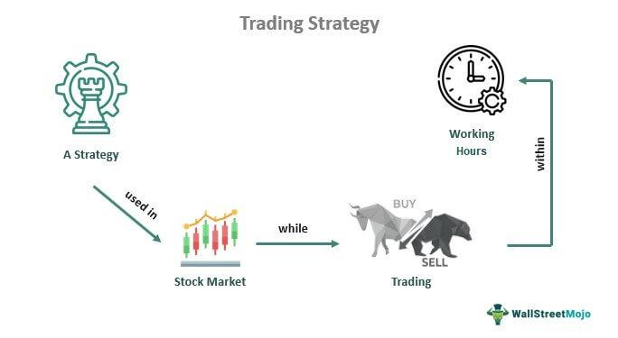

Algorithmic trading, or algo trading, is the practice of utilizing computer programs to automate the execution of trades based on specific, pre-defined criteria. This approach leverages advanced mathematical models and algorithms to make trading decisions, minimizing human intervention. Algorithmic trading offers efficiency by executing trades at speeds and frequencies that are impractical for human traders. In this article, we focus on trading a single stock using algorithmic strategies, examining both the potential benefits and the inherent challenges of this method.

The trading of a single stock using algorithmic strategies allows traders to specialize and gain a deeper understanding of the chosen stock's market behavior. This approach reduces the complexity and data requirements compared to multi-stock trading, simplifying the management and optimization of algorithmic models. By focusing on a single stock, traders have the opportunity to refine their algorithms to detect and capitalize on unique patterns and trends that the stock might exhibit. Consequently, this concentrated effort can lead to a more robust and specialized trading strategy.



The goal of algorithmic trading is not only to improve efficiency and execution speed but also to enhance decision-making by relying on data-driven insights. Understanding the mechanics and nuances of algorithmic trading is crucial for both beginners and experienced traders aiming to optimize their trading strategies. This article will provide an overview of the fundamental concepts of algorithmic trading, discuss specific strategies for trading a single stock, and address methods for mitigating risks associated with this approach.

To successfully implement algorithmic trading strategies, a comprehensive knowledge of both technical and market aspects is necessary. Technical expertise often entails programming skills, particularly in languages such as Python, R, or C++, as these are commonly used for developing trading algorithms. In addition, traders require access to real-time market data and a reliable trading platform that supports algorithmic execution. Proficiency in these areas can significantly enhance a trader's ability to develop and deploy effective algorithmic strategies.

This article aims to equip readers with the essential knowledge needed to integrate algorithmic techniques into their trading practices. By providing a detailed guide on this subject, we hope to assist traders in understanding and navigating the complexities of algorithmic trading to achieve more consistent and profitable results.

## Table of Contents

## Understanding Algorithmic Trading

Algorithmic trading, commonly known as algo trading, is a method of executing trades using pre-set computer algorithms. These algorithms perform trading tasks automatically, making decisions based on specific parameters such as price, timing, or [volume](/wiki/volume-trading-strategy), and do so without requiring human intervention. This approach effectively harnesses the power of computers to process intricate computations at speeds far beyond human capability, allowing traders to capitalize on minute trading opportunities that might otherwise be missed.

Algo trading systems are typically programmed to recognize patterns or react to market signals that align with predefined trading strategies. For instance, algorithms can be configured to execute trades when certain market conditions are met, such as when a stock's price crosses a moving average. Given the complexity involved, a foundational understanding of both coding and financial markets is essential for traders seeking to utilize algorithmic strategies.

Several programming languages are popular for developing trading algorithms. Python, for instance, is widely used due to its simplicity and the extensive range of libraries available for data analysis and [machine learning](/wiki/machine-learning). Python code implementation might include libraries such as Pandas for data manipulation, NumPy for numerical calculations, and libraries like TA-Lib for technical analysis. Here's a basic Python example to calculate a simple moving average:

```python
import pandas as pd

# Sample data
data = {
    'Date': ['2021-01-01', '2021-01-02', '2021-01-03', '2021-01-04', '2021-01-05'],
    'Price': [100, 102, 101, 105, 110]
}

# Create a DataFrame
df = pd.DataFrame(data)
df['Date'] = pd.to_datetime(df['Date'])

# Calculate a simple moving average
df['SMA'] = df['Price'].rolling(window=3).mean()
print(df)
```

In addition to Python, C++ is often chosen for its execution speed, which is crucial for high-frequency trading. R is also favored by those who focus on statistical computations or require advanced data visualization capabilities.

A successful [algorithmic trading](/wiki/algorithmic-trading) setup demands access to real-time market data, which is needed for timely decision-making and execution. Traders rely on robust trading platforms that provide reliable market feeds and allow for seamless integration of custom-built algorithms. Furthermore, [backtesting](/wiki/backtesting) — the process of testing trading strategies on historical data — is a critical component. It allows traders to evaluate the potential efficacy and risks of their algorithms before deploying them in live markets.

In summary, while the sophistication of algorithmic trading systems can vary, they share common necessities: a blend of strategic programming, technology infrastructure, and deep market understanding. These elements together enable traders to navigate and exploit financial markets efficiently through algorithmic means.

## Why Trade One Stock in Algorithmic Trading?

Focusing on a single stock in algorithmic trading facilitates specialization, enabling traders to gain a profound understanding of its specific market behavior. This approach allows traders to become intimately familiar with the stock's historical performance, [volatility](/wiki/volatility-trading-strategies) patterns, [liquidity](/wiki/liquidity-risk-premium), and the impact of macroeconomic factors on its price movements. By narrowing the focus, traders can hone in on nuances such as seasonal trends or earnings-related fluctuations, which can be pivotal in making informed trading decisions.

Reducing the complexity of trading multiple assets simplifies both the development and optimization of trading algorithms. With a narrowed scope, traders can allocate resources more efficiently, focusing on refining algorithms to address the unique behavior and idiosyncrasies of a single stock. This simplification reduces not only the cognitive load but also the computational demands, allowing more precise adjustments to strategies in response to market shifts. 

Trading a single stock offers the advantage of refining algorithms to detect specific patterns and trends inherent to that stock. Algorithms can be tailored to capitalize on recurrent price movements or predictable responses to market stimuli, leading to potentially enhanced predictive accuracy and trade execution.

Furthermore, a concentrated trading approach allows for intensive backtesting. By rigorously testing strategies against historical data of that stock, traders can identify potential pitfalls and optimize parameters for better performance. The focused nature of single stock backtesting ensures that findings are directly applicable to the actual trading scenario, thereby enhancing the reliability of the algorithm's predictive power.

In terms of cost efficiency, focusing on a single stock is beneficial as it avoids the expenses associated with acquiring extensive datasets required for trading a diversified portfolio. Large datasets can incur significant costs, both in terms of data acquisition fees and the computational power needed to process them.

Single stock trading also results in reduced transaction costs compared to trading multiple securities. Diversification typically necessitates a larger number of trades to maintain balanced exposures, leading to higher cumulative brokerage fees and potential slippage. By focusing trading efforts on one stock, these costs can be minimized, optimizing overall returns.

In conclusion, trading one stock allows for a concentrated effort on strategy development, execution precision, and cost management, enhancing the potential for profitable outcomes in algorithmic trading.

## Strategies for Trading One Stock

Trading a single stock using algorithmic strategies allows traders to focus deeply on the nuances and patterns specific to that stock. Various strategies can be employed to capitalize on market movements, each with unique advantages and techniques tailored for optimal execution.

**Trend Following**: This strategy involves identifying and acting upon trends in the stock's price movement. Moving averages, such as the simple moving average (SMA) or exponential moving average (EMA), are commonly used indicators in this strategy. For instance, an algorithm might buy a stock when the short-term EMA crosses above the long-term EMA (a bullish crossover) and sell when the opposite occurs. Trend-following strategies aim to capitalize on the momentum of the stock, assuming that trends tend to persist over time.

**Mean Reversion**: Mean reversion strategies are based on the assumption that the stock's price will revert to its historical average over time. If the stock is currently priced below its mean, a mean reversion strategy would entail buying the stock, anticipating a price increase. Conversely, if the stock is above the mean, the strategy would suggest selling. Calculating the z-score of a stock price relative to its moving average can provide a quantitative basis for these decisions:

$$
z = \frac{{\text{Price} - \text{Moving Average}}}{{\text{Standard Deviation}}}
$$

A positive z-score indicates that the price is above the average, while a negative z-score suggests it's below.

**Arbitrage Opportunities**: Although traditional arbitrage seeks pricing discrepancies between different markets or instruments, micro-arbitrage within a single stock requires identifying mispricings in different forms of the stock, such as variations in options pricing or exploiting very short-term inefficiencies. Despite being less common and more challenging within a single stock, these opportunities can arise and offer low-risk profits if executed swiftly.

**Market Sentiment Analysis**: This involves utilizing sentiment indicators from various sources to predict stock price movements. Algorithms can be programmed to analyze social media, news articles, and other relevant media to gauge investor sentiment. Python libraries such as NLTK or TextBlob can be employed to process and quantify textual data:

```python
from textblob import TextBlob

def get_sentiment(text):
    analysis = TextBlob(text)
    return analysis.sentiment.polarity
```

A high polarity indicates positive sentiment, suggesting a potential buying opportunity, while negative polarity may be a bearish signal.

**Volume-Weighted Average Price (VWAP)**: VWAP is a trading benchmark that represents the average price a stock has traded at during the day, based on both volume and price. It assists traders in executing large orders with minimal impact on the market price. The formula for VWAP is:

$$
\text{VWAP} = \frac{\sum (\text{Price} \times \text{Volume})}{\sum \text{Volume}}
$$

Traders aim to execute trades close to the VWAP to ensure an average price level that is reflective of the overall trading session.

**Developing Proprietary Indicators**: Crafting custom indicators tailored to a specific stock can provide an edge. By analyzing historical price data and identifying unique patterns or behaviors, traders can create indicators that signal potential buy or sell points. For example, a custom indicator might factor in the stock's historical volatility or combine multiple traditional indicators to improve trade accuracy.

In summary, selecting and applying one or more of these strategies requires not only a deep understanding of the stock in question but also the ability to leverage computational tools and frameworks for automated analysis and execution. Proper implementation of these strategies can enhance the effectiveness of trading a single stock.

## Technical Requirements and Implementation

When embarking on algorithmic trading, selecting a suitable platform is paramount. An ideal platform should support a range of programming languages and offer an API for seamless trading and data access. This API facilitates both execution and the retrieval of crucial real-time data, which is essential for informed decision-making.

Historical data availability is crucial for developing and backtesting trading strategies. Access to comprehensive data archives allows traders to simulate potential strategies against past market conditions, providing insights into their effectiveness. Backtesting helps identify any flaws in the strategy, offering a clearer picture of potential performance when employing said strategy on the chosen stock.

Python is a preferred language in the development of trading algorithms owing to its robustness and extensive libraries tailored for data analysis and trading, such as pandas, NumPy, and TA-Lib. With its straightforward syntax and vast community support, Python streamlines the process of writing and simulating trading algorithms. The following simple example illustrates initializing a basic trading algorithm using a moving average crossover strategy:

```python
import pandas as pd

# Load historical stock price data
data = pd.read_csv('historical_stock_data.csv')
short_window = 40
long_window = 100

# Calculate moving averages
data['Short_MA'] = data['Close'].rolling(window=short_window, min_periods=1).mean()
data['Long_MA'] = data['Close'].rolling(window=long_window, min_periods=1).mean()

# Generate trading signals
data['Signal'] = 0
data['Signal'][short_window:] = \
    pd.np.where(data['Short_MA'][short_window:] > data['Long_MA'][short_window:], 1, 0)

# Backtest and performance analysis here
```

Optimizing data processing speed and accuracy is critical; investing in reliable hardware and networking infrastructure is essential for achieving this. Rapid data processing allows for efficient execution of trades in a market where milliseconds can be the difference between profit and loss.

The optimization process involves rigorous backtesting combined with real-time simulations. Backtesting assesses the strategy using past data, while real-time simulations, often called paper trading, involve running algorithms in live markets without financial risk. This dual approach validates the strategy's profitability and effective risk management.

Continuous monitoring systems ensure that trading algorithms operate as intended. A robust monitoring system can track the execution and performance of trades and adapt to real-time market changes. Automated alerts and safeguards can be employed to detect discrepancies, such as unexpected stock price deviations or latency issues in execution, allowing for immediate corrective actions.

In conclusion, thoroughness in the technical deployment of algorithmic trading strategies enables traders to capitalize on the benefits of automation while mitigating associated risks.

## Risk Management in Single Stock Trading

Risk management is a fundamental aspect of trading a single stock through algorithmic strategies, primarily due to the absence of diversification which naturally increases exposure to specific stock risks. The following are key considerations and techniques for effectively managing these risks:

1. **Stop-Loss Orders**: Implementing stop-loss orders is essential for protecting against sudden adverse price movements. Stop-loss orders automatically sell the stock if it reaches a predetermined price level, thus limiting potential losses. For instance, a trader might set a stop-loss order at 5% below their entry price, ensuring that their maximum loss is capped at this level. 

2. **Position Sizing**: Calculating position size is critical and should align with the trader’s risk tolerance and the stock's volatility. A common method is to use the formula:
$$
   \text{Position Size} = \frac{\text{Risk Per Trade}}{\text{Stop Loss Distance}}

$$
   where the risk per trade is a fixed percentage of the trader’s total capital they are willing to risk. For a stock with high volatility, a smaller position may be necessary to maintain a manageable risk level.

3. **Strategy Review and Adaptation**: Trading strategies require regular review to ensure they remain effective under current market conditions. This might include adjustments based on new financial data, changes in trading volume, or shifts in market sentiment. Algorithmic adjustments can encompass changes to parameters like moving averages or volatility thresholds within the trading algorithm.

4. **Scenario Analysis and Stress Testing**: These tools help traders anticipate and prepare for extreme market situations. By simulating various market conditions such as sharp price declines or spikes, traders can evaluate the algorithm's performance and identify weaknesses. Stress tests might simulate historical events, like the 2008 financial crisis, to test how the algorithm would respond under similar conditions.

5. **Market Intelligence and News Monitoring**: Keeping abreast of any corporate actions, such as earnings reports, mergers, or dividend announcements, is crucial as these can significantly impact the stock's price and trading behavior. Incorporating a news sentiment analysis component within the trading algorithm may provide real-time updates and insights, helping to adjust positions as necessary.

Risk management is an ongoing process that requires vigilance and the ability to adapt strategies based on evolving market conditions. By implementing strong risk management practices, traders can better protect their investments while pursuing profitability through algorithmic trading strategies.

## Conclusion

Trading one stock through algorithmic strategies offers a distinct set of opportunities and challenges. The ability to concentrate on a single stock allows traders to develop a more precise and focused understanding of its market dynamics. This can lead to the creation of highly optimized trading algorithms tailored to the specific behaviors and patterns of the stock. However, this focus necessitates diligent risk management due to the inherent lack of diversification and the potential for pronounced volatility.

Success in algorithmic trading hinges on comprehensive research and robust backtesting. Traders must engage in continuous refinement of their algorithms, adapting them to changing market conditions and integrating the latest data analytics techniques. The evolutionary nature of technology plays a significant role, as advancements continually offer new avenues for innovative trading strategies. By adopting a systematic and technologically empowered approach, traders can aspire to achieve more consistent and profitable outcomes.

Ultimately, successful algorithmic trading demands a synergy of technical proficiency, market acumen, and strategic foresight. Traders must possess a deep understanding of both programming and financial markets to navigate the complexities of algorithmic strategies effectively. This blend of skills is critical to harness the full potential of algorithmic trading and to capitalize on the opportunities it presents within the stock market.

## References & Further Reading

[1]: Bergstra, J., Bardenet, R., Bengio, Y., & Kégl, B. (2011). ["Algorithms for Hyper-Parameter Optimization."](https://dl.acm.org/doi/10.5555/2986459.2986743) Advances in Neural Information Processing Systems 24.

[2]: ["Advances in Financial Machine Learning"](https://www.amazon.com/Advances-Financial-Machine-Learning-Marcos/dp/1119482089) by Marcos Lopez de Prado

[3]: ["Evidence-Based Technical Analysis: Applying the Scientific Method and Statistical Inference to Trading Signals"](https://www.amazon.com/Evidence-Based-Technical-Analysis-Scientific-Statistical/dp/0470008741) by David Aronson

[4]: ["Machine Learning for Algorithmic Trading"](https://github.com/stefan-jansen/machine-learning-for-trading) by Stefan Jansen

[5]: ["Quantitative Trading: How to Build Your Own Algorithmic Trading Business"](https://books.google.com/books/about/Quantitative_Trading.html?id=j70yEAAAQBAJ) by Ernest P. Chan