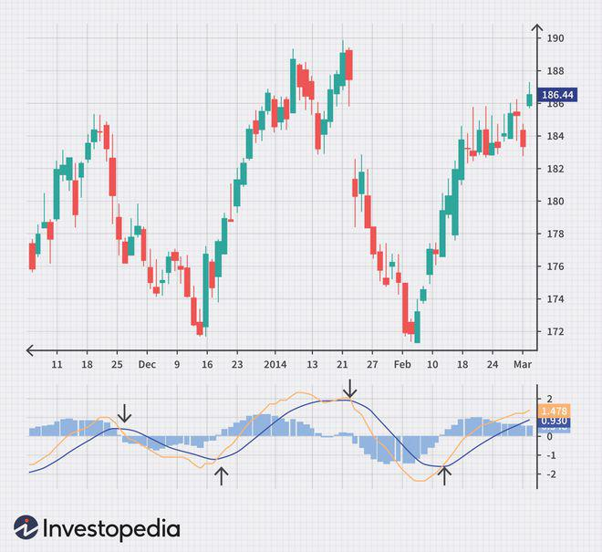

## Table of Contents

## What is stock trading and why do people engage in it?

Stock trading is when people buy and sell parts of companies, called stocks or shares. When you buy a stock, you own a little piece of that company. The price of stocks goes up and down based on how well the company is doing and what people think about it. People can trade stocks on places called stock exchanges, like the New York Stock Exchange or the NASDAQ.

People engage in stock trading for different reasons. One big reason is to make money. If you buy a stock and its price goes up, you can sell it for more than you paid and make a profit. Some people trade stocks often, trying to make money from small changes in prices. Others buy stocks and hold onto them for a long time, hoping the company will do well and the stock price will go up over time. Another reason people trade stocks is to save for the future, like for retirement. By investing in stocks, they hope their money will grow over time.

## How does one start trading stocks as a beginner?

To start trading stocks as a beginner, first, you need to open a brokerage account. A brokerage account is like a special bank account where you can buy and sell stocks. You can choose from many online brokers, like Robinhood, E*TRADE, or Charles Schwab. When picking a broker, look at how much they charge for trades and what tools they offer to help you learn and make decisions. Once you have your account set up, you'll need to add money to it so you can start buying stocks.

Next, you should learn about the stocks you want to buy. Start by researching companies that interest you. Look at their financial health, what they do, and how they're doing in the market. You can find this information on the company's website, in financial news, or through your broker's research tools. When you're ready to buy, decide how many shares you want and place an order through your brokerage account. Remember, it's wise to start small and only invest money you can afford to lose, as the stock market can be risky.

## What are the different types of stock orders and how do they work?

There are a few main types of stock orders that you can use when you want to buy or sell stocks. The simplest one is a "market order." When you place a market order, you're telling your broker to buy or sell the stock right away at the best available price. This is good if you want to make a trade quickly, but the price you get might be a little different from what you see on the screen because stock prices can change fast.

Another type is a "limit order." With a limit order, you set a specific price at which you want to buy or sell the stock. For example, if you want to buy a stock but only if it's $50 or less, you can set a limit order at $50. Your order will only go through if the stock reaches that price or better. This gives you more control over the price, but there's a chance your order won't be filled if the stock never hits your limit price.

Lastly, there's a "stop order," which is also called a "stop-loss order." This one is used to limit your losses or protect your profits. You set a "stop price," and when the stock reaches that price, your stop order turns into a market order. For example, if you own a stock that's worth $100 and you set a stop order at $90, if the stock drops to $90, your order will turn into a market order and sell the stock to stop you from losing more money. Just remember, the final sale price might be a bit lower than your stop price because it becomes a market order.

## What are the key differences between day trading and long-term investing?

Day trading and long-term investing are two different ways to make money with stocks. Day trading is when you buy and sell stocks in the same day, trying to make money from small changes in their prices. Day traders watch the market closely all day and make many trades. They need to be quick and good at understanding what's happening in the market right away. Day trading can be exciting but it's also risky because the stock market can be unpredictable, and you might lose money if you make a wrong move.

Long-term investing is different. It's when you buy stocks and hold onto them for a long time, like months or years. The idea is to pick good companies and let your money grow slowly over time. Long-term investors don't worry about small changes in stock prices every day. They believe that over time, the companies they invest in will do well and their stock prices will go up. This way of investing is usually less stressful and can be a good way to save for big goals like retirement, but it still has risks because no one can predict the future of the market perfectly.

## How can one analyze stocks using fundamental analysis?

Fundamental analysis is a way to look at stocks by studying the company's financial health and how it's doing in the market. You start by looking at the company's financial statements, like the income statement, balance sheet, and cash flow statement. These tell you how much money the company is making, how much it owes, and how it's spending its cash. You also look at things like the company's earnings, how fast it's growing, and how much profit it's making compared to its costs. This helps you figure out if the company is strong and if it's likely to do well in the future.

Another part of fundamental analysis is looking at the bigger picture. You want to understand the industry the company is in and how it's doing compared to other companies in that industry. You also look at the economy and any news or events that might affect the company. For example, if a company makes cars, you'd want to know if people are buying more cars and if there are new laws about car safety that could help or hurt the company. By putting all this information together, you can decide if the stock is a good buy at its current price.

In the end, fundamental analysis helps you see if a stock is undervalued or overvalued. If you think the stock's price is lower than what the company is really worth, it might be a good time to buy. But if the price seems too high compared to the company's actual value, you might want to wait or look at other stocks. This kind of analysis takes time and a lot of research, but it can help you make smarter choices about which stocks to invest in.

## What is technical analysis and how is it used in stock trading?

Technical analysis is a way to look at stocks by studying charts and patterns of their past prices and trading volumes. Instead of looking at the company's financial health like in fundamental analysis, technical analysts focus on the stock's price movements. They believe that all the information about a company, like how it's doing and what people think about it, is already shown in the stock's price. By looking at these patterns and trends, technical analysts try to guess where the stock's price might go next. They use tools like moving averages, support and resistance levels, and different kinds of charts to help them make these guesses.

People use technical analysis to help them decide when to buy or sell stocks. For example, if they see a certain pattern that usually means the stock's price will go up, they might decide to buy the stock. Or if they see a pattern that means the price might go down, they might decide to sell. Technical analysis is popular among day traders and short-term investors who want to make quick trades based on what's happening in the market right now. While it can be helpful, it's not perfect, and it's always a good idea to use it along with other kinds of analysis to make the best decisions.

## What are the common risks associated with stock trading and how can they be mitigated?

Stock trading comes with several risks that you should know about. One big risk is market risk, which means the whole stock market can go up or down because of things like the economy, politics, or big world events. This can make your stocks lose value even if the companies are doing well. Another risk is company-specific risk, where the stock of a single company might go down because of problems with that company, like bad earnings or a scandal. There's also the risk of losing money quickly if you're day trading, as the market can be very unpredictable day to day.

You can try to lower these risks in a few ways. For market risk, one way is to diversify your investments, which means not putting all your money into one type of stock or one industry. By spreading your money around, you can balance out the ups and downs of different parts of the market. To reduce company-specific risk, do your research and only invest in companies you understand and believe in. If you're day trading, use tools like stop-loss orders to limit your losses if a trade goes against you. And remember, never invest money you can't afford to lose, because the stock market can be risky no matter how careful you are.

## How do market trends and economic indicators affect stock trading decisions?

Market trends and economic indicators play a big role in how people make decisions about trading stocks. Market trends are like the general direction the stock market is moving, whether it's going up, down, or staying the same. If the trend is up, people might feel more confident and buy more stocks, hoping to make money as prices keep rising. But if the trend is down, people might get worried and sell their stocks to avoid losing money. Economic indicators are things like unemployment rates, inflation, and how fast the economy is growing. These indicators give people clues about how the economy is doing, which can affect how they think about the future of the stock market. For example, if unemployment is low and the economy is growing, people might think the stock market will do well and decide to buy more stocks.

Economic indicators can also change how people feel about certain industries or companies. For instance, if inflation is high, people might worry that companies will have a harder time making profits because their costs are going up. This could make them sell stocks in those companies or avoid buying them. On the other hand, if the economy is doing well and people are spending more money, companies that sell things people want, like cars or electronics, might see their stock prices go up. By keeping an eye on these trends and indicators, traders can make smarter choices about when to buy or sell stocks, trying to make the most money while also managing their risks.

## What are some advanced trading strategies used by experienced traders?

Experienced traders often use a strategy called "swing trading." This is when they hold onto stocks for a few days or weeks, trying to make money from the ups and downs in the stock's price. They look for patterns in the stock's price chart that tell them when it might be a good time to buy or sell. This way, they can take advantage of short-term changes in the market without having to watch it all day like day traders do. Swing trading needs a good understanding of technical analysis, but it can be less stressful than day trading because you don't have to make quick decisions all the time.

Another advanced strategy is "options trading." Options are special kinds of investments that give you the right, but not the obligation, to buy or sell a stock at a certain price before a certain date. Experienced traders use options to make money in different ways. For example, they might buy a "call option" if they think a stock's price will go up, or a "put option" if they think it will go down. Options can be risky because they can lose all their value if the stock doesn't move the way you expect, but they can also help you make more money if you use them right. Options trading takes a lot of knowledge and practice, so it's usually something traders learn after they've been trading for a while.

Some experienced traders also use "algorithmic trading," where they use computer programs to buy and sell stocks automatically. These programs, called algorithms, follow a set of rules to make trades based on things like price changes or market trends. This can help traders make decisions faster and without letting their emotions get in the way. Algorithmic trading can be very powerful, but it needs a lot of technical skills to set up and manage the programs. It's a way for traders to take advantage of the market's movements without having to watch it every second of the day.

## How can one use options and futures in stock trading?

Options and futures are special kinds of investments that let you bet on what will happen to a stock's price in the future. Options give you the right, but not the obligation, to buy or sell a stock at a certain price before a certain date. If you think a stock's price will go up, you can buy a "call option." This lets you buy the stock at a set price, even if it goes up a lot. If you think the stock's price will go down, you can buy a "put option." This lets you sell the stock at a set price, even if it falls. Options can help you make more money if you guess right, but they can also lose all their value if you're wrong, so they're risky.

Futures are a bit different. When you buy a futures contract, you agree to buy or sell a stock at a set price on a certain date in the future. Futures are often used by people who want to protect themselves from price changes. For example, if you're a farmer and you want to make sure you get a good price for your crops, you can sell a futures contract to lock in that price. In stock trading, futures can be used to bet on where the market is going. If you think the market will go up, you can buy a futures contract, and if you think it will go down, you can sell one. Like options, futures can be risky because you have to follow through with the contract no matter what happens to the stock's price.

## What role does portfolio diversification play in managing stock trading risks?

Portfolio diversification is a way to spread your money across different types of investments to lower the risk of losing it all. When you have a diversified portfolio, you're not putting all your eggs in one basket. Instead of buying stocks from just one company or one industry, you buy stocks from many different companies and industries. This way, if one stock or one industry does badly, it won't hurt your whole portfolio too much. For example, if you only own tech stocks and the tech industry has a bad year, you could lose a lot of money. But if you also own stocks in healthcare, energy, and consumer goods, those other stocks might do well and balance out your losses.

Diversification doesn't just mean buying different stocks. It can also mean investing in other things like bonds, real estate, or even commodities like gold. Bonds are like loans you give to companies or the government, and they usually pay you back with interest. Real estate can be a good investment because people always need places to live and work. Commodities like gold can be a safe place to put your money when the stock market is doing badly. By spreading your money across these different kinds of investments, you can protect yourself from big losses and make your portfolio more stable over time.

## How can algorithmic trading be utilized to enhance stock trading performance?

Algorithmic trading uses computer programs to buy and sell stocks automatically. These programs follow a set of rules to make trades based on things like price changes or market trends. By using algorithms, traders can make decisions faster than they could by themselves. This can help them take advantage of small changes in the market and make more trades without getting tired or letting their emotions get in the way. For example, if a stock's price goes up a little bit, the algorithm can quickly buy it and then sell it when the price goes up even more. This way, the trader can make money from tiny price movements that they might miss if they were trading by hand.

Another way algorithmic trading can help is by testing different trading strategies. Traders can use computers to try out many different ways of trading without risking real money. They can see which strategies work best and then use those strategies in the real market. This can help them make more money and lose less. But algorithmic trading isn't perfect. It needs a lot of technical skills to set up and manage the programs, and sometimes the market can do unexpected things that the algorithms don't predict. Still, for traders who know how to use it, algorithmic trading can be a powerful tool to improve their performance in the stock market.

## References & Further Reading

[1]: Lo, Andrew W. (2004). ["The Efficient Market Hypothesis and Its Critics."](https://papers.ssrn.com/sol3/papers.cfm?abstract_id=602222) Journal of Economic Perspectives, 18(1), 29-82.

[2]: Bruno, M. (2010). ["Technical Analysis and Financial Asset Forecasting: From Simple Tools to Advanced Techniques."](https://worldscientific.com/worldscibooks/10.1142/8625) World Scientific.

[3]: MacKenzie, D. (2006). ["An Engine, Not a Camera: How Financial Models Shape Markets."](https://academic.oup.com/mit-press-scholarship-online/book/20588) MIT Press.

[4]: Kissell, R. (2014). ["The Science of Algorithmic Trading and Portfolio Management."](https://www.sciencedirect.com/book/9780124016897/the-science-of-algorithmic-trading-and-portfolio-management) Academic Press.

[5]: Malkiel, Burton G. (2011). ["The Efficient Market Hypothesis and Its Critics."](https://pubs.aeaweb.org/doi/10.1257/089533003321164958) Journal of Economic Perspectives, 49(3), 123-139.

[6]: Treleaven, P., Galas, M., & Lalchand, V. (2013). ["Algorithmic trading review."](https://dl.acm.org/doi/10.1145/2500117) Journal of Algorithmic Finance, 2(1), 1-17.