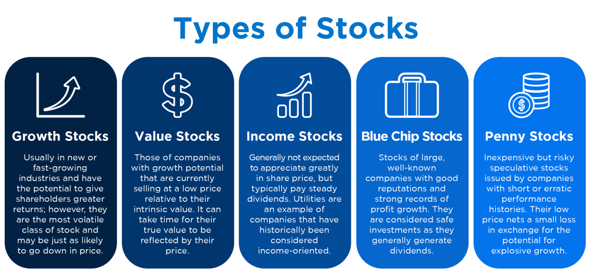

## Table of Contents

## What are the basic types of stocks?

Stocks are divided into two main types: common stocks and preferred stocks. Common stocks are the most common type that people buy. When you own common stocks, you own a part of the company. You can vote on company decisions and might get dividends, which are like a share of the company's profits. But, the value of common stocks can go up and down a lot, so they can be riskier.

Preferred stocks are different. People who own preferred stocks usually don't get to vote on company decisions, but they have a special advantage. They get their dividends before common stockholders do. Also, if the company goes bankrupt, preferred stockholders get paid back before common stockholders. This makes preferred stocks a bit less risky than common stocks, but they might not grow in value as much.

In summary, common stocks give you more control and potential for big gains, but they are riskier. Preferred stocks are safer and give you more stable dividends, but you don't get to vote and the growth might be slower. Both types have their own benefits and risks, so it's important to understand them before you invest.

## How do common stocks differ from preferred stocks?

Common stocks and preferred stocks are two different types of stocks that you can buy. Common stocks give you a piece of the company and let you vote on important decisions. If the company makes money, you might get some of it as dividends, but it's not guaranteed. The value of common stocks can change a lot, so they can be risky. But if the company does well, the value of your common stocks can go up a lot, which means you could make more money.

Preferred stocks are different because they usually don't let you vote on company decisions. But they have a special advantage: you get your dividends before people who own common stocks. If the company has a tough time and can't pay everyone, preferred stockholders get their money first. This makes preferred stocks a bit safer than common stocks. However, the value of preferred stocks doesn't usually grow as much as common stocks, so you might not make as much money if the company does really well.

## What are growth stocks and how do they differ from value stocks?

Growth stocks are stocks from companies that are growing really fast. These companies usually don't pay dividends because they use all their money to grow even more. People buy [growth stocks](/wiki/growth-stocks) because they hope the company will keep growing and the price of the stock will go up a lot. But, growth stocks can be risky because if the company stops growing, the price of the stock can fall quickly.

Value stocks are different. They come from companies that are not growing as fast, but they might be undervalued, meaning their stock price is lower than it should be. These companies often pay dividends because they have more steady money coming in. People buy value stocks hoping that the market will realize the company is worth more and the stock price will go up. Value stocks are usually less risky than growth stocks, but they might not grow as much.

In short, growth stocks are about betting on fast growth and high potential, while value stocks are about finding good deals and getting steady returns. Both types have their own risks and rewards, so it's important to understand them before you invest.

## Can you explain what dividend stocks are and why investors might choose them?

Dividend stocks are stocks from companies that regularly pay out part of their profits to their shareholders. These payments are called dividends, and they can be paid out in cash or more shares of the stock. Companies that pay dividends are usually well-established and have steady earnings, so they can afford to share their profits with investors.

Investors might choose dividend stocks for a few reasons. One big reason is that dividends can provide a steady income, which is great for people who need regular money, like retirees. Another reason is that dividend stocks can be less risky than other types of stocks because the companies paying them are often more stable. Plus, even if the stock price doesn't go up a lot, the dividends can still give you a good return on your investment over time.

## What are penny stocks and what are the risks associated with them?

Penny stocks are stocks that cost very little money, usually less than a dollar. They come from small companies that are just starting out or are not doing so well. People might buy penny stocks because they hope the company will grow a lot and the stock price will go up fast. But, penny stocks are very risky because these small companies can fail easily, and if they do, you could lose all your money.

The risks with penny stocks are big. First, they are not traded on big stock exchanges like the New York Stock Exchange, so it's hard to find good information about them. This makes it easy for people to lie about the company to trick you into buying the stock. Also, because penny stocks are cheap, it's easy to buy a lot of them, but if the price goes down just a little, you can lose a lot of money quickly. So, while penny stocks can seem like a good deal, they are very risky and you should be careful if you decide to invest in them.

## How do blue-chip stocks provide stability in a portfolio?

Blue-chip stocks come from big, well-known companies that have been around for a long time. These companies are usually leaders in their industries and have a good history of making money. Because they are so stable and reliable, blue-chip stocks can help make your investment portfolio more steady. They don't usually go up and down as much as smaller or newer companies, so they can help balance out the riskier parts of your investments.

Investors like blue-chip stocks because they often pay dividends, which means you get regular payments just for owning the stock. This can be really helpful if you need a steady income from your investments. Plus, even though blue-chip stocks might not grow as fast as some other stocks, they are less likely to lose a lot of value suddenly. This makes them a safe choice to keep your portfolio stable over time.

## What are income stocks and how do they fit into an investment strategy?

Income stocks are stocks from companies that pay out a lot of their profits to shareholders as dividends. These companies are usually big and stable, so they can afford to share their earnings regularly. People buy income stocks because they want to get a steady stream of money from their investments. This can be really helpful for people who need regular income, like retirees, or anyone who wants to make their money work for them without selling their stocks.

Including income stocks in an investment strategy can help balance things out. Because these stocks come from stable companies, they don't usually go up and down in price as much as other stocks. This means they can make your overall investments less risky. Plus, the regular dividends from income stocks can add up over time, giving you a good return on your investment even if the stock price doesn't grow a lot. So, income stocks can be a smart choice if you want both stability and a steady income from your portfolio.

## Can you describe what cyclical stocks are and how they relate to economic cycles?

Cyclical stocks are stocks from companies whose performance goes up and down with the economy. These companies do well when the economy is growing and people have more money to spend. For example, car makers, hotels, and luxury goods companies are often cyclical because people buy more cars, take more vacations, and splurge on fancy things when times are good. But when the economy slows down and people start saving more, these companies don't do as well because fewer people are buying their products or services.

Because of this, cyclical stocks can be a bit risky. Their value can go up a lot during good economic times, but they can also drop a lot when the economy is struggling. Investors who buy cyclical stocks are betting that they can predict when the economy will be strong and when it will be weak. If they guess right, they can make a lot of money, but if they guess wrong, they can lose a lot too. So, understanding economic cycles is really important if you want to invest in cyclical stocks.

## What are defensive stocks and why might they be important during economic downturns?

Defensive stocks are stocks from companies that do well even when the economy is not doing great. These companies make things that people always need, like food, medicine, and utilities like electricity and water. Because people can't stop buying these things even if they're saving money, defensive stocks stay pretty stable no matter what's happening with the economy.

During an economic downturn, when a lot of other stocks are losing value, defensive stocks can be really important. They help keep your investments safe because they don't go down as much as other stocks. If you have some defensive stocks in your portfolio, they can help you lose less money when times are tough, and they can give you peace of mind knowing that part of your investments is more secure.

## How do small-cap, mid-cap, and large-cap stocks differ in terms of risk and potential return?

Small-cap, mid-cap, and large-cap stocks are different in size and how much risk and potential return they offer. Small-cap stocks come from smaller companies, usually with a market value of less than $2 billion. These stocks can be really risky because small companies can fail easily, but they also have the potential to grow a lot if the company does well. So, if you invest in small-cap stocks, you might make a lot of money, but you could also lose a lot.

Mid-cap stocks are from companies that are a bit bigger, with a market value between $2 billion and $10 billion. They are less risky than small-cap stocks because these companies are more established, but they still have room to grow. This means mid-cap stocks can offer a good balance between risk and reward. They might not grow as fast as small-cap stocks, but they are less likely to lose a lot of value suddenly.

Large-cap stocks are from the biggest companies, with a market value of more than $10 billion. These stocks are usually the safest because big companies are more stable and less likely to fail. They don't usually grow as fast as smaller companies, so the potential return might not be as high. But, large-cap stocks can still give you a good return over time, and they help keep your investments steady because they don't go up and down as much as smaller stocks.

## What are ESG stocks and how do they align with ethical investing?

[ESG](/wiki/esg-investing) stocks are stocks from companies that focus on Environmental, Social, and Governance factors. This means they try to be good for the planet, treat people well, and have fair and honest leadership. When you buy ESG stocks, you're investing in companies that care about more than just making money. They want to make a positive impact on the world too. This kind of investing is called ethical investing because it's about putting your money into businesses that match your values.

Ethical investing is important to a lot of people because they want their investments to help make the world a better place. By choosing ESG stocks, investors can support companies that are working to reduce pollution, treat their workers fairly, and have good management practices. While ESG stocks might not always give the highest returns, many people are willing to accept a bit less money if it means they can invest in a way that aligns with their beliefs about what's right and wrong.

## How can understanding sector-specific stocks enhance portfolio diversification?

Understanding sector-specific stocks can really help you spread out your investments in a smart way. Different sectors, like technology, healthcare, or energy, do well at different times. For example, when people are buying a lot of new gadgets, tech stocks might go up. But when people need more medicine, healthcare stocks might do better. By knowing about these different sectors, you can pick stocks from each one. This way, if one sector has a tough time, the other sectors in your portfolio might still be doing okay, which can help keep your overall investments more balanced and less risky.

Adding stocks from different sectors also means you're not putting all your eggs in one basket. If you only invest in one sector and something bad happens to that whole sector, like new laws or a big drop in demand, your investments could lose a lot of value. But if you have stocks from many sectors, like tech, healthcare, and energy, a problem in one sector won't hurt your whole portfolio as much. This can make your investments safer and help you get a steady return over time, even when the market is up and down.

## References & Further Reading

[1]: Bergstra, J., Bardenet, R., Bengio, Y., & Kégl, B. (2011). ["Algorithms for Hyper-Parameter Optimization."](https://papers.nips.cc/paper/4443-algorithms-for-hyper-parameter-optimization) Advances in Neural Information Processing Systems 24.

[2]: ["Advances in Financial Machine Learning"](https://www.amazon.com/Advances-Financial-Machine-Learning-Marcos/dp/1119482089) by Marcos Lopez de Prado

[3]: ["Evidence-Based Technical Analysis: Applying the Scientific Method and Statistical Inference to Trading Signals"](https://www.amazon.com/Evidence-Based-Technical-Analysis-Scientific-Statistical/dp/0470008741) by David Aronson

[4]: ["Machine Learning for Algorithmic Trading"](https://github.com/stefan-jansen/machine-learning-for-trading) by Stefan Jansen

[5]: ["Quantitative Trading: How to Build Your Own Algorithmic Trading Business"](https://www.amazon.com/Quantitative-Trading-Build-Algorithmic-Business/dp/1119800064) by Ernest P. Chan