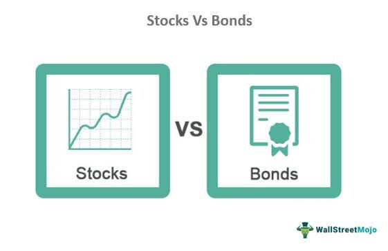

The world of investment offers various avenues for potential growth, income, and risk management. Among these, bonds, stocks, and algorithmic trading stand out as significant components of an investment strategy. Bonds, traditionally seen as fixed-income securities, provide predictable interest payments and return of principal upon maturity, appealing to conservative investors seeking stable returns with lower risk. In contrast, stocks represent ownership in a company, offering higher potential returns coupled with greater volatility and risk, appealing to those seeking long-term growth.

Algorithmic trading, a more contemporary facet of investing, utilizes computer algorithms to execute trades at high speed and precision, leveraging market data to capitalize on minute price movements. This form of trading minimizes emotional decision-making and enhances the efficiency of trade execution. Understanding the nuances between bonds and stocks, alongside the impact of algorithmic trading, is crucial for modern investors. Each offers distinct characteristics and responds differently to market conditions, influencing the overall performance of an investment portfolio.



This article aims to provide a comprehensive comparison of bonds, stock performance, and algorithmic trading, elucidating their unique characteristics, advantages, and challenges. By analyzing these investment options, readers will gain insights into diversifying their portfolios effectively, aligning their investment strategies with their financial goals and risk tolerance. As financial markets continue to evolve, understanding these components will empower investors to navigate complexities and optimize their investment outcomes.

## Table of Contents

## Understanding Bonds as an Investment Option

Bonds are fixed-income securities that play a crucial role within investment portfolios, particularly for conservative investors seeking lower risk and stable returns. Providing a predictable stream of income through fixed interest payments, bonds are considered a refuge during market volatility, often exhibiting less price fluctuation compared to equities.

**Types of Bonds**:
1. **Government Bonds**: These bonds are issued by national governments and are generally considered low-risk investments. They are backed by the credit of the issuing government, making them reliable but usually offering lower yields. Examples include U.S. Treasury bonds, which come in various maturities: bills (short-term), notes (medium-term), and bonds (long-term).

2. **Municipal Bonds**: Issued by local or state governments, municipal bonds fund public projects such as infrastructure and schools. They often provide tax advantages, as interest is sometimes exempt from federal and/or state taxes, which can enhance their attractiveness to investors in higher tax brackets. However, they may carry different risk levels based on the financial health of the issuing municipality.

3. **Corporate Bonds**: These are issued by companies to raise capital and typically carry higher risk than government bonds due to the potential for corporate default. Nevertheless, they usually offer higher yields to compensate for this additional risk. The creditworthiness of corporate bonds is often assessed by credit rating agencies, with investment-grade bonds being less risky than high-yield, or "junk," bonds.

**Role in Portfolio Diversification**:
Bonds are instrumental in reducing overall portfolio [volatility](/wiki/volatility-trading-strategies). They act as a counterbalance to the more erratic nature of stocks because bond prices typically move inversely to interest rates. When stock markets are volatile or bearish, bonds can provide stability and help preserve capital, supporting a smoother investment journey over time.

**Evaluating Bond Investments**:
When assessing bond investments, several key factors must be considered to align with an investor's financial goals:

- **Credit Ratings**: These ratings, provided by agencies such as Moody's, S&P Global, and Fitch, indicate the risk of default. Higher-rated bonds (AAA to BBB for investment-grade) suggest lower default risk, whereas lower-rated bonds (BB and below for speculative-grade) imply higher potential return but come with increased risk.

- **Yields**: A bond's yield, also known as yield to maturity (YTM), reflects the annual return an investor can expect assuming the bond is held until it matures. Yield can be influenced by the bond's coupon rate, market interest rates, and the bond's price in the secondary market. The formula for YTM considers the bond's current price, annual interest payments, face value, and remaining maturity:
$$
  \text{YTM} = \left( \frac{C + \frac{F - P}{n}}{\frac{F + P}{2}} \right)

$$

  Where $C$ is the annual coupon payment, $F$ is the face value, $P$ is the current price, and $n$ is the number of years to maturity.

- **Maturity Dates**: Bonds come with various maturity periods; short-term bonds tend to be less sensitive to interest rate changes, while long-term bonds can offer higher yields at the cost of greater interest rate risk.

By considering these elements, investors can strategically invest in bonds, aligning their selections with their individual risk tolerances and financial objectives to optimize portfolio performance.

## The Dynamics of Stock Investments

Stocks represent shares of ownership in a company, providing investors with the potential for financial gains and risks. As investment vehicles, they offer a higher potential return compared to bonds, but with significantly increased volatility and associated risk. This intrinsic characteristic of stocks makes them suitable for investors seeking long-term capital appreciation rather than stability.

### Types of Stocks

There are various categories of stocks, each designed to meet the preferences and strategies of different investor profiles. Common stocks give shareholders voting rights and potential dividends, representing the majority of stock traded on the market. Preferred stocks, although lacking voting rights, often provide fixed dividends and priority over common stocks during liquidation.

Stocks are also classified by market capitalization. Large-cap stocks represent companies with a market capitalization typically over $10 billion, often characterized by stability and relatively steady growth. Small-cap stocks, with market capitalizations between $300 million and $2 billion, present opportunities for rapid growth but come with increased volatility. In contrast, [growth stocks](/wiki/growth-stocks) are those expected to grow at an above-average rate compared to their industry, often reinvesting earnings to fuel further expansion. Value stocks are companies that are undervalued compared to their earnings and intrinsic worth, attractive to investors who seek potential growth at reduced costs.

### Fundamental and Technical Analysis

Evaluating a stock's potential necessitates rigorous analysis through fundamental and technical methods. Fundamental analysis focuses on a company's financial health, including revenue, earnings, future growth, return on equity, and profit margins. Ratios such as the price-to-earnings (P/E) ratio, return on investment (ROI), and earnings per share (EPS) are instrumental in this approach.

Conversely, technical analysis involves studying stock price movements and trading volumes to predict future performance. It relies on charts and indicators like moving averages, relative strength index (RSI), and MACD (Moving Average Convergence Divergence). These tools help investors identify trends and market signals for buying or selling stocks.

### Diversification and Risk Management

A diversified stock portfolio is crucial for managing risk and optimizing returns. By balancing different types of stocks—such as a mix of large-cap, small-cap, growth, and value stocks—investors can cushion their portfolios against market volatility. Diversification does not eliminate risk entirely but can significantly reduce unsystematic risk, specific to individual stocks or industry sectors.

In conclusion, stock investments offer a dynamic approach to wealth creation through ownership in companies, catering to a wide spectrum of investment goals and risk appetites. Through strategic analysis and diversification, investors can effectively navigate the complexities of stock market investing, optimizing their potential for returns while managing risk.

## Algorithmic Trading: The Future of Investing

Algorithmic trading represents a transformative step in the investment landscape, leveraging computer algorithms to execute trades with remarkable speed and precision. This approach capitalizes on small yet significant market movements, allowing traders to implement strategies that would be challenging to execute manually. By automating the trading process, [algorithmic trading](/wiki/algorithmic-trading) reduces the influence of human emotions, which often lead to irrational decision-making during times of market stress. This automation enhances not only the speed but also the efficiency of trade execution, offering significant advantages over traditional trading methods.

The development of robust algorithmic trading strategies requires careful design and implementation of various algorithm types. Trend-following algorithms, for example, are designed to identify and capitalize on established market trends by analyzing historical price data. These algorithms typically rely on indicators such as moving averages or relative strength indicators to make trading decisions. Another sophisticated strategy involves sentiment analysis, which uses natural language processing (NLP) to gauge the market sentiment from news articles, social media, and other textual data. By extracting and analyzing the sentiment, traders can make predictions about future price movements and seize trading opportunities.

Despite its many strengths, algorithmic trading is not without challenges. One significant risk is technology-related; system failures, latency issues, and erroneous algorithmic predictions can lead to substantial financial losses. Furthermore, large-scale algorithmic trading can impact market [liquidity](/wiki/liquidity-risk-premium) and contribute to heightened volatility, as seen in events like the Flash Crash of 2010. Consequently, regulatory compliance is critical to prevent such disruptions and ensure fair market practices. Regulatory bodies worldwide have established guidelines and frameworks to govern algorithmic trading, requiring rigorous testing and monitoring of algorithms to mitigate associated risks.

Overall, algorithmic trading introduces a new dimension of efficiency and precision in the financial markets. By merging advanced statistical techniques and technological innovations, it offers a competitive edge to tech-savvy investors, provided that the associated risks are carefully managed and regulatory requirements are strictly adhered to.

## Comparing Bonds, Stocks, and Algo Trading

Bonds, stocks, and algorithmic trading represent three distinct pillars of investment strategies, each with unique attributes catering to different investor needs and profiles. Bonds are traditionally seen as a conservative investment option, offering lower risk and steady income. These fixed-income securities provide investors with periodic interest payments and the return of principal upon maturity, thereby ensuring predictable returns. This characteristic makes bonds particularly attractive to risk-averse investors who prioritize capital preservation and income stability over high returns.

In contrast, stocks represent equity ownership in a company and have the potential to deliver significantly higher returns than bonds. However, this potential for higher returns is accompanied by increased volatility and risk. Stock prices are influenced by a myriad of factors, including company performance, industry trends, and broader economic indicators. Investors willing to accept these fluctuations are generally focused on long-term growth, leveraging the potential upside of equities to maximize returns over extended investment horizons.

Algorithmic trading, a more contemporary approach, leverages computer algorithms to execute trades at speeds and efficiencies unattainable by human traders. This method reduces emotional biases in trading decisions and allows for the swift capitalizing on short-term market movements. The precision and speed associated with algorithmic trading make it appealing to technologically adept investors who seek to exploit market inefficiencies through advanced strategies such as trend-following, [arbitrage](/wiki/arbitrage), and sentiment analysis.

Balancing these investment options can enhance a portfolio’s risk-return profile. By integrating bonds, stocks, and algorithmic trading, investors can potentially achieve a diversified portfolio that mitigates risk while optimizing returns. For example, an investment strategy could allocate a portion of the portfolio to bonds to ensure income stability and capital preservation, while investing in stocks for growth and allocating a smaller segment to algorithmic trading to capitalize on short-term market opportunities.

Utilizing Python, investors can simulate portfolio allocations and assess potential returns and risks. An illustrative Python code snippet below demonstrates a simple example of calculating a portfolio's expected return and volatility:

```python
import numpy as np

# Expected returns and covariance matrix
expected_returns = np.array([0.03, 0.07, 0.10]) # Example returns for bonds, stocks, algo trading
cov_matrix = np.array([[0.0001, 0.00008, 0.00007],
                       [0.00008, 0.0002, 0.0001],
                       [0.00007, 0.0001, 0.0003]])

# Portfolio weights
weights = np.array([0.5, 0.3, 0.2]) # 50% bonds, 30% stocks, 20% algo trading

# Portfolio expected return
portfolio_return = np.dot(weights, expected_returns)

# Portfolio volatility
portfolio_volatility = np.sqrt(np.dot(weights.T, np.dot(cov_matrix, weights)))

print(f"Expected Portfolio Return: {portfolio_return:.2%}")
print(f"Portfolio Volatility: {portfolio_volatility:.2%}")
```

This code evaluates a mixed-asset portfolio, illustrating how diversification can be quantitatively assessed. The expected return reflects a balance between stability and growth, while the calculated volatility offers insights into potential risk. By understanding the comparative strengths and limitations of bonds, stocks, and algorithmic trading, investors can construct portfolios aligned with their financial goals and risk appetites.

## Conclusion

Bonds, stocks, and algorithmic trading stand out as distinct yet integral components of a diversified investment strategy, each offering unique advantages and challenges. Bonds are generally characterized by their lower risk and steady income, appealing to investors seeking stability and a fixed income source. Stocks, in contrast, present opportunities for higher returns. These inherently come with increased volatility and risk, attracting investors focused on long-term growth and willing to manage market fluctuations. Algorithmic trading introduces technological sophistication, bringing efficiency and precision to trading activities, enticing tech-savvy investors with its capacity to optimize trade execution based on complex strategies.

Investors can harness the strengths of these financial instruments by building diversified portfolios that reflect their financial goals and risk tolerance levels. This diversification can strategically balance the safety and predictability of bonds, the growth potential of stocks, and the advanced trading capabilities associated with algorithmic trading.

Continuous research and keeping abreast of both market and technological advancements play a critical role in successfully optimizing investment outcomes. As financial markets evolve and algorithms become more sophisticated, remaining informed and adaptable allows investors to capitalize on emerging opportunities while mitigating risks effectively. Understanding and utilizing these investment tools empower investors, providing them with the resources to navigate complex financial landscapes and achieve their investment goals systematically.

## References & Further Reading

[1]: Zvi Bodie, Alex Kane, & Alan J. Marcus. ["Investments"](https://www.amazon.com/Investments-Zvi-Bodie/dp/1260013839) (2013). This comprehensive text provides an in-depth understanding of the principles of investing, including stock and bond markets.

[2]: Burton Malkiel. ["A Random Walk Down Wall Street"](https://www.amazon.com/Random-Walk-Down-Wall-Street/dp/0393358380) (2019). This book offers insights into various investment strategies, including stocks and bonds, emphasizing the importance of a diversified portfolio.

[3]: Marcos López de Prado. ["Advances in Financial Machine Learning"](https://www.amazon.com/Advances-Financial-Machine-Learning-Marcos/dp/1119482089) (2018). This book explores the application of advanced machine learning techniques to algorithmic trading, providing valuable insights into modern trading strategies.

[4]: Ernest P. Chan. ["Quantitative Trading: How to Build Your Own Algorithmic Trading Business"](https://www.amazon.com/Quantitative-Trading-Build-Algorithmic-Business/dp/0470284889) (2008). This book is a practical guide to developing algorithmic trading strategies and building a trading business.

[5]: David Aronson. ["Evidence-Based Technical Analysis: Applying the Scientific Method and Statistical Inference to Trading Signals"](https://www.amazon.com/Evidence-Based-Technical-Analysis-Scientific-Statistical/dp/0470008741) (2006). This book emphasizes the use of scientific and statistical techniques in technical analysis for trading.