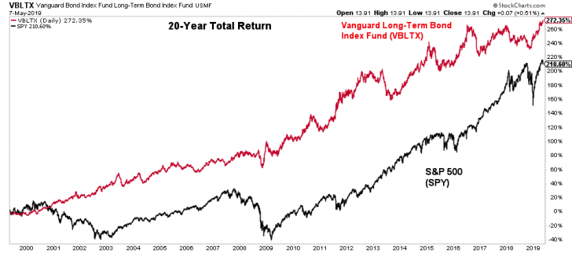

## Table of Contents

## What are stocks and how do they work?

Stocks are pieces of ownership in a company. When you buy a stock, you are buying a small part of that company. Companies sell stocks to raise money. They can use this money to grow their business, create new products, or pay off debts. People who own stocks are called shareholders. Shareholders hope that the company will do well so the value of their stocks will go up.

The price of a stock can go up or down based on how well the company is doing and what people think about its future. If a company makes more money or has good news, its stock price might go up. If the company has problems or bad news, the stock price might go down. Shareholders can make money in two ways: by selling their stocks for a higher price than they paid, or by receiving dividends. Dividends are payments that some companies give to their shareholders from their profits.

## What are bonds and how do they work?

Bonds are like loans that you give to a government or a company. When you buy a bond, you are lending them money. In return, they promise to pay you back the money you lent them, plus a little extra, on a certain date. This extra money is called interest. Bonds are often seen as safer than stocks because they have a fixed return and a set date when you get your money back.

The interest you get from a bond can be paid to you in different ways. Sometimes, you get payments every few months until the bond reaches its end date. Other times, you get all the interest at the end, along with your original money. The safety of a bond depends on who issued it. Government bonds are usually safer than company bonds because governments are less likely to go bankrupt. But safer bonds often give you less interest, while riskier bonds might give you more interest to make up for the higher risk.

## How do stocks and bonds differ in terms of risk and return?

Stocks are generally riskier than bonds. When you buy a stock, you own a piece of a company. If the company does well, the price of the stock can go up a lot, and you can make a lot of money. But if the company does badly, the stock price can go down a lot, and you can lose money. Stocks don't have a fixed return, so how much you make depends on how the company does and what other people think about it. This makes stocks exciting but also scary because you never know exactly what will happen.

Bonds are usually safer than stocks. When you buy a bond, you are lending money to a government or a company. They promise to pay you back your money plus some interest on a certain date. This means you know how much money you will get and when you will get it, as long as the issuer doesn't go bankrupt. The interest you get from bonds is usually less than what you might make from stocks, but it's more predictable. So, bonds are a good choice if you want to be safer with your money but still earn a little bit.

In short, stocks can offer higher returns but come with more risk, while bonds offer lower but more predictable returns with less risk. It's like choosing between a roller coaster ride with big thrills and big scares, or a calm boat ride where you know what to expect.

## What factors influence stock performance?

Many things can make a stock go up or down. One big thing is how well the company is doing. If a company makes more money or grows bigger, its stock price might go up because people want to own a piece of a successful company. Another important thing is what people think about the company's future. If people believe the company will do well, they might buy more of its stock, which can push the price up. On the other hand, if the company has problems or bad news, like losing money or having a scandal, the stock price might go down because people might want to sell their shares.

The economy can also affect stock prices. If the whole economy is doing well, with more jobs and more money being spent, many companies might do better, and their stock prices might go up. But if the economy is struggling, with fewer jobs and less spending, stock prices might go down. Other things like interest rates, inflation, and even big world events can also move stock prices. For example, if interest rates go up, borrowing money becomes more expensive, which can slow down the economy and affect stock prices.

Lastly, the stock market itself can influence stock performance. Sometimes, stocks go up or down just because other stocks are doing the same thing, a bit like a trend. This can happen even if nothing has changed with the company itself. Also, how easy it is to buy and sell a stock can affect its price. If a lot of people want to buy or sell a stock at the same time, the price can change quickly. So, many different things, from the company's own performance to bigger economic and market forces, all play a role in how a stock does.

## What factors influence bond performance?

Bonds are affected by many things, but one big thing is interest rates. When interest rates go up, new bonds start paying more interest. This can make old bonds, which pay less interest, less attractive to people. So, the price of old bonds might go down. When interest rates go down, new bonds pay less interest, making old bonds, which pay more, more attractive. This can make the price of old bonds go up. So, interest rates and bond prices usually move in opposite directions.

Another thing that affects bonds is how safe people think they are. If people think a government or company might have trouble paying back their bonds, they might want more interest to take that risk. This can make the price of those bonds go down. If people think the bond is very safe, they might be okay with less interest, which can make the price of the bond go up. The economy can also play a role. In a good economy, people might feel safer about bonds and want less interest, pushing bond prices up. In a bad economy, people might want more interest, pushing bond prices down.

Lastly, inflation can impact bonds. When prices for things go up a lot, the money you get from a bond might not buy as much as before. This can make bonds less attractive, and their prices might go down. If inflation is low, the money from a bond can still buy a lot, making bonds more attractive and their prices might go up. So, interest rates, how safe people think bonds are, the economy, and inflation all play a part in how bonds do.

## How have stocks historically performed compared to bonds?

Over a long time, stocks have usually done better than bonds. If you look at the last 100 years, stocks have grown more than bonds. This is because stocks can go up a lot when companies do well. But, stocks can also go down a lot if things go badly. So, while stocks can make you more money over time, they can also be scarier because they can lose value quickly. For example, if you had put money in the stock market in the U.S. over the last 50 years, you would have made about 10% each year on average, but there were times when stocks lost a lot of value, like during the 2008 financial crisis.

Bonds, on the other hand, have been safer but have grown less over time. They give you a steady return because they pay interest. Over the same 100 years, bonds have not grown as much as stocks. For example, U.S. government bonds have given about 5-6% each year on average over the last 50 years. Bonds are less likely to lose a lot of value all at once, which makes them a good choice if you want to keep your money safe. But because they grow slower, you might not make as much money over a long time as you would with stocks.

So, if you want to make more money and are okay with taking more risk, stocks might be better for you. If you want to keep your money safe and don't mind making less money, bonds might be a better choice. It's like choosing between a fast roller coaster that can be exciting but scary, and a slow boat ride that's calm and safe.

## What are the tax implications of investing in stocks versus bonds?

When you invest in stocks, you have to think about taxes. If you make money by selling your stocks for more than you paid, that's called a capital gain. You have to pay taxes on capital gains. If you hold the stock for more than a year before selling, it's called a long-term capital gain, and the tax rate is usually lower. If you sell the stock in less than a year, it's a short-term capital gain, and you pay your regular income tax rate, which can be higher. Also, if you get dividends from your stocks, those are usually taxed too, but at a special rate that's often lower than your regular income tax rate.

Bonds have different tax rules. The interest you get from most bonds is taxed as regular income, which can be at a higher rate than the tax on stock dividends or long-term capital gains. But there are some bonds, like municipal bonds, that can be tax-free. This means you don't have to pay federal taxes on the interest you get from them, and sometimes you don't have to pay state taxes either. So, if you want to keep more of your money, tax-free bonds can be a good choice, but they usually pay less interest than other bonds.

## How does the economic cycle affect stock and bond performance?

The economic cycle is like a big wheel that goes up and down, and it can change how stocks and bonds do. When the economy is doing well, like in a boom time, people have more money to spend, and companies make more money. This makes stock prices go up because people want to own parts of successful companies. But when the economy starts to slow down, or goes into a recession, people spend less money, and companies might make less money. This can make stock prices go down because people might want to sell their stocks and not buy new ones.

Bonds can also be affected by the economic cycle, but in a different way. When the economy is booming, people might want to take more risks and invest in stocks instead of bonds. This can make bond prices go down because fewer people want to buy them. But when the economy is slowing down or in a recession, people might want to be safer with their money and buy more bonds. This can make bond prices go up because more people want to buy them. So, the economic cycle can make stocks and bonds move in opposite ways sometimes.

## What role do interest rates play in the performance of stocks and bonds?

Interest rates can really change how stocks and bonds do. When interest rates go up, borrowing money gets more expensive for companies. This can make it harder for them to grow and make money, which can make their stock prices go down. Also, when interest rates go up, people might want to put their money in things that pay interest, like savings accounts or bonds, instead of stocks. This can make stock prices go down because fewer people want to buy them.

For bonds, interest rates are a big deal too. When interest rates go up, new bonds start paying more interest. This makes old bonds, which pay less interest, less attractive to people. So, the price of old bonds might go down. When interest rates go down, new bonds pay less interest, making old bonds, which pay more, more attractive. This can make the price of old bonds go up. So, interest rates and bond prices usually move in opposite directions.

## How can diversification between stocks and bonds benefit an investment portfolio?

Diversification between stocks and bonds can help make your investment portfolio safer and more balanced. When you put your money in both stocks and bonds, you spread out your risk. Stocks can go up a lot, but they can also go down a lot. Bonds are usually safer and give you a steady return. So, if the stock market goes down, the bonds in your portfolio can help keep your money safe. This way, you don't lose as much money if things go badly.

Also, having both stocks and bonds can help you make more money over time. Stocks can grow a lot more than bonds, so they can help your money grow faster. But bonds give you a steady return and can help you keep your money safe. By having some of both, you can get the best of both worlds. You can grow your money with stocks and keep it safe with bonds. This can help you reach your financial goals without taking too much risk.

## What advanced metrics should be considered when comparing stock and bond performance?

When comparing how stocks and bonds are doing, you might want to look at something called the Sharpe ratio. This helps you see how much extra return you get for the risk you take. A higher Sharpe ratio means you're getting more return for the risk you're taking, which is good. For stocks, you can also look at the beta, which shows how much the stock moves compared to the whole market. A stock with a high beta moves a lot more than the market, which can be riskier but also more exciting. For bonds, you might want to check the duration, which tells you how much the bond's price might change if interest rates go up or down. A longer duration means the bond's price can change a lot if interest rates move.

Another important thing to think about is the yield to maturity for bonds. This shows you the total return you can expect if you hold the bond until it matures. It's different from the coupon rate, which is just the interest the bond pays each year. For stocks, you can look at the price-to-earnings (P/E) ratio, which tells you how much you're paying for the company's earnings. A lower P/E ratio might mean the stock is a good deal, but it could also mean people don't think the company will do well in the future. By looking at these advanced metrics, you can get a better idea of how stocks and bonds might do and make smarter choices about where to put your money.

## How do global economic conditions impact the relative performance of stocks and bonds?

Global economic conditions can really change how stocks and bonds do. When the world economy is doing well, like when countries are growing and people are buying more things, companies usually make more money. This can make stock prices go up because people want to own parts of successful companies. But if the world economy is struggling, like during a big recession, companies might make less money. This can make stock prices go down because people might want to sell their stocks and not buy new ones. Also, if there's a lot of uncertainty around the world, like with wars or big political changes, people might feel scared and want to sell their stocks, which can make stock prices go down even more.

Bonds can also be affected by what's happening in the world economy, but in a different way. When the world economy is doing well, people might want to take more risks and invest in stocks instead of bonds. This can make bond prices go down because fewer people want to buy them. But when the world economy is slowing down or in a recession, people might want to be safer with their money and buy more bonds. This can make bond prices go up because more people want to buy them. So, global economic conditions can make stocks and bonds move in opposite ways sometimes. For example, if there's a big crisis in one part of the world, people might move their money to safer places like government bonds, which can make bond prices go up while stock prices might go down.

## What is the understanding of bonds as an investment option?

Bonds are fixed-income securities that play a crucial role within investment portfolios, particularly for conservative investors seeking lower risk and stable returns. Providing a predictable stream of income through fixed interest payments, bonds are considered a refuge during market volatility, often exhibiting less price fluctuation compared to equities.

**Types of Bonds**:
1. **Government Bonds**: These bonds are issued by national governments and are generally considered low-risk investments. They are backed by the credit of the issuing government, making them reliable but usually offering lower yields. Examples include U.S. Treasury bonds, which come in various maturities: bills (short-term), notes (medium-term), and bonds (long-term).

2. **Municipal Bonds**: Issued by local or state governments, municipal bonds fund public projects such as infrastructure and schools. They often provide tax advantages, as interest is sometimes exempt from federal and/or state taxes, which can enhance their attractiveness to investors in higher tax brackets. However, they may carry different risk levels based on the financial health of the issuing municipality.

3. **Corporate Bonds**: These are issued by companies to raise capital and typically carry higher risk than government bonds due to the potential for corporate default. Nevertheless, they usually offer higher yields to compensate for this additional risk. The creditworthiness of corporate bonds is often assessed by credit rating agencies, with investment-grade bonds being less risky than high-yield, or "junk," bonds.

**Role in Portfolio Diversification**:
Bonds are instrumental in reducing overall portfolio [volatility](/wiki/volatility-trading-strategies). They act as a counterbalance to the more erratic nature of stocks because bond prices typically move inversely to interest rates. When stock markets are volatile or bearish, bonds can provide stability and help preserve capital, supporting a smoother investment journey over time.

**Evaluating Bond Investments**:
When assessing bond investments, several key factors must be considered to align with an investor's financial goals:

- **Credit Ratings**: These ratings, provided by agencies such as Moody's, S&P Global, and Fitch, indicate the risk of default. Higher-rated bonds (AAA to BBB for investment-grade) suggest lower default risk, whereas lower-rated bonds (BB and below for speculative-grade) imply higher potential return but come with increased risk.

- **Yields**: A bond's yield, also known as yield to maturity (YTM), reflects the annual return an investor can expect assuming the bond is held until it matures. Yield can be influenced by the bond's coupon rate, market interest rates, and the bond's price in the secondary market. The formula for YTM considers the bond's current price, annual interest payments, face value, and remaining maturity:
$$
  \text{YTM} = \left( \frac{C + \frac{F - P}{n}}{\frac{F + P}{2}} \right)

$$

  Where $C$ is the annual coupon payment, $F$ is the face value, $P$ is the current price, and $n$ is the number of years to maturity.

- **Maturity Dates**: Bonds come with various maturity periods; short-term bonds tend to be less sensitive to interest rate changes, while long-term bonds can offer higher yields at the cost of greater interest rate risk.

By considering these elements, investors can strategically invest in bonds, aligning their selections with their individual risk tolerances and financial objectives to optimize portfolio performance.

## References & Further Reading

[1]: Zvi Bodie, Alex Kane, & Alan J. Marcus. ["Investments"](https://www.amazon.com/Investments-Zvi-Bodie/dp/1260013839) (2013). This comprehensive text provides an in-depth understanding of the principles of investing, including stock and bond markets.

[2]: Burton Malkiel. ["A Random Walk Down Wall Street"](https://www.amazon.com/Random-Walk-Down-Wall-Street/dp/0393358380) (2019). This book offers insights into various investment strategies, including stocks and bonds, emphasizing the importance of a diversified portfolio.

[3]: Marcos López de Prado. ["Advances in Financial Machine Learning"](https://www.amazon.com/Advances-Financial-Machine-Learning-Marcos/dp/1119482089) (2018). This book explores the application of advanced machine learning techniques to algorithmic trading, providing valuable insights into modern trading strategies.

[4]: Ernest P. Chan. ["Quantitative Trading: How to Build Your Own Algorithmic Trading Business"](https://www.amazon.com/Quantitative-Trading-Build-Algorithmic-Business/dp/0470284889) (2008). This book is a practical guide to developing algorithmic trading strategies and building a trading business.

[5]: David Aronson. ["Evidence-Based Technical Analysis: Applying the Scientific Method and Statistical Inference to Trading Signals"](https://www.amazon.com/Evidence-Based-Technical-Analysis-Scientific-Statistical/dp/0470008741) (2006). This book emphasizes the use of scientific and statistical techniques in technical analysis for trading.