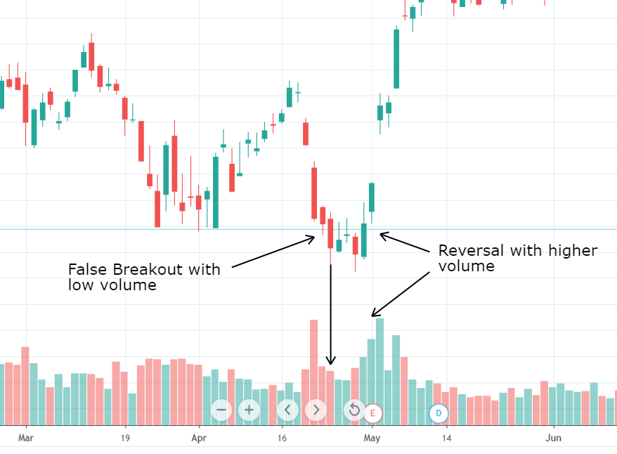

Trading volume is a critical metric in financial markets, encapsulating the total number of shares, contracts, or units exchanged over a defined period. This metric serves as a cornerstone for interpreting market dynamics and gauging the liquidity of financial instruments. In essence, a higher trading volume suggests more robust market activity and typically indicates that assets can be traded more easily without causing significant price changes. This ease of transaction is particularly beneficial when executing large orders, allowing for better price control and execution efficiency.

Volume extends beyond a mere liquidity gauge, acting as an essential indicator of market sentiment and the strength of price movements. When investors and traders assess whether a price trend is genuine or merely ephemeral, they look at trading volume as a confirmatory statistic. A trend backed by substantial volume is often regarded as more reliable; conversely, a trend with low volume may be subject to skepticism and deemed less sustainable.



This article will cover various facets of stock volume, specifically how it provides invaluable insights to investors, its integral role in trading strategies, and its growing application within algorithmic trading. Understanding the nuances of volume can enhance investment decisions and improve trading outcomes by offering a clearer picture of market dynamics.

## Table of Contents

## Understanding Stock Volume

Stock volume represents the total number of shares traded within a specific timeframe, usually a day. It serves as a quantitative measure of trading activity within a stock. Understanding stock volume is crucial as it signals the liquidity of a stock, indicating how easily it can be bought or sold without impacting its price. High trading volumes typically suggest high liquidity, facilitating better order execution for investors. This is because a more liquid market allows for quicker transactions and tighter bid-ask spreads, reducing the cost of trading.

For investors and traders, volume provides essential context to price movements. A significant price change accompanied by high trading volume is generally viewed as a strong indicator of future trends. This is because such movements suggest heightened interest, either buying or selling, thereby offering a more credible indication of a potential trend. Conversely, if a stock experiences price shifts with low or declining volume, it might indicate a lack of conviction among traders, rendering the price trend potentially unreliable.

Volume also helps in distinguishing between genuine price trends and market noise, which can result from temporary factors affecting a stock price. Analyzing volume in conjunction with price allows for a better assessment of whether a price movement reflects genuine market sentiment or is merely an aberration. For example, a stock consistently increasing in price on rising volume suggests strong buying interest, whereas the same price movement on low volume might be the result of speculative or random factors.

In summary, stock [volume](/wiki/volume-trading-strategy) is a vital metric that enhances the understanding of price actions, fosters improved [liquidity](/wiki/liquidity-risk-premium) conditions, and enables investors to make informed decisions by deciphering the underlying strength of a stock's movement.

## Significance of Trading Volume for Investors

Trading volume is a key measure of market sentiment, reflecting the collective mood of investors. When trading volume is high, it typically indicates strong investor interest and participation, which often aligns with a bullish mood in the market. Conversely, low trading volumes may suggest a lack of investor conviction or interest, corresponding with a more bearish sentiment.

Investors use volume to confirm price trends because a movement in price that is coupled with a corresponding high volume is often seen as more reliable. For instance, if a stock's price rises significantly with high trading volume, it is generally considered more likely to be a true reflection of bullish market sentiment rather than a brief fluctuation due to minor market noise. This concept is rooted in the idea that when many investors are actively trading, it could validate the strength of the current price movement, implying that the change in price is supported by broad market consensus.

Volume divergence can be an important indicator of potential trend reversals. This occurs when the price of a stock increases while trading volume decreases, or vice versa. Such divergence may suggest that the current trend lacks the support of broader market participation, indicating a possible weakening or impending reversal. For example, if a stock is continuously rising in price but the volume is declining, it may point to diminishing buyer interest, and the upward trend could be losing [momentum](/wiki/momentum).

Mathematically, trading volume analysis might involve comparing the current volume to historical averages to spot anomalies or patterns. In Python, a simple way to check for such volume anomalies could be using moving averages:

```python
import pandas as pd

# Assuming 'data' is a pandas DataFrame with 'Close' for prices and 'Volume' for trading volumes
data['Volume_MA_20'] = data['Volume'].rolling(window=20).mean()

# Identifying periods where the current volume significantly deviates from the 20-day moving average
data['Volume_Anomaly'] = ((data['Volume'] - data['Volume_MA_20']) / data['Volume_MA_20']) > 0.25

# Checking whether the price trend and volume anomaly align
data['Volume_Trend_Conf'] = data['Close'].diff().apply(lambda x: 'bullish' if x > 0 else 'bearish')
```

This code calculates a 20-day moving average of volume and flags any instances where the trading volume significantly exceeds this average. By tagging the direction of the price trend, it offers a basic way to see whether high volume aligns with, or diverges from, the price trend. This information can be crucial for investors seeking to interpret market signals accurately.

## Trading Volume in Technical Analysis

Technical analysts use trading volume as a significant tool to confirm technical patterns such as breakouts and reversals. When a security's price moves beyond a support or resistance level, the volume of trades can provide essential confirmation. A [breakout](/wiki/breakout-trading) accompanied by high volume suggests strong market interest and conviction, which is more likely to result in a sustained directional movement, whereas a breakout on low volume may indicate a lack of participant engagement and higher chances of a false signal.

Indicators like On-Balance Volume (OBV) and Volume-Weighted Average Price (VWAP) offer more profound insights into volume dynamics beyond superficial observations. OBV is a cumulative measure that adds volume on up days and subtracts it on down days, helping to indicate the buying or selling pressure. An upward OBV trend is typically associated with an upward price trend, while a downward OBV trend suggests a decrease in price. The formula for calculating OBV is:

$$

\text{OBV} = \begin{cases} 
\text{OBV}_{\text{previous}} + \text{Volume}, & \text{if } \text{Close}_{\text{today}} > \text{Close}_{\text{yesterday}} \\
\text{OBV}_{\text{previous}} - \text{Volume}, & \text{if } \text{Close}_{\text{today}} < \text{Close}_{\text{yesterday}} \\
\text{OBV}_{\text{previous}}, & \text{if } \text{Close}_{\text{today}} = \text{Close}_{\text{yesterday}}
\end{cases}
$$

VWAP, on the other hand, provides an average price a security has traded at throughout the day, based on both volume and price. It's a tool often used by institutional traders to ensure they are executing trades at favorable prices compared to the day’s average activity. VWAP is calculated as follows:

$$

\text{VWAP} = \frac{\sum(\text{Price} \times \text{Volume})}{\sum(\text{Volume})}
$$

Volume analysis aids in validating breakouts above significant support and resistance levels. For instance, when a stock price rises above a resistance level on high volume, it confirms that traders expect future price increases, providing a stronger market signal. Similarly, if a stock falls below a support level on heavy volume, it may indicate the potential for further downward movement. Thus, incorporating volume with price movements enhances the reliability of technical analyses and aids traders in making informed decisions.

## The Role of Volume in Algorithmic Trading

Algorithmic trading has become an integral part of modern financial markets, utilizing automated systems to execute trades based on pre-set criteria. A critical component of this approach is trading volume data, which informs and enhances the execution processes of high-frequency trades. Volume data essentially measures market activity and liquidity, providing a crucial dimension for algorithms that process market signals and execute trades.

Understanding volume dynamics is pivotal for creating effective trading algorithms. Algorithms rely on volume data to assess market liquidity, which is vital for minimizing market impact and ensuring efficient trade execution. High volumes often indicate higher liquidity, which implies narrower bid-ask spreads and lower transaction costs, making it easier for algorithms to enter and [exit](/wiki/exit-strategy) positions with minimal market disruption.

Moreover, volume analysis helps refine the decision-making process in algorithmic strategies. By integrating volume data, algorithms can filter out noise from actual market signals, focusing on trades backed by strong volume support. This approach enhances the reliability of implementing strategies such as momentum trading or mean reversion, where timing and execution precision are crucial.

As [algorithmic trading](/wiki/algorithmic-trading) continues to dominate market activity, the interpretation of volume data is likely to evolve. Algorithms not only analyze volume in real-time but also predict future volume patterns using historical data through [machine learning](/wiki/machine-learning) techniques. For instance, algorithms might employ statistical models or neural networks to forecast volume spikes, allowing them to adjust trading strategies accordingly.

The transition toward more automated markets presents new challenges and opportunities concerning volume interpretation. While traditional traders have relied on direct volume observation, algorithms can synthesize vast amounts of data to form complex models that identify subtle patterns not observable manually. This shift requires traders and developers to continuously adapt and optimize algorithms for changing market conditions.

In summary, volume plays a central role in algorithmic trading by improving trade execution and decision-making. As technology progresses, the integration of sophisticated volume analysis techniques will likely further enhance the capabilities of trading algorithms, challenging market participants to stay ahead in an increasingly automated financial environment.

## Practical Applications and Case Studies

Trading volume plays a crucial role in the practical application of stock analysis and predicting market trends. By examining real-world cases, one can see how volume data has been a reliable indicator of market movements and, at times, a misleading signal for traders.

### Real-World Examples of Trading Volume Impact

1. **Tesla Inc. (TSLA) Stock Movements**: An example of trading volume significantly impacting stock prices is Tesla Inc. In 2020, Tesla experienced a sharp rise in trading volume coupled with a steep increase in price as investors anticipated its inclusion in the S&P 500 index. This high-volume period confirmed the bullish sentiment, as the price movements were supported by significant investor participation, thereby reinforcing the trend with credible signals.

2. **GameStop Corp. (GME) and the Short Squeeze of 2021**: The GameStop saga in early 2021 highlighted how trading volume could signal both opportunity and risk. A surge in trading volume along with a skyrocketing stock price caught many seasoned investors off-guard. The dramatic rise was fueled by retail investors coordinating trades through online forums, resulting in a short squeeze. Here, heightened volume served as both a catalyst for price movements and a challenge for traders, showcasing how volume can mislead traditional valuation metrics.

3. **Amazon.com Inc. (AMZN) Breakout Pattern**: In technical analysis, Amazon exhibited a technical breakout in 2018 where the volume played a critical role. The stock had traded in a range for months before breaking through a resistance level. A rise in volume validated this breakout, signaling to technical traders that the upward movement had strong backing, thus likely to continue.

### Cases of Volume as a Predictive Tool

1. **Bitcoin Price Movements**: Trading volume isn’t limited solely to stocks. Cryptocurrencies like Bitcoin also show how volume can predict shifts in market trends. Periods of low volume followed by a significant spike often precede volatile price movements. Traders monitoring volume changes can thus identify potential opportunities or impending volatility.

2. **Role of Volume in Misleading Signals**: However, high trading volume does not always translate to favorable outcomes. During speculative bubbles or around earnings announcements, trades might occur based on hype or misinformation rather than intrinsic value, leading traders to act on misguided assumptions drawn from volume data alone.

### Conclusion

These examples underscore the dual role volume plays in financial markets, serving as a barometer of market sentiment while also posing challenges due to its potential to mislead. Effective use of volume data involves not just observing volume spikes but understanding the context behind them—whether speculative or backed by fundamentals. As trading platforms evolve with technology, traders and investors alike must adeptly interpret volume information to align with broader market strategies and insights.

## Conclusion

Stock volume remains a fundamental metric for traders and investors, playing a crucial role in understanding market dynamics and price trends. As it measures the number of shares traded within a specific timeframe, volume offers an essential perspective on the liquidity and momentum of a given stock or market. A high trading volume generally implies greater liquidity, enabling investors to execute orders more efficiently and reducing the likelihood of price manipulation.

With the continuous advancement in trading technology, the analysis and application of trading volume have witnessed significant evolution. Algorithmic and high-frequency trading strategies, which rely heavily on automated systems, increasingly utilize volume data to optimize trade execution and enhance strategy performance. These developments have made real-time volume analysis an indispensable component of modern trading systems, as it assists in identifying trading opportunities and mitigating risk.

Given these dynamics, investors and traders are strongly encouraged to incorporate volume analysis into their strategies. This can enhance decision-making processes and improve the ability to anticipate and respond to market trends. By understanding volume patterns, investors can confirm price movements, identify potential reversals, and assess market sentiment more accurately, thus aligning their strategies more closely with the underlying market conditions.

The importance of trading volume is underscored by the development of technical indicators such as the On-Balance Volume (OBV) and Volume-Weighted Average Price (VWAP), which offer deeper insights into volume trends and their impact on price behavior. These tools enhance the reliability of traditional technical analysis by integrating volume data into their calculations, thereby providing a more comprehensive view of market activity.

In conclusion, as market participants continue to navigate the complexities of trading, the strategic integration of volume analysis remains a key approach for enhancing market understanding and achieving successful trading outcomes.

## References & Further Reading

[1]: Bergstra, J., Bardenet, R., Bengio, Y., & Kégl, B. (2011). ["Algorithms for Hyper-Parameter Optimization."](https://papers.nips.cc/paper/4443-algorithms-for-hyper-parameter-optimization) Advances in Neural Information Processing Systems 24.

[2]: ["Advances in Financial Machine Learning"](https://www.amazon.com/Advances-Financial-Machine-Learning-Marcos/dp/1119482089) by Marcos Lopez de Prado

[3]: ["Evidence-Based Technical Analysis: Applying the Scientific Method and Statistical Inference to Trading Signals"](https://www.amazon.com/Evidence-Based-Technical-Analysis-Scientific-Statistical/dp/0470008741) by David Aronson

[4]: ["Machine Learning for Algorithmic Trading"](https://github.com/stefan-jansen/machine-learning-for-trading) by Stefan Jansen

[5]: ["Quantitative Trading: How to Build Your Own Algorithmic Trading Business"](https://books.google.com/books/about/Quantitative_Trading.html?id=j70yEAAAQBAJ) by Ernest P. Chan