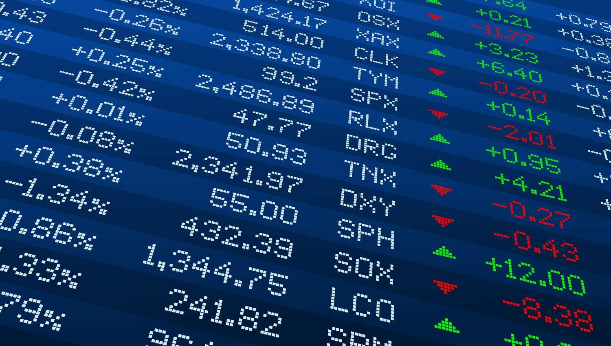

The world of investing is experiencing a significant shift due to technological advancements. Stock monitoring, financial analysis, investment tracking, and algorithmic trading have become indispensable tools for contemporary investors. These tools play a crucial role in shaping modern investment strategies by providing critical insights that inform decision-making and portfolio optimization.

Stock monitoring allows investors to keep track of stock performance in real time, paving the way for timely and data-driven decisions. Financial analysis offers comprehensive evaluations of company financial statements, enabling investors to gauge investment viability and associated risks. Investment tracking ensures that all assets within a portfolio are aligned with an investor's financial goals, assisting in strategic asset allocation and tax management. Algorithmic trading, on the other hand, uses complex algorithms to execute trades at optimal times, enhancing trading efficiency and minimizing human error.



Understanding these technological tools is paramount for any investor looking to make informed decisions. Not only do they offer potential improvements in investment returns and risk management, but they also assist in developing a well-rounded investment strategy. By integrating these technologies, investors can build robust portfolios tailored to their specific goals and risk tolerance.

This article explores the role of these technologies in detail, examining how they integrate into investment strategies and the benefits they offer. As technology continues to advance, the investment landscape will undoubtedly evolve, presenting new opportunities for optimizing portfolio performance and staying ahead in the market. Keeping abreast of these tools is essential for anyone looking to succeed in today's competitive financial environment.

## Table of Contents

## What is Stock Monitoring?

Stock monitoring involves tracking the performance of stocks in real-time, a practice that has become indispensable for modern investors. By observing market fluctuations as they occur, investors can effectively identify trends, price movements, and overall market sentiment, enabling them to make well-informed investment decisions.

With advancements in technology, digital platforms and software tools now provide unparalleled access to real-time market data. These platforms facilitate investors in obtaining instant updates on stock performance, helping them to swiftly respond to market changes. The integration of stock monitoring applications allows investors to customize alerts and set notifications for significant price changes or important news events. By leveraging these functionalities, investors can stay abreast of critical market movements and capitalize on potential opportunities or mitigate risks promptly.

The ability to monitor stocks in real-time is crucial for ensuring timely investment decisions. It empowers investors to react immediately to market developments rather than rely on outdated information. For instance, unexpected geopolitical events or corporate announcements that impact stock prices demand quick action, which real-time monitoring can provide. Consequently, investors are better positioned to adjust their portfolios in a manner that aligns with their financial objectives.

Overall, the accessibility and efficiency afforded by stock monitoring tools represent a significant advancement in the financial industry, allowing investors to achieve greater precision and agility in managing their investment strategies. With these tools, investors can enhance their capacity to evaluate market dynamics, optimize their portfolios, and ultimately improve their investment outcomes.

## The Importance of Financial Analysis

Financial analysis is a cornerstone of informed investing, involving a thorough evaluation of a company's financial statements to comprehend its performance and potential as an investment opportunity. The primary objective of financial analysis is to help investors evaluate the viability and risk associated with investing in specific stocks. By examining the financial health and operational efficiency of a company, investors can make educated decisions that align with their investment strategies and risk tolerance.

One of the critical aspects of financial analysis is the use of advanced tools that provide comprehensive insights and forecasts. These tools have evolved significantly, offering investors the capability to analyze large volumes of data with greater precision and speed. For example, software platforms can now efficiently process financial statements, valuation models, and industry comparisons to present concise results that guide investment decisions.

Financial analysis relies heavily on key metrics that indicate a company's fiscal strength and potential for growth. Earnings per share (EPS) is a fundamental measure, representing the portion of a company's profit allocated to each outstanding share of common stock. It provides insight into a company's profitability and is often used to compare performance across companies in the same sector.

Revenue growth is another crucial metric, reflecting the increase in a company's sales over a specific period. A steady or accelerating revenue growth rate suggests a company's products or services are in demand, which can signal potential for expansion and increased market share.

Profit margins, including gross, operating, and net margins, are also vital indicators. They measure how efficiently a company converts sales into profit. Higher margins typically suggest better operational efficiency and effectiveness in managing expenses relative to revenue. By analyzing these metrics, investors can determine whether a company's profitability is sustainable over the long term.

Overall, financial analysis empowers investors by providing a clear rationale for their investment choices. It transforms raw financial data into actionable insights, forming the basis for strategic decision-making. In an era where technology continuously offers better tools for financial analysis, investors can achieve a higher level of sophistication in their evaluations, adapting swiftly to changes in financial narratives and market conditions.

## Investment Tracking Techniques

Investment tracking is the systematic process of overseeing the performance and allocation of assets within an investment portfolio. This practice is pivotal in ensuring that investments are aligned with predefined financial objectives and that they perform as expected. With the proliferation of technology, numerous sophisticated software solutions and mobile applications have emerged, allowing investors to monitor their portfolios in real-time through user-friendly dashboards. These platforms provide valuable insights into the performance of each asset, facilitating informed decisions on whether to buy, sell, or hold.

One of the primary benefits of effective investment tracking is its contribution to timely decision-making. By consistently monitoring portfolio performance, investors can act swiftly in response to market fluctuations, maximizing returns while minimizing potential losses. For instance, if a particular asset deviates significantly from its expected performance, the investor can swiftly decide on a corrective action, such as reallocating resources or altering investment strategies.

Investment tracking also plays a crucial role in tax management. Proper tracking ensures accurate recording of capital gains, dividends, and interest, simplifying tax reporting and compliance. Software platforms often include features that help calculate the tax implications of trading decisions, making it easier for investors to optimize their portfolios for tax efficiency.

A comprehensive investment tracking system is built upon several core metrics and tools. These usually include portfolio analytics to assess asset allocation, risk assessment tools to evaluate portfolio [volatility](/wiki/volatility-trading-strategies), and performance benchmarks for comparison against market indices. Additionally, such tools often come equipped with features that allow investors to set alerts and notifications for significant market events or price changes, further enhancing their ability to make data-driven decisions.

Utilizing technology to track investments effectively empowers investors by providing both a macro and micro view of their financial landscape. With the right tracking framework, investors can not only ensure their portfolios are on target to achieve their financial goals but also adapt strategies dynamically to adjust to changing market conditions and personal financial circumstances.

## The Rise of Algorithmic Trading

Algorithmic trading, popularly known as algo trading, is transforming the financial markets by using complex algorithms to perform trade executions at optimal times. These algorithms analyze a multitude of market variables and make trading decisions faster than any human trader. The automation of trades through algo trading allows for increased speed, precision, and efficiency, often leading to more profitable outcomes for investors.

At its core, [algorithmic trading](/wiki/algorithmic-trading) harnesses technological advancements to capitalize on market opportunities within microseconds. By leveraging the power of computers, algo trading reduces latency in executing trades, which is crucial in swiftly changing markets. This capability is advantageous in both volatile and stable market conditions, where the timeliness of trade execution can significantly influence profit margins.

One of the most compelling features of algorithmic trading is its customization potential. Traders can program algorithms to adhere to specific strategies and parameters, which can range from basic moving averages to complex mathematical models embracing [machine learning](/wiki/machine-learning) techniques. For instance, an algorithm could be designed to identify [arbitrage](/wiki/arbitrage) opportunities or execute trades based on pre-defined technical indicators, such as the Relative Strength Index (RSI) or Moving Average Convergence Divergence (MACD).

In practical terms, an algorithm might look like this when implemented in Python, seeking to execute trades when a simple moving average crosses over an exponential moving average:

```python
def sma_crossover_strategy(prices, short_window, long_window):
    signals = pd.DataFrame(index=prices.index)
    signals['price'] = prices
    signals['short_mavg'] = prices.rolling(window=short_window, min_periods=1).mean()
    signals['long_mavg'] = prices.rolling(window=long_window, min_periods=1).mean()
    signals['signal'] = 0.0

    # Create 'signal' column where short moving average crosses above long moving average
    signals['signal'][short_window:] = np.where(signals['short_mavg'][short_window:] > signals['long_mavg'][short_window:], 1.0, 0.0)

    # Generate trading orders where signals differ
    signals['positions'] = signals['signal'].diff()

    return signals
```

The automation of trading processes through algorithms mitigates human error, thereby minimizing risks associated with emotional decision-making and impulsive buying or selling. Furthermore, it allows for high-frequency trading ([HFT](/wiki/high-frequency-trading-strategies)), where thousands of orders can be placed in fractions of a second, capitalizing on small price movements efficiently and effectively.

The enhancement of [artificial intelligence](/wiki/ai-artificial-intelligence) (AI) and machine learning continues to expand the horizons of algorithmic trading. AI algorithms can process vast datasets encompassing historical prices, economic indicators, and global news to identify patterns and predict future price movements with heightened accuracy. Machine learning models are being trained to adapt to changing market conditions, continually improving performance as they learn from past trades.

The evolution of AI in algorithmic trading promises to redefine the capabilities of these systems, making them an integral part of modern investing. As the algorithms become more sophisticated, they are expected to contribute significantly to increasing market [liquidity](/wiki/liquidity-risk-premium) and reducing trading costs, benefiting not only individual investors but also the financial ecosystem as a whole.

## Combining Digital Tools for a Robust Investment Strategy

Integrating digital tools such as stock monitoring, financial analysis, and algorithmic trading can significantly enhance investment strategies. This integration allows for a comprehensive view of one's investments, facilitating informed decision-making and potentially boosting returns.

Stock monitoring tools provide real-time data on stock performance, enabling investors to stay informed about market trends and price movements. This immediate access to data allows for the setting of alerts for significant price changes or relevant news, ensuring that investors can react promptly and make timely decisions.

Financial analysis tools offer the ability to evaluate a company’s financial health through its financial statements. By examining key metrics like earnings per share, revenue growth, and profit margins, investors gain valuable insights into the viability and potential risk of their investments. These tools often include advanced analytics and forecasting abilities, giving investors a deeper understanding of a company's financial trajectory.

Algorithmic trading, on the other hand, leverages computer algorithms to execute trades at optimal times, increasing efficiency and reducing the likelihood of human error. With the capacity for high-frequency trading, these algorithms can process large datasets quickly to seize the best trading opportunities. Advances in artificial intelligence continue to improve the capabilities of algorithmic trading, allowing for more sophisticated strategies and improved performance.

Combining these tools allows investors to take a holistic approach, customizing strategies to suit their individual investment goals and risk tolerance. Each tool brings its advantages, and when used together, they can provide a dynamic and adaptable investment strategy. Consideration of the investor's objectives and risk profile is vital when selecting the right combination of digital tools.

Successful investors often dedicate time to learning and adapting to new technologies. This continuous learning process is essential for keeping pace with technological advancements and leveraging new tools to enhance investment performance. By embracing new technologies and integrating them effectively, investors can build robust investment strategies that are both flexible and resilient in changing market conditions.

## Conclusion

The integration of stock monitoring, financial analysis, and algo trading tools is significantly transforming the landscape of investing. By leveraging these technologies, investors can access and analyze real-time data, facilitating more informed and timely decision-making processes. Stock monitoring offers the continuous tracking of market fluctuations and stock performance, enabling investors to react promptly to market changes and capitalize on emerging trends.

Financial analysis, on the other hand, allows investors to scrutinize company financials, supplying essential insights into potential risks and growth opportunities. Advanced analytics tools can dissect financial statements and derive key performance indicators, such as earnings per share (EPS) and revenue growth rate, thus providing a solid foundation for strategic investment decisions.

Algorithmic trading represents a paradigm shift in executing trades. By employing algorithms that can operate on defined parameters and market strategies, algo trading minimizes human error and harnesses high-frequency trading possibilities, leading to greater trading efficiency and potentially enhanced returns.

As technology continues to evolve, it will undoubtedly introduce new opportunities for refining investment tracking and performance. Staying updated on these tools and understanding their applications is paramount for achieving investment success. With a comprehensive grasp of these technologies, investors have the power to substantially enhance their portfolios, aligning investments with their financial goals and risk appetites. This technological synergy presents a pathway toward optimizing investment outcomes, facilitating a more strategic and responsive investment strategy.

## References & Further Reading

[1]: Bergstra, J., Bardenet, R., Bengio, Y., & Kégl, B. (2011). ["Algorithms for Hyper-Parameter Optimization."](https://dl.acm.org/doi/10.5555/2986459.2986743) Advances in Neural Information Processing Systems 24.

[2]: ["Advances in Financial Machine Learning"](https://www.amazon.com/Advances-Financial-Machine-Learning-Marcos/dp/1119482089) by Marcos Lopez de Prado

[3]: ["Evidence-Based Technical Analysis: Applying the Scientific Method and Statistical Inference to Trading Signals"](https://www.amazon.com/Evidence-Based-Technical-Analysis-Scientific-Statistical/dp/0470008741) by David Aronson

[4]: ["Machine Learning for Algorithmic Trading"](https://github.com/stefan-jansen/machine-learning-for-trading) by Stefan Jansen

[5]: ["Quantitative Trading: How to Build Your Own Algorithmic Trading Business"](https://www.amazon.com/Quantitative-Trading-Build-Algorithmic-Business/dp/1119800064) by Ernest P. Chan