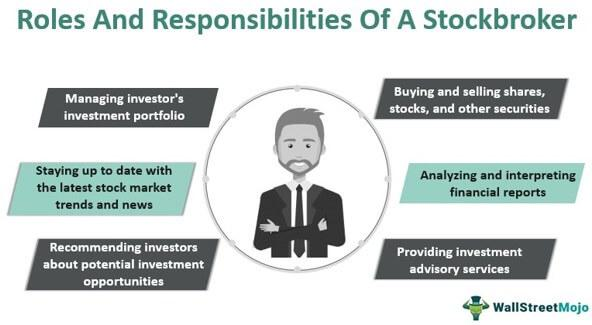

Finance careers are diverse and multi-faceted, encompassing various roles that focus on managing, analyzing, and strategizing financial transactions and investments. Among these, stockbroking and algorithmic trading stand out due to their substantial impact on the financial markets and the lucrative opportunities they offer.

Understanding the roles and compensation in these sectors is crucial for anyone considering a career in finance. Salaries often reflect the complexity and responsibility associated with these positions, alongside factors like geographical location, the size of the firm, and individual performance. Therefore, gaining insight into the financial and career trajectories within these fields is essential for making informed career decisions.



Stockbrokers are financial professionals who buy and sell stocks and other securities on behalf of clients. They play a key role in connecting buyers and sellers in the financial markets, ensuring that transactions are executed smoothly. The evolving nature of stockbroking—from traditional face-to-face interactions to online and digital platforms—continuously shapes their responsibilities and career outlook.

Algorithmic trading, a subset of trading that employs computerized systems and advanced algorithms to execute trade orders, has transformed the financial landscape in recent years. This technique leverages speed and efficiency, critical in today's fast-paced markets. Professionals in this domain, including quantitative analysts and algorithmic traders, are tasked with developing and optimizing these trading strategies.

As these sectors continue to grow and evolve, understanding their dynamics not only aids prospective professionals but also helps in navigating the complex financial terrain inherent in these roles. This knowledge facilitates career advancement and potentially increases earning potential, making it a significant consideration for entrants and veterans alike in finance.

## Table of Contents

## Understanding the Role of a Stockbroker

A stockbroker is a professional who executes buy and sell orders for stocks and other securities on behalf of clients. Stockbrokers play a crucial role in the financial markets by facilitating transactions that contribute to market liquidity and price discovery. They typically work for brokerage firms and are regulated by financial authorities to ensure compliance with market standards and protect investor interests.

The primary responsibilities of a stockbroker include advising clients on investment opportunities, conducting research to make informed recommendations, and managing client portfolios. Stockbrokers must stay updated with market trends, economic news, and company performances to provide accurate advice and make timely trades that align with clients' financial goals.

Stockbrokers facilitate transactions in financial markets through a well-structured process. They receive orders from clients and direct them to the appropriate exchanges where the trades are executed. This involves negotiating prices, processing transaction paperwork, and ensuring the transfer of ownership between buyers and sellers. By doing so, stockbrokers help maintain the efficiency and fluidity of financial markets.

There are two main types of stockbrokers: full-service brokers and discount brokers. Full-service brokers offer a comprehensive range of services, including personalized investment advice, retirement planning, and tax guidance. They cater to clients who require a hands-on approach and are willing to pay higher fees for the expertise and customized service. Discount brokers, on the other hand, provide a less comprehensive service focused primarily on executing trades. They charge lower fees, appealing to self-directed investors who prefer managing their investments and need only minimal broker assistance. This distinction allows investors to choose brokerage services that best align with their financial needs and investment strategies.

In summary, stockbrokers are pivotal in ensuring the smooth operation of financial markets by executing client orders and offering strategic investment advice. Their choice between full-service and discount brokers provides clients with options tailored to their specific investment preferences and requirements.

## Stockbroker Salaries: What to Expect

Stockbrokers play a pivotal role in the financial markets, assisting clients in executing trades and managing investment portfolios. Their compensation structures typically consist of commissions, fees, or a combination of both. These compensation frameworks are crucial for stockbrokers as they reflect their performance and the value they bring to clients.

Compensation structures for stockbrokers generally fall into two categories: commission-based and fee-based. Commission-based stockbrokers earn a percentage of each transaction they facilitate. For instance, if a broker executes a trade worth $10,000 and charges a 1% commission, they would earn $100 for the transaction. This structure incentivizes brokers to increase trading volumes and can lead to significant earnings for those with a large client base. On the other hand, fee-based stockbrokers may charge a flat fee for managing a client's portfolio, which can provide more predictable income.

The average salary of a stockbroker varies significantly by region and other influencing factors. In the United States, stockbrokers might earn between $50,000 to $100,000 annually, with experienced brokers or those in prestigious firms [earning](/wiki/earning-announcement) substantially more. In the UK, the average salary is approximately £40,000 to £70,000, but again, those in top financial institutions or who have built a lucrative client roster can exceed this range. Regions such as Hong Kong and Singapore, renowned for their financial sectors, offer competitive salaries that often rival or exceed Western markets.

Several factors influence stockbroker salaries. Experience is a primary determinant; seasoned brokers with a track record of successful trades and client retention tend to command higher incomes. The size and reputation of the firm also play a role. Brokers at well-established firms often access a broader client base and more substantial resources, translating into higher earnings. Additionally, economic conditions and market [volatility](/wiki/volatility-trading-strategies) can impact brokers' earnings, as they often thrive in dynamic markets with high trading volumes. Therefore, while stockbroking can be a lucrative career, it requires skill, dedication, and a strategic approach to client relationships and market opportunities.

## Overview of Careers in Algorithmic Trading

Algorithmic trading, often referred to as algo trading, is the use of computer algorithms and statistical models to execute trades in financial markets. These algorithms are designed to operate at speeds and frequencies that are beyond human capacity, often taking advantage of minute market inefficiencies. Its significance in modern finance cannot be overstated, as it enhances market [liquidity](/wiki/liquidity-risk-premium) and reduces transaction costs, thus playing a crucial role in the efficient functioning of contemporary financial markets.

In the world of [algorithmic trading](/wiki/algorithmic-trading), there are several career roles that individuals can pursue, each contributing in various ways to the trading process. One primary role is that of a **quantitative analyst (quant)**. Quants are responsible for developing the mathematical models that underpin the algorithms used in trading. They employ techniques from mathematics, [statistics](/wiki/bayesian-statistics), and computer science to create models that can predict market movements or identify trading opportunities. These professionals often hold advanced degrees in quantitative fields such as mathematics, physics, or engineering.

Another prominent role is that of an **algorithmic trader**. Unlike traditional traders who might rely on intuition or experience, algorithmic traders use the outputs of quantitative models to make informed trading decisions. They work closely with quants to implement and refine trading strategies that are often executed automatically by the algorithms. This role typically requires a strong understanding of financial markets and products, as well as technical skills to operate and adjust trading systems.

Key skills required for a career in algorithmic trading span across several domains. A deep understanding of quantitative methods and statistics is essential for developing and evaluating trading models. Proficiency in programming languages such as Python, C++, or R is crucial for coding algorithms and handling large datasets efficiently. Here is a simple example of a moving average crossover strategy implemented in Python:

```python
import pandas as pd

def moving_average_strategy(prices, short_window, long_window):
    # Calculate moving averages
    signals = pd.DataFrame(index=prices.index)
    signals['signal'] = 0.0
    signals['short_mavg'] = prices['Close'].rolling(window=short_window, min_periods=1).mean()
    signals['long_mavg'] = prices['Close'].rolling(window=long_window, min_periods=1).mean()

    # Signal generation
    signals['signal'][short_window:] = np.where(signals['short_mavg'][short_window:] > signals['long_mavg'][short_window:], 1.0, 0.0)   
    signals['positions'] = signals['signal'].diff()

    return signals

# Usage example (prices is a DataFrame with a datetime index and a 'Close' column)
# signals = moving_average_strategy(prices, short_window=40, long_window=100)
```

Additionally, problem-solving skills and the ability to analyze and interpret complex data sets are crucial for identifying profitable trading signals. Knowledge of financial markets and instruments, along with risk management principles, is also vital to navigate the intricacies of trading successfully. Overall, careers in algorithmic trading require a blend of analytical prowess, technical expertise, and market acumen, making it a challenging yet rewarding field for aspiring finance professionals.

## Algo Trading Salaries and Job Prospects

Algorithmic trading salaries vary considerably depending on factors such as the individual's role, experience, the firm's geographical location, and the complexity of the algorithms developed. Common roles in the algorithmic trading sector include quantitative analysts, algorithmic traders, and software developers specializing in trading algorithms.

### Typical Salary Expectations

1. **Quantitative Analysts:** Quant analysts, often called "quants," are paramount in developing trading algorithms. Salaries for quantitative analysts can range from $80,000 to $150,000 annually for entry-level positions. With experience, salaries can increase significantly, often exceeding $250,000, particularly at top investment banks and hedge funds.

2. **Algorithmic Traders:** These professionals implement and monitor trading strategies using algorithms. Entry-level algorithmic traders may expect salaries starting from $100,000, with the potential to earn upwards of $200,000 to $300,000 per year as they gain expertise and achieve successful trading outcomes.

3. **Software Developers:** Developers specializing in creating trading platforms and algorithms typically earn between $90,000 and $180,000 annually. Their salaries can increase based on the complexity of the algorithms they work with and their role in the development process.

### Factors Affecting Salaries

- **Experience and Expertise:** As with many industries, experience significantly influences salary scales. More experienced professionals with a successful track record in algorithmic trading are highly sought after and command higher salaries.

- **Firm Type and Size:** Larger, more established firms such as major investment banks and hedge funds tend to offer higher salaries and bonuses compared to smaller, boutique firms. The financial health and market positioning of the firm also play critical roles.

- **Market Performance:** The profitability and success rate of the trading algorithms developed by the professionals can considerably impact their bonus compensation, which is a substantial part of the total remuneration in this sector.

- **Geographical Location:** Salaries can vary greatly depending on the region. Financial hubs like New York City, London, and Hong Kong typically offer higher salaries compared to smaller markets due to the cost of living and the competitive nature of these markets.

### Career Advancement Opportunities

Career advancement in algorithmic trading often follows a trajectory from junior positions to senior roles, culminating in leadership roles such as lead quant, head of trading, or chief technology officer. Professionals may also choose to transition to related areas of finance, such as risk management or portfolio management, leveraging their quantitative skills.

Continuous learning and adaptation to technological advances are crucial for career progression. As financial markets evolve, staying abreast of trends in [machine learning](/wiki/machine-learning), data analytics, and [artificial intelligence](/wiki/ai-artificial-intelligence) significantly enhances one's prospects for advancement. Additionally, obtaining advanced degrees or certifications in finance or data science can provide a competitive edge in this dynamic field.

## Educational and Licensing Requirements

Aspiring stockbrokers and algo traders typically follow distinct educational pathways, reflecting the different skill sets and knowledge bases required for success in these respective fields. For stockbrokers, a bachelor's degree in finance, economics, or business administration is commonly the starting point. These programs provide foundational knowledge in financial markets, investment strategies, and economic principles. Courses often include subjects like financial accounting, corporate finance, and securities analysis, which are crucial for understanding the intricacies of buying and selling stocks.

Algo traders often need a more technical education, frequently requiring a strong background in fields such as mathematics, statistics, computer science, or engineering. A bachelor's degree in one of these areas is typically essential. Furthermore, a master’s degree or a Ph.D. in quantitative finance, financial engineering, or a related field can greatly enhance one's understanding of complex trading algorithms and quantitative models. Proficiency in programming languages such as Python, C++, or R is also highly beneficial for algorithm development and data analysis.

Licensing is an essential step for stockbrokers worldwide and varies by country. In the United States, aspiring stockbrokers must pass the Series 7 exam, administered by the Financial Industry Regulatory Authority (FINRA). This comprehensive exam assesses a candidate’s knowledge of investment risks, securities, tax regulations, and market structures. In the United Kingdom, the Financial Conduct Authority (FCA) requires stockbrokers to pass several exams, often part of the Chartered Institute for Securities & Investment (CISI) qualifications. Meanwhile, in Australia, the Australian Securities and Investments Commission (ASIC) mandates compliance with national training standards, typically through the completion of a Recognised Practising Certificate.

For algorithmic traders, while there are no specific licensing requirements similar to those for stockbrokers, industry-regarded certifications such as the Chartered Financial Analyst (CFA) or Financial Risk Manager (FRM) can be valuable. These certifications signal a high level of proficiency in financial and risk analysis, beneficial in the algorithmic trading landscape.

Continuous learning and certification remain significant in finance careers, enabling professionals to keep pace with market innovations, regulatory changes, and technological advancements. For both stockbrokers and algo traders, staying updated with industry trends through workshops, online courses, and professional networks is essential. Certification programs often offer courses on evolving topics, such as blockchain technology or machine learning applications in trading, providing an edge in this competitive field. This commitment to ongoing education helps finance professionals maintain their relevance and effectiveness in a rapidly changing industry.

## The Future of Stockbroking and Algorithmic Trading

Stockbroking and algorithmic trading are continuously evolving fields within the financial industry, driven by advances in technology and changes in market dynamics. These changes are shaping not only how transactions are conducted but also determining the skills needed for future careers in these areas.

One of the primary trends influencing the future of stockbroking is technological advancements. As digital platforms become more sophisticated, brokers are increasingly leveraging technology to streamline operations and offer enhanced services to their clients. The increasing use of mobile applications and online platforms is democratizing market access, allowing individual investors to trade directly in the financial markets with ease. This shift requires stockbrokers to adapt by focusing on personalized services and value-added advice, as traditional commission-based models become less dominant.

Algorithmic trading is also undergoing significant transformation, primarily due to the integration of artificial intelligence (AI) and machine learning (ML). These technologies are enhancing the efficiency and accuracy of trading algorithms, allowing for more complex strategies that can adjust to market conditions in real-time. AI and ML algorithms can process large datasets to identify patterns and predict market movements more effectively than traditional models. As a result, they have the potential to minimize risks and maximize returns.

The potential impact of AI on algorithmic trading is profound. Machine learning models can optimize trading strategies by continuously learning from new data, adapting to changing market conditions faster than human traders. The increased deployment of such algorithms is expected to enhance the competitive edge of firms that invest in these technologies, creating a demand for professionals skilled in AI and data science within the trading landscape.

Looking ahead, the career prospects in stockbroking and algorithmic trading appear promising. As the industry becomes more technology-driven, there will be a growing need for professionals who can bridge the gap between finance and technology. Stockbrokers who can offer valuable insights and personalized investment advice will remain crucial, especially in navigating complex market environments.

In the algorithmic trading domain, career growth opportunities are likely to increase for quant analysts, data scientists, and trading strategists proficient in AI and ML. The demand for such roles is anticipated to rise as firms seek to harness data-driven insights to outpace their competition. Moreover, continuous innovation in trading platforms and analytics tools will require professionals to keep updating their skills, emphasizing the importance of lifelong learning in these careers.

In conclusion, the future of stockbroking and algorithmic trading will be shaped by technological advancements and evolving market dynamics. Professionals in these sectors will need to adapt to new tools and techniques to stay relevant and capitalize on emerging opportunities.

## Conclusion

In examining the landscape of finance careers, particularly within stockbroking and algorithmic trading, several critical insights emerge regarding salary expectations and career opportunities. Stockbroking offers a dynamic environment where compensation is often commission-based, fluctuating with market performance, individual experience, and firm size. In contrast, algorithmic trading roles, such as quantitative analysts or algo traders, often command high salaries due to the technical skillset required and the significant role they play in today's tech-driven financial markets.

As the financial sector continues to evolve, these careers present compelling opportunities. Stockbroking remains crucial for facilitating transactions and providing advisory services, while algorithmic trading increasingly dominates with its efficiency and accuracy driven by advanced algorithms and data analytics. The appeal of these careers lies not only in their financial rewards but also in the intellectual challenge and potential for growth they offer.

For those contemplating a career in these fields, the combination of mathematical prowess, programming skills, and a keen understanding of market dynamics is invaluable. Continuous education and gaining relevant certifications can further enhance both expertise and employability.

The finance sector's landscape is rapidly transforming, influenced by technological advancements such as artificial intelligence and machine learning. These changes are likely to continue shaping stockbroking and algorithmic trading, opening new avenues for professional development and innovation. Aspiring professionals are encouraged to seize the opportunities these changes present, embracing a journey of lifelong learning and adaptation in a sector that promises robust growth and evolution.

## References & Further Reading

[1]: ["Advances in Financial Machine Learning"](https://www.amazon.com/Advances-Financial-Machine-Learning-Marcos/dp/1119482089) by Marcos Lopez de Prado

[2]: ["Quantitative Trading: How to Build Your Own Algorithmic Trading Business"](https://www.amazon.com/Quantitative-Trading-Build-Algorithmic-Business/dp/1119800064) by Ernest P. Chan

[3]: ["Evidence-Based Technical Analysis: Applying the Scientific Method and Statistical Inference to Trading Signals"](https://www.semanticscholar.org/paper/Evidence-Based-Technical-Analysis%3A-Applying-the-and-Aronson/3b33df8737f1772e9e14d66a08c9696f140a2ee1) by David Aronson

[4]: ["Machine Learning for Algorithmic Trading"](https://github.com/PacktPublishing/Machine-Learning-for-Algorithmic-Trading-Second-Edition) by Stefan Jansen

[5]: Bergstra, J., Bardenet, R., Bengio, Y., & Kégl, B. (2011). ["Algorithms for Hyper-Parameter Optimization."](https://dl.acm.org/doi/10.5555/2986459.2986743) Advances in Neural Information Processing Systems 24.