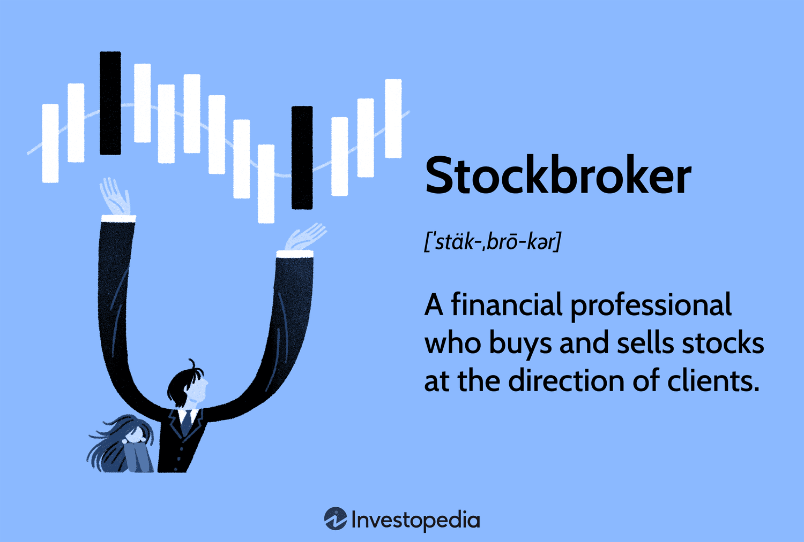

## Table of Contents

## What is a stockbroker?

A stockbroker is a person or a company that helps people buy and sell stocks. Stocks are small pieces of a company that people can own. When you want to buy or sell a stock, you can go to a stockbroker who will do it for you. They use a special system called a stock exchange to make these trades happen.

Stockbrokers also give advice about which stocks to buy or sell. They study the market and use their knowledge to help their clients make good choices. Some stockbrokers charge a fee for each trade they make, while others might charge a yearly fee or take a small part of the money their clients make from their investments.

## What are the primary roles of a stockbroker?

A stockbroker's main job is to help people buy and sell stocks. When someone wants to invest in a company by buying its stock, they go to a stockbroker. The stockbroker uses a stock exchange, which is like a big marketplace for stocks, to make the trade happen. They handle all the paperwork and make sure everything is done correctly. This makes it easier for people who want to invest but don't know how to do it themselves.

Another important role of a stockbroker is to give advice. They study the stock market and know a lot about different companies. They use this knowledge to help their clients decide which stocks to buy or sell. This advice can be very helpful, especially for people who are new to investing. Stockbrokers might charge a fee for their services, either per trade, as a yearly fee, or as a percentage of the money their clients make from their investments.

## What are the different types of stockbrokers?

There are two main types of stockbrokers: full-service brokers and discount brokers. Full-service brokers do a lot more than just buying and selling stocks for you. They also give you advice on which stocks to buy or sell. They study the market and use their knowledge to help you make good choices. Because they offer so much help, full-service brokers usually charge more money. They might take a fee for each trade they make, or they might charge you a yearly fee, or even take a small part of the money you make from your investments.

Discount brokers, on the other hand, focus mainly on buying and selling stocks for you. They don't give as much advice as full-service brokers. This means they usually charge less money. If you know a lot about the stock market and don't need much help, a discount broker might be a good choice for you. They still use the stock exchange to make your trades happen, but they leave the decision-making up to you.

Some people also use online brokers, which are a type of discount broker. Online brokers let you buy and sell stocks using a website or an app. This can be very convenient because you can do it from home or anywhere with an internet connection. Online brokers often have the lowest fees because they don't have to pay for a physical office or as many staff members.

## How does a full-service stockbroker differ from a discount broker?

A full-service stockbroker offers a lot more help than a discount broker. They not only buy and sell stocks for you, but they also give you advice on which stocks to buy or sell. They study the market and use their knowledge to help you make good choices. Because they offer so much help, full-service brokers usually charge more money. They might take a fee for each trade they make, or they might charge you a yearly fee, or even take a small part of the money you make from your investments.

A discount broker, on the other hand, focuses mainly on buying and selling stocks for you. They don't give as much advice as full-service brokers. This means they usually charge less money. If you know a lot about the stock market and don't need much help, a discount broker might be a good choice for you. They still use the stock exchange to make your trades happen, but they leave the decision-making up to you.

## What qualifications are needed to become a stockbroker?

To become a stockbroker, you need to have a good education. Most stockbrokers have at least a bachelor's degree in business, finance, or economics. These degrees help you learn about the stock market and how to make good investment choices. Some stockbrokers also get a master's degree, like an MBA, to learn even more. After getting your degree, you need to pass some exams. The most common ones are the Series 7 and Series 63 exams, which are given by the Financial Industry Regulatory Authority (FINRA). These exams test your knowledge of the stock market and the rules you need to follow.

Once you pass these exams, you can start working at a brokerage firm. At first, you might work as an assistant or a junior broker. This gives you a chance to learn from more experienced brokers. Over time, you can become a full-service or discount broker, depending on what kind of help you want to offer your clients. To be a good stockbroker, you also need to be good at talking to people and explaining things clearly. You need to keep learning about the stock market because it changes all the time. This way, you can give your clients the best advice and help them make smart investments.

## How do stockbrokers earn their income?

Stockbrokers earn their income in different ways, depending on the type of broker they are. Full-service brokers usually charge more because they offer a lot of help. They might charge a fee for each trade they make for their clients. They could also charge a yearly fee, or they might take a small part of the money their clients make from their investments. This is called a commission.

Discount brokers, on the other hand, charge less because they don't give as much advice. They mostly focus on buying and selling stocks for their clients. They usually charge a small fee for each trade they make. Sometimes, they might also charge a yearly fee, but it's usually less than what full-service brokers charge.

Online brokers, which are a type of discount broker, often have the lowest fees. They let people buy and sell stocks using a website or an app. Because they don't need to pay for a physical office or as many staff members, they can charge less money. This makes it easier for people to invest without spending a lot on fees.

## What is the average salary of a stockbroker?

The average salary of a stockbroker can vary a lot depending on where they work, how much experience they have, and what type of broker they are. In the United States, a stockbroker might earn around $70,000 to $100,000 a year. But some stockbrokers, especially those who are very experienced or work in big cities, can make a lot more money. They might earn over $200,000 a year.

Full-service brokers usually earn more than discount brokers because they offer more help and advice to their clients. They might get a bigger commission for each trade they make or take a larger part of the money their clients make from their investments. On the other hand, discount brokers and online brokers often earn less because they charge lower fees. But they can still make a good living, especially if they have a lot of clients.

## What factors influence a stockbroker's salary?

A stockbroker's salary can be affected by many things. One big [factor](/wiki/factor-investing) is where they work. Stockbrokers in big cities like New York or London might earn more money because there are more clients and more trading happening. Another important factor is how much experience the stockbroker has. Someone who has been working for a long time and knows a lot about the stock market might make more money than someone who is just starting out.

The type of broker also matters. Full-service brokers, who give a lot of advice and help to their clients, usually earn more than discount brokers. This is because they charge more for their services. They might get a bigger fee for each trade or take a larger part of the money their clients make from their investments. On the other hand, discount brokers and online brokers often have lower salaries because they charge less. But if they have a lot of clients, they can still make a good living.

## How do stockbrokers manage risk for their clients?

Stockbrokers help their clients manage risk by giving them good advice about which stocks to buy or sell. They study the stock market and look at different companies to see which ones are doing well and which ones might be risky. If a stock seems too risky, they might tell their client not to buy it. They also help their clients spread out their investments. This means not putting all their money into one stock, but instead buying different kinds of stocks. This way, if one stock goes down, the client's whole investment doesn't get hurt as much.

Another way stockbrokers manage risk is by keeping an eye on the market all the time. They watch for any big changes that might affect their clients' investments. If they see something that could be a problem, they can quickly tell their clients to sell a stock before it loses too much value. Stockbrokers also use special tools and charts to understand the market better. These tools help them make smarter choices about when to buy or sell stocks, which helps their clients avoid big losses.

## What advanced strategies do expert stockbrokers use to maximize returns?

Expert stockbrokers use a few special strategies to help their clients make more money. One strategy is called diversification. This means they help their clients spread their money across different kinds of stocks and other investments. By not putting all their money into one stock, if one stock goes down, the whole investment doesn't lose as much value. Another strategy is called asset allocation. This means deciding how much money to put into stocks, bonds, and other types of investments based on how much risk the client is willing to take and how long they plan to keep their money invested.

Another important strategy is timing the market. Expert stockbrokers use special tools and charts to try to buy stocks when they are low and sell them when they are high. This can be tricky because the stock market can change quickly, but with a lot of knowledge and experience, stockbrokers can make smart guesses about when to trade. They also use a strategy called hedging, which means buying other investments that can protect against losses. For example, they might buy something called a put option, which gives them the right to sell a stock at a certain price, even if the stock's value goes down. This helps limit how much money their clients might lose.

## How has technology impacted the role of stockbrokers?

Technology has changed the job of stockbrokers a lot. Now, people can buy and sell stocks on their own using computers and smartphones. This means stockbrokers don't have to do as much trading for their clients as before. Instead, they focus more on giving advice and helping people understand the stock market. They use special computer programs and apps to look at data and make smart choices about which stocks to buy or sell. This has made their job more about being experts and less about just making trades.

Online trading platforms and robo-advisors have also changed things. These are websites and apps that let people invest without talking to a stockbroker. Robo-advisors use computer programs to give advice and manage investments automatically. This can be cheaper than working with a human stockbroker. But many people still like to have a person to talk to, so stockbrokers who can explain things well and give good advice are still very important. Technology has made the job of stockbrokers different, but it has also given them new tools to help their clients make smart investments.

## What are the future trends and challenges for stockbrokers?

The future of stockbrokers will be shaped by technology and changing client needs. More people are using online platforms and robo-advisors to invest, which means stockbrokers need to find new ways to help their clients. They will need to focus more on giving good advice and understanding the stock market deeply. Stockbrokers who can explain things clearly and help clients make smart choices will be very important. They will also need to use new technology, like special computer programs and apps, to look at data and make better decisions.

One big challenge for stockbrokers will be keeping up with all the changes in the stock market and technology. The market can change quickly, and new tools and apps are always coming out. Stockbrokers will need to keep learning and adapting to stay ahead. Another challenge is building trust with clients. With so many options for investing, clients might choose to use online platforms instead of working with a stockbroker. Stockbrokers will need to show that they can offer something special, like personalized advice and a deep understanding of the market, to keep their clients happy and loyal.

## References & Further Reading

[1]: ["Advances in Financial Machine Learning"](https://www.amazon.com/Advances-Financial-Machine-Learning-Marcos/dp/1119482089) by Marcos Lopez de Prado

[2]: ["Quantitative Trading: How to Build Your Own Algorithmic Trading Business"](https://www.amazon.com/Quantitative-Trading-Build-Algorithmic-Business/dp/1119800064) by Ernest P. Chan

[3]: ["Evidence-Based Technical Analysis: Applying the Scientific Method and Statistical Inference to Trading Signals"](https://www.semanticscholar.org/paper/Evidence-Based-Technical-Analysis%3A-Applying-the-and-Aronson/3b33df8737f1772e9e14d66a08c9696f140a2ee1) by David Aronson

[4]: ["Machine Learning for Algorithmic Trading"](https://github.com/PacktPublishing/Machine-Learning-for-Algorithmic-Trading-Second-Edition) by Stefan Jansen

[5]: Bergstra, J., Bardenet, R., Bengio, Y., & Kégl, B. (2011). ["Algorithms for Hyper-Parameter Optimization."](https://dl.acm.org/doi/10.5555/2986459.2986743) Advances in Neural Information Processing Systems 24.