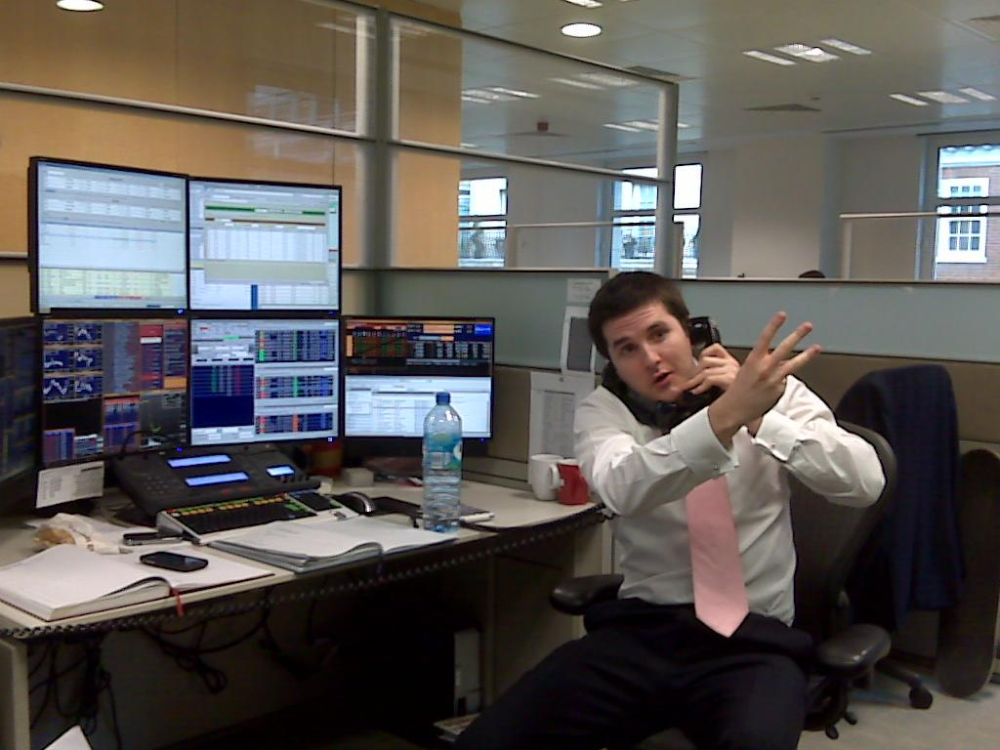

## Table of Contents

## What is stockbroking and why is it important?

Stockbroking is when people or companies help others buy and sell stocks. Stocks are small pieces of a company that people can own. When you buy a stock, you own a little bit of that company. Stockbrokers know a lot about the stock market and they use this knowledge to help their clients make good choices about which stocks to buy or sell.

Stockbroking is important because it helps people invest their money in a way that can grow over time. When people invest in stocks, they can make more money if the company does well. This can help people save for things like retirement or buying a house. Stockbrokers also help make the stock market work smoothly by making sure that buying and selling happens fairly and efficiently.

## How does one become a stockbroker?

To become a stockbroker, you need to start by getting a good education. Many stockbrokers have a college degree in finance, business, economics, or something similar. After college, you might want to get a special license to work as a stockbroker. In the United States, you need to pass exams like the Series 7 and Series 63 to get these licenses. These exams test your knowledge about the stock market and the rules you need to follow.

Once you have your education and licenses, you can start looking for a job at a brokerage firm. These firms hire stockbrokers to help their clients buy and sell stocks. At first, you might work under someone more experienced to learn the ropes. Over time, as you gain more experience and build a good reputation, you can become a more successful stockbroker. It's important to keep learning and staying up-to-date with the stock market because it changes all the time.

## What are the basic functions of a stockbroker?

A stockbroker's main job is to help people buy and sell stocks. They do this by understanding what their clients want and then finding the best stocks for them. Stockbrokers use their knowledge of the stock market to give advice on which stocks might be good to buy or sell. They also make sure that all the buying and selling happens correctly and follows the rules.

Another important part of a stockbroker's job is to keep their clients informed. They do this by watching the stock market closely and telling their clients about any big changes or news that might affect their stocks. Stockbrokers also help their clients plan for the future by giving them advice on how to invest their money over time. This way, clients can make smart choices about their investments and reach their financial goals.

## What are the different types of stock orders?

When you want to buy or sell a stock, you can use different types of orders to tell your stockbroker exactly what you want to do. The simplest type is a market order, which means you want to buy or sell the stock right away at the current price. A limit order lets you set a specific price at which you want to buy or sell. For example, if you want to buy a stock but only if it's $50 or less, you can set a limit order for $50. A stop order, or stop-loss order, is used to limit your losses. It tells your broker to sell a stock if it drops to a certain price, helping you avoid losing too much money.

Another type of order is a stop-limit order, which combines the features of a stop order and a limit order. With a stop-limit order, you set two prices: the stop price and the limit price. When the stock reaches the stop price, it triggers a limit order at your chosen limit price. This can give you more control over the price at which your order is filled. Lastly, there are all-or-none orders, which means your order will only be filled if the entire quantity you want can be bought or sold at once. If it can't, the order won't go through at all. Each type of order helps you manage your investments in different ways, depending on what you need.

## How do stockbrokers earn their income?

Stockbrokers make money in a few different ways. One common way is through commissions. This means they get a small percentage of the money every time they help a client buy or sell a stock. For example, if a client buys $1,000 worth of stock, and the commission rate is 1%, the broker earns $10. Some brokers also earn money through fees. They might charge clients a fee for managing their investments or for giving them advice.

Another way stockbrokers earn income is through salary. Many brokers work for big companies and get paid a regular salary. On top of their salary, they might also get bonuses if they do a good job or if their clients make a lot of money. This can be a big part of their income. Some brokers also make money by selling financial products. They might get paid for recommending certain investments to their clients, but they have to be careful to always do what's best for the client.

## What are the key skills required to be a successful stockbroker?

Being a successful stockbroker takes a lot of different skills. You need to be really good at understanding numbers and how the stock market works. This means you have to be able to look at charts and data to figure out which stocks are good to buy or sell. You also need to keep learning because the market changes all the time. Being able to think quickly and make smart choices is very important.

Another big part of being a good stockbroker is talking to people. You need to be able to explain complicated things in a simple way so your clients understand. Listening to what your clients want and need is also important. You have to build trust with them so they feel good about the advice you give. Being friendly and good at working with others helps a lot, too.

## What are the risks associated with stockbroking?

Being a stockbroker can be risky because the stock market can go up and down a lot. If the market goes down, the stocks that brokers and their clients own can lose value. This means that brokers might not make as much money from commissions or fees if their clients are not buying and selling as much. Also, if a broker gives bad advice and their clients lose money, it can hurt the broker's reputation and make it hard to find new clients.

Another risk is that stockbrokers have to follow a lot of rules and laws. If they break these rules, they can get in big trouble. This could mean losing their license to work as a broker or even facing legal problems. It's important for brokers to always do what's best for their clients and not just try to make money for themselves. This can be hard because there's a lot of pressure to make money in the stock market.

## How does the stock market work and what role do stockbrokers play?

The stock market is like a big store where people can buy and sell pieces of companies called stocks. When a company wants to grow, it can sell some of its pieces to the public. People who buy these pieces, or stocks, become part owners of the company. The price of a stock goes up and down based on how well the company is doing and what people think about it. If lots of people want to buy a stock, its price goes up. If fewer people want it, the price goes down. The stock market has a lot of rules to make sure buying and selling is fair for everyone.

Stockbrokers are people who help others buy and sell stocks in the stock market. They know a lot about different companies and how the stock market works. When someone wants to buy or sell a stock, they can tell their stockbroker what they want to do. The stockbroker then uses their knowledge to find the best stocks and make sure the buying and selling happens correctly. Stockbrokers also give advice to their clients about which stocks might be good to buy or sell, helping them make smart choices about their money.

## What are the regulatory requirements and ethical considerations for stockbrokers?

Stockbrokers have to follow a lot of rules set by government agencies like the Securities and Exchange Commission (SEC) in the United States. These rules make sure that buying and selling stocks is fair and honest. To become a stockbroker, you need to pass special tests like the Series 7 and Series 63 exams. These tests check if you know enough about the stock market and the rules you need to follow. Stockbrokers also have to keep good records of all their trades and report them correctly. If they break these rules, they can lose their license or even face legal trouble.

Ethical considerations are also very important for stockbrokers. They need to always do what's best for their clients, not just try to make money for themselves. This means giving honest advice and not hiding any important information from clients. Stockbrokers should also avoid conflicts of interest, like recommending a stock just because they will get a big commission from it. Being honest and fair helps build trust with clients, which is key to being a successful stockbroker. If a broker acts unethically, it can hurt their reputation and make it hard to keep or find new clients.

## How has technology impacted the field of stockbroking?

Technology has changed stockbroking a lot. Now, people can buy and sell stocks on their computers or phones without needing to talk to a stockbroker. This is called online trading. It's easier and faster for people to do their own trading. There are also special computer programs that can help people make choices about which stocks to buy or sell. These programs use math and data to find good stocks, which can be really helpful.

But technology has also made things harder for stockbrokers. Because people can trade on their own, there are fewer clients who need a stockbroker's help. This means stockbrokers have to work harder to show why they are still useful. They need to give really good advice and use technology to help their clients in new ways. Even though it's harder, technology also gives stockbrokers new tools to do their job better and faster.

## What advanced strategies do expert stockbrokers use to maximize returns?

Expert stockbrokers use a few smart strategies to help their clients make more money. One strategy is called diversification. This means they spread their clients' money across different kinds of stocks and other investments. By doing this, if one stock goes down, the others might still go up, which can help balance out the losses. Another strategy is called technical analysis. This is when brokers look at charts and patterns to guess where a stock's price might go next. They use this information to decide when to buy or sell a stock to get the best price.

Another important strategy is [fundamental analysis](/wiki/fundamental-analysis). This is when brokers look at a company's financial health, like how much money it makes and how much it owes. If a company looks strong, the broker might suggest buying its stock because it could go up in value. Expert stockbrokers also use something called portfolio rebalancing. This means they check their clients' investments regularly and make changes to keep the mix of stocks and other investments just right. This helps make sure the investments are still working well to meet the client's goals.

## How can one evaluate the performance of a stockbroker or brokerage firm?

To evaluate the performance of a stockbroker or brokerage firm, you should first look at how well they help you make money. This means checking if the stocks they suggest go up in value over time. You can also see if they are good at managing risk by looking at how much your investments go down when the market is not doing well. Another important thing is to see how much they charge in fees and commissions. If they charge too much, it can eat into your profits, so you want to make sure their costs are fair.

Another way to evaluate a stockbroker or brokerage firm is by looking at their service. This includes how easy it is to talk to them and get help when you need it. Good stockbrokers should be able to explain things clearly and answer your questions. You can also check what other people say about them by reading reviews or asking friends for recommendations. If a lot of people are happy with their service, it's a good sign. Remember, the best stockbroker or firm for you is one that helps you reach your financial goals while making you feel comfortable and supported.

## References & Further Reading

[1]: Bergstra, J., Bardenet, R., Bengio, Y., & Kégl, B. (2011). ["Algorithms for Hyper-Parameter Optimization."](https://dl.acm.org/doi/10.5555/2986459.2986743) Advances in Neural Information Processing Systems 24.

[2]: ["Advances in Financial Machine Learning"](https://www.amazon.com/Advances-Financial-Machine-Learning-Marcos/dp/1119482089) by Marcos Lopez de Prado

[3]: ["Evidence-Based Technical Analysis: Applying the Scientific Method and Statistical Inference to Trading Signals"](https://www.amazon.com/Evidence-Based-Technical-Analysis-Scientific-Statistical/dp/0470008741) by David Aronson

[4]: ["Machine Learning for Algorithmic Trading"](https://github.com/stefan-jansen/machine-learning-for-trading) by Stefan Jansen

[5]: ["Quantitative Trading: How to Build Your Own Algorithmic Trading Business"](https://books.google.com/books/about/Quantitative_Trading.html?id=j70yEAAAQBAJ) by Ernest P. Chan