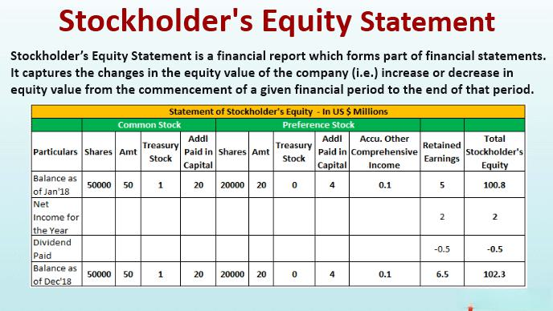

## Table of Contents

## What is stockholders' equity?

Stockholders' equity is the amount of money that would be left over if a company sold all its assets and paid off all its debts. It represents the net worth of the company from the perspective of the shareholders. This figure is important because it shows how much the shareholders actually own in the company after all liabilities are settled.

You can find stockholders' equity on a company's balance sheet. It is calculated by subtracting total liabilities from total assets. If a company has $100,000 in assets and $60,000 in liabilities, the stockholders' equity would be $40,000. This number can change over time as the company earns profits, pays dividends, or issues new stock.

## How is stockholders' equity calculated?

Stockholders' equity is found by taking away the total liabilities from the total assets of a company. Imagine a company has a bunch of things it owns, like buildings and money, which are its assets. It also has debts it needs to pay, which are its liabilities. To figure out stockholders' equity, you just subtract what the company owes from what it owns.

This number is important because it shows how much the company is worth to its owners, the stockholders, after all the bills are paid. If a company has $100,000 in assets and $60,000 in liabilities, the stockholders' equity would be $40,000. This means that if the company sold everything and paid off all its debts, the shareholders would have $40,000 left.

## What are the main components of stockholders' equity?

Stockholders' equity is made up of a few key parts. The first part is called "contributed capital." This is the money that shareholders put into the company by buying its stock. When someone buys a share of stock, the money they pay goes into the company's contributed capital. This part of stockholders' equity shows how much money the company has gotten from selling its stock.

The second part is "retained earnings." This is the money the company has made from its business over time, after paying out dividends to shareholders. If a company makes a profit, it can either give that money back to shareholders as dividends or keep it in the company. The money that stays in the company adds to the retained earnings. Sometimes, if a company loses money, it can have negative retained earnings, which means it's using up the money it had saved before.

There can also be other parts to stockholders' equity, like "treasury stock," which is the company's own stock that it has bought back. This reduces stockholders' equity because it's money the company spent to buy back its own shares. All these parts together make up the total stockholders' equity, showing how much the company is worth to its owners.

## Can you explain the difference between common stock and preferred stock in terms of equity?

Common stock and preferred stock are two types of stock that companies can issue to raise money. Common stock is the most common type of stock and gives shareholders the right to vote on company matters like electing the board of directors. If the company makes money, common stockholders can get some of it as dividends, but the company doesn't have to pay them. If the company goes out of business, common stockholders get paid last, after everyone else like banks and bondholders.

Preferred stock is different because it usually doesn't give shareholders the right to vote. But, preferred stockholders get paid dividends before common stockholders. These dividends are often fixed, meaning they get the same amount every time. If the company goes out of business, preferred stockholders get paid before common stockholders but after banks and bondholders. So, preferred stock is a bit safer than common stock, but it might not grow in value as much over time.

## How does retained earnings affect stockholders' equity?

Retained earnings are an important part of stockholders' equity. They are the money a company has made from its business over time, after paying out dividends to shareholders. When a company earns a profit, it can either give that money back to shareholders as dividends or keep it in the company. The money that stays in the company adds to the retained earnings. This means that if a company keeps more of its profits instead of paying them out, its retained earnings will go up, and so will its stockholders' equity.

On the other hand, if a company loses money, it can have negative retained earnings. This means it's using up the money it had saved before. When retained earnings go down, stockholders' equity goes down too. So, retained earnings can make stockholders' equity go up or down, depending on whether the company is making or losing money. This shows how important it is for a company to manage its profits well to keep its stockholders' equity strong.

## What is the significance of treasury stock in the context of stockholders' equity?

Treasury stock is when a company buys back its own shares from the market. This can happen for different reasons, like the company thinking its stock is a good investment or wanting to increase the value of the remaining shares by reducing the total number of shares out there. When a company buys back its stock, it uses cash to do this, which reduces the amount of money it has. This means the stockholders' equity goes down because the company is spending money to buy back its own shares.

The amount of treasury stock is shown as a negative number in the stockholders' equity section of the balance sheet. This is because it represents a reduction in the company's net worth from the shareholders' perspective. Even though buying back stock can lower stockholders' equity right away, it might help the company in the long run by making the remaining shares more valuable or giving the company more control over its stock. So, treasury stock is an important part of understanding a company's financial health and how it manages its equity.

## How do dividends impact stockholders' equity?

When a company pays dividends, it gives some of its money to its shareholders. This money usually comes from the company's profits, which are part of the stockholders' equity called retained earnings. When the company pays out dividends, the retained earnings go down, and so does the stockholders' equity. So, dividends lower the total amount of money the company has, which means less equity for the shareholders.

But, paying dividends isn't always bad for stockholders' equity. If the company is doing well and making a lot of money, it can still keep some of its profits in the retained earnings even after paying dividends. This can make shareholders happy because they get some money now and still have a strong company that might grow in value later. So, while dividends do reduce stockholders' equity right away, they can be part of a good plan for the company and its shareholders.

## What are some common financial ratios that use stockholders' equity?

Some common financial ratios that use stockholders' equity are the return on equity (ROE) and the debt-to-equity ratio. Return on equity shows how well a company is using the money that shareholders have put into it to make more money. You find it by dividing the company's net income by its stockholders' equity. A higher ROE means the company is doing a good job of turning the shareholders' money into profit.

The debt-to-equity ratio tells you how much the company is borrowing compared to what the shareholders own. You calculate it by dividing the company's total liabilities by its stockholders' equity. A lower debt-to-equity ratio means the company is not borrowing too much money, which can be a good sign for shareholders because it means less risk. Both of these ratios help investors understand how healthy a company is and how well it's using its equity.

## How can changes in stockholders' equity be used to assess a company's financial health?

Changes in stockholders' equity can tell us a lot about a company's financial health. If stockholders' equity goes up, it usually means the company is doing well. It could be making more money, keeping more of its profits, or getting more money from selling new stock. When stockholders' equity grows, it shows that the company is worth more to its owners, the shareholders. This can make investors feel good because it means the company is using their money well to grow and be successful.

On the other hand, if stockholders' equity goes down, it might mean the company is struggling. It could be losing money, paying out a lot in dividends, or buying back its own stock. When stockholders' equity shrinks, it can worry investors because it shows the company might not be managing its money as well as it should. By looking at how stockholders' equity changes over time, investors can get a sense of whether the company is on a good path or if it might be facing some problems.

## What are the accounting entries involved in transactions affecting stockholders' equity?

When a company issues new common stock, it increases its stockholders' equity. The accounting entry for this is to debit cash for the amount of money received and credit common stock for the same amount. If the stock is sold for more than its par value, the extra money goes into an account called additional paid-in capital. So, the entry would be to debit cash, credit common stock for the par value, and credit additional paid-in capital for the rest. This makes the stockholders' equity go up because the company got more money from shareholders.

When a company makes a profit, it adds to its retained earnings, which is part of stockholders' equity. The entry for this is to debit income summary and credit retained earnings. If the company decides to pay dividends, it takes money out of retained earnings. The entry for paying dividends is to debit retained earnings and credit dividends payable. When the dividends are actually paid, the entry is to debit dividends payable and credit cash. This reduces the stockholders' equity because the company is giving money back to shareholders. If the company buys back its own stock, it's called treasury stock, and the entry is to debit treasury stock and credit cash. This also lowers stockholders' equity because the company is spending its money to buy back its shares.

## How do stock splits and reverse stock splits affect stockholders' equity?

A stock split happens when a company decides to split its shares into more shares. For example, in a 2-for-1 stock split, each share becomes two shares. Even though the number of shares goes up, the total value of the company doesn't change. So, the stockholders' equity stays the same. The price of each share goes down, but shareholders still own the same part of the company. This doesn't change the amount of money the company has or owes, so the stockholders' equity doesn't go up or down.

A reverse stock split is the opposite. It's when a company decides to combine its shares into fewer shares. For example, in a 1-for-2 reverse stock split, two shares become one share. Just like with a stock split, the total value of the company doesn't change, so the stockholders' equity stays the same. The price of each share goes up, but shareholders still own the same part of the company. This also doesn't change the amount of money the company has or owes, so the stockholders' equity doesn't go up or down. Both stock splits and reverse stock splits are just about changing the number of shares, not about changing the company's worth.

## Can you provide advanced examples of how companies manipulate stockholders' equity and the implications of such actions?

Sometimes companies use clever ways to change their stockholders' equity to make their financial health look better. One way they do this is by buying back their own stock, called treasury stock. When a company buys back its stock, it uses its money to do this, which makes the stockholders' equity go down right away. But, if the company buys back a lot of its stock, it can make the remaining shares worth more because there are fewer shares out there. This can make the price of the stock go up, which can make investors happy. But, if the company spends too much money buying back its stock, it might not have enough money left to run its business well, which can be risky.

Another way companies can play with their stockholders' equity is by changing how much they pay out in dividends. If a company decides to pay out less in dividends and keep more of its profits, its retained earnings go up, and so does its stockholders' equity. This can make the company look like it's doing better because it has more money. But, if shareholders were expecting to get more money from dividends, they might not be happy about this. On the other hand, if a company pays out a lot in dividends, it can make its stockholders' equity go down because it's giving away its money. This can make the company look weaker, but it might keep shareholders happy because they're getting more money now.

These actions can have big effects on how investors see the company. If a company is always buying back its stock or changing its dividends, it might make investors think the company is trying to hide something or not doing well in its business. It's important for companies to be honest about why they're making these changes so investors can trust them. If investors don't trust the company, they might sell their shares, which can make the stock price go down and hurt the company's value. So, while companies can use these tricks to change their stockholders' equity, they need to be careful about how it might affect their relationship with investors.

## How do you calculate stockholders' equity?

Stockholders' equity is a key indicator of a company's financial health and an essential component of financial analysis. It represents the residual interest in the company's assets after all liabilities have been deducted. The general formula for calculating stockholders' equity is:

$$
\text{Stockholders' Equity} = \text{Total Assets} - \text{Total Liabilities}
$$

To accurately determine stockholders' equity, the following steps should be followed to gather necessary information from a balance sheet:

1. **Identify Total Assets**: Total assets are usually listed on the balance sheet and include current assets such as cash, accounts receivable, and inventory; along with non-current assets like property, plant, equipment, and intangible assets.

2. **Identify Total Liabilities**: Total liabilities are also detailed on the balance sheet and encompass current liabilities such as short-term debt and accounts payable; along with long-term liabilities like bonds payable and long-term debt. 

3. **Apply the Formula**: Subtract the total liabilities from the total assets to arrive at the stockholders' equity. 

For illustration, consider a simplified example:

Assume a hypothetical company "ABC Corp" has the following balance sheet data at the end of its financial year:

- **Total Assets**: $500,000
- **Total Liabilities**: $300,000

Using the formula for calculating stockholders' equity:

$$
\text{Stockholders' Equity} = 500,000 - 300,000 = 200,000
$$

Therefore, ABC Corp's stockholders' equity amounts to $200,000. This figure provides a snapshot of what shareholders would theoretically receive if the company liquidated all its assets and paid off its liabilities. This calculation is vital for potential investors and financial analysts in assessing the strength and investment potential of a company. Understanding these fundamentals of balance sheet analysis can aid in making informed financial decisions.

## What are Financial Examples of Equity Calculation?

In financial analysis, examining the equity calculations of major companies offers valuable insights into their financial stability and market perceptions. Equity, in this context, represents the residual interest in the assets of a company after deducting liabilities. It is a crucial indicator of financial health and a key component in evaluating a company's value. 

### Real-Life Case: Apple Inc.

Apple Inc., one of the largest and most well-known companies globally, provides an exemplary case for analyzing stockholders' equity fluctuations over time. According to its balance sheet, Apple's stockholders' equity can be calculated as follows:

$$
\text{Stockholders' Equity} = \text{Total Assets} - \text{Total Liabilities}
$$

For example, in 2022, Apple reported total assets of approximately $352 billion and total liabilities of around $287 billion. Thus, the stockholders' equity was:

$$
\text{Stockholders' Equity} = 352\, \text{billion} - 287\, \text{billion} = 65\, \text{billion}
$$

The stockholders' equity provides insights into the company's financial footing and ability to manage its resources effectively. Over the years, Apple has shown a steady increase in equity, indicating strong earnings and judicious asset management.

### Implications of Equity Changes

Changes in stockholders' equity may indicate various underlying financial activities or strategic decisions. For instance, a growing equity could signify consistent profitability and retained earnings reinvested into the company for growth. Conversely, a declining equity might raise concerns about declining earnings or increased liabilities.

For Apple, the consistent rise in equity reflects its strong financial performance, leading to positive investor sentiment and a robust market valuation. In contrast, a company with diminishing equity might face scrutiny regarding its financial strategies and operational efficiency, potentially affecting its stock price and investor confidence.

### Impact on Investor Perceptions

Equity calculations serve as a vital tool for investors to gauge a company's financial health and investment potential. An increase in equity generally signals a financially stable and potentially profitable entity, which can elevate investor interest and drive stock prices up. Conversely, a decrease can lead to skepticism regarding a company's growth prospects, potentially affecting investor trust and market performance.

In conclusion, real-life examples, such as Apple's equity trajectory, highlight the critical nature of equity calculations in financial analysis. Assessing these calculations enables investors to discern a company's financial strength and informs strategic investment decisions. The evolving equity landscape underscores the dynamic nature of financial markets, where such metrics serve as pivotal indicators of corporate health and investor sentiment.

## What is the impact of treasury shares on stockholders' equity?

Treasury shares, also known as treasury stock, refer to shares that a company has issued and subsequently reacquired. These shares are held by the company itself and are not included in the calculation of earnings per share or dividends. They do not have voting rights because they are essentially considered non-active shares in terms of shareholder privileges. Companies typically hold treasury shares for purposes such as stock repurchase plans, to reissue them under employee compensation plans (such as stock options), or to [carry](/wiki/carry-trading) out mergers and acquisitions.

The presence of treasury shares impacts the calculation of stockholders' equity. Stockholders' equity, often referred to as shareholders' equity or simply equity, is derived from the equation:

$$
\text{Stockholders' Equity} = \text{Total Assets} - \text{Total Liabilities}
$$

However, when specifically detailing the components involved, treasury shares play a pivotal role. The calculation can be refined to reflect their influence as follows:

$$
\text{Stockholders' Equity} = \text{Common Stock} + \text{Paid-in Capital} + \text{Retained Earnings} - \text{Treasury Shares}
$$

Treasury shares reduce stockholders' equity since they represent the amount paid to buy back shares from shareholders, essentially lowering the equity available to external investors. When a company buys back its shares, it decreases the shares outstanding in the market, which can have various impacts, such as increasing the value of remaining shares by concentrating ownership.

From a strategic viewpoint, treasury shares are instrumental in share buybacks. Share buybacks, also known as share repurchases, occur when a company reacquires its shares from the marketplace. This strategy can be utilized for several reasons:

1. **Enhancing Share Value**: By reducing the number of shares outstanding, buybacks can increase the value of remaining shares, which can lead to a higher earnings per share (EPS).

2. **Signaling Effect**: A buyback can also signal to the market that the company's leadership believes its stock is undervalued, which can positively influence stock price. 

3. **Capital Structure Optimization**: Buybacks can also be part of a strategy to optimize the capital structure by adjusting the company’s equity proportion relative to debt.

4. **Utilizing Excess Cash**: Companies with excess cash can use buybacks as a way of returning capital to shareholders without increasing dividends.

Strategic buybacks, by altering the [volume](/wiki/volume-trading-strategy) of treasury shares, directly affect the stockholders' equity. Thus, changes in treasury shares indicate not only financial activities undertaken but also hold implications for investor perception and company valuation.

## References & Further Reading

[1]: ["Financial Statements: A Step-by-Step Guide to Understanding and Creating Financial Reports"](https://books.google.com/books/about/Financial_Statements.html?id=V9tEDwAAQBAJ) by Thomas Ittelson

[2]: Fernandes, N., Ferreira, M. A., Matos, P., & Rocha, A. P. (2010). ["The Effect of Affiliate Ownership on Dividend Policy in Europe."](https://papers.ssrn.com/sol3/papers.cfm?abstract_id=1341639) Journal of Financial and Quantitative Analysis, 45(3), 719-750.

[3]: ["Valuation: Measuring and Managing the Value of Companies, University Edition"](https://www.wiley.com/en-us/Valuation%3A+Measuring+and+Managing+the+Value+of+Companies%2C+University+Edition%2C+7th+Edition-p-9781119611868) by McKinsey & Company Inc.

[4]: Lo, A. W., & MacKinlay, A. C. (1997). ["The Econometrics of Financial Markets."](https://press.princeton.edu/books/hardcover/9780691043012/the-econometrics-of-financial-markets) Princeton University Press.

[5]: ["The Little Book That Still Beats the Market"](https://www.amazon.com/Little-Book-Still-Beats-Market/dp/0470624159) by Joel Greenblatt