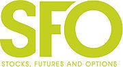

The rapid advancement in financial markets has significantly elevated the role of algorithmic trading, reshaping how stocks, futures, and options are transacted. Algorithmic trading involves using computer algorithms to automate trading processes based on pre-established criteria, thus minimizing the need for human intervention. This approach has revolutionized trading by enhancing the speed and efficiency of executing trades, thereby providing a strategic edge.

Traders and investors find themselves at an interesting intersection of stocks, futures, and options when algorithmic trading is in play. This fusion offers profound insights into market dynamics and strategic execution. Algorithms process vast amounts of data quickly, identify emerging trends, and capitalize on opportunities that are often fleeting, given the volatile nature of these financial instruments. By executing trades automatically and accurately, algorithmic trading reduces the emotional and psychological biases that typically affect human traders, ensuring decisions are data-driven and precise.



This article focuses on the comprehensive benefits and practical applications of algorithmic trading in stocks, futures, and options. Our content is crafted to serve both seasoned traders seeking advanced strategy optimization and newcomers eager to step into the world of automated trading systems. It integrates crucial aspects such as strategy development, risk management, and the selection of the appropriate technological tools, offering a guide on enhancing trading performance through algorithmic solutions.

In exploring these subjects, traders can enrich their strategic approaches and manage risks more effectively. By adopting algorithms, market participants can improve their ability to navigate the complexities of modern financial markets, making informed decisions that capitalize on available opportunities. The forthcoming sections provide a detailed guide for optimizing trading strategies using algorithmic methods, ensuring traders are well-equipped to face the intricacies of market trading.

## Table of Contents

## Understanding Algorithmic Trading

Algorithmic trading, commonly referred to as algo trading, is a modern trading practice that utilizes computer algorithms to automate the trading process. This automation is based on predefined criteria such as timing, price, and quantity, allowing trades to be executed without human intervention. This method has become essential in trading stocks, futures, and options due to its efficiency and ability to handle complex data sets.

In the trading of stock futures and options, algorithms are pivotal as they can swiftly adapt to dynamic market conditions. These algorithms are equipped to make data-driven decisions in real-time, which is critical in markets known for their high [volatility](/wiki/volatility-trading-strategies). By automating the trading process, algo trading minimizes the potential for human error and emotional decision-making, offering a more precise approach to executing trades. 

The significant advantage of [algorithmic trading](/wiki/algorithmic-trading) lies in its capacity to process and analyze large volumes of data with remarkable speed. This ability not only aids in identifying market trends but also ensures that trades are executed at the most favorable prices. The precision afforded by algo trading is crucial; in volatile markets like futures and options, small price movements can significantly affect profitability.

Another key concept of incorporating algorithmic systems in trading is the consistency and repeatability it provides. Algorithms follow predefined rules and logic, ensuring a systematic approach that can be backtested and refined for optimal performance. This systematic approach allows traders to develop complex strategies that can be consistently applied, reducing the subjective biases that can arise from manual trading.

In summary, algorithmic trading revolutionizes traditional trading methods through automation, data analysis capabilities, and bias elimination. It creates opportunities for traders to engage with the financial markets more strategically, enhancing their ability to capitalize on market opportunities swiftly and accurately.

## Key Components for Successful Algo Trading in Futures and Options

Successful algorithmic trading in futures and options requires an amalgamation of technical skills, data analysis proficiency, and effective risk management. These components are crucial to derive meaningful insights and develop robust trading systems capable of operating in dynamic market environments.

Programming knowledge is fundamental, particularly in languages such as Python and C++. Python stands out for its simplicity and extensive library support, making it ideal for data manipulation, algorithm development, and [backtesting](/wiki/backtesting). Libraries like NumPy, pandas, and scikit-learn facilitate complex numerical computations and data analysis. C++ is preferred for tasks requiring high performance due to its speed and efficiency in managing system resources. A basic example of implementing a simple trading strategy in Python might involve using historical price data to compute technical indicators:

```python
import pandas as pd

# Load historical data
data = pd.read_csv('historical_data.csv')
data['Moving Average'] = data['Close'].rolling(window=20).mean()

# Define a simple moving average crossover strategy
def trading_signal(row):
    if row['Close'] > row['Moving Average']:
        return 'Buy'
    elif row['Close'] < row['Moving Average']:
        return 'Sell'
    return 'Hold'

data['Signal'] = data.apply(trading_signal, axis=1)
```

Data analysis expertise is integral in deciphering market trends and making informed decisions. Traders must be adept at using statistical techniques to identify patterns and forecast price movements. Key methods include time series analysis and [machine learning](/wiki/machine-learning) algorithms, which can enhance predictive capabilities. For instance, time series models like ARIMA (Autoregressive Integrated Moving Average) help model and forecast time-dependent data.

Quantitative methods further enrich algorithmic strategies by optimizing their robustness and adaptability to market conditions. Utilization of techniques such as regression analysis, Monte Carlo simulations, and stochastic calculus enables traders to quantify risk and potential returns. Calculating the expected return $E(R)$ of a portfolio is an essential quantitative technique, represented by:

$$
E(R) = \sum_{i=1}^{n} w_i \times R_i
$$

where $w_i$ is the weight of each asset in the portfolio, and $R_i$ is the expected return of each asset.

Risk management remains a pivotal component. Implementing effective risk management strategies involves setting precise stop-loss levels, leveraging diversification, and continuously adjusting for market volatility to mitigate potential losses. Employing a risk-reward ratio framework ensures that trades are justified by their potential returns relative to the risks taken.

Overall, achieving success in algo trading for futures and options necessitates a multi-disciplinary approach, combining profound technical, analytical, and risk management skills, providing a formidable edge to traders looking to thrive in a competitive market.

## Developing an Environment for Algo Trading

Creating a development environment for algorithmic trading involves strategic selection of technology and infrastructure, ensuring the seamless execution and continuous improvement of trading algorithms. The choice of programming languages and frameworks is critical and should be aligned with the trader's specific objectives and the complexity of the trading strategies deployed. Popular languages for algo trading include Python, known for its ease of use and strong support for data analysis and machine learning libraries, and C++, valued for its execution speed and efficiency in handling real-time data.

A modular and scalable architecture is vital to adapt to evolving trading strategies and market demands. This architecture should support continuous integration, allowing for regular updates and testing of algorithms without disrupting operations. The use of containerization tools such as Docker can enhance scalability and portability, enabling developers to replicate and manage environments across different stages of the development cycle.

Backtesting is another crucial component of an effective algo trading environment. It involves simulating trading strategies on historical data to evaluate their performance and refine parameters. This process is essential to ensure that strategies are robust and reliable before they are deployed live. Libraries like Backtrader and frameworks such as QuantConnect provide integrated tools for comprehensive backtesting, supporting various asset classes, including stocks, futures, and options.

Version control systems, such as Git, play a significant role in managing code changes and maintaining the integrity of algorithmic strategies. Version control enables developers to track iterations, collaborate effectively, and revert to previous versions if necessary, ensuring the consistent development and deployment of optimized algorithms.

Setting up a development environment also entails establishing robust data pipelines for efficient data acquisition, processing, and storage. Utilizing cloud platforms like Amazon Web Services (AWS) or Microsoft's Azure can provide the necessary computational power and storage capacity, facilitating real-time data processing and analysis.

Overall, building a development environment for algo trading demands careful planning and execution to incorporate the best practices in software development, data management, and performance optimization. Adopting a strategic approach ensures that traders can effectively develop, test, and deploy robust trading algorithms in a dynamic market landscape.

## Strategies and Techniques for Trading Stocks Futures and Options

Algorithmic trading within the realms of stocks, futures, and options can be extensively optimized using various strategies, each tailored to exploit specific market conditions. The three most popular algorithmic strategies are trend-following, mean reversion, and [arbitrage](/wiki/arbitrage), each offering unique mechanisms for profit generation in the markets.

1. **Trend-Following**: 
   Trend-following strategies aim to capitalize on existing market trends. Algorithms designed for this strategy typically employ technical indicators like moving averages and [momentum](/wiki/momentum) oscillators to identify and enter trades in the direction of prevailing trends. These algorithms often use a predefined set of rules based on crossover signals. For instance, a simple moving average crossover system might buy when a short-term average surpasses a long-term average and sell when the opposite occurs. Such an approach requires robust data analysis capabilities to ensure timely and effective trend detection.

2. **Mean Reversion**: 
   Mean reversion strategies are based on the assumption that asset prices will revert to their historical mean or average over time. This strategy is implemented using algorithms that detect overbought or oversold conditions by employing statistical measures such as standard deviation or Bollinger Bands. The algorithm executes trades by selling assets that are deemed overvalued and buying assets considered undervalued relative to their historical averages. The success of mean reversion heavily relies on precise parameter tuning and market condition assessments to avoid false signals.

3. **Arbitrage**: 
   Arbitrage strategies exploit price discrepancies of the same or related financial instruments in different markets or forms. This strategy is highly dependent on execution speed, as the price differences are often minimal and short-lived. Algorithms scan multiple markets in real-time to identify and act on these opportunities, simultaneously buying and selling assets to lock in risk-free profits. Implementing arbitrage strategies requires advanced algorithms designed to minimize latency and maximize execution speed, often involving the use of sophisticated technologies such as co-location with exchange servers.

The choice of strategy is influenced by market analysis, available data, and the proficiency of the trader in deploying complex algorithms. Backtesting plays a crucial role in optimizing these strategies. By using historical market data, traders can simulate algorithm performance, allowing them to fine-tune algorithm parameters and assess the strategy’s potential profitability and risk. For example, Python provides excellent libraries like `pandas` for data manipulation and `[backtrader](/wiki/backtrader)` for strategy backtesting, which helps in refining algorithmic strategies effectively.

In a backtesting scenario, a trader might use Python to implement a moving average crossover strategy as follows:

```python
import backtrader as bt

class MovingAverageStrategy(bt.SignalStrategy):
    def __init__(self):
        self.short_ma = bt.indicators.SimpleMovingAverage(self.data.close, period=10)
        self.long_ma = bt.indicators.SimpleMovingAverage(self.data.close, period=30)

    def next(self):
        if self.short_ma > self.long_ma:
            self.buy()
        elif self.short_ma < self.long_ma:
            self.sell()

# Backtesting setup
cerebro = bt.Cerebro()
data = bt.feeds.YahooFinanceData(dataname='AAPL', fromdate=datetime(2020, 1, 1), todate=datetime(2020, 12, 31))
cerebro.adddata(data)
cerebro.addstrategy(MovingAverageStrategy)
cerebro.run()
```

This approach allows traders to effectively test their trading logic against historical data, enabling them to adapt and refine their strategies for real-world application. Utilizing these strategic techniques in an algorithmic framework not only enhances trading efficiency but also ensures that traders are equipped to navigate the complexities of financial markets with greater precision and confidence.

## Implementing Risk Management Practices

In the fast-paced world of algorithmic trading, effective risk management practices are paramount to protecting capital and ensuring long-term success. Risk management in algo trading involves a combination of methods that help traders mitigate unforeseen market dynamics and reduce the potential for substantial losses.

One of the foundational techniques is position sizing, where the amount of capital allocated to a particular trade is determined by the trader's risk tolerance and specific strategy objectives. For example, a trader might use the formula:

$$
\text{Position Size} = \frac{\text{Risk per Trade}}{\text{Trade Risk}}
$$

Here, the "Risk per Trade" represents the percentage of the portfolio the trader is willing to risk, while "Trade Risk" is the difference between the entry price and the stop-loss price.

Stop-loss orders are another critical tool that automatically [exit](/wiki/exit-strategy) positions if the market moves unfavorably by a set amount, thereby limiting potential losses. Algorithmic systems can incorporate dynamic stop-loss adjustments based on market conditions, enhancing resilience against volatility.

Diversification is also crucial, as spreading investments across various assets or strategies can reduce overall risk exposure. By minimizing the impact of a poor-performing asset on the total portfolio, traders can stabilize returns.

Adjusting for market volatility involves monitoring the volatility index (VIX) and other indicators to scale exposure appropriately. In times of high market turbulence, reducing position sizes and increasing cash allocations can prevent significant drawdowns.

The implementation of a risk-reward ratio framework ensures that potential returns are commensurate with the risks incurred. Researchers and traders often seek a minimum risk-reward ratio of 1:2, meaning the expected reward is at least twice the risk taken. Such a strategy requires backtesting and calibration to align with market conditions.

Integrating these risk management principles into algorithmic systems fosters stability and trader confidence. Automated risk-check protocols can help ensure compliance, alerting traders to potential breaches and enforcing risk limits. As traders refine these practices within their algorithms, they build robust strategies capable of navigating fluctuations with greater efficiency and reliability.

## Deploying and Monitoring Algorithms for Live Trading

The deployment phase of algorithmic trading involves several critical components aimed at ensuring that trading strategies are executed efficiently and effectively in live markets. The selection of the right trading platform is paramount. It should support high-speed data processing, low-latency execution, and seamless integration with various financial exchanges. Many platforms offer application programming interfaces (APIs) that allow for custom development and flexibility in deploying diverse trading strategies.

Parameter configuration is equally important during deployment. Algorithms must be fine-tuned to operate optimally under varying market conditions. This involves setting up parameters such as entry and exit points, stop-loss limits, and position sizing. Utilizing machine learning techniques can aid in dynamically adjusting parameters based on real-time market feedback, enhancing the algorithm's adaptability and performance.

Simulating strategies in a paper trading environment is a prudent step before live deployment. This approach allows traders to test and refine their algorithms without the risk of financial loss. Paper trading helps identify potential flaws or inefficiencies in the strategy and provides a platform for performance evaluation. For instance, using Python's Backtrader library or platforms like QuantConnect can facilitate comprehensive backtesting and simulation.

Once deployed, continuous monitoring of algorithms is crucial to ensure they remain aligned with market conditions and objectives. Real-time monitoring tools can track metrics such as execution speed, slippage, and performance against benchmarks. Automated alerts can be set up to notify traders of significant deviations or anomalies, enabling prompt intervention when necessary.

Moreover, employing a robust infrastructure that includes redundant systems and fail-safes can mitigate the impact of technical failures or unforeseen market events. Cloud-based solutions, such as AWS or Microsoft Azure, offer scalability and reliability for hosting trading algorithms, providing resilience against downtime.

Effective monitoring requires an agile framework for logging and analyzing trade data, which can be achieved through platforms like Elasticsearch or Splunk. These tools allow traders to visualize trends and gain insights into their strategy's performance and efficiency continuously.

In conclusion, deploying and monitoring trading algorithms necessitates a blend of sophisticated technology and strategic planning. Ensuring robust platform selection, thorough parameter configuration, comprehensive simulation, and vigilant monitoring are fundamental steps. By adhering to these principles, traders can achieve seamless and effective trading operations, maximizing their potential for success in live markets.

## Conclusion

Algorithmic trading in stocks, futures, and options presents a significant advancement in trading efficiency and strategy optimization. Through the integration of sophisticated algorithms, traders can achieve unparalleled speed in executing trades, while simultaneously minimizing human errors and biases. This adherence to data-driven decision-making is vital in navigating the complexities of today's financial markets. The information presented throughout this article provides a comprehensive understanding of the journey necessary for understanding, developing, and deploying algorithmic trading strategies effectively.

Traders armed with these insights are better equipped to face the dynamic challenges of market trading. By leveraging the benefits of algorithmic trading, such as reduced latency and enhanced precision, they can secure a competitive advantage. This edge is essential in swiftly adapting to market fluctuations and seizing opportunities as they arise. Engaging with algorithmic trading ensures that traders are not just participants in the market but active, strategic players capable of optimizing their returns through calculated, informed decisions.

In summary, embracing algorithmic trading is not simply a trend but a strategic necessity for those aiming to thrive in the fast-paced and ever-evolving landscape of financial markets. By aligning technological capabilities with trading goals, market participants can confidently tackle emerging opportunities and mitigate risks, ensuring sustained success in their trading endeavors.

## References & Further Reading

[1]: Bergstra, J., Bardenet, R., Bengio, Y., & Kégl, B. (2011). ["Algorithms for Hyper-Parameter Optimization."](https://papers.nips.cc/paper/4443-algorithms-for-hyper-parameter-optimization) Advances in Neural Information Processing Systems 24.

[2]: ["Advances in Financial Machine Learning"](https://www.amazon.com/Advances-Financial-Machine-Learning-Marcos/dp/1119482089) by Marcos Lopez de Prado

[3]: ["Evidence-Based Technical Analysis: Applying the Scientific Method and Statistical Inference to Trading Signals"](https://www.amazon.com/Evidence-Based-Technical-Analysis-Scientific-Statistical/dp/0470008741) by David Aronson

[4]: ["Machine Learning for Algorithmic Trading"](https://github.com/stefan-jansen/machine-learning-for-trading) by Stefan Jansen

[5]: ["Quantitative Trading: How to Build Your Own Algorithmic Trading Business"](https://books.google.com/books/about/Quantitative_Trading.html?id=j70yEAAAQBAJ) by Ernest P. Chan