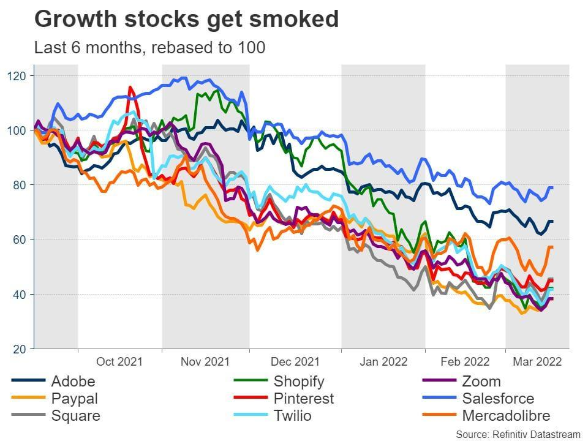

## Table of Contents

## What is Bitcoin and how has its value changed over the past year?

Bitcoin is a type of digital money that people can use to buy things online. It is different from regular money because it is not controlled by any government or bank. Instead, it uses a technology called blockchain, which is like a big, shared record book that keeps track of all the Bitcoin transactions. People can send and receive Bitcoins using special computer programs, and they store their Bitcoins in digital wallets.

Over the past year, the value of Bitcoin has gone up and down a lot. At the beginning of the year, one Bitcoin was worth around $16,000. As the year went on, its value increased a lot, reaching over $60,000 at one point. But then it started to go down again, and by the end of the year, it was worth around $40,000. So, while Bitcoin can be a good investment for some people, it can also be risky because its value changes so much.

## What are stocks and how do they differ from cryptocurrencies like Bitcoin?

Stocks are pieces of ownership in a company. When you buy a stock, you are buying a small part of that company. If the company does well, the value of the stock can go up, and you might make money. If the company does poorly, the value of the stock can go down, and you might lose money. Stocks are traded on stock markets, like the New York Stock Exchange, where people buy and sell them every day. Companies can use the money they get from selling stocks to grow their business.

Cryptocurrencies like Bitcoin are different from stocks. While stocks represent ownership in a company, cryptocurrencies are a type of digital money that is not controlled by any government or bank. They use a technology called blockchain to keep track of transactions. The value of cryptocurrencies can change a lot, sometimes going up or down very quickly. Unlike stocks, which are tied to the performance of a company, the value of cryptocurrencies can be influenced by many different things, like how many people want to use them and what people think about them in the future.

## How can one measure the growth of an investment over a specific period?

To measure the growth of an investment over a specific period, you need to look at the difference between what you started with and what you have at the end. You can do this by calculating the percentage increase or decrease. First, find out how much your investment has grown in dollars. Then, divide that growth by the amount you started with, and multiply by 100 to get the percentage. For example, if you invested $100 and it grew to $120, the growth is $20. Divide $20 by $100 to get 0.2, and then multiply by 100 to find that your investment grew by 20%.

Another way to measure growth is by using the compound annual growth rate (CAGR). This tells you the average rate at which your investment grew each year over the period. To calculate CAGR, you need the starting value, the ending value, and the number of years. The formula is: CAGR = (Ending Value / Starting Value)^(1 / Number of Years) - 1. For example, if you invested $100 and it grew to $120 over 2 years, the CAGR would be (120 / 100)^(1 / 2) - 1, which equals about 9.5%. This means your investment grew at an average rate of 9.5% per year.

## What criteria were used to select stocks that outperformed Bitcoin in the past year?

To find stocks that did better than Bitcoin in the past year, we looked at how much their value grew. We compared the starting price of each stock at the beginning of the year to its price at the end of the year. If a stock's value went up more than Bitcoin's value, it was considered to have outperformed Bitcoin. We also made sure to pick stocks from different kinds of businesses to see if certain types of companies did better than others.

Another thing we looked at was how steady the growth of the stocks was. Some stocks might have big jumps in value but also big drops, which can be risky. We chose stocks that had a more even growth over the year, even if they didn't grow as fast as Bitcoin at its highest points. This way, we could see which stocks were not only beating Bitcoin but also doing so in a more reliable way.

## Can you list some stocks that have shown greater growth than Bitcoin in the past year?

Over the past year, a few stocks have done better than Bitcoin. One of these is Tesla, a company that makes electric cars. At the start of the year, Tesla's stock was around $700 per share. By the end of the year, it had gone up to over $1,000 per share. This means Tesla's stock grew by more than Bitcoin, which went from about $16,000 to around $40,000 over the same time. Another stock that did well is NVIDIA, a company that makes computer chips. NVIDIA's stock started the year at around $500 and ended up over $3000, showing a big jump that beat Bitcoin's growth.

Another stock that outperformed Bitcoin is Apple, a company known for its iPhones and other tech products. Apple's stock began the year at about $130 per share and rose to around $150 by the end of the year. While this growth might not seem as big as some others, it was still more than Bitcoin's percentage increase over the year. These examples show that even though Bitcoin can be a good investment, some stocks can do even better, especially if you pick the right ones.

## What industries do these outperforming stocks belong to?

The stocks that did better than Bitcoin in the past year come from different industries. Tesla is in the car industry, but it's special because it makes electric cars. This means it's also part of the green energy industry. Tesla's stock grew a lot because more people want electric cars and because the company is doing well in other areas like batteries and solar power.

NVIDIA is in the technology industry, making computer chips that are used in many things, like video games and [artificial intelligence](/wiki/ai-artificial-intelligence). Their stock did really well because there's a big demand for their chips, especially for things like gaming and data centers. Apple is also in the technology industry, known for making iPhones, iPads, and other gadgets. Apple's stock grew because people keep buying their products and because the company is doing well in other areas like services and wearables.

## What are the key factors that contributed to the growth of these stocks?

Tesla's stock grew a lot because more people want electric cars. Tesla makes really good electric cars that people like. Also, Tesla is doing well in other areas like batteries and solar power. These things made more people want to buy Tesla's stock. Another reason is that Tesla's leader, Elon Musk, is famous and people think he will make the company even better in the future. All these things made Tesla's stock go up more than Bitcoin.

NVIDIA's stock did well because there is a big demand for their computer chips. These chips are used in video games, which a lot of people play, and in artificial intelligence, which is becoming more important. As more companies and people need these chips, NVIDIA's stock goes up. Also, NVIDIA is good at making new kinds of chips that work better, so more people want to buy their stock. This is why NVIDIA's stock grew more than Bitcoin.

Apple's stock went up because people keep buying their products like iPhones and iPads. Apple also makes money from services like Apple Music and the App Store, and from wearables like the Apple Watch. These different ways of making money help Apple's stock grow. People trust Apple and think it will keep doing well, which makes more people want to buy its stock. This is why Apple's stock did better than Bitcoin.

## How do market conditions affect the performance of stocks compared to Bitcoin?

Market conditions can change how well stocks and Bitcoin do. Stocks are affected by things like how the economy is doing, what's happening in the world, and if people feel good or bad about the future. If the economy is growing and people are happy, they might buy more stocks, making their prices go up. But if there's a problem, like a recession or bad news, people might sell their stocks, making prices go down. Stocks from different industries can be affected differently. For example, if people start buying more electric cars, Tesla's stock might go up, but if there's a problem in the car industry, it might go down.

Bitcoin is different because it's not tied to any one company or economy. Its value can change a lot because of what people think about it. If more people think Bitcoin is a good investment and start buying it, its price can go up a lot. But if something bad happens, like a big hack or new rules that make it harder to use, its price can go down fast. Bitcoin can also be affected by things like how easy it is to buy and sell, and what other cryptocurrencies are doing. So, while stocks and Bitcoin can both go up and down with market conditions, they can be affected by different things and in different ways.

## What are the risks associated with investing in stocks that have recently outperformed Bitcoin?

Investing in stocks that have done better than Bitcoin recently can be risky. One big risk is that the stock's price might go down. Just because a stock did well in the past year doesn't mean it will keep doing well. The stock market can change a lot, and if the company doesn't do as well as people expect, the stock price can drop. Also, if something bad happens in the world or the economy, it can make people sell their stocks, which can make the price go down even more.

Another risk is that these stocks might be overvalued. When a stock does really well, more people want to buy it, which can make the price go up a lot. But if the price gets too high compared to what the company is really worth, it might not be a good investment anymore. If the price is too high, it can fall back down to a more normal level, and people who bought it at the high price can lose money. So, it's important to look at why the stock did well and if it can keep doing well in the future before deciding to invest.

## How can investors use technical analysis to predict future performance of these stocks?

Investors can use technical analysis to predict how stocks might do in the future by looking at charts and patterns. Technical analysis is about studying the past prices and trading volumes of a stock to see if there are any patterns that can help guess what might happen next. For example, if a stock's price has been going up and making higher highs and higher lows, it might keep going up. Or if it's been going down and making lower highs and lower lows, it might keep going down. Investors also look at things like moving averages, which are lines on a chart that show the average price over a certain time, to see if the stock is trending up or down.

Another way technical analysis can help is by looking at special patterns on the charts, like head and shoulders or double tops and bottoms. These patterns can give clues about when a stock might change direction. For example, if a stock makes a head and shoulders pattern, it might mean the price is going to go down soon. Also, investors use things called indicators, like the Relative Strength Index (RSI), to see if a stock is overbought or oversold. If the RSI is very high, it might mean the stock's price is too high and could go down, and if it's very low, it might mean the price is too low and could go up. By using these tools, investors can make better guesses about where a stock's price might go next.

## What are the long-term growth prospects for these stocks compared to Bitcoin?

The long-term growth prospects for stocks like Tesla, NVIDIA, and Apple can be good if the companies keep doing well. Tesla is in the electric car and green energy business, which is growing because more people want to use clean energy. If Tesla keeps making good cars and batteries, its stock could go up a lot over time. NVIDIA makes computer chips that are used in video games and artificial intelligence, which are also growing industries. If NVIDIA keeps making better chips, its stock could do well in the long run. Apple makes popular products like iPhones and iPads, and it also makes money from services and wearables. If Apple keeps coming up with new products that people want, its stock could keep growing.

Bitcoin's long-term growth prospects are harder to predict because it's not tied to any company or economy. Its value can go up a lot if more people start using it and think it's a good investment. But it can also go down a lot if something bad happens, like a big hack or new rules that make it harder to use. Over the long term, Bitcoin could do well if more people and businesses start using it, but it could also stay the same or go down if people lose interest or if other cryptocurrencies become more popular. So, while stocks like Tesla, NVIDIA, and Apple might have more predictable growth if their companies do well, Bitcoin's future depends a lot on what people think about it.

## How should an investor's portfolio be diversified to include both stocks and cryptocurrencies like Bitcoin?

To diversify an investor's portfolio with both stocks and cryptocurrencies like Bitcoin, it's important to spread out the money across different types of investments. This means not putting all the money into just one stock or just Bitcoin. Instead, an investor could pick a few different stocks from different industries, like Tesla from the car industry, NVIDIA from the technology industry, and Apple from the tech and consumer goods industry. This way, if one stock doesn't do well, the others might still do okay. Then, the investor could also put some money into Bitcoin, but not too much, because Bitcoin can go up and down a lot.

The key to a good diversified portfolio is balance. An investor might decide to put most of their money into stocks because they are usually more stable than Bitcoin. For example, they could put 70% of their money into stocks and 30% into Bitcoin. This way, they can still benefit from Bitcoin's potential to grow a lot, but they won't lose too much if Bitcoin's value goes down. It's also a good idea to keep checking the portfolio and making changes if needed, like if one stock or Bitcoin starts doing much better or worse than the others. By spreading out the investments and keeping a balance, an investor can have a better chance of doing well over time.

## References & Further Reading

[1]: Graham, B. (1949). ["The Intelligent Investor."](https://en.wikipedia.org/wiki/The_Intelligent_Investor) Harper Business.

[2]: Antonopoulos, A. M. (2014). ["Mastering Bitcoin: Unlocking Digital Cryptocurrencies."](https://books.google.com/books/about/Mastering_Bitcoin.html?id=IXmrBQAAQBAJ) O'Reilly Media.

[3]: Chan, E. P. (2009). ["Algorithmic Trading: Winning Strategies and Their Rationale."](https://github.com/ftvision/quant_trading_echan_book) John Wiley & Sons.

[4]: Prado, M. L. (2018). ["Advances in Financial Machine Learning."](https://www.amazon.com/Advances-Financial-Machine-Learning-Marcos/dp/1119482089) John Wiley & Sons.

[5]: Aronson, D. R. (2007). ["Evidence-Based Technical Analysis: Applying the Scientific Method and Statistical Inference to Trading Signals."](https://www.amazon.com/Evidence-Based-Technical-Analysis-Scientific-Statistical/dp/0470008741) John Wiley & Sons.

[6]: Jansen, S. (2020). ["Machine Learning for Algorithmic Trading: Second Edition."](https://github.com/PacktPublishing/Machine-Learning-for-Algorithmic-Trading-Second-Edition) Packt Publishing.