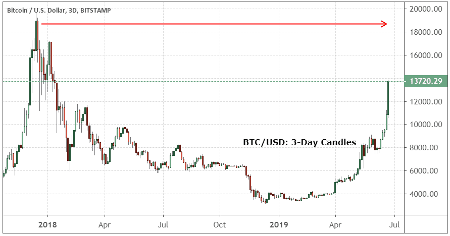

Stock investment, Bitcoin, and algorithmic trading represent pivotal concepts in contemporary financial markets, each contributing uniquely to the landscape of investment opportunities and technological advancements. Stock investment has been a foundational component of finance, allowing individuals and institutions to own fractions of companies and potentially benefit from their growth over time. Bitcoin, as a pioneering digital asset, has introduced a new paradigm of decentralized finance, challenging traditional monetary and banking systems. Algorithmic trading, on the other hand, leverages computer algorithms to execute trades at speeds and frequencies impossible for human traders, making it a cornerstone of modern finance.

The interconnectedness of these fields is increasingly apparent as technology continues to integrate various aspects of the financial sector. For instance, algorithmic trading strategies are not only applied to stock markets but also show significant potential in cryptocurrencies like Bitcoin, allowing traders to navigate the volatile nature of digital assets. Furthermore, the emergence of platforms that support both traditional stock investment and cryptocurrency trading reflects a blending of financial markets facilitated by technological innovation.

Understanding these concepts is crucial for navigating today's dynamic financial environments, where rapid changes and developments are the norms. Stock investment remains a key strategy for building wealth, yet grasping the nuances of Bitcoin and algorithmic trading provides a holistic view of current investment landscapes and potential future trajectories. This article aims to explore these themes, offering insights into the historical development of stock markets, the evolution and impact of Bitcoin, and the role of algorithmic trading in shaping financial strategies.

Readers can expect to gain a comprehensive understanding of each subject area, learning about the fundamentals and advanced strategies that influence investment decisions today. By examining the synergies and challenges at the intersection of stocks, Bitcoin, and algorithmic trading, this article provides a roadmap for investors seeking to adapt and thrive in an ever-evolving financial world.

## Table of Contents

## Understanding Stock Investment

The history of stock markets traces back to the early 17th century, with the Amsterdam Stock Exchange often cited as the first formal stock exchange. Established in 1602, it was created by the Dutch East India Company to trade its shares, laying the foundation for modern financial markets. Over the centuries, stock exchanges evolved, with significant milestones including the establishment of the London Stock Exchange (1801) and the New York Stock Exchange (NYSE) in the United States (1792). These developments marked the globalization of capital markets, enabling companies to raise funds from a broad base of investors.

Investing in stocks involves acquiring ownership in a publicly traded company. The fundamental principle governing stock investment is the risk-reward trade-off: higher potential returns are usually associated with higher risk. Investors purchase shares hoping for capital appreciation, dividends, or both. Capital appreciation occurs when the value of the stock increases over time, while dividends are periodic payments made to shareholders from a company’s earnings. 

A strategy often adopted by investors is long-term investing, where stocks are held for extended periods, typically over several years. This approach, advocated by successful investors like Warren Buffett, is predicated on the belief that, despite short-term [volatility](/wiki/volatility-trading-strategies), stock markets tend to rise over time. Contrarily, [day trading](/wiki/day-trading-spy) focuses on short-term market movements, with traders buying and selling stocks within the same trading day. While potentially profitable, day trading is riskier due to its reliance on short-term price fluctuations.

Portfolio diversification is a critical strategy in stock investment, aiming to mitigate risk by investing in various assets. By spreading investments across different sectors, industries, and geographical locations, investors can reduce the impact of poor performance from any single investment. The principle behind diversification is that a well-balanced portfolio yields steadier returns compared to investing in a single stock or sector.

Advancements in technology have notably transformed stock investments, with recent trends including the rise of online brokerage platforms, robo-advisors, and mobile trading apps. Online platforms have democratized stock trading, enabling more individuals to participate in markets with lower fees and increased accessibility. Robo-advisors provide automated financial planning services, leveraging algorithms to manage client portfolios and offer advice. Furthermore, high-frequency trading ([HFT](/wiki/high-frequency-trading-strategies)) uses powerful computers to execute large orders at incredibly fast speeds, a practice that has further increased market efficiency but also raised ethical and regulatory concerns.

Today’s dynamic financial landscape continues to evolve, driven by technological advances that reshape traditional stock investment paradigms. Investors must stay informed about these changes to harness opportunities and manage risks effectively.

## Bitcoin: The Digital Asset Revolution

Bitcoin and its associated ecosystem of cryptocurrencies represent a paradigm shift in the concept of currency and investment. As the first decentralized digital currency, Bitcoin was introduced in 2009 by an anonymous entity known as Satoshi Nakamoto. It operates without a central authority, utilizing blockchain technology, which is a distributed ledger enforced by a network of nodes, to manage transactions and mint new units of the currency.

**Transformation of the Investment Landscape**

Bitcoin has fundamentally changed the investment landscape by offering a new asset class that diverges from traditional equities and fixed-income securities. Its decentralization, scarcity (capped at 21 million coins), and ease of global transfer have made it attractive to both individual and institutional investors. Bitcoin has redefined the concepts of asset diversification and portfolio risk management. Unlike gold, another non-yielding asset traditionally used as a hedge against inflation, Bitcoin adds the dimension of technology scalability through its underlying blockchain.

**Benefits and Risks of Investing in Bitcoin**

The potential benefits of investing in Bitcoin include high returns, diversification, and acting as a hedge against inflation. Bitcoin's historical performance has seen an upward trajectory, particularly during times of economic uncertainty or fiat currency devaluation. However, these benefits come with significant risks such as high volatility, regulatory uncertainty, and susceptibility to market manipulation. Bitcoin's price fluctuations can be extreme, attributed to changing investor sentiment and news cycles.

**Comparison to Traditional Stock Investment**

Bitcoin investment differs from traditional stock investment in several key ways. Stocks represent claims on future cash flows of a company and are subject to regulatory oversight, corporate governance, and economic factors. Bitcoin, lacking intrinsic cash flows or intrinsic value, relies predominantly on market demand and technological adoption. While stocks provide dividends and valuation models based on earnings projections, Bitcoin relies upon the supply-demand equilibrium and technological innovation within the [cryptocurrency](/wiki/cryptocurrency) space.

**Developments and Future Trends**

Recent developments in the cryptocurrency sector include the surge in decentralized finance (DeFi) applications, which aim to replicate traditional financial systems on the blockchain, and the rise of central bank digital currencies (CBDCs) that may alter central authorities' roles. The integration of Bitcoin into mainstream financial systems continues to grow, with companies accepting Bitcoin payments and offering it as an investment option in retirement portfolios.

Future trends point towards increasing regulatory clarity, which could foster greater adoption from institutional investors. Technological upgrades, such as scalability solutions and energy-efficient mining operations, are ongoing to address criticisms of Bitcoin's environmental impacts and transaction speed limitations. As the crypto market matures, the role of Bitcoin as a store of value and medium of exchange may evolve, reinforcing its status within the broader financial landscape.

## Algorithmic Trading: The Future of Investment

Algorithmic trading refers to the use of computer algorithms to automatically execute trading strategies in financial markets. This method leverages computational power to manage trading rules, analyze large datasets, and operate at a speed and efficiency unmatched by human traders. Unlike traditional trading, which relies on manual decision-making and execution, [algorithmic trading](/wiki/algorithmic-trading) is driven by predefined criteria set into algorithms, encompassing complex mathematical models to predict market movements and identify trading opportunities.

One of the primary advantages of algorithmic trading is its speed. Algorithms can process and react to market conditions much faster than a human, executing trades in milliseconds. This capability is essential in high-frequency trading (HFT), where success largely depends on exploiting minute price discrepancies that may exist for only fractions of a second. Consequently, efficiency is another significant benefit. Algorithms can continuously scan multiple markets across the globe, monitor numerous financial instruments simultaneously, and execute trades with precision, minimizing the scope for human error and emotional decision-making.

The role of data and [artificial intelligence](/wiki/ai-artificial-intelligence) (AI) in algorithmic trading is increasingly prominent. Algorithms utilize historical market data along with real-time information to generate trading signals. Machine learning, a subset of AI, plays a crucial role here, as it can enhance algorithms' learning ability by identifying patterns and making data-driven predictions about future market behavior. Through techniques such as supervised learning and [reinforcement learning](/wiki/reinforcement-learning), trading algorithms can refine their strategies over time, improving accuracy and adaptability to changing market conditions.

Several popular algorithmic trading strategies exist, each with its specific focus. Some of these include:

1. **Trend Following**: This strategy identifies and capitalizes on existing market trends. It typically involves using statistical indicators such as moving averages to detect upward or downward trends and make trades accordingly.

2. **Arbitrage**: Arbitrage strategies exploit price differences of a single asset across different markets or platforms. Algorithms swiftly spot and capitalize on these temporary discrepancies to lock in profit.

3. **Mean Reversion**: This strategy is based on the hypothesis that price fluctuations will eventually revert to their historical mean or average level. Algorithms using this method aim to trade against the extremes, anticipating a return to unity.

4. **Market Making**: This strategy involves placing simultaneous buy and sell orders to profit from the bid-ask spread. Algorithms try to profit from the slight price differences between buying and selling prices.

Even with its advantages, algorithmic trading presents potential risks and ethical challenges. Software malfunctions or poorly designed algorithms can lead to significant market disruptions, as seen in historical instances like the 2010 "Flash Crash". Moreover, high-frequency trading strategies, in particular, raise concerns regarding market fairness and manipulation due to the potential for front running and other anti-competitive behaviors. There are also issues related to transparency, as complex algorithms may operate as "black boxes", providing little insight into their decision-making process.

In summary, while algorithmic trading offers considerable benefits in terms of speed, efficiency, and data-driven decision-making, it also necessitates careful consideration of the associated risks and ethical implications. As the financial markets continue to evolve, algorithmic trading will likely remain a focal point of innovation and regulation.

## Integrating Stocks, Bitcoin, and Algorithmic Trading

The integration of stocks, Bitcoin, and algorithmic trading represents a dynamic shift in the investment landscape, where advanced strategies and technology converge to maximize potential returns and minimize risks. The synergy between stock investment and algorithmic trading is underscored by the ability of algorithms to process vast amounts of market data at incredible speeds, allowing for timely and informed decision-making that is challenging for traditional manual trading.

Algorithmic trading encompasses techniques wherein predefined criteria are used to make trading decisions, effectively removing human emotion from the process. This advantage leads to increased efficiency and accuracy, reducing the latency in capturing market trends. Traders and institutional investors often employ algorithms to identify [arbitrage](/wiki/arbitrage) opportunities, execute large orders strategically without significantly impacting stock prices, and manage portfolios effectively.

The inclusion of Bitcoin and cryptocurrency markets within the purview of algorithmic trading broadens the horizon for investors. Cryptocurrencies are known for their volatility, often exhibiting rapid price changes within short time frames. Algorithms are capable of leveraging these fluctuations to capitalize on short-term trading opportunities, often more effectively than human traders. Advanced algorithms can employ technical analysis tools, such as moving averages or the Relative Strength Index (RSI), to predict price movements in cryptocurrencies, similar to their use in equity markets. For instance, a simple moving average crossover strategy can be applied to Bitcoin trading; when a short-term moving average crosses above a long-term moving average, it may signal a buy opportunity, and vice versa.

An example of an integrated investment portfolio might include a combination of diversified stock holdings, a strategic allocation to Bitcoin and other cryptocurrencies, and a set of algorithm-driven trading strategies tailored to leverage both markets. This balanced approach allows an investor to mitigate risks associated with individual asset classes while maintaining optimal exposure to potential high-reward scenarios.

Technological advancements are paving the way for greater integration of these investment domains. The proliferation of high-frequency trading (HFT) platforms, advancements in [machine learning](/wiki/machine-learning) models, and access to real-time market data create a fertile environment for developing sophisticated trading algorithms. Cloud computing and distributed ledger technology further enhance the scalability and security of these trading systems, providing investors with robust tools to navigate complex financial landscapes.

However, integrating these strategies is not without challenges. The primary concern lies in the increased complexity of managing cross-instrument portfolios that behave differently under varying market conditions. Regulatory compliance is another challenge, as both cryptocurrency markets and algorithmic trading are subject to evolving legal frameworks that differ across jurisdictions. Moreover, technological failures, such as algorithmic errors or system outages, can lead to substantial financial loss.

Investors must approach integration with a comprehensive understanding of each component's intricacies and the interplay between them. By doing so, they can maximize the potential benefits offered by the synergy of stocks, Bitcoin, and algorithmic trading, while being mindful of the accompanying challenges and risks.

## Conclusion

As we have explored the multifaceted landscape of modern investments, it is evident that stocks, Bitcoin, and algorithmic trading each present unique opportunities and challenges. Grasping the essentials of stock investment provides a foundation for recognizing patterns, understanding market volatility, and optimizing returns through diversification and strategic planning. Meanwhile, Bitcoin marks a paradigm shift in digital finance, introducing investors to the realm of cryptocurrencies with its decentralized approach and potential for high returns, albeit with substantial risks.

Algorithmic trading represents a cutting-edge advancement in investment strategies, offering enhanced speed and efficiency through sophisticated data-driven approaches. Harnessing algorithms enables traders to capitalize on market movements with precision and minimal human intervention. Together, these domains underscore a critical intersection where technology and finance converge, shaping the future of investment strategies.

Understanding stocks, Bitcoin, and algorithmic trading not only equips investors with a comprehensive toolkit for navigating today's financial markets but also encourages proactive engagement with continuous learning and adaptation. The rapid evolution of these fields suggests broader implications for investment, including increased market [liquidity](/wiki/liquidity-risk-premium), potential democratization of financial services, and the development of new financial instruments and platforms.

The synergy between these investment practices offers vast potential in creating diversified, resilient portfolios. However, investors must remain astute, acknowledging the inherent uncertainties and staying informed about regulatory, technological, and market developments. As finance and technology continue to intertwine, fostering a dynamic environment, the informed investor will be well-prepared to harness these changes, thereby enhancing their financial acumen and potential for success in the evolving investment landscape.

## Further Reading and Resources

For those interested in stock investment, there are several authoritative resources to consider. Books such as "The Intelligent Investor" by Benjamin Graham provide foundational knowledge on value investing principles. Websites like Investopedia offer a wealth of information on stock market fundamentals, investment strategies, and financial news. Additionally, online courses from platforms like Coursera and Udemy cover a broad range of topics in stock investing, from beginner to advanced levels.

For those looking to deepen their understanding of Bitcoin and cryptocurrencies, "Mastering Bitcoin" by Andreas M. Antonopoulos is a highly recommended book that explains the technical foundations of Bitcoin. Websites such as CoinTelegraph and CryptoSlate provide regular updates and insights into the dynamic world of digital currencies. Furthermore, the Bitcoin Official Website offers comprehensive resources for new and experienced users alike. Online courses, such as those provided by edX and Khan Academy, offer structured learning pathways into cryptocurrency markets and technologies.

Those interested in experimenting with algorithmic trading can benefit from tools like QuantConnect and AlgoTrader, which provide platforms for developing, testing, and deploying trading algorithms. Books such as "Algorithmic Trading" by Ernie Chan guide the reader through the intricacies of developing algorithmic trading strategies. Additionally, the online community QuantInsti offers specialized courses and resources focused on algorithmic and [quantitative trading](/wiki/quantitative-trading) methods.

Staying informed about the latest developments in these fields is crucial for investors. Financial news outlets such as Bloomberg, Reuters, and CNBC provide updated news and analysis on market trends and economic developments. Following reputable financial blogs and forums can also help investors engage with experts and peers. Websites like TradingView offer community forums where investors can share insights and strategies.

For direct engagement with experts, platforms like LinkedIn host many professional groups focused on investment strategies, cryptocurrency discussions, and algorithmic trading techniques. Participating in online communities such as Reddit's r/investing or r/cryptocurrency can further enhance learning and networking opportunities.

## References & Further Reading

[1]: Graham, B. (1949). ["The Intelligent Investor."](https://en.wikipedia.org/wiki/The_Intelligent_Investor) Harper Business.

[2]: Antonopoulos, A. M. (2014). ["Mastering Bitcoin: Unlocking Digital Cryptocurrencies."](https://books.google.com/books/about/Mastering_Bitcoin.html?id=IXmrBQAAQBAJ) O'Reilly Media.

[3]: Chan, E. P. (2009). ["Algorithmic Trading: Winning Strategies and Their Rationale."](https://github.com/ftvision/quant_trading_echan_book) John Wiley & Sons.

[4]: Prado, M. L. (2018). ["Advances in Financial Machine Learning."](https://www.amazon.com/Advances-Financial-Machine-Learning-Marcos/dp/1119482089) John Wiley & Sons.

[5]: Aronson, D. R. (2007). ["Evidence-Based Technical Analysis: Applying the Scientific Method and Statistical Inference to Trading Signals."](https://www.amazon.com/Evidence-Based-Technical-Analysis-Scientific-Statistical/dp/0470008741) John Wiley & Sons.

[6]: Jansen, S. (2020). ["Machine Learning for Algorithmic Trading: Second Edition."](https://github.com/PacktPublishing/Machine-Learning-for-Algorithmic-Trading-Second-Edition) Packt Publishing.