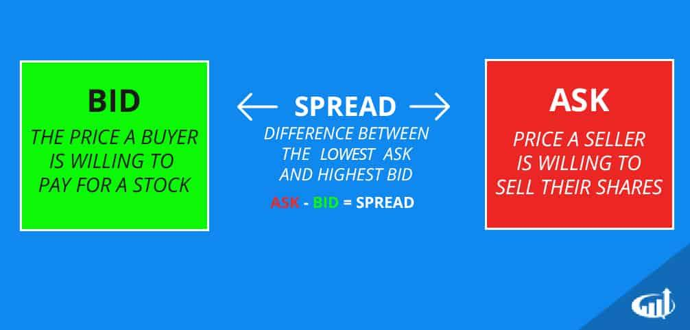

The bid-ask spread is a fundamental concept in stock trading, representing the difference between the highest price a buyer is willing to pay for an asset (bid price) and the lowest price a seller is willing to accept (ask price). This spread is a critical indicator of a market's liquidity, where a narrow spread typically suggests higher liquidity and thus, enhanced ease of trading. Conversely, a wide spread often indicates less liquidity, signaling potential challenges in executing trades swiftly and at desired prices.

In recent years, algorithmic trading has revolutionized the landscape of financial markets. Employing complex algorithms and vast computational power, traders can analyze vast amounts of market data at speeds beyond human capability. Algorithmic trading facilitates strategies that exploit minute market inefficiencies, such as slight variations within bid-ask spreads, thereby contributing significantly to market liquidity and efficiency. A prominent facet of algorithmic trading is high-frequency trading (HFT), which involves rapid execution of a large number of orders, often leading to narrower bid-ask spreads and improved market depth.



This article aims to provide an in-depth understanding of the bid-ask spread, its significance in financial markets, and the influence of algorithmic trading on this critical market metric. By exploring the intricate relationship between bid-ask spreads and algorithmic strategies, we seek to illuminate trading opportunities and challenges inherent in modern markets. Through this exploration, traders and market participants will gain insights into leveraging technology to capitalize on spread variations and optimize trading outcomes.

## Table of Contents

## Understanding the Bid-Ask Spread

The bid-ask spread is a fundamental concept in financial markets, representing the difference between the price at which buyers are willing to purchase a security (bid price) and the price at which sellers are willing to sell it (ask price). Mathematically, it can be expressed as:

$$
\text{Bid-Ask Spread} = \text{Ask Price} - \text{Bid Price}
$$

This spread serves as a key indicator of market liquidity, which is the ease with which assets can be bought or sold in the market without affecting the asset's price. A narrow bid-ask spread typically signifies a liquid market, with many buyers and sellers actively trading the asset. Conversely, a wide spread indicates a less liquid market, where larger price changes might be necessary to facilitate trading.

Several factors influence the size of the bid-ask spread, with trading [volume](/wiki/volume-trading-strategy) being one of the most significant. High trading volumes usually lead to narrower spreads because increased activity promotes greater competition among traders, thus narrowing the gap between the bid and ask prices. On the other hand, in markets with low trading volumes, spreads tend to widen due to reduced competition and less price discovery.

Volatility also plays a crucial role in determining the bid-ask spread. In periods of high market [volatility](/wiki/volatility-trading-strategies), spreads often widen as market makers and traders account for the increased risk of price fluctuations. During such times, the uncertainty about asset pricing results in broader spreads to compensate for the risk undertaken.

Market conditions significantly influence whether spreads are narrow or wide. For instance, in a stable and high-volume market, such as a large-cap stock or a highly-traded currency pair, spreads are generally narrow due to the abundance of buyers and sellers and the relatively low risk of price fluctuations. Conversely, in illiquid or volatile conditions, such as thinly-traded stocks or during geopolitical tensions, spreads can be quite wide, reflecting the increased risk and lower participation in the market.

In summary, the bid-ask spread is a vital metric for assessing market [liquidity](/wiki/liquidity-risk-premium) and is influenced by factors such as trading volume and volatility. Understanding these influences provides traders with insights into market conditions, aiding in more informed trading decisions.

## Algorithmic Trading and the Bid-Ask Spread

Algorithmic trading represents a paradigm shift in financial markets, marked by the use of computer algorithms to execute trades with speed and precision that surpasses human capabilities. The evolution of [algorithmic trading](/wiki/algorithmic-trading) has been driven by technological advancements, increased data availability, and the need for efficient market execution strategies. Initially, algorithmic trading was adopted by large financial institutions, but its scope has expanded significantly, impacting various facets of market operations, including the bid-ask spread.

Algorithms programmatically assess bid-ask spreads to identify profitable trading opportunities. The bid-ask spread, the difference between the highest price a buyer is willing to pay (bid) and the lowest price a seller is willing to accept (ask), serves as a critical indicator of market liquidity and pricing efficiency. Algorithmic strategies often utilize real-time data feeds to monitor these spreads across multiple securities, enabling traders to make informed decisions based on existing market conditions.

For example, algorithms are designed to detect anomalies or inefficiencies in bid-ask spreads, allowing traders to profit through short-term trades. This can involve executing trades when a spread temporarily widens beyond its historical average, indicating potential mispricing. The utilization of statistical models and [machine learning](/wiki/machine-learning) enhances the ability to predict these anomalies by analyzing large datasets for patterns that signal trading opportunities.

High-frequency trading ([HFT](/wiki/high-frequency-trading-strategies)), a subset of algorithmic trading, plays a crucial role in narrowing bid-ask spreads. HFT strategies are characterized by rapid execution of high volumes of orders within extremely short timeframes, often milliseconds. By continuously posting bids and asks close to the market price, HFT firms increase market liquidity, thereby reducing spreads. This process is essential in establishing tighter spreads, which benefits all market participants by improving order execution quality and reducing transaction costs.

An illustrative Python code snippet that demonstrates how simple algorithms might identify and trade opportunities in bid-ask spreads is as follows:

```python
import pandas as pd

# Sample data: a DataFrame with bid and ask prices
data = pd.DataFrame({
    'time': ['09:30', '09:31', '09:32'],
    'bid': [100.5, 101.0, 100.7],
    'ask': [101.5, 101.2, 101.0]
})

# Calculate the bid-ask spread
data['spread'] = data['ask'] - data['bid']

# Define a simple strategy to buy when the spread is narrow (e.g., < 0.5)
def trading_strategy(row):
    if row['spread'] < 0.5:
        return 'Buy'
    else:
        return 'Hold'

# Apply the simple trading strategy
data['action'] = data.apply(trading_strategy, axis=1)

print(data)
```

This kind of approach highlights the basic logic behind more complex algorithms in trading systems that identify and act upon spread opportunities based on predefined criteria.

In conclusion, the intersection of algorithmic trading and the bid-ask spread presents avenues for economic efficiency and better price discovery. High-frequency traders, through their operations, contribute significantly to the narrowing of bid-ask spreads, enhancing the liquidity and functionality of financial markets. As technology continues to evolve, algorithms will undoubtedly play an even more integral role in shaping the dynamics of bid-ask spreads and overall market efficiency.

## Strategies for Trading the Bid-Ask Spread

Market making serves as a fundamental strategy for trading the bid-ask spread. Market makers provide liquidity by simultaneously offering to buy (bid) and sell (ask) a financial instrument, thus tightening the spread through competition. This role is crucial for market efficiency, as it reduces the cost for other traders and stabilizes price fluctuations. Market makers profit from the spread itself, as well as by executing a high volume of trades with minimal market impact.

Arbitrage opportunities within bid-ask spreads arise when there are discrepancies between the prices of identical or similar financial instruments in different markets or forms. Traders look for price inefficiencies that allow them to simultaneously buy low and sell high. This can occur due to differences in time zones, market inefficiencies, or temporary information lags. Successful [arbitrage](/wiki/arbitrage) requires sophisticated algorithms capable of quickly identifying and executing trades before the market self-corrects.

Scalping involves executing a large number of trades over short time periods to capitalize on small price changes. Traders focus on tight spreads, using advanced software to execute trades quickly, taking advantage of the bid-ask spread's continuous fluctuation. Scalpers aim to make small profits over numerous trades, which collectively result in significant returns. The strategy necessitates a high degree of precision and an acute understanding of market dynamics.

Mean reversion strategies are based on the principle that prices and spreads return to an average level over time. Traders employing mean reversion techniques monitor deviations in spreads, predicting that they will revert to their historical average. These strategies involve statistical analysis and the creation of models to identify when a spread is likely to revert. Python, for example, offers libraries like NumPy and pandas for handling time-series data to build such models. Here is a simple example of a mean reversion strategy using Python:

```python
import numpy as np
import pandas as pd

# Load historical spread data
spread_data = pd.read_csv('spread_data.csv')

# Calculate the mean and standard deviation of the spread
spread_mean = spread_data['spread'].mean()
spread_std = spread_data['spread'].std()

# Define the upper and lower thresholds
upper_threshold = spread_mean + spread_std
lower_threshold = spread_mean - spread_std

# Identify mean reversion signals
def mean_reversion_strategy(spread_data):
    signals = []

    for spread in spread_data['spread']:
        if spread > upper_threshold:
            signals.append('sell')
        elif spread < lower_threshold:
            signals.append('buy')
        else:
            signals.append('hold')

    return signals

spread_data['signals'] = mean_reversion_strategy(spread_data)
```

Market participants implement these strategies based on their risk tolerance, market conditions, and technological resources. Successfully trading bid-ask spreads requires a robust understanding of market dynamics, technological infrastructure, and incorporating statistical and algorithmic tools.

## Real-World Implications and Examples

Bid-ask spreads are a key indicator of market dynamics, significantly affecting both the liquidity of markets and the opportunities available to various classes of traders. 

### Comparison of Bid-Ask Spreads in Liquid and Illiquid Markets

In highly liquid markets, such as those for major currency pairs in the foreign exchange market or stocks of large-cap companies, bid-ask spreads are typically narrow. A narrow bid-ask spread indicates that the difference between the price at which buyers are willing to buy (the bid) and the price at which sellers are prepared to sell (the ask) is minimal, suggesting robust activity and sufficient volume to accommodate large trades without significantly affecting the price.

Conversely, in illiquid markets — which may include stocks of small-cap companies or certain commodities — the bid-ask spreads are often wider. Wider spreads occur due to lesser trading volumes and higher perceived risk, which can result in increased cost for executing trades and greater difficulty in entering or exiting positions. For instance, during periods of market turbulence or economic uncertainty, even typically liquid markets can experience an increase in spreads, reflecting reduced liquidity and increased risk perception.

### Case Studies of Algorithmic Trading Firms

Algorithmic trading firms frequently exploit variations in bid-ask spreads to generate profits. Firms such as Virtu Financial and Citadel Securities are known for their high-frequency trading (HFT) strategies. These firms leverage advanced algorithms to identify and execute trades at lightning speed, capitalizing on even the smallest changes in bid-ask spreads. For example, HFT algorithms can perform market-making activities, continuously placing buy and sell orders to capture the spread, or they may execute [statistical arbitrage](/wiki/statistical-arbitrage) strategies that utilize the spread in pricing inefficiencies across different market venues.

### Impact of Bid-Ask Spreads on Retail versus Institutional Traders

The impact of bid-ask spreads is markedly different for retail and institutional traders. Retail traders typically encounter wider spreads compared to institutional traders. This is partly due to the lower volume traded by retail investors, which translates to less bargaining power and access to less favorable pricing. Moreover, retail trading platforms might include additional costs or fees that effectively widen the bid-ask spread presented to the retail investor.

Institutional traders, on the other hand, usually benefit from narrower spreads due to negotiating directly in the order [books](/wiki/algo-trading-books) and executing larger trades. Their substantial volume gives them a price advantage often reinforced by direct market access and sophisticated order execution strategies, allowing them to mitigate costs associated with the spreads.

In conclusion, understanding the nuances of bid-ask spreads and their implications for different market participants is crucial for effective trading. For algorithmic trading firms, tight spreads represent frequent opportunities for profit, while for retail traders, navigating these costs remains a significant challenge. As technology evolves, the landscape of spread effects continues to change, influencing trading strategies and market behaviors.

## Challenges and Considerations

In spread trading, numerous challenges and considerations arise due to the dynamic nature of the financial markets and the intricacies of trading mechanisms. A primary technical challenge involves the precision required in maintaining robust algorithms that can swiftly and accurately analyze spreads in real-time. The hardware and software infrastructure must be equipped to handle large volumes of data at high speeds to capitalize on fleeting opportunities. For instance, high-frequency trading (HFT), a subset of algorithmic trading, necessitates cutting-edge technology, including low-latency networks and powerful computing resources, to execute trades in microseconds.

Regulatory considerations also play a significant role, as governing bodies impose strict compliance standards to ensure market integrity and protect investors. Institutions engaged in spread trading often face challenges conforming to regulations like the European Union's MiFID II or the United States' Dodd-Frank Act, which demand transparency and accountability. These regulations may limit the types of spreads that can be traded or impose requirements on reporting and data storage, impacting both strategy and execution.

Market conditions such as high volatility and low liquidity significantly affect bid-ask spreads. During periods of high volatility, spreads tend to widen as uncertainties increase, and investors demand higher risk premiums. Conversely, low liquidity can exacerbate this, as insufficient trading volume makes it difficult to execute large trades without substantially impacting the market price. These conditions complicate spread trading strategies, requiring traders to adapt their algorithms to swiftly changing environments. 

For example, in Python, a trader might employ the following code snippet to monitor and react to spread changes:

```python
def monitor_spread(bid, ask, volatility, liquidity_threshold):
    spread = ask - bid
    if volatility > threshold and liquidity < liquidity_threshold:
        take_action(spread)

def take_action(spread):
    if spread > wide_spread_limit:
        print("Consider holding or selling")
    elif spread < narrow_spread_limit:
        print("Consider buying")

# Example usage
monitor_spread(100, 102, 0.05, 0.8)
```

This simple code adjusts actions based on spread dynamics, reflecting necessary adaptations in real-world trading scenarios.

The requirement for advanced technology and infrastructure is crucial. Trading systems must ensure high availability, as even minimal downtime could translate into missed opportunities or financial loss. Implementing redundancy and failover systems mitigates such risks, while continuous monitoring and optimization of algorithms ensure they remain effective under varying market conditions. 

In conclusion, navigating the technical and regulatory landscape of spread trading demands comprehensive understanding and meticulous attention to market signals, supported by sophisticated trading infrastructure and adherence to regulatory frameworks.

## Conclusion

Understanding the bid-ask spread is crucial for traders as it directly impacts transaction costs and potential profitability. The bid-ask spread represents the difference between the price a buyer is willing to pay (the bid) and the price a seller is asking for (the ask). This spread is a key indicator of market liquidity, with narrower spreads generally reflecting a more liquid market. Factors influencing the spread include trading volume, market volatility, and the overall supply and demand for an asset. Traders who understand these nuances can better navigate market conditions and optimize their trading strategies.

Looking to the future, technology is poised to play an increasingly significant role in spread trading. Algorithmic trading, already a substantial force, continues to evolve, providing traders with sophisticated tools to analyze and act upon bid-ask spreads more efficiently. Algorithms can process large datasets quickly, identify patterns and anomalies within spreads, and execute trades at speeds unmatched by human traders. High-frequency trading, in particular, has been instrumental in narrowing spreads, contributing to more efficient market dynamics.

For traders, the advancement of technology presents both opportunities and challenges. Capitalizing on bid-ask spreads requires not only a keen understanding of market mechanics but also access to advanced technological infrastructure. Traders should consider investing in robust trading platforms and data analysis tools while maintaining awareness of the regulatory landscape to ensure compliance.

In summary, mastering the intricacies of the bid-ask spread is essential for traders aiming to maximize their market efficiency. As technology continues to advance, staying abreast of developments in algorithmic and high-frequency trading will be vital. Embracing these tools can enhance decision-making processes, increase trading speed, and potentially improve profitability. Traders are encouraged to persistently expand their knowledge, adapt to technological innovations, and refine their strategies in response to ever-evolving market conditions.

## References & Further Reading

1. **"Market Microstructure Theory" by Maureen O'Hara**  
   This book provides a comprehensive examination of market microstructure, including topics such as bid-ask spreads, liquidity, and price formation. It is an essential resource for understanding the intricacies of trading processes and the factors affecting spread dynamics.

2. **"Algorithmic and High-Frequency Trading" by Álvaro Cartea, Sebastian Jaimungal, and José Penalva**  
   This text investigates into the strategies and mathematical models behind algorithmic and high-frequency trading. It emphasizes the role of these methods in interpreting and capitalizing on bid-ask spreads.

3. **"Advances in Financial Machine Learning" by Marcos López de Prado**  
   López de Prado's work focuses on the machine learning techniques used in quantitative finance, with particular attention to algorithmic trading strategies that can influence bid-ask spreads.

4. **"High-Frequency Trading: A Practical Guide to Algorithmic Strategies and Trading Systems" by Irene Aldridge**  
   This resource explores the design and implementation of high-frequency trading systems. It includes practical examples and case studies, illustrating how such systems analyze bid-ask spreads.

5. **Research Papers and Articles from Financial Journals**  
   - "The Components of the Bid-Ask Spread: A General Approach" by Lawrence R. Glosten and Lawrence E. Harris, published in the Journal of Finance. This paper investigates the factors contributing to the size of the bid-ask spread.
   - "High-Frequency Trading and the New Market Makers" by Jonathan Brogaard. This article discusses the impact of HFT on market liquidity and spread dynamics.

6. **Online Resources and Financial News Platforms**  
   - Investopedia's series on bid-ask spread provides accessible explanations and examples of spread concepts and strategies.  
   - The Financial Times and Bloomberg regularly cover developments related to algorithmic trading and market microstructure, offering insights and news relevant to traders and financial analysts.

7. **Academic and Industry Conferences**  
   Attending conferences such as the Quantitative Trading Conference or the Algorithmic Trading Symposium can provide valuable networking opportunities and insights into current trends and technologies affecting bid-ask spreads.

