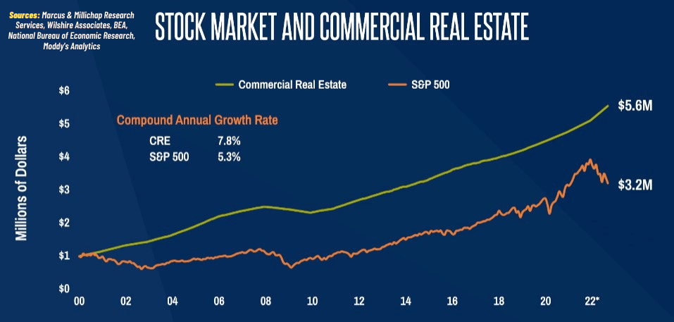

## Table of Contents

## What are stocks and how do they function as real assets?

Stocks are pieces of ownership in a company. When you buy a stock, you are buying a small part of that company. This means you have a claim on a portion of the company's assets and earnings. Companies sell stocks to raise money, which they can use to grow their business or pay off debts. People buy stocks because they hope the company will do well and the value of the stock will go up, allowing them to sell it later for a profit.

Stocks function as real assets because they represent actual ownership in a business. Just like owning a house or a car, owning stocks means you have something of value. If the company does well, the value of the stock can increase, and you might also receive dividends, which are payments made by the company to its shareholders. However, stocks can also lose value if the company does poorly, making them a bit riskier than some other types of assets. Still, many people invest in stocks as a way to build wealth over time.

## How can stocks be classified as real assets?

Stocks can be classified as real assets because they represent actual ownership in a company. When you buy a stock, you own a piece of that business. This is similar to owning a house or a car, where you have something tangible that you can claim as yours. Stocks give you a share in the company's assets and earnings, making them a real part of your wealth.

Just like other real assets, the value of stocks can go up or down. If the company does well, the value of the stock can increase, and you might get dividends, which are like little payments from the company. But if the company doesn't do well, the stock's value can drop. Even though stocks can be risky, they are still considered real assets because they represent real ownership and can grow in value over time.

## What are the benefits of investing in stocks as real assets?

Investing in stocks as real assets can help you grow your money over time. When you buy a stock, you own a piece of a company. If that company does well, the value of your stock can go up. This means you could sell your stock later for more money than you paid for it. Also, some companies pay dividends, which are like little payments to people who own their stock. These dividends can give you extra money without selling your stock.

Another benefit is that stocks can help protect your money from inflation. Inflation is when the price of things goes up over time. If you just keep your money in a savings account, it might not grow fast enough to keep up with inflation. But stocks can grow faster than inflation, helping your money keep its value. Plus, by owning stocks, you can spread out your investments. This means you can own a little bit of many different companies, which can make your investments safer because if one company does badly, the others might still do well.

## How do stocks compare to other real assets like real estate or commodities?

Stocks, real estate, and commodities are all real assets because they represent something you own that can grow in value. Stocks are pieces of ownership in companies. When you buy a stock, you own a small part of that business. Real estate is property like houses or land. When you buy real estate, you own the actual building or land. Commodities are things like gold, oil, or wheat. When you buy commodities, you own the physical item or a contract to buy it later. Each type of asset can go up or down in value, but they work in different ways.

Stocks can be easier to buy and sell than real estate or commodities. You can buy and sell stocks quickly on a computer or phone. Real estate usually takes longer to buy or sell because it involves big contracts and sometimes loans. Commodities can be tricky to buy and store, especially if you're buying things like oil or wheat. Stocks also let you own a little bit of many different companies, which can make your investments safer. Real estate and commodities usually mean you're putting all your money into one thing, which can be riskier. But real estate can give you a place to live or rent out, and commodities can be useful if you need them for something specific.

## What are the risks associated with stocks as real assets?

Investing in stocks as real assets can be risky because the value of stocks can go up and down a lot. If the company you own stock in does badly, the price of your stock can drop. This means you could lose money if you need to sell your stock when the price is low. Also, stocks don't always pay dividends, so you might not get any extra money while you own them. If the whole stock market goes down, like during a big economic problem, your stocks could lose a lot of value all at once.

Another risk is that stocks can be hard to understand. You need to know about the company and how it's doing to make good choices. If you don't do your homework, you might pick the wrong stocks and lose money. Also, even if you pick good stocks, other things like the economy or world events can affect their value. This means you can't always predict what will happen to your stocks, which can be scary if you're not ready for it.

## How does the liquidity of stocks compare to other real assets?

Stocks are very liquid, which means you can buy and sell them quickly and easily. You can do this on a computer or phone, often in just a few minutes. This is much easier than selling other real assets like real estate or commodities. For example, selling a house can take months because it involves finding a buyer, negotiating, and dealing with lots of paperwork. Commodities like gold or oil can also be hard to sell quickly, especially if you need to find someone who wants to buy them right away.

On the other hand, real estate and commodities can be less liquid, meaning it takes longer to turn them into cash. Real estate requires a lot of time and effort to sell, and you might need to wait for the right buyer. Commodities can be tricky because you need to find someone who wants to buy them, and you might need to store them until you can sell them. This makes stocks a more flexible choice if you need to get your money out quickly.

## What role do stocks play in a diversified investment portfolio?

Stocks are an important part of a diversified investment portfolio because they can help your money grow over time. When you own stocks, you own a piece of a company. If the company does well, the value of your stock can go up. This means you could sell your stock later for more money than you paid for it. Stocks also let you own a little bit of many different companies, which can make your investments safer. If one company does badly, the others might still do well, so you don't lose all your money at once.

Another reason stocks are good for a diversified portfolio is that they can help protect your money from inflation. Inflation is when the price of things goes up over time. If you just keep your money in a savings account, it might not grow fast enough to keep up with inflation. But stocks can grow faster than inflation, helping your money keep its value. By mixing stocks with other types of investments like bonds or real estate, you can spread out your risk and have a better chance of making money over time.

## How can one evaluate the performance of stocks as real assets?

You can evaluate the performance of stocks as real assets by looking at how much their value has gone up or down over time. If you bought a stock for $10 and it's now worth $15, that's a good sign. You can also check if the company is making more money than before. If the company's profits are growing, it's likely that the stock will keep doing well. Another way to evaluate stocks is by looking at the dividends they pay. If a company pays you more dividends over time, that's a good thing because it means you're getting more money without selling your stock.

It's also important to compare the stock's performance to the overall stock market. If the stock is doing better than the market, that's a good sign. You can use something called a stock index, like the S&P 500, to see how the market is doing. If your stock is going up while the market is going down, that's even better. But remember, stocks can be risky, so it's good to look at how much the stock's price goes up and down. If it's very bumpy, it might be riskier than a stock that stays more steady.

## What are the tax implications of investing in stocks as real assets?

When you invest in stocks, you need to think about taxes. If you make money from selling your stocks for more than you paid, that's called a capital gain. You have to pay taxes on capital gains. If you hold the stock for more than a year before selling, you pay a lower tax rate on the gain. But if you sell it in less than a year, you pay a higher tax rate. Also, if you get dividends from your stocks, those are usually taxed too. The tax rate on dividends can be different depending on how much money you make and what kind of dividends they are.

Taxes can make a big difference in how much money you keep from your stocks. If you're not careful, taxes can take a big bite out of your profits. That's why it's smart to think about taxes when you're planning to buy or sell stocks. You might want to talk to a tax advisor to help you figure out the best way to handle your taxes. They can help you understand how much you'll owe and how to pay less in taxes.

## How do macroeconomic factors affect stocks as real assets?

Macroeconomic factors are big things that affect the whole economy, like interest rates, inflation, and unemployment. These things can change how well stocks do. For example, if interest rates go up, it can make it harder for companies to borrow money. This might make them less profitable, and their stock prices could go down. On the other hand, if the economy is doing well and people are spending more money, companies might make more profit, and their stock prices could go up.

Another big [factor](/wiki/factor-investing) is inflation. If prices are going up a lot, it can make people worried about the future. They might sell their stocks, which can make stock prices drop. But if inflation is under control, people might feel more confident and keep their money in stocks. Unemployment is also important. If a lot of people are out of work, they won't have as much money to spend, and companies might not do as well. This can hurt stock prices. But if unemployment is low, people have more money to spend, and companies can do better, which can help stock prices go up.

## What advanced strategies can be used to optimize returns from stocks as real assets?

One advanced strategy to optimize returns from stocks is called dollar-cost averaging. This means you put a little bit of money into stocks regularly, no matter if the stock price is high or low. Over time, this can help you buy more shares when prices are low and fewer when prices are high, which can lead to better returns. Another strategy is called value investing. This is when you look for stocks that you think are priced lower than they should be. You buy these stocks and hold onto them until their price goes up to what you think is fair. This can take a lot of research, but it can help you find good deals on stocks.

Another way to optimize returns is by using a strategy called growth investing. This means you look for companies that are growing fast and might keep growing in the future. You buy their stocks hoping that as the company grows, the stock price will go up too. This can be riskier because fast-growing companies can sometimes fail, but if you pick the right ones, you can make a lot of money. Lastly, you can use something called technical analysis. This is when you look at charts and patterns to try to guess where the stock price might go next. It's like trying to predict the future by looking at past prices. While it's not perfect, it can help you decide when to buy or sell your stocks to get the best returns.

## How do global market trends influence the valuation of stocks as real assets?

Global market trends can have a big impact on how much stocks are worth. When the world economy is doing well, people feel more confident about spending and investing. This can make stock prices go up because companies are making more money. For example, if there's a lot of trade between countries, companies that sell things around the world might do better, and their stock prices could go up. But if there's a big problem, like a trade war or a global health crisis, it can make the economy slow down. People might sell their stocks because they're worried, and this can make stock prices go down.

Another way global trends affect stocks is through changes in money value, called exchange rates. If the money in one country gets weaker compared to another country's money, it can make it harder for companies in the first country to sell things abroad. This might hurt their profits and make their stock prices go down. On the other hand, if a country's money gets stronger, it can help companies that buy things from other countries because those things become cheaper. This can help their profits and make their stock prices go up. So, keeping an eye on what's happening around the world can help you understand why stock prices are changing.

## References & Further Reading

[1]: Bergstra, J., Bardenet, R., Bengio, Y., & Kégl, B. (2011). ["Algorithms for Hyper-Parameter Optimization."](https://dl.acm.org/doi/10.5555/2986459.2986743) Advances in Neural Information Processing Systems 24.

[2]: ["Advances in Financial Machine Learning"](https://www.amazon.com/Advances-Financial-Machine-Learning-Marcos/dp/1119482089) by Marcos Lopez de Prado

[3]: ["Evidence-Based Technical Analysis: Applying the Scientific Method and Statistical Inference to Trading Signals"](https://www.amazon.com/Evidence-Based-Technical-Analysis-Scientific-Statistical/dp/0470008741) by David Aronson

[4]: ["Machine Learning for Algorithmic Trading"](https://github.com/stefan-jansen/machine-learning-for-trading) by Stefan Jansen

[5]: ["Quantitative Trading: How to Build Your Own Algorithmic Trading Business"](https://www.amazon.com/Quantitative-Trading-Build-Algorithmic-Business/dp/1119800064) by Ernest P. Chan