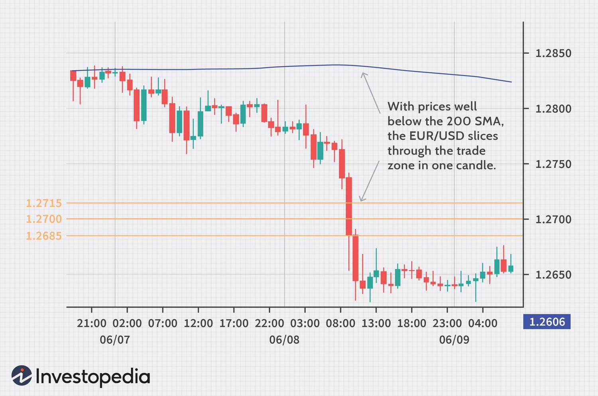

The foreign exchange (forex) market stands as a cornerstone of global finance, characterized by its dynamic nature and the substantial leverage available to participants. This market attracts traders aiming for profitability by engaging in currency pairs trading across volatile and diverse economic landscapes. A distinctive practice within this arena is stop hunting, where sizable market entities endeavor to initiate a sequence of stop-loss orders, thereby causing profound price fluctuations. This strategy capitalizes on the cascading effect of stop-loss activations, which can lead to significant and rapid market movements.

Algorithmic trading, which employs sophisticated algorithms to automate trading strategies, significantly bolsters the efficacy of stop hunting. The precision and speed of algorithms enable them to identify and exploit market conditions conducive to triggering stop-loss orders, thereby intensifying their impact. By swiftly analyzing market data, algorithms can execute trades with a proficiency that manual traders might find challenging to match.



This article examines stop hunting and its ramifications for the forex market, presenting an analysis of how algorithmic trading plays a pivotal role in executing such strategies. Through exploring these components, it aims to provide insight into the mechanics of stop hunting, its effects on market dynamics, and the potential strategies traders can leverage to mitigate associated risks.

## Table of Contents

## Understanding Stop Hunting

Stop hunting is a strategy employed by larger market participants to manipulate price movements in a manner that triggers the stop-loss orders of smaller traders. This technique hinges on the execution of trades that artificially drive prices toward commonly identified zones where retail traders have placed their stop-loss orders, such as those around key support and resistance levels. Stop-loss orders are predefined points set by traders at which a position is automatically sold to prevent further losses. When prices reach these levels, a cascade of automatic sell or buy orders is executed, which can result in significant price fluctuations.

Stop hunting capitalizes on the predictable nature of human trading behavior. Retail traders often set stop-loss orders at visible chart levels, such as recent highs and lows or prominent trend lines, which become targets for those practicing stop hunting. Once these stop-loss orders are activated, the amplified market activity can lead to temporary volatility spikes. Such volatility not only triggers more stop-loss orders in a domino effect but also creates potential profit opportunities for the initiators, as they can benefit from the ensuing rapid price movements.

The market volatility induced by stop-loss activations is of particular interest to those engaging in this strategy. For traders initiating stop hunting, such volatility can serve as a mechanism to take advantage of short-term price dislocations before the market stabilizes again. Experienced traders may strategically place their own orders, anticipating these induced movements, to capture profits from the turmoil. Understanding these dynamics is crucial for market participants, as it underscores the importance of astute stop-loss placement and highlights the need for vigilance against potential manipulative strategies in the forex market.

## Stop Hunting and Algorithmic Trading

Algorithmic trading has revolutionized the landscape of [forex](/wiki/forex-system) trading by automating the execution of complex strategies, including stop hunting. Algorithms, by their nature, can process vast amounts of data at speeds far surpassing human capabilities, enabling traders to identify clusters of stop-loss orders swiftly and execute trades designed to trigger these stop-loss levels.

When stop-loss orders are grouped around certain price points, algorithms can sense a pattern and calculate the most plausible path for price manipulation to activate these stops. The logic underlying this approach often involves the identification of support and resistance levels where stop-loss orders are typically concentrated. By driving the market prices toward these identified clusters, algorithms can force a quick succession of stop-loss triggers. This is because stop-loss orders, once triggered, turn into market orders, which can rapidly propel prices in the desired direction, hitting consecutive layers of stops and potentially amplifying the initial price movement.

The role of algorithms in this strategy extends beyond mere execution. They constantly analyze market conditions, [volatility](/wiki/volatility-trading-strategies) patterns, and trading volumes to adapt their approaches dynamically. The algorithms use historical and real-time market data to estimate optimal times for launching a stop hunting effort, thereby maximizing the potential impact. This refinement enhances their effectiveness and enables traders to exploit temporal market inefficiencies caused by concentrated stop-loss placements.

The capabilities of algorithmic systems to execute trades with unparalleled speed and precision magnify the effects of stop hunting on market dynamics. For instance, in milliseconds, an algorithm can simultaneously execute thousands of trades, something unfeasible for a human trader. Below is a simplified example illustrating how an algorithm might be structured to identify and exploit stop-loss clusters in the forex market using Python:

```python
import numpy as np

def identify_stop_clusters(price_data, stop_levels):
    clusters = {}
    for level in stop_levels:
        nearby_prices = [price for price in price_data if abs(price - level) <= threshold]
        clusters[level] = len(nearby_prices)
    return clusters

def execute_trades(price_data, clusters):
    for level, count in clusters.items():
        if count > trigger_threshold:
            print(f"Execute trades to trigger stops at level {level}")

# Example price data and stop-loss levels
price_data = np.array([1.3020, 1.3015, 1.3035, 1.3025, 1.3010])
stop_levels = np.array([1.3010, 1.3030])
threshold = 0.001
trigger_threshold = 2

clusters = identify_stop_clusters(price_data, stop_levels)
execute_trades(price_data, clusters)
```

This Python code snippet outlines a basic framework where an algorithm identifies clusters of stop-loss orders around predefined levels and then executes trades if certain conditions are met, such as the number of orders reaching a specific threshold.

The amplification of market impact through algorithmic stop hunting is not without controversy. While the strategy remains legal, its ethical implications, particularly concerning market manipulation and fairness, are subjects of ongoing debate. Nonetheless, the integration of [algorithmic trading](/wiki/algorithmic-trading) into stop hunting underscores a significant evolution in the methods available for influencing forex market behaviors.

## Strategies to Combat Stop Hunting

Retail traders face significant challenges due to stop hunting practices in the forex market. This section outlines strategies that traders can employ to counteract these risks effectively.

One of the primary strategies is diversifying stop-loss placements. Many traders tend to place stop-loss orders around obvious support and resistance levels, making them a target for stop hunting. By diversifying stop-loss points—such as placing them at unconventional levels or slightly beyond obvious ones—traders can decrease the likelihood of their orders being prematurely triggered. A more randomized approach can reduce predictability and thus vulnerability.

Another method to combat stop hunting is the use of wider stop orders. While this approach requires a larger risk tolerance, it can protect traders from getting caught in minor market manipulations. Wider stops allow for normal market fluctuations without triggering the stop-loss, accommodating broader price movements justified by strong market trends rather than short-term volatility spikes.

Incorporating mental stops or discretionary trading can further mitigate vulnerability. Mental stops involve setting an internal threshold for acceptable losses and executing an [exit](/wiki/exit-strategy) manually when this threshold is reached. This approach necessitates discipline and may help avoid automatic triggers caused by stop hunting activities. Discretionary trading enables traders to take into account broader market context and recent volatility, allowing for more informed decision-making.

Choosing the right broker is also crucial in safeguarding against stop hunting. Retail traders should prioritize brokers known for transparent execution policies and adherence to ethical standards. These brokers are less likely to engage in or facilitate practices that can lead to stop hunting. Investigating a broker's reputation, regulatory compliance, and executed trade reports can offer insights into their operational ethics.

Overall, these strategies empower traders to better navigate the forex market, providing resilience against the potentially adverse effects of stop hunting. Proper implementation helps in maintaining a balance between risk management and the pursuit of trading opportunities.

## Ethical and Legal Considerations

Stop hunting, a prevalent strategy in forex trading, operates in a space where ethical and legal boundaries must be carefully navigated. While the practice itself is not explicitly illegal, it is essential for market participants to understand the regulatory environment that governs trading behaviors. Market manipulation, deceitful practices, and exploitation of market orders violate trading regulations established by entities such as the U.S. Commodity Futures Trading Commission (CFTC) and the European Securities and Markets Authority (ESMA). These regulatory bodies aim to maintain fair trading environments by prohibiting manipulative activities that deceive or mislead market participants.

The ethical dimension of stop hunting is equally important. Ethical trading hinges on principles of transparency and integrity. Stop hunting can undermine these principles by creating artificial price movements that mislead traders regarding genuine market sentiment and conditions. By triggering stop-loss orders strategically placed around significant support or resistance levels, traders engaged in stop hunting can generate undue volatility, thus eroding trust in market mechanisms.

Transparency becomes a critical [factor](/wiki/factor-investing), particularly with the rise of algorithmic trading, where rapid execution and complex strategies can obscure the intentions behind trades. Ethical trading practices call for clear and consistent disclosure of trading strategies, particularly when leveraging technologies that amplify market impacts.

Traders and firms must adhere to established ethical guidelines that emphasize responsible trading. This may include implementing rigorous internal controls, institutional codes of conduct, and ensuring algorithms are designed to avoid manipulative purposes. Moreover, regulatory compliance programs should be enforced to educate traders about their legal obligations and the ethical implications of their trading strategies.

Ultimately, maintaining a balance between strategic trading and ethical standards is crucial. Financial markets prosper when participants have confidence in their fairness and integrity, which necessitates strict adherence to ethical norms, as well as compliance with established regulatory frameworks.

## Case Studies and Examples

Historical examples of stop hunting in the forex markets provide valuable insights into its execution and the consequences that result from such strategies. Analyzing these examples reveals how specific market conditions can amplify the effectiveness of stop hunting, thereby providing the context for understanding its impact on traders.

A notable case of stop hunting occurred in the aftermath of the 2010 Flash Crash in the United States equity markets. Although primarily an equities event, the swift movement resonated across various financial markets, including forex. The sudden and steep decline in market prices triggered numerous stop-loss orders placed by retail traders at key support levels. This cascading effect resulted in increased market volatility, which was compounded by algorithmic trading systems exploiting the triggered stops to execute high-frequency trades. This event highlighted how periods of heightened volatility and rapid price changes can magnify the effectiveness and impact of stop hunting, leading to substantial losses for traders caught off-guard.

In another instance, during the Swiss franc volatility in January 2015, market conditions were ripe for stop hunting. The Swiss National Bank's unexpected decision to abandon the euro cap led to an unprecedented appreciation of the Swiss franc. This induced a bout of extreme volatility, during which stop-loss orders clustered around established support levels were rapidly triggered. Large institutional traders and sophisticated algorithms took advantage of this situation by executing strategic trades that exaggerated the price movement initiated by the triggered stops. This incident exemplifies how unexpected news events, combined with existing stop-loss concentrations, can create perfect scenarios for effective stop hunting, causing massive repercussions for retail traders and brokers alike.

In both cases, certain market conditions—such as high volatility, unexpected announcements, and tight clustering of stop-loss orders—played crucial roles in amplifying the execution of stop hunting strategies. Traders can learn from these examples by understanding the importance of diversifying stop-loss placements and preparing for events that could lead to similar market behaviors. Addressing these factors can significantly reduce the risks associated with stop hunting and enhance traders' resilience in volatile markets.

## Conclusion

Stop hunting continues to be a significant tactic in forex trading, with its effectiveness greatly enhanced by algorithmic trading solutions. A clear grasp of stop hunting's mechanics and implications is invaluable for traders looking to navigate the complexities of the forex market. 

Algorithmic trading enables large market participants to detect clusters of stop-loss orders quickly, executing stop hunting strategies with precision and speed. This can result in considerable market volatility, impacting both retail and institutional traders. Understanding these dynamics allows traders to anticipate potential market movements and prepare accordingly.

To mitigate the risks associated with stop hunting, traders can implement a series of strategic countermeasures. Diversifying stop-loss placements and employing wider stop orders can help minimize the likelihood of premature stop losses. Moreover, integrating mental stops and practicing discretionary trading offer additional flexibility against algorithm-driven market manipulations.

Selecting brokers with transparent execution policies is also crucial. Ethical brokers adhere to robust market standards, reducing the incidence of manipulative practices like deceitful stop hunting.

Ultimately, while stop hunting remains a formidable strategy in forex, informed traders equipped with effective countermeasures can safeguard their trading activities from its adverse effects.

## References & Further Reading

[1]: Armstrong, M., Dempster, M. A. H., & Jones, G. J. (2000). ["Algorithmic Trading and Information."](https://scholar.google.com/citations?user=JbitHFcAAAAJ&hl=en) The Journal of Finance, 55(4), 1239-1260.

[2]: Aldridge, I. (2013). ["High-Frequency Trading: A Practical Guide to Algorithmic Strategies and Trading Systems."](https://www.amazon.com/High-Frequency-Trading-Practical-Algorithmic-Strategies/dp/1118343506) Wiley Finance.

[3]: Harris, L. (2003). ["Trading and Exchanges: Market Microstructure for Practitioners."](https://www.amazon.com/Trading-Exchanges-Market-Microstructure-Practitioners/dp/0195144708) Oxford University Press.

[4]: Easley, D., López de Prado, M. M., & O'Hara, M. (2012). ["The Volume Clock: Insights into the High Frequency Paradigm."](https://papers.ssrn.com/sol3/papers.cfm?abstract_id=2034858) The Review of Financial Studies, 25(8), 2015-2062.

[5]: Nakashima, K. (2007). ["Foreign Exchange Intervention: Theory and Evidence."](https://www.sciencedirect.com/science/article/pii/S0922142512000230) Institute for Monetary and Economic Studies, Bank of Japan.