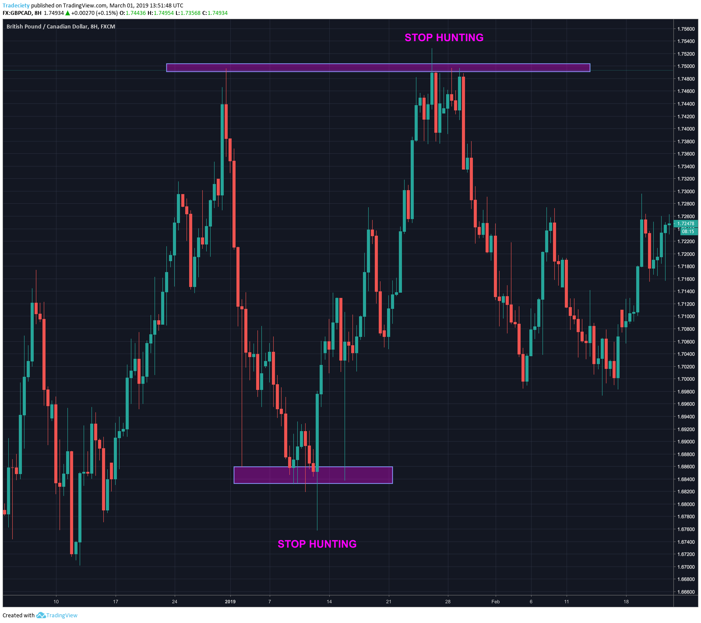

## Table of Contents

## What is stop hunting in trading?

Stop hunting in trading is when big traders or institutions move the price of a stock or currency to hit the stop-loss orders of smaller traders. A stop-loss order is set by a trader to automatically sell a stock if its price falls to a certain level, to limit losses. When many traders set their stop-loss orders at similar price levels, big traders can push the price to those levels on purpose. This causes the stop-loss orders to be triggered, and the price might then quickly move back in the opposite direction.

This strategy can be very frustrating for smaller traders. They might think they are protecting themselves with stop-loss orders, but they end up getting stopped out of their trades, only to see the price move back in their favor soon after. It's hard to know for sure when stop hunting is happening, but traders often suspect it when they see sudden price movements that seem to target common stop-loss levels. Being aware of stop hunting can help traders set their stop-loss orders more wisely and avoid getting caught in these traps.

## Why do traders need to be aware of stop hunting?

Traders need to be aware of stop hunting because it can affect their trades in a bad way. When big traders push the price to hit stop-loss orders, it can make smaller traders lose money. If a trader's stop-loss order gets triggered because of stop hunting, they might sell their stock at a low price. Then, the price might go back up quickly, and the trader misses out on the gains they could have made.

Knowing about stop hunting helps traders set their stop-loss orders better. Instead of setting stop-losses at common levels where they might get hunted, traders can choose different levels. This way, they might avoid getting stopped out of their trades just because of what big traders are doing. Being aware of stop hunting can help traders make smarter choices and protect their money better.

## How can stop hunting affect a beginner trader's strategy?

Stop hunting can really mess up a beginner trader's strategy. When big traders move the price to hit stop-loss orders, it can make a beginner's trades go wrong. A beginner might set their stop-loss at a common price level without knowing about stop hunting. Then, when the big traders push the price to that level, the beginner's stop-loss gets triggered. They end up selling their stock at a low price, and then the price might go back up quickly. This can make the beginner lose money and feel frustrated.

To deal with stop hunting, a beginner needs to learn about it and change their strategy. Instead of setting stop-losses at common levels, they can choose different levels that are less likely to be targeted. This way, they might avoid getting stopped out of their trades just because of what big traders are doing. By understanding stop hunting, a beginner can make smarter choices and protect their money better. It's all about being aware and adjusting their strategy to avoid the traps set by big traders.

## What are common signs that stop hunting might be occurring?

Stop hunting might be happening when you see the price of a stock suddenly move a lot to hit a certain level where many people have set their stop-loss orders. This often happens just before important news comes out or at times when the market is not very busy. If the price goes down fast to a round number like $50 or $100, and then quickly goes back up, it could be a sign of stop hunting.

Another sign is when the price moves in a way that seems strange or too perfect. For example, if the price drops just enough to hit a lot of stop-loss orders and then bounces back right away, it might be because big traders are trying to trick smaller traders. Being aware of these signs can help you be more careful with where you set your stop-loss orders and avoid getting caught in stop hunting traps.

## Can stop hunting be considered a form of market manipulation?

Stop hunting can be seen as a form of market manipulation. It happens when big traders move the price of a stock to hit the stop-loss orders of smaller traders on purpose. This can make smaller traders sell their stocks at a bad price, and then the price might go back up quickly. It's like the big traders are tricking the smaller ones to get out of their trades at the wrong time.

However, it's hard to say for sure if stop hunting is always market manipulation. Sometimes, the price might move to hit stop-loss orders just because of normal market changes. But when big traders do it on purpose to make money from smaller traders, it can be seen as unfair and manipulative. Knowing about stop hunting can help traders be more careful and protect themselves better.

## What are the typical times of day when stop hunting is most likely to occur?

Stop hunting often happens at times when the market is not very busy. This is usually early in the morning or late in the afternoon when fewer people are trading. Big traders might find it easier to move the price to hit stop-loss orders when there are not many other traders around to stop them.

Another time when stop hunting might happen is just before important news comes out. Traders might set their stop-loss orders at certain levels, and big traders could move the price to those levels right before the news, hoping to trigger the stop-losses. Knowing these times can help traders be more careful about when they set their stop-loss orders.

## How can traders protect themselves from stop hunting?

Traders can protect themselves from stop hunting by being smart about where they set their stop-loss orders. Instead of setting them at common price levels like round numbers, they can choose less obvious levels. This makes it harder for big traders to target their stop-losses. Also, traders can use a wider stop-loss, which means the price has to move more before their order gets triggered. This can help avoid getting stopped out by small price movements that might be caused by stop hunting.

Another way to protect against stop hunting is to pay attention to when it might happen. It often occurs early in the morning or late in the afternoon when the market is quiet, or just before important news comes out. By being aware of these times, traders can be more careful and adjust their stop-loss orders accordingly. Knowing the signs of stop hunting, like sudden price drops to hit common levels followed by quick rebounds, can also help traders stay safe and keep their trades going the way they want.

## What role do large institutional traders play in stop hunting?

Large institutional traders can play a big role in stop hunting. They have a lot of money and power to move the price of a stock. When they see that many smaller traders have set their stop-loss orders at the same price level, they might push the price down to that level on purpose. This makes the stop-loss orders get triggered, and the smaller traders have to sell their stocks at a low price. The big traders can then buy those stocks at a cheaper price and make money when the price goes back up.

This kind of trading can be frustrating for smaller traders. They think they are protecting themselves with stop-loss orders, but they end up losing money because of what the big traders are doing. It's hard to know for sure if stop hunting is happening, but it's something that traders should be aware of. By understanding how large institutional traders might use stop hunting, smaller traders can set their stop-loss orders more wisely and avoid getting caught in these traps.

## How can advanced technical analysis help in identifying potential stop hunting?

Advanced technical analysis can help traders spot when stop hunting might be happening. By looking at charts and using tools like volume indicators, traders can see if the price is moving in a strange way. For example, if the price suddenly drops to a round number where many stop-loss orders might be set, and then quickly goes back up, it could be a sign of stop hunting. Also, if the volume of trades goes up a lot just before the price hits a common stop-loss level, it might mean big traders are trying to trigger those orders.

Using technical analysis, traders can also look for patterns that show stop hunting. If the price often moves to hit certain levels and then bounces back, it might be because big traders are targeting those levels on purpose. By understanding these patterns and watching the market closely, traders can be more careful about where they set their stop-loss orders. This way, they can avoid getting caught in stop hunting traps and protect their money better.

## Are there specific markets where stop hunting is more prevalent?

Stop hunting can happen in many markets, but it's more common in markets where big traders have a lot of power. The foreign exchange (forex) market is one place where stop hunting is often seen. This is because the forex market is huge and not very regulated, so big traders can move prices more easily. Also, many smaller traders use stop-loss orders in forex, which makes it a good place for big traders to try stop hunting.

Another market where stop hunting can be more common is the stock market, especially with stocks that are not traded very often. When a stock doesn't have a lot of trading activity, it's easier for big traders to move the price to hit stop-loss orders. This can happen more with smaller companies or stocks that are not well-known. Knowing which markets are more likely to see stop hunting can help traders be more careful and set their stop-loss orders in a smarter way.

## What are the ethical considerations surrounding stop hunting?

Stop hunting can be seen as unfair because big traders are trying to trick smaller traders into selling their stocks at bad prices. This can make smaller traders lose money and feel frustrated. It's like the big traders are using their power to take advantage of others, which doesn't seem right. Many people think that stop hunting is a form of market manipulation, which is against the rules in many places. But it's hard to prove when stop hunting is happening on purpose, so it's a tricky problem.

Even though stop hunting might be seen as unethical, it's still something that happens in the markets. Traders need to be aware of it and protect themselves by setting their stop-loss orders carefully. By understanding how stop hunting works, traders can make better choices and avoid getting caught in these traps. It's all about being smart and knowing what to watch out for in the market.

## How can algorithmic trading strategies be adjusted to mitigate the risks of stop hunting?

Algorithmic trading strategies can be adjusted to avoid the risks of stop hunting by using smarter ways to set stop-loss orders. Instead of setting stop-losses at common levels like round numbers, the algorithms can use random or less obvious levels. This makes it harder for big traders to target the stop-losses on purpose. Also, the algorithms can use a wider stop-loss, which means the price has to move more before the order gets triggered. This can help avoid getting stopped out by small price movements that might be caused by stop hunting.

Another way to adjust algorithmic trading strategies is to pay attention to when stop hunting might happen. It often occurs early in the morning or late in the afternoon when the market is quiet, or just before important news comes out. By knowing these times, the algorithms can be set to be more careful and adjust stop-loss orders accordingly. Also, the algorithms can look for signs of stop hunting, like sudden price drops to hit common levels followed by quick rebounds. By being aware of these signs and adjusting the strategies, algorithmic trading can better protect against the tricks of big traders.

## References & Further Reading

[1]: Bergstra, J., Bardenet, R., Bengio, Y., & Kégl, B. (2011). ["Algorithms for Hyper-Parameter Optimization."](https://papers.nips.cc/paper/4443-algorithms-for-hyper-parameter-optimization) Advances in Neural Information Processing Systems 24.

[2]: ["Advances in Financial Machine Learning"](https://www.amazon.com/Advances-Financial-Machine-Learning-Marcos/dp/1119482089) by Marcos Lopez de Prado

[3]: ["Evidence-Based Technical Analysis: Applying the Scientific Method and Statistical Inference to Trading Signals"](https://www.amazon.com/Evidence-Based-Technical-Analysis-Scientific-Statistical/dp/0470008741) by David Aronson

[4]: ["Machine Learning for Algorithmic Trading"](https://github.com/stefan-jansen/machine-learning-for-trading) by Stefan Jansen

[5]: ["Quantitative Trading: How to Build Your Own Algorithmic Trading Business"](https://www.amazon.com/Quantitative-Trading-Build-Algorithmic-Business/dp/1119800064) by Ernest P. Chan