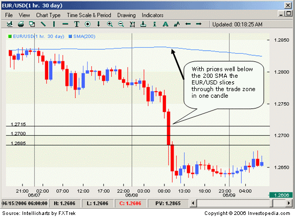

Financial markets are structured platforms where assets such as stocks, bonds, currencies, and commodities are traded. These markets play a crucial role in allocating resources and facilitating economic growth by providing a mechanism for price determination and liquidity. The significance of trading strategies lies in their ability to guide the decision-making process for buying and selling assets within these markets, ultimately affecting profitability. 

Stop hunting is one such trading strategy, often perceived with mixed opinions. It involves triggering stop-loss orders set by other traders to create advantageous trading positions. The primary goal is to exploit liquidity by causing abrupt price movements that trigger automated sell-offs or buy-backs, thus influencing market dynamics.

In recent years, the increasing adoption of algorithms in trading, known as algorithmic trading or algo trading, has revolutionized financial markets. Algorithms enable rapid decision-making and execution of trades, offering advantages such as increased efficiency, speed, and the elimination of emotional bias in trading.

This article focuses on integrating stop hunting strategies within algo trading frameworks. By combining the predatory nature of stop hunting with the precision of algorithms, traders aim to optimize their strategies for potentially higher returns. However, this integration presents both opportunities and challenges that require a strategic and ethical approach.

The following sections will explore financial markets in detail and discuss stop hunting and algorithmic trading. They will further examine the practical implications of combining these strategies and address the associated challenges and ethical considerations.

## Table of Contents

## Understanding Financial Markets

Financial markets are platforms where individuals and institutions engage in the exchange of financial assets, such as stocks, currencies, commodities, and derivatives. These markets play a crucial role in the allocation of resources, price determination, and risk management within the global economy.

#### Types of Financial Markets

1. **Stock Markets**: These platforms facilitate the buying and selling of shares in publicly listed companies. The primary function of stock markets is to provide companies with access to capital in exchange for providing investors with a slice of ownership in the business. Notable stock exchanges include the New York Stock Exchange (NYSE) and the London Stock Exchange (LSE).

2. **Forex Markets**: Also known as the foreign exchange markets, forex markets are decentralized global markets for trading currencies. They are the largest financial markets in the world, trading an average of over $6 trillion per day. Forex markets enable currency conversion for international trade and investment.

3. **Commodities Markets**: Here, basic goods such as metals, oil, and agricultural products are traded. These markets are essential for stabilizing the prices of these resources and enabling producers and consumers to hedge against price fluctuations.

4. **Derivatives Markets**: These markets involve financial securities whose value is derived from underlying assets like stocks, bonds, commodities, or currencies. Derivatives, such as futures and options, allow traders to hedge risk, leverage positions, and speculate on price movements.

5. **Bond Markets**: Also known as fixed-income markets, these venues allow for the issuance and trading of debt securities. Governments and corporations alike issue bonds to raise capital for various projects and operations.

#### Primary Functions and Importance

Financial markets serve several key functions:

- **Capital Allocation**: Financial markets direct resources towards their most productive uses by connecting savers with investors needing funds. This allocation supports economic growth and development.

- **Price Discovery**: Through trading, financial markets establish the prices of securities, providing critical information for economic decision-making.

- **Liquidity Provision**: They offer liquidity, enabling investors to buy and sell assets with ease.

- **Risk Management**: By offering various financial instruments, markets allow participants to manage and hedge against potential financial losses.

These functions highlight how financial markets underpin the broader global economy, influencing investment, consumption, and financial policies.

#### Participants in Financial Markets

Several key participants interact within financial markets:

- **Traders**: Individuals who actively buy and sell securities, often with a short-term horizon, to capitalize on market movements.

- **Investors**: These participants typically have a long-term approach, buying and holding assets to achieve capital appreciation and income generation.

- **Institutions**: This group includes banks, insurance companies, pension funds, and hedge funds. They play a significant role due to their large volume trades and strategic influence on market dynamics.

- **Market Makers**: Entities that provide liquidity to markets by offering to buy and sell securities continuously at publicly quoted prices.

#### Forces Driving Market Movements

Market movements are driven by various forces, including:

- **Supply and Demand**: Basic economic principles dictate that prices adjust based on the availability and desire for assets.

- **Economic Indicators**: Data such as GDP growth, unemployment rates, and inflation can influence market sentiment and pricing.

- **Monetary Policy**: Central bank actions, including interest rate changes and quantitative easing, directly affect market conditions.

- **Geopolitical Events**: Political stability, conflicts, and policy changes can lead to market volatility and shifts in investor confidence.

- **Investor Behavior**: Psychological factors, herd behavior, and market sentiment play critical roles in shaping market trends.

Understanding these forces is essential for developing effective trading strategies, as they provide insights into potential price movements and market conditions. By analyzing these elements, traders, investors, and institutions can make informed decisions to maximize returns and manage risks.

## What is Stop Hunting?

Stop hunting is a trading strategy often employed by institutional investors or market manipulators to trigger stop-loss orders set by smaller or less informed traders, leading to advantageous market conditions for those performing the stop hunting. The primary purpose of stop hunting is to cause significant price movements that result in a cascade of triggered stop-loss orders, thereby creating opportunities for institutional traders to enter or [exit](/wiki/exit-strategy) positions at more favorable prices. This strategy exploits the predictable behavioral patterns of traders who place stop-loss orders near psychological price levels or technical indicators.

Stop hunting can substantially affect individual traders by forcing them out of their positions at unfavorable prices. For instance, when a stop-loss is triggered, the trader's position is automatically closed, often at a loss. This results in a forced liquidation, which can leave traders frustrated and can generate market [volatility](/wiki/volatility-trading-strategies).

The implications of stop hunting techniques are significant, both at the individual level and for market movements. These techniques can exacerbate volatility, influence market sentiment, and cause short-term deviations from an asset's intrinsic value. The ripple effect from a stop-hunting maneuver can alter the perception of market conditions, prompting reactions not only from those directly affected but also from other traders who adjust their strategies in response to observed volatility.

Common techniques used in stop hunting include identifying and exploiting closely clustered stop-loss orders. These orders are often set at round numbers, previous highs and lows, or recognized support and resistance levels. A coordinated effort is then made to drive the price towards these levels, triggering a large number of stop-loss executions which can amplify the price movement in the desired direction. This process can be carried out manually by traders with significant capital or automatically through algorithms designed to identify and capitalize on these setups.

Examples of stop hunting can be found across various financial markets. In the [forex](/wiki/forex-system) market, for example, stop hunting may occur when a currency pair is pushed to a historical support level, triggering stop-loss orders and causing an abrupt depreciation or appreciation. Similarly, in the stock market, large-cap stocks can sometimes experience sudden spikes or drops in price as a result of stop hunting, especially in thinly traded sessions or during times of low [liquidity](/wiki/liquidity-risk-premium).

Overall, stop hunting is a controversial yet prevalent strategy with the potential for both profit and disruption, highlighting the importance of market awareness and strategic placement of stop-loss orders for individual traders. Understanding the mechanics and potential outcomes of stop hunting can enable traders to better safeguard their positions while navigating the complexities of financial markets.

 to Algo Trading

Algorithmic trading, commonly referred to as algo trading, is an approach to trading financial instruments using automated, pre-programmed trading instructions. These instructions are based on variables such as time, price, and [volume](/wiki/volume-trading-strategy), executed at speeds and frequencies unachievable by human traders. The importance of [algorithmic trading](/wiki/algorithmic-trading) has surged in modern financial markets, transforming how trades are executed and leading to increased market efficiency.

Algo trading offers multiple advantages, primarily its efficiency and speed. Unlike manual trading, algorithmic systems can analyze vast volumes of data and execute trades at very high speeds, often within milliseconds. This capability allows traders to capitalize on fleeting market opportunities that may not be noticeable or actionable through manual processes. Additionally, algorithmic trading is devoid of human emotions, such as fear and greed, which can adversely affect trading decisions. By relying on predetermined algorithms, traders can maintain consistency and enhance accuracy, mitigating the risk of impulsive decisions.

A basic algorithmic trading system comprises several components:

1. **Data Analysis**: Algorithms require large datasets to identify patterns and potential trading opportunities. The data might include historical prices, volume information, and market predictions derived from statistical analysis.

2. **Trading Strategy Formulation**: This involves coding specific rules that guide the trading decisions. These rules could be based on technical indicators such as moving averages, or more complex strategies like arbitrage.

3. **Programming and Software**: Writing the algorithm is typically done using programming languages like Python or C++, which offer robust libraries and frameworks for implementing complex trading strategies. High-frequency trading, a subset of algo trading, often relies on highly optimized software to minimize execution time.

4. **Execution System**: This component connects to the financial markets and executes trades automatically based on the pre-defined algorithm. Speed and reliability are crucial, as delays can result in missed opportunities or poor trade executions.

In the context of regulatory and technological considerations, algo trading is subject to scrutiny by financial regulators to ensure market integrity. High-speed trading can exacerbate market volatility, as evidenced in events like the Flash Crash of 2010. As a result, regulatory bodies such as the U.S. Securities and Exchange Commission (SEC) and the European Securities and Markets Authority (ESMA) have implemented rules to monitor and control the impact of algorithmic trading.

From a technological perspective, the infrastructure supporting algorithmic trading continuously evolves. This evolution includes advanced data analytics platforms, faster and more reliable communication networks, and improvements in computer hardware. As markets become more technologically reliant, staying abreast of these changes is imperative for traders leveraging algorithmic strategies.

## Integrating Stop Hunting with Algorithmic Strategies

Traders can leverage stop hunting techniques within algorithmic strategies to enhance market positioning and potentially increase profitability. Stop hunting involves targeting stop-loss orders placed by other market participants, driving the price to levels that trigger these orders, which can result in sharp market moves. By integrating these practices into algorithms, traders can automate the detection and exploitation of these stop-loss levels.

The potential benefits of integrating stop hunting into algorithmic trading include capturing market liquidity and inducing volatility, which can create profitable trading opportunities. For instance, algorithms can identify clusters of stop-loss orders by analyzing historical price data, volume, and market depth. Once these levels are identified, the algorithm can execute trades designed to move the price to these predefined levels, thus benefiting from the resulting market movements.

However, there are notable risks associated with incorporating stop hunting into algorithms. The strategies can lead to increased market volatility, which might result in larger, unanticipated market swings. Additionally, while stop hunting can be profitable in the short term, it may also contribute to negative market perceptions or lead to regulatory scrutiny due to its manipulative nature.

Key considerations when designing algorithms that use stop hunting tactics include data accuracy, market conditions, and regulatory compliance. It is critical to ensure that the algorithms use accurate real-time data to identify potential stop-loss clusters reliably. Moreover, algorithms must be adaptable to changing market conditions to maintain their effectiveness. Developers should also consider current regulations regarding market manipulation to ensure compliance and ethical operation.

Successful integration of stop hunting techniques in algorithmic trading is illustrated by certain hedge funds and trading firms that have reportedly employed these methods effectively. For example, some high-frequency trading firms utilize sophisticated algorithms to analyze [order book](/wiki/order-book-trading-strategies) data in real time, identifying potential stop-loss levels across various asset classes. These algorithms execute rapid trades designed to trigger stop-loss orders, capturing profit in the ensuing price swings. Such strategies highlight the effectiveness of combining traditional trading techniques like stop hunting with cutting-edge technology to gain a competitive edge in financial markets.

In conclusion, while integrating stop hunting with algorithmic strategies offers distinct advantages, it is crucial to balance these with the associated risks and ethical considerations. Traders must carefully design algorithms to be adaptable, compliant, and sensitive to the broader market dynamics to achieve sustainable success.

## Challenges and Ethical Considerations

The implementation of stop hunting strategies in algorithmic trading presents several challenges for traders. One significant challenge is the complexity involved in accurately predicting stop-loss levels set by other traders. These predictions often depend on understanding market psychology and price action patterns, which can be challenging to encapsulate in an algorithm. Additionally, stop hunting strategies require precise timing to execute, as they aim to trigger stop-loss orders and capitalize on the subsequent price movements. This necessitates advanced data analysis capabilities and infrastructure to process large volumes of data efficiently and in real-time.

Ethically, stop hunting strategies can raise questions about market integrity. By intentionally triggering stop-loss orders, traders can exacerbate market volatility and contribute to price manipulation. This can undermine the confidence of retail traders and investors in the fairness of financial markets. Algorithmic trading, by its nature, can amplify these effects due to its speed and efficiency, potentially leading to rapid and significant market movements.

Regulators recognize these concerns and have taken steps to oversee algorithmic trading activities, though the regulatory landscape varies by jurisdiction. In the United States, the Securities and Exchange Commission (SEC) and the Commodity Futures Trading Commission (CFTC) have implemented rules to enhance transparency and stability in financial markets. Regulation Automated Trading (Reg AT), for example, seeks to address issues specific to algorithmic trading. Similarly, in the European Union, the Markets in Financial Instruments Directive II (MiFID II) requires more stringent risk controls and provides regulators with the authority to monitor and restrict high-frequency trading activities if needed.

Balancing strategic advantage with ethical trading practices is crucial for maintaining market integrity. Traders should strive for a strategy that adheres to ethical standards while pursuing profitability. This balance is vital to ensure that markets remain competitive and transparent, attracting a diverse range of participants. Encouraging a culture of ethical trading requires a collective effort amongst traders, regulators, and financial institutions to prioritize long-term sustainability over short-term gains.

In conclusion, while integrating stop hunting strategies into algorithmic trading can offer competitive advantages, it is imperative to do so ethically. Continued dialogue between market participants and regulators is essential to foster an environment where innovative trading practices can flourish without undermining market fairness and integrity.

## Conclusion

The exploration of financial markets, stop hunting, and algorithmic trading highlights the intricate dynamics and strategies that shape modern trading environments. Financial markets are critical elements of the global economy, facilitating capital flow, price discovery, and risk management for participants like traders, investors, and institutions. These markets are driven by a myriad of forces, including investor sentiment, macroeconomic factors, and geopolitical events, all of which influence trading strategies.

Stop hunting emerges as a controversial yet strategic trading practice where larger market players deliberately trigger stop-loss orders to manipulate security prices to their advantage. While this technique can affect market movements, its integration within algorithmic trading strategies offers an avenue for traders to exploit these artificial price adjustments to enhance trading performance. Algorithmic trading, characterized by its efficiency, speed, and emotionless nature, presents a transformative approach to modern trading by leveraging sophisticated algorithms and data analysis.

The combination of stop hunting with algorithmic trading strategies presents both opportunities and challenges. The potential benefits of this integration lie in the ability to optimize trading strategies while capitalizing on market inefficiencies. However, it also necessitates careful consideration of ethical practices and the potential risk of market manipulation. Successful implementation of such strategies requires a balance between gaining strategic advantage and maintaining market integrity.

Looking forward, the landscape of algorithmic trading is poised for further evolution, driven by advancements in [artificial intelligence](/wiki/ai-artificial-intelligence), [machine learning](/wiki/machine-learning), and data analytics. As these technologies continue to develop, they offer unprecedented opportunities to refine trading algorithms, enhancing their precision and adaptability to ever-changing market conditions. Nonetheless, traders must remain vigilant to ethical considerations and regulatory scrutiny to ensure that their practices contribute to a fair and stable market environment.

Ultimately, while integrating stop hunting with algorithmic trading provides a compelling strategic avenue, traders are encouraged to [factor](/wiki/factor-investing) in both the strategic and ethical dimensions of their trading practices. Embracing technological advancements should go hand in hand with a commitment to ethical standards, fostering a transparent and equitable trading ecosystem that benefits all market participants.

## References & Further Reading

[1]: Bergstra, J., Bardenet, R., Bengio, Y., & Kégl, B. (2011). ["Algorithms for Hyper-Parameter Optimization."](https://papers.nips.cc/paper/4443-algorithms-for-hyper-parameter-optimization) Advances in Neural Information Processing Systems 24.

[2]: ["Advances in Financial Machine Learning"](https://www.amazon.com/Advances-Financial-Machine-Learning-Marcos/dp/1119482089) by Marcos Lopez de Prado

[3]: ["Evidence-Based Technical Analysis: Applying the Scientific Method and Statistical Inference to Trading Signals"](https://www.amazon.com/Evidence-Based-Technical-Analysis-Scientific-Statistical/dp/0470008741) by David Aronson

[4]: ["Machine Learning for Algorithmic Trading"](https://github.com/stefan-jansen/machine-learning-for-trading) by Stefan Jansen

[5]: ["Quantitative Trading: How to Build Your Own Algorithmic Trading Business"](https://www.amazon.com/Quantitative-Trading-Build-Algorithmic-Business/dp/1119800064) by Ernest P. Chan