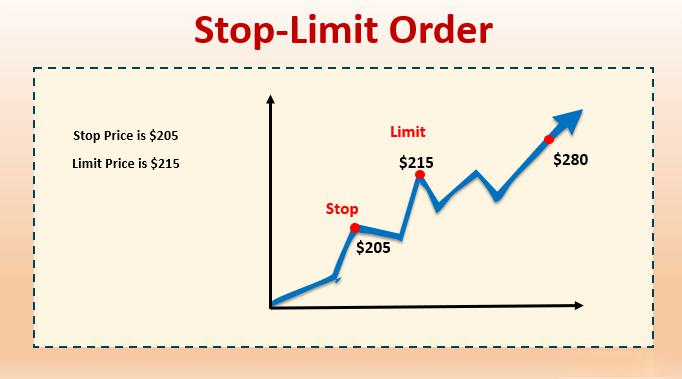

Forex trading is recognized as a dynamic and complex field, engaging a vast number of traders globally in the buying and selling of currencies. At the core of this financial market are various trading strategies and order types, pivotal for executing trades effectively. Among these, stop and limit orders play a critical role in ensuring the efficiency and success of trading operations. These orders serve as fundamental tools for traders, providing mechanisms to manage risks associated with market fluctuations and optimize their trading strategies for better outcomes.

Stop and limit orders are integral in defining the parameters within which traders operate. A thorough understanding of these order types is crucial as they allow traders to control potential losses, secure profits, and navigate the unpredictable nature of the forex market with greater confidence. Stop orders, also known as stop-loss orders, facilitate buying or selling a currency pair once it reaches a predetermined price, thus acting as a safeguard against adverse market movements. Conversely, limit orders enable traders to set the maximum or minimum price at which they are willing to buy or sell, offering greater control over trade execution compared to market orders.



Moreover, the evolution of technology has introduced algorithmic trading into forex trading, significantly enhancing the execution of stop and limit orders. Algorithmic trading involves using automated processes to execute trades based on predetermined criteria, allowing for precise and swift decision-making. It eliminates the emotional component of trading, often a cause of irrational decisions, and enables the processing of large volumes of data in real time. By integrating stop and limit orders into algorithmic strategies, traders can optimize their trade outcomes, ensuring more reliable and profitable trading operations. This integration exemplifies the sophisticated and tech-driven nature of modern forex trading.

In this article, we will explore in detail the roles of stop orders and limit orders, the impact of algorithmic trading, and how these elements integrate to improve trading strategies in the forex market. Understanding these concepts and their practical applications is imperative for anyone engaged in or considering entering the world of forex trading.

## Table of Contents

## Understanding Stop Orders

Stop orders, commonly referred to as stop-loss orders, play a critical role in forex trading by providing a mechanism to automatically buy or sell a currency pair when a specified price is reached. This feature is instrumental in managing risk, as it can help traders limit potential losses or secure profits. Essentially, a stop order is a conditional instruction executed once the market price of the currency pair hits the predetermined stop price.

### Types of Stop Orders

#### 1. Buy-Stop Orders

A buy-stop order is placed above the current market price, and it becomes active when the specified stop price is reached. This type of stop order is typically used in situations where a trader believes that the currency price will continue to rise after reaching a certain level. By setting a buy-stop order, traders aim to capture upward [momentum](/wiki/momentum) and avoid entering the trade until the bullish trend is confirmed.

*Example:* Suppose the EUR/USD pair is currently trading at 1.1000, and a trader believes that the price will rise if it breaks the resistance level of 1.1050. The trader can place a buy-stop order at 1.1050, which will be executed once the price reaches or surpasses this level.

#### 2. Sell-Stop Orders

Conversely, a sell-stop order is set below the current market price and is triggered when the market falls to the specified stop price. This type of order is used to protect against potential losses in a downward-trending market or to initiate a short position as confirmation of a bearish trend.

*Example:* If a trader is holding a long position in the GBP/USD pair, currently trading at 1.3200, and wishes to limit potential losses to 100 pips, they may place a sell-stop order at 1.3100. If the market price decreases to this level, the sell-stop order will be executed, preventing further losses.

### Practical Application

Implementing stop orders requires careful planning and an understanding of market conditions. Traders often utilize technical analysis to determine optimal stop levels. It is crucial for traders to balance the stop price distance from the entry price to avoid premature execution due to market noise while also ensuring adequate protection.

Here's a simple Python snippet illustrating how a sell-stop order could be programmed with assumed inputs:

```python
def execute_sell_stop(current_price, stop_price, order_amount):
    if current_price <= stop_price:
        print(f"Sell Order Executed for {order_amount} units at price {current_price}")
    else:
        print("Sell Stop Order not triggered.")

current_market_price = 1.3100
sell_stop_price = 1.3100
amount_to_sell = 1000

execute_sell_stop(current_market_price, sell_stop_price, amount_to_sell)
```

In this example, when the current market price reaches the specified sell stop price, a sell order is triggered, thereby automating trade execution and risk management. Properly placed stop orders, coupled with strategic analysis, are powerful tools in a trader's arsenal to mitigate potential losses and capitalize on market movements.

## Understanding Limit Orders

Limit orders are instrumental in [forex](/wiki/forex-system) trading as they allow traders to specify the maximum or minimum price at which they are willing to buy or sell a currency pair. This predefined pricing offers traders significant control over trade executions in contrast to market orders, which execute at the prevailing market price.

A buy-limit order is placed below the current market price and is used when a trader anticipates a price drop before a subsequent rise. For example, if the current EUR/USD rate is 1.1000, a trader might place a buy-limit order at 1.0950. This order ensures that the trader purchases the currency only if its price drops to or below 1.0950, thereby potentially benefiting from the lower entry point.

Conversely, a sell-limit order is placed above the current market price. A trader who expects the currency to rise before falling may use this type of order to lock in potential profits. For instance, if the USD/JPY rate is 110.00, a sell-limit order placed at 110.50 will execute only if the price climbs to 110.50 or higher, allowing the trader to capitalize on the upswing.

The main advantages of limit orders lie in their precision and potential for better pricing. By setting a specific price, traders avoid the impulsiveness and unpredictability associated with market orders. This specificity can be especially advantageous in volatile markets where price fluctuations can be rapid and unexpected.

Furthermore, limit orders can act as part of a strategic trading plan, automating entry and [exit](/wiki/exit-strategy) points to mitigate risk and maximize efficiency. However, it's essential to note that while limit orders provide control and precision, they [carry](/wiki/carry-trading) the risk of non-execution. If the market does not reach the specified limit price, the order remains unfilled, potentially missing out on trading opportunities or necessitating a reassessment of strategy.

In summary, buy-limit and sell-limit orders are vital tools for traders seeking controlled and strategic entries and exits in the forex market. Their ability to specify trade conditions with precision helps enhance trading discipline and execution.

## The Role of Algorithms in Forex Trading

Algorithmic trading, commonly referred to as algo-trading, plays a pivotal role in modern forex trading by enhancing the efficiency of executing stop and limit orders. These algorithms enable traders to automate trading processes, thereby improving both the accuracy and speed with which trades are conducted.

Traders leverage algorithms to implement trading strategies with precision, minimizing errors that typically arise from manual interventions. A significant advantage of [algorithmic trading](/wiki/algorithmic-trading) is the mitigation of emotional influence on trading decisions. Emotional trading can lead to impulsive decisions that deviate from a trader’s strategy, often resulting in suboptimal outcomes. By relying on algorithms, traders can maintain discipline and adhere strictly to predetermined trading strategies.

Moreover, algorithmic trading is adept at processing vast amounts of data at speeds unattainable by human traders. Forex markets are highly volatile and require quick decision-making to capitalize on opportunities. Algorithms can analyze market trends, historical data, and other variables rapidly and execute orders in fractions of a second, far quicker than any human is capable of. This speed is crucial for trading strategies that rely on timing, such as [arbitrage](/wiki/arbitrage).

Furthermore, algorithms can accommodate complex trading strategies, marrying various market indicators and trading conditions to execute orders at precisely defined parameters. For example, a trader might use an algorithm to set a combination of stop-loss and limit orders based on moving averages, relative strength indexes, and other technical indicators.

The deployment of Python is particularly prevalent in algorithmic trading due to its simplicity and rich ecosystem of libraries such as Pandas, NumPy, and SciPy, which facilitate data analysis and algorithm development. An example of a simple algorithm might be as follows:

```python
import pandas as pd
import numpy as np

# Example function for a simple moving average strategy

def moving_average_strategy(prices, short_window, long_window):
    signals = pd.DataFrame(index=prices.index)
    signals['price'] = prices
    signals['short_mavg'] = prices.rolling(window=short_window, min_periods=1).mean()
    signals['long_mavg'] = prices.rolling(window=long_window, min_periods=1).mean()
    signals['signal'] = 0.0
    signals['signal'][short_window:] = np.where(signals['short_mavg'][short_window:] > 
                                                 signals['long_mavg'][short_window:], 1.0, 0.0)   
    signals['positions'] = signals['signal'].diff()
    return signals

# Example usage
prices = pd.Series([/* historical price data */])
signals = moving_average_strategy(prices, short_window=40, long_window=100)

```

In this example, the algorithm generates trading signals based on the crossover of short- and long-term moving averages. When the short-term moving average crosses above the long-term moving average, a buy signal is generated. Conversely, when it crosses below, a sell signal is triggered.

By automating such strategies, traders can ensure that their trades are consistently aligned with their strategic intentions, free from emotional distractions and with the benefit of data-driven decisions. In conclusion, algorithmic trading significantly amplifies the effectiveness and efficiency of forex trading operations, particularly with stop and limit orders.

## Integrating Stop and Limit Orders in Algorithmic Strategies

Algorithmic strategies that incorporate stop and limit orders aim to optimize trading outcomes by leveraging computational efficiency and precision. These strategies rely on well-defined algorithms to determine the appropriate parameters for executing trades, setting both stop and limit orders based on historical data analysis, current market conditions, and predictive modeling.

In algorithmic trading, the parameters for stop and limit orders are often determined through [backtesting](/wiki/backtesting) and simulation. Backtesting involves applying the algorithm to historical market data to evaluate how it would have performed. This allows traders to fine-tune their strategies by adjusting parameters such as entry and exit points, order sizes, and timeframes. For instance, a trader may set a stop loss of 50 pips below the entry price to limit potential losses, while a take-profit limit order might be set at 100 pips above the entry price to lock in profits.

Python, a widely used programming language in quantitative finance, provides numerous libraries for implementing algorithmic trading strategies. For example, the code snippet below illustrates a simple backtesting scenario where an algorithm sets stop and limit orders based on the moving average crossover strategy:

```python
import pandas as pd

# Sample data
data = {
    'price': [1.100, 1.105, 1.108, 1.102, 1.111, 1.115, 1.110, 1.112, 1.117, 1.120],
}
df = pd.DataFrame(data)

# Calculate moving averages
df['ma_short'] = df['price'].rolling(window=3).mean()
df['ma_long'] = df['price'].rolling(window=5).mean()

# Determine buy/sell signals
df['signal'] = 0
df.loc[df['ma_short'] > df['ma_long'], 'signal'] = 1
df.loc[df['ma_short'] < df['ma_long'], 'signal'] = -1

# Determine stop and limit levels
def set_stop_limit(price, risk=0.0005, reward=0.001):
    stop_loss = price - risk * price
    take_profit = price + reward * price
    return stop_loss, take_profit

# Apply stop and limit settings for a buy signal
buy_price = df.loc[df['signal'] == 1, 'price'].iloc[0]
stop_loss, take_profit = set_stop_limit(buy_price)
```

The algorithm's decision-making process involves not only technical analysis indicators like moving averages but also other factors such as [volatility](/wiki/volatility-trading-strategies) and [liquidity](/wiki/liquidity-risk-premium) metrics. These factors determine the most opportune moments to execute orders and the risk levels to be adhered to, thus setting precise stop and limit order values.

Case studies have demonstrated the effectiveness of algorithmic trading strategies using stop and limit orders. One notable example focuses on a strategy using the relative strength index (RSI) combined with dynamic stop-loss adjustments based on volatility bands. The algorithm dynamically adjusts its stop-loss orders to account for increasing or decreasing volatility, enhancing both profitability and risk management. By automating this process, the trader can promptly respond to market fluctuations without the need for manual intervention.

Integrating stop and limit orders within algorithmic strategies not only optimizes trade execution but can also adapt to continuously changing market conditions. This adaptability is achieved by programming the algorithm to re-evaluate its parameters periodically, ensuring that trading decisions are based on the most current data available. As such, the synthesis of algorithmic trading with stop and limit orders represents a powerful approach for maximizing returns while mitigating risks in the forex market.

## Risks and Considerations

Stop and limit orders are fundamental tools in forex trading, providing mechanisms for risk management and trade optimization. However, they are not without their challenges and inherent risks. Understanding these risks is crucial for effective utilization.

### Non-Execution
One of the primary risks associated with stop and limit orders is non-execution. A limit order will only execute at the specified price or better. If the market never reaches this price, the order remains open, leading to missed trading opportunities. Similarly, stop orders activate only when the market price reaches the stop level. In volatile markets, prices may leap over the stop level without triggering the execution, leaving traders exposed to greater risks than anticipated.

### Slippage
Slippage refers to the difference between the expected price of a trade and the actual price at which it is executed. This mainly occurs during periods of high volatility or low liquidity. For stop orders, once the stop price is reached, the order becomes a market order and executes at the next available price, which can be significantly different from the stop price. Limit orders can also experience slippage when partial fills occur, with the remaining portion waiting for execution at the limit price while the market fluctuates.

### Best Practices and Tips
To mitigate these risks, traders can adopt several best practices:

- **Set Realistic Price Levels**: Avoid setting stop or limit orders too close to the current market price, especially in volatile markets, to reduce the chances of premature execution or unnecessary exposure.

- **Use Volatility Indicators**: Implementing volatility indicators such as the Average True Range (ATR) can help in setting more informed stop and limit levels that are responsive to market conditions.

- **Leverage Technology**: High-frequency traders often utilize algorithms to manage stop and limit orders dynamically. Python can be utilized for backtesting different stop-loss strategies, such as trailing stops that adjust levels based on market movements.

```python
def trailing_stop(initial_price, percentage):
    """
    A simple trailing stop function that adjusts the stop price.

    :param initial_price: The initial price at the time of trade execution.
    :param percentage: The trail percentage for adjusting the stop price.
    :return: The adjusted stop price.
    """
    current_price = get_current_price()  # Function to get current market price
    trail_amount = initial_price * (percentage / 100.0)
    stop_price = max(stop_price, current_price - trail_amount)
    return stop_price
```

- **Review and Adjust**: Regularly review the execution of orders and adjust strategies based on performance data to optimize risk management protocols continually.

- **Diversify Strategies**: Avoid reliance solely on stop and limit orders by integrating additional risk management strategies, such as options or futures, to hedge against adverse market movements.

By comprehending the risks associated with stop and limit orders and adhering to best practices, traders enhance their ability to navigate the complexities of the forex market confidently. This disciplined approach aids in minimizing potential trading losses and optimizing overall performance.

## Conclusion

In the forex market, the adept use of stop and limit orders equips traders with essential tools for managing their trades effectively. By clearly defining entry and exit points, these orders help mitigate risks and enhance the precision of trading strategies. Stop orders, designed to limit potential losses or secure profits, and limit orders, aimed at ensuring trade executions occur at desired price levels, form the cornerstone of a disciplined trading approach.

The integration of algorithmic trading further amplifies these benefits, offering traders the ability to automate the execution of stop and limit orders with remarkable precision and efficiency. Algorithms eliminate the emotional component of trading, allowing for the consistent application of predefined strategies. Additionally, the ability of algorithms to process vast amounts of data swiftly ensures that trading decisions can be made based on real-time market analysis.

However, the dynamic nature of the forex market necessitates continual learning and adaptation. As market conditions and financial technologies evolve, traders must keep abreast of new methodologies and tools. This ongoing education is crucial for fully leveraging the advantages provided by stop and limit orders within both manual and algorithmic trading contexts. By embracing a mindset of continual improvement and adaptation, traders can better position themselves to navigate the complexities of the forex market and achieve their trading objectives.

## References & Further Reading

[1]: Bergstra, J., Bardenet, R., Bengio, Y., & Kégl, B. (2011). ["Algorithms for Hyper-Parameter Optimization."](https://papers.nips.cc/paper/4443-algorithms-for-hyper-parameter-optimization) Advances in Neural Information Processing Systems 24.

[2]: ["Advances in Financial Machine Learning"](https://staging.uncbluesky.kenan-flagler.unc.edu/public/publication/HomePages/advances_in_financial_machine_learning_1nbsped.pdf) by Marcos Lopez de Prado

[3]: ["Evidence-Based Technical Analysis: Applying the Scientific Method and Statistical Inference to Trading Signals"](https://www.amazon.com/Evidence-Based-Technical-Analysis-Scientific-Statistical/dp/0470008741) by David Aronson

[4]: ["Machine Learning for Algorithmic Trading"](https://github.com/PacktPublishing/Machine-Learning-for-Algorithmic-Trading-Second-Edition) by Stefan Jansen

[5]: ["Quantitative Trading: How to Build Your Own Algorithmic Trading Business"](https://books.google.com/books/about/Quantitative_Trading.html?id=j70yEAAAQBAJ) by Ernest P. Chan