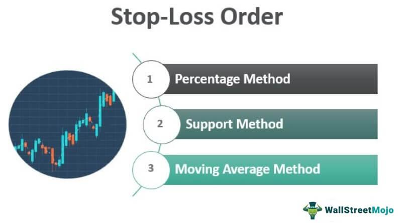

In the ever-evolving world of financial markets, algorithmic trading has become a pivotal strategy for investors seeking to maximize their returns. This sophisticated approach relies on computer algorithms to execute trades at optimal times, aiming to capitalize on market inefficiencies and patterns. A critical aspect of safeguarding investments within this automated framework is the implementation of risk management techniques, chief among them being stop-loss limits.

Stop-loss limits are predefined thresholds set to prevent excessive losses in trading positions. As market conditions fluctuate rapidly, these limits act as a safety net, automatically triggering a sale or purchase when a security's price reaches a certain point. This mechanism is crucial in protecting capital, especially in fast-paced markets where human reaction may not be swift enough to prevent significant losses.

The significance of stop-loss limits in algorithmic trading extends beyond mere loss prevention. They form a fundamental part of an automated system's strategy, ensuring that trades are executed according to systematic rules devoid of emotional influence. This not only promotes trading discipline but also enhances decision-making by allowing traders to focus on strategy rather than stressful, real-time reactions to market movements.

In this article, we explore the importance and application of stop-loss limits in algorithmic trading systems. We analyze their mechanics and strategic roles, illustrating how these tools help mitigate potential losses and provide a structured approach to trading. Understanding and effectively applying stop-loss limits is essential in creating robust trading algorithms that can withstand the complexities of modern financial markets.

## Table of Contents

## What Are Stop-Loss Limits?

Stop-loss limits are predefined price thresholds established by traders to curtail potential losses on a specific trade. When the market price of a security reaches or breaches these predetermined levels, a stop-loss order is activated. This triggers an automated transaction, either a sale or a purchase, aimed at offsetting the position. The primary goal is to manage and control risks by automatically exiting a position to avoid further losses. The need for stop-loss limits becomes even more pronounced in volatile market environments where price fluctuations can occur unpredictably and rapidly.

Both manual and algorithmic traders utilize stop-loss limits as an integral part of their trading strategies. For manual traders, these limits help in enforcing a structured approach to trading, contributing to disciplined decision-making. For algorithmic traders, stop-loss limits are embedded within trading algorithms, enabling systematic and consistent application across numerous trades without requiring human intervention. This systematic approach helps mitigate emotional decision-making, which can often lead to suboptimal trading outcomes.

The use of stop-loss orders supports the broader objective of risk management by protecting capital. In practice, this means setting a stop-loss limit at a level that aligns with an individual trader's risk tolerance and overall investment strategy. For instance, a trader might set a stop-loss order at 5% below the purchase price of a stock to limit potential losses to a manageable percentage of their investment.

Stop-loss orders not only provide security against significant losses but also allow traders to continue focusing on analysis and market opportunities, without the constant stress of tracking every price movement. This promotes a disciplined trading approach, crucial for both novice and seasoned investors alike, ensuring a structured and objective approach to trading activities. Through such measures, stop-loss limits help maintain trading discipline and prevent impulsive decisions during market [volatility](/wiki/volatility-trading-strategies).

## Role of Stop-Loss Limits in Algo Trading

In [algorithmic trading](/wiki/algorithmic-trading), stop-loss limits play an essential role in automating the risk management aspect of trading strategies. These limits are embedded within trading algorithms to ensure that predefined risk parameters are adhered to, thus providing a safeguard against unpredictable market movements. The primary function of stop-loss limits is to maintain a consistent risk profile by initiating automatic trade executions once specific conditions are fulfilled.

The integration of stop-loss limits within algorithms is instrumental in mitigating human error and emotional biases, which are common pitfalls in trading. The automated nature of executing trades when stop-loss conditions are met means that decisions are driven purely by predefined criteria rather than emotional responses. This leads to more consistent trading outcomes, as the execution of trades remains aligned with the original strategy regardless of market fluctuations.

Moreover, stop-loss limits are configured to work in conjunction with other algorithmic components such as entry points and position sizing. These elements collectively contribute to optimizing the overall strategy by ensuring that each trade adheres to a meticulously designed plan. Position sizing, for instance, can be adjusted dynamically within the algorithm based on the risk tolerance defined by stop-loss limits, leading to efficient capital management.

Crucially, stop-loss limits are pivotal in shielding algorithmic trading systems from experiencing significant drawdowns. A drawdown represents a decline in the value of a trading account from its peak to its trough, and minimizing such downturns is vital for the sustainability of trading strategies. By implementing stop-loss rules, traders can curtail losses before they escalate to levels that could jeopardize the trading system's profitability and operational stability.

In summary, the integration of stop-loss limits within algorithmic trading systems serves to enhance both the disciplined execution of trades and the strategic resilience against market volatility, ensuring that risk management processes remain robust and systematic.

## Types of Stop-Loss Strategies

Trailing Stop-Loss: This strategy automatically adjusts the stop-loss level as the position gains value, providing the dual benefit of locking in profits while still offering downside protection. For instance, if a stock is purchased at $100 and a trailing stop-loss of $5 is set, if the stock price rises to $110, the trailing stop will automatically adjust to $105. This ensures that if the price subsequently falls, the stop-loss will trigger at $105, protecting the trader from significant losses.

Fixed Stop-Loss: This involves setting a stop-loss level at the time the trade is initiated and keeping it constant unless manually adjusted. This is often used in situations where the trader wants a straightforward risk management rule. For example, a fixed stop-loss might be set 5% below the purchase price of a stock to limit potential losses, regardless of other market movements.

Time-Based Stop-Loss: This strategy triggers a stop-loss after a predefined period if specific market conditions are met, which can be vital for time-sensitive algorithmic strategies. It is beneficial in short-term trading scenarios where positions are held for limited timeframes, helping traders enforce discipline and limit exposure to market risks.

Volatility-Based Stop-Loss: This type adjusts according to prevailing market volatility, thereby accommodating dynamic market conditions. It is particularly useful in markets known for high volatility, where static stop-loss levels might either be too conservative or too risky. A volatility-based stop-loss may involve setting the stop level using the average true range (ATR) of the asset, which reflects its recent price volatility.

Choosing the right stop-loss strategy depends largely on the specific objectives and risk appetite of the algorithmic strategies employed by traders. More aggressive trading strategies might lean towards tight stop-loss levels to protect against swift market reversals, while long-term investment strategies might use wider stop-loss limits to account for normal market fluctuations.

## Advantages of Using Stop-Loss Limits

Stop-loss limits are a critical tool in algorithmic trading, offering several advantages that contribute to a more structured and effective trading strategy. One of the primary benefits is the promotion of disciplined trading by ensuring automatic exits from losing positions. This automation significantly reduces the emotional influence on trading decisions, which can often result in impulsive actions that undermine trading performance.

By capping the maximum losses on a trade, stop-loss limits play a crucial role in risk mitigation. This protective measure ensures that capital is preserved for future trading opportunities, even in adverse market conditions. It acts as a financial safeguard, particularly important during times of market volatility when price swings can be unpredictable.

The implementation of stop-loss limits also enhances the decision-making process for traders. Knowing that each trade is underpinned by predefined risk parameters allows traders to focus more on strategic analysis and market conditions rather than being distracted by every market fluctuation. This focus improves overall trading efficacy and helps traders to maintain a clear and logical approach to market opportunities.

Another significant advantage is the improvement in trading performance consistency. By aligning with a strategic risk management framework, stop-loss limits provide a foundation for more predictable trading outcomes. This consistency is critical for long-term success in algorithmic trading, where maintaining a steady performance profile is often more beneficial than sporadic high returns followed by sharp losses.

Stop-loss limits also serve as a protective mechanism against flash crashes or unexpected market events, which can cause rapid and detrimental price movements. In such scenarios, having predetermined [exit](/wiki/exit-strategy) points can shield traders from substantial financial damage. This protection is crucial in maintaining the integrity of trading systems and ensuring they are not severely impacted by sudden market anomalies.

Overall, the benefits of stop-loss limits in algorithmic trading are compelling, offering a robust framework for managing risks and enhancing trading discipline. They allow traders to remain focused on executing strategies with calculated precision, ultimately contributing to more resilient and profitable trading ventures.

## Challenges and Considerations

Stop-loss limits are an essential tool for risk management in algorithmic trading, but their effectiveness relies heavily on how they are set and executed. One of the primary challenges in using stop-loss limits is determining the appropriate level to set the stop. If set too close to the current market price, they may trigger frequent premature exits during normal market fluctuations, resulting in unnecessary trades and transaction costs. This challenge is particularly pronounced in highly volatile markets, where price swings are more substantial, increasing the likelihood of stop-loss orders being activated and leading to potential unintended losses.

To mitigate such risks, strategies involving stop-loss limits must be backtested extensively. Backtesting allows traders to simulate how their stop-loss rules would have performed in historical market conditions, providing insights into their alignment with the desired risk parameters. This process helps in establishing empirically-supported thresholds for stop-loss activation that balance the trade-off between risk protection and market noise.

Another significant consideration in employing stop-loss orders is the impact of execution speed and slippage. In fast-moving markets, execution delays can occur, causing orders to be filled at prices different from those expected, a phenomenon known as slippage. Such discrepancies can undermine the intended risk management benefits of stop-loss orders, particularly if large price movements occur between the time an order is triggered and when it is executed. Algorithmic trading systems must account for these factors, potentially incorporating them into their models to enhance order precision and reliability.

Traders must also remain vigilant in continuously reviewing and adjusting their stop-loss strategies. Market conditions and trading goals are dynamic, requiring that stop-loss parameters evolve in response. Regular assessment and modification ensure that stop-loss rules remain effective and aligned with ongoing market trends and risk tolerance levels. This adaptability is crucial to maintaining the protective intent of stop-loss orders in an ever-changing trading environment. 

Overall, while challenges exist in implementing stop-loss limits, careful consideration of their settings and ongoing refinement can harness their full potential to safeguard investments.

## Conclusion

Stop-loss limits serve as a fundamental component of risk management for algorithmic traders, playing a crucial role in preserving capital and maintaining trading discipline. These automated measures ensure that trades are executed according to predefined risk parameters, reducing the impact of emotional decision-making and allowing traders to adhere strictly to their strategies.

Proper implementation of stop-loss strategies can significantly enhance the effectiveness of algorithmic trading systems. By incorporating stop-loss limits, traders can automate risk management, maintaining a consistent risk profile across various market conditions. This disciplined approach not only minimizes potential losses but also allows traders to capitalize on profitable opportunities without the fear of substantial drawdowns.

While challenges exist, such as the risk of premature execution in highly volatile markets, the benefits of using stop-loss limits far outweigh the potential drawbacks when employed wisely. Traders must ensure that stop-loss levels are set thoughtfully to align with their risk tolerance and market analysis. Continuous back-testing and refinement of these strategies are essential to adapt to the dynamic nature of financial markets.

Traders should continuously adapt their stop-loss strategies to meet the evolving demands of market conditions and their trading goals. This adaptability ensures that the trading system remains robust against unpredictable market events and can exploit favorable conditions with minimal risk exposure.

Ultimately, incorporating stop-loss limits represents a proactive approach to safeguarding investments in the complex world of financial trading. By integrating these risk management tools, traders can enhance their trading performance, maintain consistency, and protect their capital from unexpected market swings, thereby achieving a more sustainable and disciplined trading practice.

## References & Further Reading

[1]: [Baron, M. (2013). "Quantitative Portfolio Management: The Art and Science of Statistical Arbitrage and High-Frequency Trading."](https://en.wikipedia.org/wiki/The_Lennon_Sisters) McGraw Hill Professional.

[2]: Bernard, C. & Warwick, M. (2017). "Dynamic stop-loss control using stochastic differential utility." [Journal of Banking & Finance](https://www.sciencedirect.com/journal/journal-of-banking-and-finance), 85, 109-122.

[3]: Cartea, A., Jaimungal, S., & Penalva, J. (2015). ["Algorithmic and High-Frequency Trading"](https://assets.cambridge.org/97811070/91146/frontmatter/9781107091146_frontmatter.pdf). Cambridge University Press.

[4]: Pardo, R. (2008). ["The Evaluation and Optimization of Trading Strategies."](https://onlinelibrary.wiley.com/doi/book/10.1002/9781119196969) John Wiley & Sons.

[5]: Shiryaev, A. N., Xu, Z. Q., & Zhou, X. Y. (2008). "Thou shalt buy and hold." [Quantitative Finance](https://arxiv.org/abs/0809.2878), 8(8), 765-776.