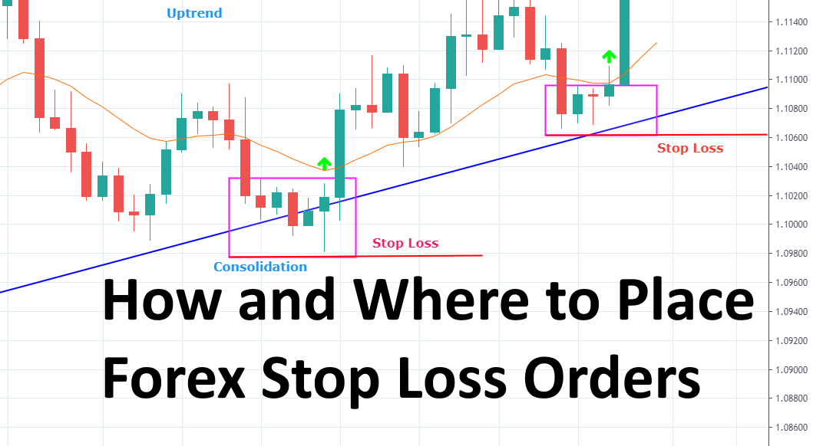

## Table of Contents

## What is a stop-loss order and why is it important?

A stop-loss order is a tool that investors use to limit their losses when they are trading stocks, currencies, or other financial assets. It works by setting a specific price at which the asset will be automatically sold if its value drops to that level. This means that if the price of the asset starts to fall, the stop-loss order helps to prevent the investor from losing more money than they are willing to risk.

Using a stop-loss order is important because it helps investors manage their risk. The stock market can be unpredictable, and prices can change quickly. By setting a stop-loss order, investors can protect themselves from big losses if the market moves against them. This can give them peace of mind and help them stick to their investment plan, even when the market is volatile.

## How does a stop-loss order work in trading?

A stop-loss order is like a safety net for people who trade stocks or other things that can go up or down in value. When you set a stop-loss order, you tell your trading platform to sell your asset if its price drops to a certain level. For example, if you bought a stock for $50 and you set a stop-loss order at $45, your stock will be sold automatically if its price falls to $45. This helps you avoid losing more money than you're okay with losing.

Using a stop-loss order is important because it helps you control how much risk you're taking. The prices of stocks and other assets can change a lot and very quickly. By setting a stop-loss order, you can protect yourself from big losses if the price suddenly drops. It's like having an automatic backup plan that kicks in when things start going the wrong way, helping you keep your trading strategy on track even when the market gets bumpy.

## What are the basic types of stop-loss orders?

There are two main types of stop-loss orders: the standard stop-loss order and the trailing stop-loss order. A standard stop-loss order is set at a specific price. For example, if you buy a stock at $100 and set a stop-loss at $90, your stock will be sold automatically if the price drops to $90. This type of order is simple and helps you limit your losses at a fixed point.

A trailing stop-loss order is a bit different. It moves with the price of the stock. If the stock price goes up, the stop-loss price also goes up, but if the stock price goes down, the stop-loss price stays where it is. For example, if you set a trailing stop-loss at 10% below the stock's highest price, and the stock goes from $100 to $120, your stop-loss will move to $108. This type of order can help you lock in profits while still protecting against big losses.

## What are the common mistakes beginners make when setting stop-loss orders?

One common mistake beginners make when setting stop-loss orders is setting them too tight. This means they set the stop-loss too close to the current price of the stock. If the price of the stock goes up and down a lot, which is normal, the stop-loss might get triggered too soon. This can cause the beginner to sell the stock too early, missing out on potential gains if the price goes back up.

Another mistake is setting the stop-loss too far away from the current price. This can lead to bigger losses if the price drops a lot. Beginners might do this because they don't want to get out of the trade too soon, but it can end up costing them more money. It's important to find a balance that matches how much risk you're willing to take.

Lastly, beginners often forget to adjust their stop-loss orders as the price of the stock changes. If the stock goes up, they might not move the stop-loss up with it, missing out on locking in some profit. Keeping an eye on the stock and adjusting the stop-loss can help manage risk better and make the most of the trade.

## How can one determine the optimal placement of a stop-loss order?

Determining the optimal placement of a stop-loss order involves understanding the [volatility](/wiki/volatility-trading-strategies) of the asset you're trading and how much risk you're willing to take. One way to do this is by looking at the asset's historical price movements. For example, if a stock typically moves up and down by 5% in a day, setting a stop-loss order too close to the current price, like at 2%, might cause it to be triggered by normal price swings. Instead, you might want to set it at a level that reflects the stock's usual volatility, maybe at 7% or 10% below the purchase price. This way, you're more likely to stay in the trade through normal ups and downs but still protect yourself from bigger losses.

Another important [factor](/wiki/factor-investing) is your own risk tolerance. Think about how much money you're okay with losing on a single trade. If you're not comfortable losing more than 2% of your total investment in one go, then you need to set your stop-loss order accordingly. Also, consider your overall trading strategy. If you're aiming for long-term gains, you might set a wider stop-loss to give the asset more room to grow. But if you're trading in the short term, a tighter stop-loss might be better to limit your risk. Balancing these factors helps you find the right spot for your stop-loss order, making sure it fits both your trading goals and your comfort with risk.

## What role does volatility play in setting stop-loss orders?

Volatility is how much the price of a stock or other asset goes up and down. When setting a stop-loss order, you need to think about how volatile the asset is. If the price moves a lot, you might want to set your stop-loss further away from the current price. This gives the stock room to go up and down without hitting your stop-loss too soon. If you set it too close, normal price swings might make you sell the stock before it has a chance to go back up.

On the other hand, if the asset is not very volatile, you can set your stop-loss closer to the current price. This is because the price won't move as much, so you don't need as much room. Understanding the volatility helps you pick a stop-loss level that protects you from big losses but also gives the stock a chance to grow. It's all about finding the right balance so you don't get kicked out of a trade too early or stay in too long and lose more than you want to.

## How should one adjust stop-loss orders in response to market news and events?

When big news or events happen, they can make stock prices move a lot. If you have a stop-loss order set, you might need to change it based on what's going on. For example, if there's good news about a company, the stock price might go up. You could move your stop-loss order higher to lock in some of the profit. If the news is bad, and the stock price might drop a lot, you might want to set your stop-loss closer to the current price to protect your money.

It's important to keep an eye on the news and think about how it might affect the stocks you're trading. If you hear about something that could change the price a lot, take a moment to think about your stop-loss order. Should you move it to be safer or give the stock more room to move? By adjusting your stop-loss based on what's happening, you can manage your risk better and maybe even make more money.

## What are advanced stop-loss strategies like trailing stops and how do they work?

A trailing stop is a type of stop-loss order that moves with the price of the stock. When you set a trailing stop, it follows the stock's price as it goes up, but stays put if the price goes down. For example, if you buy a stock at $100 and set a trailing stop at 10%, the stop-loss will be at $90 at first. If the stock price goes up to $120, the trailing stop moves to $108, which is 10% below the new high. This way, you can lock in profits as the stock price rises, but still protect yourself from big losses if the price suddenly drops.

Another advanced stop-loss strategy is the "guaranteed stop-loss order." This type of order makes sure your stock is sold at the exact price you set, no matter what happens in the market. It's useful during times when the market is moving a lot and prices can jump around quickly. While it gives you more control, it might cost a bit more because the trading platform charges a fee for this extra protection. Both trailing stops and guaranteed stop-loss orders help you manage your trades better by adjusting to the market's ups and downs.

## How can technical analysis tools assist in setting more effective stop-loss orders?

Technical analysis tools can help you set better stop-loss orders by showing you important levels where the stock price might change direction. Tools like support and resistance levels tell you where the price has had trouble moving past before. If you buy a stock near a support level, you might set your stop-loss just below that level. This way, if the price drops below support, it might keep going down, and your stop-loss can help you get out before losing too much. Moving averages can also help. If a stock's price is above its 50-day moving average, you might set your stop-loss just below that average. This can protect you if the price starts to fall and goes under the moving average, which could mean the stock's trend is changing.

Another useful tool is the Average True Range (ATR), which measures how much the stock's price moves up and down. You can use the ATR to set your stop-loss at a distance that matches the stock's normal volatility. For example, if the ATR is 2%, you might set your stop-loss 2% or a bit more below the current price. This gives the stock room to move without triggering the stop-loss too soon. By using these technical analysis tools, you can make smarter choices about where to set your stop-loss orders, helping you manage risk and maybe even make more money.

## What are the psychological factors to consider when placing stop-loss orders?

When you set a stop-loss order, your feelings can really affect what you do. A lot of people feel scared about losing money, so they might set their stop-loss too close to the price they bought at. They want to get out fast if the price drops, but this can make them sell too soon and miss out on gains if the price goes back up. On the other hand, some people might be too hopeful and set their stop-loss too far away because they don't want to sell. This can lead to bigger losses if the price keeps falling.

It's important to think about these feelings and try to stay calm when you're making decisions about your stop-loss orders. One way to do this is by having a clear plan before you start trading. Decide how much risk you're okay with and stick to it, no matter what your feelings are telling you. This can help you set your stop-loss at a good spot that matches your plan, not just your fears or hopes. By managing your emotions, you can make better choices and maybe even do better in your trading.

## How do different trading styles (e.g., day trading, swing trading) affect stop-loss placement strategies?

Different trading styles like [day trading](/wiki/day-trading-spy) and swing trading can change how you set your stop-loss orders. Day traders buy and sell stocks in the same day, so they need to be quick. They often set their stop-loss orders close to the price they bought at because they don't want to hold onto a losing trade for long. This means they might set a stop-loss at a small percentage, like 1% or 2%, to get out fast if the price starts to drop. Day traders are okay with smaller profits and smaller losses because they make a lot of trades.

Swing traders, on the other hand, hold onto their stocks for a few days or weeks. They're looking for bigger moves in the price, so they can set their stop-loss orders a bit further away from the price they bought at. This gives the stock more room to go up and down without hitting the stop-loss too soon. A swing trader might set a stop-loss at 5% or 10% below the purchase price, depending on how much risk they're okay with. They're trying to catch bigger moves, so they can handle bigger swings in the price.

## What are the latest trends and technologies influencing stop-loss order placement strategies?

The latest trends and technologies are changing how people set stop-loss orders. One big trend is using algorithms and automated trading systems. These systems can watch the market all the time and adjust stop-loss orders automatically based on what's happening. For example, if the stock price goes up a lot, the system can move the stop-loss up too, to lock in some profit. This can help traders make better decisions without having to watch the market all day.

Another important technology is using [machine learning](/wiki/machine-learning) and [artificial intelligence](/wiki/ai-artificial-intelligence) (AI). These tools can look at a lot of data and find patterns that might be hard for people to see. They can help predict how the stock price might move and suggest the best place to set a stop-loss order. This can make stop-loss strategies more accurate and help traders manage their risk better. By using these new technologies, traders can set their stop-loss orders in a smarter way and maybe even make more money.

## What is Understanding Investment Risk Management?

Investment risk management plays a crucial role in trading, focusing on the assessment and mitigation of potential losses. Its goal is to protect investments while promoting long-term trading success. In the trading world, risk manifests in various forms, including market risk, operational risk, and technical risk.

Market risk refers to the potential for an investor to experience losses due to factors that affect the overall performance of the financial markets. It is often linked to macroeconomic events, changes in interest rates, and geopolitical developments. For instance, a sudden economic downturn can negatively impact stock prices, thereby affecting an investor’s portfolio.

Operational risk involves the potential losses resulting from internal processes, people, and systems. This type of risk may stem from inadequate or failed internal processes, employee errors, or system failures. In [algorithmic trading](/wiki/algorithmic-trading), ensuring that trading algorithms are functioning correctly and efficiently is critical to managing operational risk.

Technical risk pertains to the possibility of system failures and technological disruptions that can impact trading. This includes issues such as server outages, network failures, and software glitches, which can prevent timely execution of trades or lead to substantial financial losses.

To safeguard investments, effective risk management strategies are necessary. Key components of these strategies include:

1. **Setting Clear Investment Goals**: Clearly defined goals help traders to maintain focus and discipline, ensuring that their trading activities align with their risk tolerance and investment objectives. This involves identifying acceptable levels of risk and expected returns, which guides decision-making processes.

2. **Diversifying Investments**: Diversification is a strategy that involves spreading investments across different financial instruments, industries, or asset classes. By reducing reliance on a single investment, diversification helps to minimize the impact of any one asset's poor performance on the overall portfolio.

3. **Regularly Evaluating Trading Performance**: Continuous evaluation of trading performance is essential to ensure strategies remain effective and aligned with market conditions. This involves analyzing trading results, reviewing risk measures, and adjusting strategies as necessary. Metrics such as the Sharpe ratio, which measures risk-adjusted returns, can be instrumental in evaluating performance:
$$
   \text{Sharpe Ratio} = \frac{\text{Average Portfolio Return} - \text{Risk-Free Rate}}{\text{Standard Deviation of Portfolio Return}}

$$

   This formula helps traders assess the return of an investment compared to its risk, aiding in better decision-making.

In conclusion, understanding and managing investment risks is pivotal in trading. By identifying the different forms of risk and implementing effective strategies, traders can better protect their investments and increase the likelihood of achieving sustained profitability.

## What are Algo Trading and Stop-Loss Strategies?

Algorithmic trading, or algo trading, has revolutionized the financial markets by employing sophisticated computer algorithms to automate trading decisions. This approach enables traders to capitalize on market opportunities with precision and speed, which are difficult to achieve manually. Central to effective algo trading is the incorporation of stop-loss strategies, which play a pivotal role in managing risks and safeguarding investments.

A stop-loss order in algo trading functions as a pre-programmed instruction to sell a security when it reaches a predetermined price level. This automated execution helps limit potential losses by swiftly closing positions that are moving unfavorably. By setting a stop-loss order, traders can effectively control their exposure to downside risks without constant monitoring.

To enhance stop-loss strategies within algo trading systems, traders often employ technical indicators like the Average True Range (ATR). The ATR measures market volatility by considering the range of price movements over a specified period, thus providing a dynamic framework for adjusting stop-loss levels. By integrating ATR, traders can establish stop-loss orders that adapt to changing market conditions, ensuring a more flexible and responsive risk management approach.

The formula for ATR is given by:

$$
\text{ATR} = \frac{1}{n} \sum_{i=1}^{n} TR_i
$$

where $TR_i$ is the true range for each period $i$, and $n$ is the number of periods considered. The true range (TR) can be calculated as the maximum of the following: current high minus current low, absolute current high minus previous close, and absolute current low minus previous close.

In practice, ATR-based stop-loss strategies adjust the placement of stop-loss orders depending on the level of market volatility. For instance, in a highly volatile market, a wider stop-loss distance is set to prevent premature exits from potentially profitable positions. Conversely, in a stable market, a tighter stop-loss helps capture gains by quickly exiting positions if market conditions deviate from expectations.

Using Python, traders can implement these ATR-based strategies to dynamically set stop-loss levels. Here's a basic example of how the ATR can be calculated using Python:

```python
import pandas as pd

def calculate_atr(data, period=14):
    data['TR'] = data[['High', 'Low', 'Close']].apply(
        lambda row: max(row['High'] - row['Low'], 
                        abs(row['High'] - row['Close'].shift(1)), 
                        abs(row['Low'] - row['Close'].shift(1))),
        axis=1
    )
    atr = data['TR'].rolling(window=period).mean()
    return atr

# Example usage with a DataFrame 'df' containing columns 'High', 'Low', and 'Close':
# df['ATR'] = calculate_atr(df)
```

By leveraging ATR-based stop-loss strategies, algo traders can achieve a more adaptive risk management posture that aligns with varying market dynamics. This flexibility allows traders to optimize their trading outcomes by minimizing losses while capturing profits within an automated trading environment.

## What are Advanced Risk Management Techniques in Algo Trading?

In algorithmic trading, managing risk effectively is not limited to simple stop-loss orders. Traders increasingly employ advanced risk management techniques such as trailing stops, dynamic position sizing, and hedging strategies, each serving a distinct purpose in optimizing trading outcomes.

**Trailing Stops**

Trailing stops are a sophisticated variation of stop-loss orders. They dynamically adjust the stop price as the market price of a security moves in a favorable direction, effectively locking in profits while allowing some room for fluctuations. For instance, if an asset's price rises, the trailing stop moves up correspondingly. However, if the price falls, the stop remains fixed. This method provides a balance between securing gains and accommodating market volatility.

Mathematically, a trailing stop can be expressed as follows:

$$

\text{Trailing Stop Price} = \max(\text{High Price} - \text{Trail Amount}, \text{Previous Stop Price})
$$

Where:
- $\text{High Price}$ is the highest price the security has reached since the trailing stop was set.
- $\text{Trail Amount}$ is the fixed value or percentage by which the stop is set from this high price.
- $\text{Previous Stop Price}$ is the last calculated stop price.

**Dynamic Position Sizing**

Dynamic position sizing is a technique used to adjust the size of a trade based on current market conditions and risks. By doing so, traders can better control their exposure to volatile markets. This approach often utilizes the concept of risk per trade, which is determined by the trader's total capital and risk tolerance.

A common formula for dynamic position sizing is:

$$

\text{Position Size} = \frac{\text{Risk Amount}}{\text{Entry Price} - \text{Stop Loss Price}}
$$

Where:
- $\text{Risk Amount}$ is a fixed amount or percentage of total capital that the trader is willing to risk on a single trade.
- $\text{Entry Price}$ is the price at which the trader enters the position.
- $\text{Stop Loss Price}$ is the predetermined price level at which the trade will be exited to limit losses.

Python code to calculate position size might look like:

```python
def calculate_position_size(capital, risk_per_trade, entry_price, stop_loss_price):
    risk_amount = capital * risk_per_trade
    position_size = risk_amount / (entry_price - stop_loss_price)
    return position_size

# Example usage
capital = 100000  # Total capital
risk_per_trade = 0.01  # Risking 1% of capital per trade
entry_price = 50  # Entry price of the asset
stop_loss_price = 48  # Stop loss level

position_size = calculate_position_size(capital, risk_per_trade, entry_price, stop_loss_price)
print(f"Calculated Position Size: {position_size}")
```

**Hedging Strategies**

Hedging involves taking positions that will offset potential losses in investments. In algorithmic trading, automated systems can manage hedging strategies by using derivatives such as options and futures. For instance, a trader could take a short position in a futures contract to hedge against potential declines in the price of a stock they own.

By implementing these advanced techniques, algorithmic traders aim to mitigate risk and maximize returns. Together, trailing stops, dynamic position sizing, and hedging strategies offer a robust framework for navigating the complexities of the market, enhancing the overall effectiveness of trading algorithms.

## References & Further Reading

[1]: Bergstra, J., Bardenet, R., Bengio, Y., & Kégl, B. (2011). ["Algorithms for Hyper-Parameter Optimization."](https://papers.nips.cc/paper/4443-algorithms-for-hyper-parameter-optimization) Advances in Neural Information Processing Systems 24.

[2]: ["Advances in Financial Machine Learning"](https://www.amazon.com/Advances-Financial-Machine-Learning-Marcos/dp/1119482089) by Marcos Lopez de Prado

[3]: ["Evidence-Based Technical Analysis: Applying the Scientific Method and Statistical Inference to Trading Signals"](https://www.amazon.com/Evidence-Based-Technical-Analysis-Scientific-Statistical/dp/0470008741) by David Aronson

[4]: ["Machine Learning for Algorithmic Trading"](https://github.com/stefan-jansen/machine-learning-for-trading) by Stefan Jansen

[5]: ["Quantitative Trading: How to Build Your Own Algorithmic Trading Business"](https://www.amazon.com/Quantitative-Trading-Build-Algorithmic-Business/dp/1119800064) by Ernest P. Chan