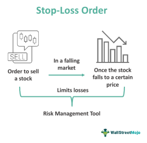

## Table of Contents

## What is a stop-loss order?

A stop-loss order is a tool that investors use to limit their losses when they are trading stocks, currencies, or other financial assets. It works by setting a specific price at which an asset will be automatically sold if its value drops to that level. This helps protect the investor from losing too much money if the market moves against their position.

For example, if you buy a stock at $50 and you set a stop-loss order at $45, the stock will be sold automatically if its price falls to $45. This means you won't lose more than $5 per share. Stop-loss orders are popular because they help manage risk without needing to watch the market all the time. However, they are not perfect and the price can sometimes jump past the stop-loss level before the order is executed, leading to bigger losses than expected.

## Why is it important to use stop-loss orders in trading?

Using stop-loss orders in trading is important because they help protect your money. When you buy a stock or another asset, its price can go up or down. If it goes down a lot, you could lose a lot of money. A stop-loss order sets a point where the asset will be sold automatically if the price drops to that level. This way, you can limit how much money you lose on a trade.

Stop-loss orders also help you manage your trades without having to watch the market all the time. You can set the stop-loss and then do other things, knowing that your trade is protected. This can make trading less stressful and help you stick to your trading plan. However, remember that stop-loss orders are not perfect. Sometimes, the price can drop very quickly and go past your stop-loss level before your order is filled, which means you might lose more money than you planned.

## How do you set up a stop-loss order on a trading platform?

Setting up a stop-loss order on a trading platform is easy. First, you need to log into your trading account. Then, find the stock or asset you want to trade. Once you have that open, look for an option that says "Trade" or "Order Entry." Click on it, and you will see different types of orders you can place. Look for the one labeled "Stop-Loss" or "Stop Order." Click on that, and you will be able to enter the price at which you want the stop-loss to trigger.

After you enter the price, you might need to enter the number of shares or the amount you want the order to cover. Make sure to double-check all the details, like the stock symbol, the stop-loss price, and the number of shares. Once everything looks good, submit the order. The trading platform will now automatically sell your asset if its price drops to the level you set. Remember, different platforms might have slightly different steps, but they all follow this basic process.

## What are the different types of stop-loss orders?

There are a few different types of stop-loss orders that traders can use. The first type is a standard stop-loss order. This is the most basic kind where you set a specific price, and if the stock drops to that price, it gets sold automatically. Another type is called a trailing stop-loss order. With this one, the stop-loss price moves up as the stock price goes up. This way, you can lock in more profits if the stock keeps going up, but it still protects you if the stock price starts to fall.

Another type is a guaranteed stop-loss order. This one makes sure that your stock is sold at the exact price you set, even if the market moves very quickly. This can be useful if you're worried about big price jumps, but it might cost more to use. Lastly, there's a stop-limit order. This is a bit different because it combines a stop-loss with a limit order. When the stock hits your stop price, it turns into a limit order, which means it will only sell at a certain price or better. This can be good if you want to make sure you get a specific price, but it also means your order might not get filled if the stock price keeps falling.

## How does the placement of a stop-loss order affect a trade?

The placement of a stop-loss order can really change how a trade goes. If you set your stop-loss too close to the current price, it might get triggered by normal ups and downs in the market. This means you could sell your stock even though it might go back up later. On the other hand, if you set it too far away, you might lose more money than you want if the price drops a lot. So, finding the right spot for your stop-loss is important to balance protecting your money and giving your trade a chance to work out.

Also, where you put your stop-loss can affect how much you make or lose. If you set it at a good spot, it can help you keep more of your profits if the price goes up. For example, using a trailing stop-loss can let you make more money as the price rises, but still protect you if it starts to fall. But if you don't place it well, you might miss out on gains or end up losing more than you planned. So, thinking carefully about where to put your stop-loss is key to managing your trades well.

## What factors should be considered when deciding where to place a stop-loss order?

When deciding where to place a stop-loss order, you should think about how much money you are okay with losing on the trade. This is called your risk tolerance. If you don't want to lose much, you might set your stop-loss closer to the price you bought at. But if you can handle more risk, you might set it further away. You also need to look at how much the stock usually moves up and down. If it moves a lot, you might need to set your stop-loss further away so it doesn't get triggered by normal changes in the price.

Another thing to consider is what the stock has done in the past. Look at where it has found support, which means a price where it usually stops going down. Setting your stop-loss just below a support level can be a good idea because it gives the stock a chance to bounce back if it drops. Also, think about any big news or events coming up that might affect the stock's price. If something big is happening soon, you might want to set your stop-loss a bit further away to give the stock time to react to the news.

## Can you explain the concept of 'stop-loss hunting' and how to avoid it?

Stop-loss hunting is when big traders or market makers try to push the price of a stock or other asset down to the point where a lot of stop-loss orders are set. They do this because they know that when those stop-loss orders get triggered, it will cause a lot of selling. This can make the price drop even more, which can help these big traders make money. It's like they are hunting for the stop-loss orders to make the market move in a way that helps them.

To avoid stop-loss hunting, you can set your stop-loss orders at prices that are not common or obvious. For example, instead of setting it at a round number like $50, you might set it at $49.75. This makes it harder for the big traders to guess where a lot of stop-loss orders are. Another way to avoid it is to use a wider stop-loss, which means setting it further away from the current price. This gives the stock more room to move without hitting your stop-loss, but it also means you might lose more money if the price does drop a lot.

## How do market volatility and liquidity impact stop-loss order placement?

Market volatility can really change how you should place your stop-loss order. When the market is moving a lot, prices can go up and down quickly. If you set your stop-loss too close to the current price, it might get triggered by these normal ups and downs, even if the stock is going to go back up later. So, in a volatile market, you might want to set your stop-loss further away from the current price to give your trade more room to move. But remember, setting it further away means you could lose more money if the price keeps going down.

Liquidity also plays a big role in where you should place your stop-loss order. Liquidity means how easy it is to buy or sell a stock without the price changing a lot. In a market with high liquidity, you can usually set your stop-loss closer to the current price because there are a lot of buyers and sellers, so your order is more likely to get filled at the price you set. But if the market is not very liquid, it might be harder to sell your stock at the stop-loss price you want. In this case, you might need to set your stop-loss further away to make sure it gets filled, but again, this means you could lose more money if the price drops a lot.

## What are the psychological benefits and challenges of using stop-loss orders?

Using stop-loss orders can help traders feel less stressed and more in control. When you know that your trade is protected by a stop-loss, you don't have to watch the market all the time. This can make trading less scary because you know you won't lose more money than you planned. It also helps you stick to your trading plan because you set the stop-loss ahead of time and don't have to make quick decisions when the market is moving a lot.

But there are also some challenges with using stop-loss orders. Sometimes, it can be hard to set the stop-loss at the right price. If you set it too close, you might get out of a trade that could have been good if you waited a bit longer. And if you set it too far away, you might lose more money than you wanted. Also, seeing your stop-loss get triggered can feel bad, even if it was the smart thing to do. It can make you second-guess your trading decisions and feel like you made a mistake, even though the stop-loss was there to protect you.

## How can backtesting help in optimizing stop-loss order placement?

Backtesting is a way to test your trading ideas using past data to see how they would have worked. When you backtest, you can try different stop-loss levels to see which ones would have made you the most money or lost you the least. By looking at how the stock moved in the past, you can find a good spot for your stop-loss that balances protecting your money and giving your trade a chance to work out. This can help you feel more confident about where to set your stop-loss in real trades.

But backtesting isn't perfect. It can't predict the future, and the market might act differently next time. Still, it's a useful tool to help you learn from the past and make better choices about where to place your stop-loss orders. By trying out different stop-loss levels in backtesting, you can see what might happen and adjust your strategy to fit how the market usually moves.

## What advanced strategies can be used to manage stop-loss orders effectively?

One advanced strategy for managing stop-loss orders is using a trailing stop-loss. This type of stop-loss moves up as the price of the stock goes up, which can help you lock in more profits if the stock keeps rising. For example, if you set a trailing stop-loss at 10%, it will stay 10% below the highest price the stock reaches. This way, you can keep making money as the stock goes up, but if it starts to fall, the stop-loss will kick in and sell the stock to protect your gains. It's a good way to balance making money and protecting what you've already made.

Another strategy is using multiple stop-loss orders at different levels. This can help you manage risk better. For example, you might set a main stop-loss to protect against big losses, and then set another one closer to the current price to take some profits if the stock goes up a bit. This way, you can take some money off the table while still giving the stock a chance to keep going up. It's like having a safety net at different heights, so you can adjust your trade as the market moves.

Lastly, you can use stop-loss orders along with other trading tools like technical indicators. For example, you might use moving averages or support and resistance levels to help decide where to place your stop-loss. If the stock drops below a key moving average or a support level, that could be a good spot for your stop-loss. By combining stop-loss orders with these other tools, you can make smarter decisions about when to get out of a trade, which can help you manage your money better and make more informed trading choices.

## How do professional traders adjust stop-loss orders in response to changing market conditions?

Professional traders often adjust their stop-loss orders based on how the market is acting. If the market is moving a lot, they might move their stop-loss further away from the current price. This gives their trade more room to move without getting sold too early. They might also look at what the stock has done before and set their stop-loss just below a price where the stock usually stops going down. This way, they can protect their money but still give the stock a chance to go back up if it drops a bit.

Sometimes, professional traders use other tools to help decide where to put their stop-loss. They might use things like moving averages or look at big news that could affect the stock's price. If the stock drops below a key moving average or there's bad news coming, they might move their stop-loss closer to the current price to protect their money. By watching the market and using these tools, professional traders can make smart choices about where to set their stop-loss orders to balance making money and protecting what they've already made.

## References & Further Reading

[1]: Bergstra, J., Bardenet, R., Bengio, Y., & Kégl, B. (2011). ["Algorithms for Hyper-Parameter Optimization."](https://dl.acm.org/doi/10.5555/2986459.2986743) Advances in Neural Information Processing Systems 24.

[2]: Lopez de Prado, M. (2018). ["Advances in Financial Machine Learning."](https://www.amazon.com/Advances-Financial-Machine-Learning-Marcos/dp/1119482089) John Wiley & Sons.

[3]: Aronson, D. R. (2006). ["Evidence-Based Technical Analysis: Applying the Scientific Method and Statistical Inference to Trading Signals."](https://www.amazon.com/Evidence-Based-Technical-Analysis-Scientific-Statistical/dp/0470008741) John Wiley & Sons.

[4]: Jansen, S. (2020). ["Machine Learning for Algorithmic Trading."](https://github.com/stefan-jansen/machine-learning-for-trading) Packt Publishing.

[5]: Chan, E. P. (2008). ["Quantitative Trading: How to Build Your Own Algorithmic Trading Business."](https://github.com/ftvision/quant_trading_echan_book) John Wiley & Sons.