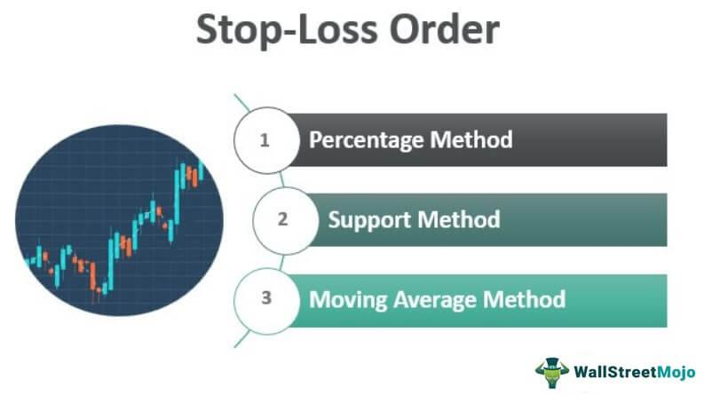

Managing risk in trading and investments is a foundational element for achieving maximum returns while minimizing potential losses. Effective risk management allows investors to make informed decisions, helping them navigate volatile markets with increased confidence. This article investigates into the key strategies that are critical for managing investment risk, with a particular focus on the application of stop-loss orders and algorithmic trading.

Stop-loss orders serve as a vital tool for investors by automatically limiting losses on existing positions when the market moves unfavorably. Meanwhile, algorithmic trading, which employs pre-programmed instructions to execute trades at high speed, allows for the efficient implementation of complex trading strategies. These tools not only protect investors from significant financial downtrends but also enable the identification and execution of profitable opportunities swiftly and accurately.



In today's fast-paced trading environments, integrating stop-loss orders and algorithmic trading into investment strategies is essential for optimizing portfolios. Such integration helps traders navigate the intricacies of financial markets, equipping them with the necessary insights and tools. Understanding and utilizing these concepts is essential for any investor or trader aiming to master market complexities and enhance their overall performance.

Our objective through this article is to impart practical insights into risk management techniques that can be immediately applied. We aim to arm you with the essential concepts and practices needed to successfully manage investment risks, ultimately contributing to more informed and strategically sound financial decisions.

## Table of Contents

## Understanding Investment Risk Management

Investment risk management is an essential practice within the broader field of trading and investing. It involves identifying, assessing, and prioritizing risks in order to minimize potential losses and maximize returns. The significance of investment risk management cannot be overstated, as it serves to protect investments from unforeseen market fluctuations and adverse events, ensuring long-term financial stability and growth.

Investors are exposed to various types of risks, each with its own implications and management techniques. Market risk, or systematic risk, arises from the inherent fluctuations in the financial markets. This risk is generally unavoidable, as it affects entire markets and asset classes. Credit risk refers to the possibility that a borrower may default on their obligations, leading to financial loss for the lender or bondholder. Liquidity risk emerges when an asset cannot be traded quickly enough in the market to prevent a loss or to meet financial obligations, often resulting in reduced asset value.

Risk tolerance is a pivotal concept in investment risk management. It refers to the level of variability in returns an investor is willing to withstand in their investment portfolio. An investor's risk tolerance is influenced by factors such as financial goals, time horizon, and personal comfort with market [volatility](/wiki/volatility-trading-strategies). Understanding one's risk tolerance is crucial for making informed investment decisions that align with individual financial objectives.

Diversification is a cornerstone strategy in managing investment risk. By spreading investments across multiple asset classes, sectors, and geographies, investors can mitigate the impact of adverse events in any single area. Diversification works on the principle that not all asset classes or market sectors will perform poorly simultaneously. For example, during an economic downturn, government bonds might perform well, while equities suffer losses, balancing the overall portfolio performance.

Successful investment risk management practices are evident in the strategies employed by experienced traders and investors. Warren Buffett, a renowned investor, emphasizes the importance of understanding the companies in which one invests and maintaining a diversified portfolio. His approach includes thorough research and creating a margin of safety to protect against potential market downturns.

Another example is Ray Dalio, who advocates for a balanced portfolio through the "All Weather" investment strategy. This approach involves creating a diversified portfolio that aims to perform well across various economic environments, thereby limiting risks associated with economic cycles. By allocating investments across asset classes that respond differently to economic changes, this strategy seeks to achieve a stable and resilient portfolio.

These practices underscore the importance of a disciplined approach to risk management in achieving investment success. By understanding the different types of risks, knowing one's risk tolerance, and implementing diversification, investors can effectively manage their portfolios and navigate the complexities of the financial markets.

## The Role of Stop-Loss Orders in Trading

A stop-loss order is a critical tool in trading that allows investors to limit potential losses by automatically selling a security when its price falls to a specified level. This type of order is essential for maintaining financial discipline, especially in volatile markets. The primary purpose of a stop-loss order is to provide a safety net that guards against significant financial losses due to unfavorable market movements, while also securing profits when the market conditions shift unexpectedly.

**Advantages of Stop-Loss Orders**

One of the key benefits of stop-loss orders is their ability to help traders and investors maintain a risk management strategy. By defining a clear [exit](/wiki/exit-strategy) point for a trade, these orders reduce the emotional component associated with investment decisions. For example, in a rapidly declining market, a stop-loss order ensures that the investor does not need to decide between cutting losses and waiting for a market recovery. By setting this automatic trigger, traders can protect their portfolios from substantial downdrafts with minimal continued oversight.

**Types of Stop-Loss Orders**

There are generally two main types of stop-loss orders: traditional and trailing stop-loss orders.

1. **Traditional Stop-Loss Order**: This order is placed at a particular price level, below which the security will be sold. For example, if a trader buys a stock at $50 and sets a stop-loss at $45, the stock will automatically be sold if the price hits $45, thus minimizing potential losses.

2. **Trailing Stop-Loss Order**: Unlike traditional stop-loss orders, a trailing stop-loss adjusts its price as the market price of the security changes. For instance, if an investor sets a trailing stop of 10% on a stock initially worth $100, as the stock price rises to $120, the stop-loss price would adjust to $108 (10% below the new high). This allows investors to lock in profits while still providing downside protection.

**Best Practices for Setting Effective Stop-Loss Orders**

To set effective stop-loss orders, several best practices should be considered:

- **Align with Risk Appetite**: The level at which a stop-loss is set should reflect the trader's individual risk tolerance. Conservative investors might set stop-losses closer to the purchase price to minimize losses, whereas more aggressive traders might afford a wider margin.

- **Market Dynamics**: Consider market volatility and liquidity. In highly volatile markets, setting stop-losses too close to the market price may result in premature execution due to short-term fluctuations.

- **Portfolio Strategy**: Align stop-loss orders with overall trading strategy and objectives. Different securities might require different stop-loss strategies depending on broader portfolio goals and market conditions.

**Real-World Scenarios**

Stop-loss orders have often played crucial roles in mitigating risks in turbulent markets. For instance, during the rapid stock market downturn in March 2020 prompted by the COVID-19 pandemic, many investors who had placed stop-loss orders were able to effectively limit their exposure to dramatic losses. These orders automatically triggered sales before the securities could decline further, illustrating how predefined exit strategies can help maintain portfolio stability amid uncertainty.

In another example, consider a volatile commodity market where prices fluctuate throughout the trading day. Traders employing trailing stop-loss orders have been successful in securing profits as prices increase, while simultaneously guarding against drastic downturns when the market direction reverses suddenly. 

By leveraging effective stop-loss strategies, traders can navigate financial markets with greater confidence, ensuring their investments are protected while optimizing return potential.

 to Algorithmic Trading

Algorithmic trading, often referred to as algo trading, involves the use of computer algorithms to automate the process of buying and selling financial instruments. These algorithms follow predefined rules and strategies to execute trades at speeds and frequencies that are impossible for human traders to achieve. Over the past few decades, [algorithmic trading](/wiki/algorithmic-trading) has become increasingly prevalent in modern financial markets due to its numerous advantages, including speed, precision, and the ability to handle complex trading strategies.

One of the primary benefits of algorithmic trading is speed. Algorithms can execute orders in fractions of a second, capitalizing on fleeting market opportunities that would be unattainable with manual trading. This rapid execution is crucial for strategies such as [arbitrage](/wiki/arbitrage), where simultaneous buying and selling are used to exploit price differences across markets. Accuracy is another advantage, as algorithms eliminate the risk of human errors that may occur in manual trading, such as incorrect order placements or calculation mistakes.

Moreover, algorithmic trading enables the implementation of complex trading strategies that involve multiple conditions and asset classes. For instance, traders can program algorithms to monitor various market indicators simultaneously and execute trades only when specific criteria are met. This complexity allows for sophisticated strategies, such as [statistical arbitrage](/wiki/statistical-arbitrage), [market making](/wiki/market-making), and [trend following](/wiki/trend-following), which might be cumbersome or unfeasible to manage manually.

Developing algorithms involves a combination of quantitative analysis, financial theory, and computer programming. Traders and developers use historical market data to identify profitable patterns and test these strategies through [backtesting](/wiki/backtesting), a process that evaluates how the algorithm would have performed in the past. Technologies such as [machine learning](/wiki/machine-learning) and [artificial intelligence](/wiki/ai-artificial-intelligence) are increasingly employed to enhance the predictive power of algorithms, enabling them to adapt to changing market dynamics.

Despite its advantages, algorithmic trading is not without misconceptions and risks. One common misconception is that algo trading guarantees profits, while in reality, market conditions can change rapidly, impacting strategy effectiveness. Another risk is the potential for technical failures or malfunctions in the trading systems, which can lead to significant unintended trading losses. Furthermore, the reliance on algorithms can lead to increased market volatility, as seen in events like the Flash Crash of 2010, where automated systems triggered rapid market swings.

From a risk management perspective, algorithmic trading contributes significantly by enabling traders to monitor and respond to market changes more efficiently. Algorithms can be designed to incorporate risk management techniques such as stop-loss orders, enabling automatic sell-offs when asset prices fall to a predetermined level. These mechanisms allow for better control of portfolio exposure and the mitigation of losses in volatile markets.

Algorithmic trading offers a multifaceted approach to modern financial trading, leveraging technology to enhance speed, accuracy, complexity, and risk management. While it presents certain risks, the strategic development and deployment of algorithms can greatly improve trading efficiency and outcomes in investment portfolios.

## Integrating Stop-Loss Orders and Algo Trading for Optimal Risk Management

The integration of stop-loss orders and algorithmic trading represents a harmonious approach to managing investment risk, combining automation with precautionary measures. Stop-loss orders serve as an investor's safety net, automatically ceasing trades at a predetermined price level to limit potential losses. Algorithmic trading, on the other hand, leverages computational algorithms to execute trades at optimal speeds and precision, often capitalizing on market inefficiencies or trends.

### Strategies for Integrating Stop-Loss Orders with Algorithmic Trading

1. **Adaptive Algorithmic Strategies**:
   Algorithms can be programmed to incorporate dynamic stop-loss adjustments based on market conditions. For instance, instead of a fixed stop-loss, a trailing stop-loss can be utilized, which follows the price movement at a set distance. This can be pivotal in volatile markets where prices can fluctuate sharply.

    ```python
    # Example Python code for a simple trailing stop-loss
    def trailing_stop_loss(entry_price, trail_percent):
        highest_price = entry_price
        stop_loss_price = entry_price * (1 - trail_percent)

        def update(current_price):
            nonlocal highest_price, stop_loss_price
            if current_price > highest_price:
                highest_price = current_price
                stop_loss_price = highest_price * (1 - trail_percent)
            return stop_loss_price

        return update
    ```

2. **Risk-Weighted Portfolio Allocation**:
   Algorithms can be used to diversify a portfolio across different asset classes, with stop-loss orders placed at varying levels. This diversification cushions against extreme market movements and ensures that losses in one sector don't overwhelmingly impact the total portfolio.

3. **Backtesting with Integrated Stop-Losses**:
   Before deploying algorithms in live trading, backtesting with integrated stop-loss mechanisms allows the simulation of market conditions to determine potential outcomes. This is crucial for adjusting parameters such as stop-loss levels and deciding on the type of orders to use.

### Examples of Successful Integration

Traders have seen significant success by embedding stop-loss functionalities within their algorithmic trading systems. For example, a quantitative [hedge fund](/wiki/hedge-fund-trading-strategies) might integrate stop-loss logic into stock-trading algorithms to automatically liquidate positions when undesired volatility is detected, thereby preserving capital and maintaining consistent returns.

### Challenges and Considerations

Integrating stop-loss orders within algorithmic systems is not without its challenges. One major consideration is the potential for over-optimization, where a strategy performs exceedingly well in historical tests but fails to adapt to new market conditions. Additionally, latency issues can arise, where stop-loss orders trigger too late due to delays in execution, especially in high-frequency trading environments.

Moreover, the emotional detachment provided by automation may lead to a false sense of security, encouraging over-leveraging or excessive risk-taking.

### Tools and Platforms for Integration

Several trading platforms and software support the seamless integration of stop-loss orders and algorithmic trading. MetaTrader, for example, offers robust support for automated trading systems, including tools for scripting custom algorithms with built-in stop-loss mechanisms. QuantConnect and TradeStation also provide cloud-based solutions that enable the design, backtesting, and deployment of sophisticated trading strategies with integrated risk management features.

By strategically combining stop-loss orders with algorithmic trading, investors and traders can craft resilient portfolios that capitalize on market opportunities while safeguarding against unforeseen downturns. This dual approach not only enhances the efficacy of trading strategies but also instills a disciplined risk management philosophy.

## Conclusion

In summary, effective investment risk management requires the integration of contemporary tools and techniques, such as stop-loss orders and algorithmic trading. Stop-loss orders are indispensable for limiting potential losses and securing gains, acting as a safety net for investors against significant downturns. Concurrently, algorithmic trading enhances trading efficiency through speed, precision, and the execution of complex strategies, providing a robust framework for mitigating risks in real-time.

Traders and investors must remain vigilant and committed to continuous learning about evolving trading technologies and strategies. As the financial markets evolve, staying informed on the latest developments and tools becomes crucial. This ongoing education helps in refining trading strategies and optimizing portfolio management amidst changing market conditions.

It's paramount for investors to customize their risk management strategies according to their unique investment goals and risk appetite. Risk tolerance varies among individuals, and personalizing strategies ensures that investment activities align with broader financial objectives.

For those seeking to expand their knowledge, several resources are available, offering insights into advanced trading strategies and risk management techniques. Books, online courses, financial news networks, and forums provide a wealth of information, helping both novice and seasoned investors enhance their trading acumen and risk management capabilities.

## References & Further Reading

[1]: Bergstra, J., Bardenet, R., Bengio, Y., & Kégl, B. (2011). ["Algorithms for Hyper-Parameter Optimization."](https://papers.nips.cc/paper/4443-algorithms-for-hyper-parameter-optimization) Advances in Neural Information Processing Systems 24.

[2]: ["Advances in Financial Machine Learning"](https://www.amazon.com/Advances-Financial-Machine-Learning-Marcos/dp/1119482089) by Marcos Lopez de Prado

[3]: ["Evidence-Based Technical Analysis: Applying the Scientific Method and Statistical Inference to Trading Signals"](https://www.amazon.com/Evidence-Based-Technical-Analysis-Scientific-Statistical/dp/0470008741) by David Aronson

[4]: ["Machine Learning for Algorithmic Trading"](https://github.com/stefan-jansen/machine-learning-for-trading) by Stefan Jansen

[5]: ["Quantitative Trading: How to Build Your Own Algorithmic Trading Business"](https://www.amazon.com/Quantitative-Trading-Build-Algorithmic-Business/dp/1119800064) by Ernest P. Chan