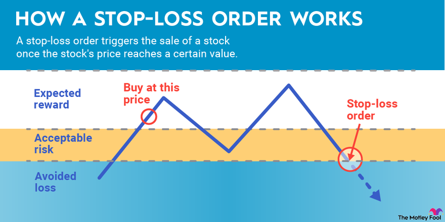

## Table of Contents

## What is a stop-loss order?

A stop-loss order is an instruction you give to your broker to sell a stock when it reaches a certain price. This helps you limit your losses if the stock price starts to fall. For example, if you bought a stock at $50 and you set a stop-loss order at $45, the stock will be sold automatically if its price drops to $45. This way, you won't lose more money than you're comfortable with.

Using a stop-loss order can be a good way to manage risk, especially in a volatile market. It takes the emotion out of selling, because the decision is made in advance. However, there's a downside: if the stock price drops suddenly and then quickly recovers, you might end up selling at a loss even though the stock could have gone back up. So, it's important to set the stop-loss price carefully and keep an eye on market conditions.

## How does a stop-loss order work with mutual funds?

A stop-loss order with mutual funds works a bit differently than with stocks. When you set a stop-loss order for a mutual fund, you're telling your broker to sell your mutual fund shares if the price falls to a certain level. For example, if you bought shares in a mutual fund at $20 each and you set a stop-loss order at $18, your shares will be sold automatically if the price drops to $18. This helps you limit your losses if the mutual fund's value starts to go down.

However, mutual funds are priced once a day, at the end of the trading day, based on their net asset value (NAV). This means that your stop-loss order won't be executed until the end of the day, when the NAV is calculated. If the mutual fund's price drops below your stop-loss level during the day but then goes back up by the end of the day, your order won't be triggered. So, it's important to understand that with mutual funds, stop-loss orders are less immediate than with stocks, and you need to set the stop-loss level carefully.

## Why would an investor use a stop-loss order on a mutual fund?

An investor might use a stop-loss order on a mutual fund to protect their money. If they think the mutual fund might lose value, they can set a stop-loss order to sell the fund if it drops to a certain price. This way, they won't lose more money than they're okay with losing. It's like having a safety net that automatically kicks in to help limit losses.

Using a stop-loss order can also take away some of the stress of deciding when to sell. Instead of watching the market all the time and worrying about when to sell, the investor can set the stop-loss order and feel more at ease. However, they need to remember that mutual funds are only priced at the end of the day, so the stop-loss order won't happen right away. It's important to set the right price for the stop-loss order and keep an eye on how the mutual fund is doing.

## What are the potential risks of using stop-loss orders on mutual funds?

One big risk of using stop-loss orders on mutual funds is that they might sell your shares at the wrong time. Mutual funds are only priced once a day, at the end of the trading day. So, if the price of the mutual fund drops below your stop-loss level during the day but then goes back up by the end of the day, your order won't be triggered. But if it stays down, your shares will be sold at a loss, even if the price could have gone back up the next day. This means you could miss out on gains if the market recovers quickly.

Another risk is that stop-loss orders can lead to selling during short-term dips that don't reflect the long-term value of the mutual fund. If the market goes through a temporary downturn, your stop-loss order might kick in and sell your shares at a low price. If the market then rebounds, you might have sold your shares too soon and missed out on potential gains. So, it's important to set the stop-loss level carefully and think about whether the mutual fund is likely to recover from any short-term drops in value.

## How do you set a stop-loss order on a mutual fund?

To set a stop-loss order on a mutual fund, you need to talk to your broker or use your online trading platform. You'll tell them which mutual fund you want to set the stop-loss order for and at what price you want it to be triggered. For example, if you own shares in a mutual fund that's currently priced at $20 each, and you want to sell if it drops to $18, you would set your stop-loss order at $18. Your broker will then keep an eye on the mutual fund's price and sell your shares if it hits that $18 level at the end of the trading day.

Remember, mutual funds are only priced once a day, at the end of the trading day. This means your stop-loss order won't happen right away if the price drops during the day. It will only be triggered if the price is still at or below your stop-loss level when the mutual fund's net asset value (NAV) is calculated at the end of the day. So, it's important to set the stop-loss price carefully and think about how the mutual fund might perform over time.

## What is the difference between a stop-loss order and a stop-limit order for mutual funds?

A stop-loss order and a stop-limit order are both ways to protect your money when you invest in mutual funds, but they work a bit differently. A stop-loss order tells your broker to sell your mutual fund shares if the price drops to a certain level. For example, if you set a stop-loss order at $18 for a mutual fund you bought at $20, your shares will be sold automatically if the price hits $18 at the end of the trading day. This helps you limit your losses if the mutual fund's value goes down.

A stop-limit order adds an extra step. It not only tells your broker to sell if the price drops to a certain level, but it also sets a minimum price at which you're willing to sell. For example, if you set a stop-limit order with a stop price of $18 and a limit price of $17.50, your broker will try to sell your shares if the price hits $18, but only if they can get at least $17.50 per share. This gives you more control over the selling price, but it also means your shares might not be sold if the price keeps dropping below your limit price. So, a stop-limit order can help you get a better price, but it comes with more risk that your shares won't be sold at all.

## Can stop-loss orders protect against all types of market downturns?

Stop-loss orders can help protect your money when the market goes down, but they don't work against all types of market downturns. If the market drops slowly, a stop-loss order can sell your shares before they lose too much value. This can help you avoid big losses if you set the right price for your stop-loss order.

However, stop-loss orders have some problems. If the market drops very quickly, your shares might be sold at a low price, and you might miss out on any quick recovery. Also, stop-loss orders don't protect against long-term market downturns. If the market keeps going down over a long time, your stop-loss order will only sell your shares at one point, and you won't be protected from further losses after that. So, while stop-loss orders can be helpful, they don't protect against all types of market downturns.

## How does market volatility affect stop-loss orders on mutual funds?

Market volatility can make stop-loss orders on mutual funds tricky. When the market is very up and down, the price of a mutual fund can change a lot in a short time. If you set a stop-loss order, it might get triggered during a big drop, even if the price goes back up later. This means you could sell your shares at a low price and miss out on any quick recovery. So, in a volatile market, stop-loss orders might not work as well as you hope.

Also, because mutual funds are only priced once a day, at the end of the trading day, a stop-loss order won't happen right away. If the market is very volatile, the price might drop below your stop-loss level during the day but then go back up by the end of the day. In this case, your order won't be triggered, and you'll still own the shares. But if the price stays down, your shares will be sold at a loss. So, it's important to think carefully about where you set your stop-loss order in a volatile market.

## What are the tax implications of triggering a stop-loss order on a mutual fund?

When you trigger a stop-loss order on a mutual fund, it means you're selling your shares. If you make a profit from selling, you'll have to pay capital gains tax. The tax rate depends on how long you held the shares. If you held them for more than a year, it's called a long-term capital gain, and the tax rate is usually lower. If you held them for a year or less, it's a short-term capital gain, and you'll pay your regular income tax rate on the profit.

If you sell your mutual fund shares at a loss, you can use that loss to reduce your taxes. You can subtract the loss from any capital gains you made that year. If your losses are more than your gains, you can use up to $3,000 of the extra loss to lower your taxable income. Any loss you can't use in the current year can be carried over to future years. So, it's important to think about the tax effects when you set a stop-loss order on a mutual fund.

## How should the timing of setting a stop-loss order be considered for mutual funds?

When you set a stop-loss order on a mutual fund, it's important to think about the timing. Mutual funds are only priced once a day, at the end of the trading day. This means your stop-loss order won't happen right away if the price drops during the day. It will only be triggered if the price is still at or below your stop-loss level when the mutual fund's net asset value (NAV) is calculated at the end of the day. So, you need to set the stop-loss price carefully and think about how the mutual fund might perform over time.

Also, think about what's happening in the market when you set your stop-loss order. If the market is very up and down, the price of the mutual fund can change a lot in a short time. If you set your stop-loss order too close to the current price, it might get triggered during a big drop, even if the price goes back up later. This means you could sell your shares at a low price and miss out on any quick recovery. So, in a volatile market, you might want to set your stop-loss order at a level that gives the mutual fund some room to move without selling your shares too soon.

## What advanced strategies can be used with stop-loss orders on mutual funds?

One advanced strategy is to use a trailing stop-loss order. This means you set your stop-loss order at a certain percentage below the mutual fund's highest price. As the price goes up, your stop-loss order moves up with it, but if the price drops, the stop-loss stays where it is. This way, you can protect your gains while still giving the mutual fund room to grow. For example, if you set a trailing stop-loss at 10% below the highest price, and the mutual fund reaches $22 from $20, your stop-loss would move to $19.80. If the price then drops to $19.80, your shares will be sold, but if it keeps going up, your stop-loss keeps moving up too.

Another strategy is to use stop-loss orders in combination with other investment strategies. For example, you might use a stop-loss order to protect against big losses while also using dollar-cost averaging to buy more shares over time. This means you invest a fixed amount of money at regular intervals, which can help lower the average price you pay for the mutual fund. By using both strategies together, you can limit your losses while also taking advantage of market dips to buy more shares at a lower price. This can help you build a stronger investment over time.

## How can stop-loss orders be integrated into a broader investment strategy for mutual funds?

Stop-loss orders can be a helpful part of a bigger plan for investing in mutual funds. They can help you limit your losses if the price of a mutual fund goes down a lot. For example, you might set a stop-loss order at a certain price to make sure you don't lose too much money if the market takes a big dip. This way, you can feel more secure knowing that you have a safety net in place. But it's important to set the stop-loss price carefully, because if the market goes down and then quickly goes back up, you might sell your shares too soon and miss out on the recovery.

You can also use stop-loss orders along with other ways of investing to make your plan even stronger. For instance, you might use a stop-loss order to protect against big losses while also using dollar-cost averaging to buy more shares over time. Dollar-cost averaging means you invest a fixed amount of money at regular times, which can help you buy more shares when the price is low. By using both strategies together, you can limit your losses and take advantage of market dips to buy more shares at a lower price. This can help you build a better investment over time.

## References & Further Reading

[1]: Ellis, C. D. (2016). ["Winning the Loser's Game: Timeless Strategies for Successful Investing."](https://www.amazon.com/Winning-Losers-Game-Strategies-Successful/dp/1264258461) McGraw-Hill Education.

[2]: Bogle, J. C. (2017). ["The Little Book of Common Sense Investing: The Only Way to Guarantee Your Fair Share of Stock Market Returns."](https://www.amazon.com/Little-Book-Common-Sense-Investing/dp/1119404509) Wiley.

[3]: Chevalier, J., & Ellison, G. (1997). ["Risk Taking by Mutual Funds as a Response to Incentives."](https://www.journals.uchicago.edu/doi/10.1086/516389) Journal of Political Economy, 105(6), 1167-1200.

[4]: Pardo, R. (2008). ["The Evaluation and Optimization of Trading Strategies."](https://onlinelibrary.wiley.com/doi/book/10.1002/9781119196969) Wiley.

[5]: Hasbrouck, J., & Saar, G. (2013). ["Low-latency trading."](https://www.sciencedirect.com/science/article/abs/pii/S1386418113000165) Journal of Financial Markets, 16(4), 646-679.

[6]: Mehrling, P. (2011). ["The New Lombard Street: How the Fed Became the Dealer of Last Resort."](https://www.jstor.org/stable/j.ctt7sgxz) Princeton University Press.