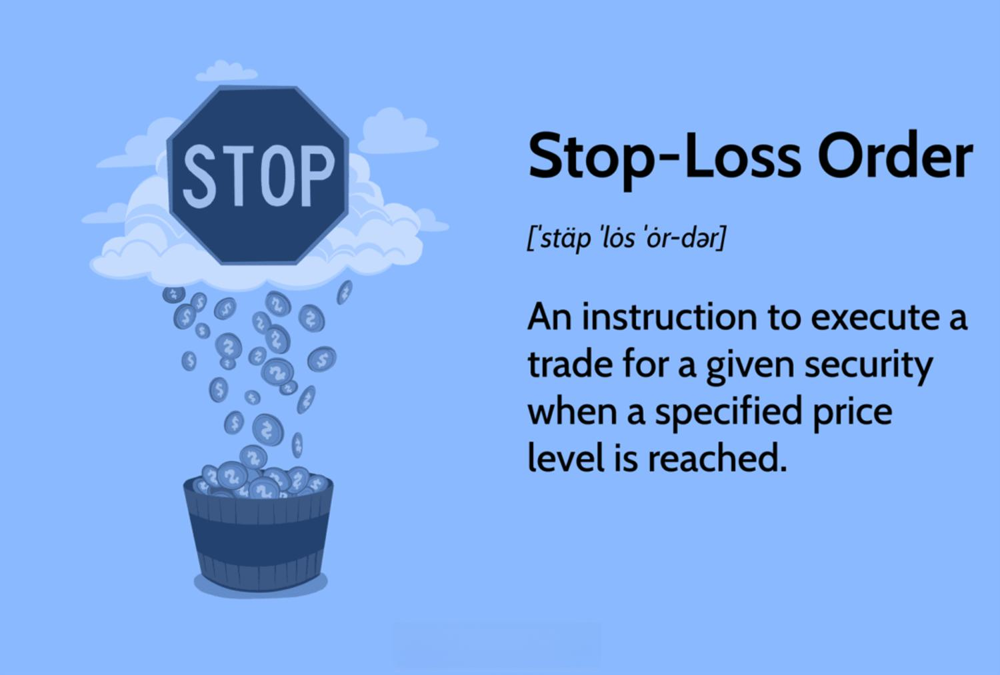

Algorithmic trading has made a significant impact on the financial markets by providing a systematic and quantitative method for executing trades. One of the core aspects of algorithmic trading is risk management, which involves various strategies to mitigate potential financial losses. Within this framework, stop-loss orders are a fundamental tool, offering traders the ability to protect their investments by automatically exiting a position when the price reaches a pre-determined threshold.

Stop-loss orders are strategically placed with brokers to buy or sell a security once it attains a specific price point, called the stop price. These orders encompass both long and short trading positions, and they become market orders upon reaching the stop price, ensuring immediate execution at the best available opportunity. This automated approach is invaluable in curbing emotional decision-making in trading, as it allows for a predefined exit strategy regardless of the market dynamics at play. 



The advantages of stop-loss orders extend beyond simple loss prevention. They also aid in securing profits, bringing discipline to trading strategies, and reducing the necessity for constant market surveillance. By automating the process, traders can concentrate on strategy development and optimization rather than manual monitoring.

This article provides an in-depth exploration of stop-loss orders, detailing their benefits, various types, and crucial role in risk management. Understanding and implementing the right stop-loss strategies are imperative for traders seeking to balance potential risks and rewards in an ever-fluctuating market environment.

## Table of Contents

## What is a Stop-Loss Order?

A stop-loss order is a financial instrument used by traders to manage risk by automatically selling or buying a security when its price reaches a predetermined level, referred to as the stop price. This type of order is a crucial tool for traders seeking to limit potential losses and protect profits in volatile markets. When the stop price is reached, the stop-loss order is converted into a market order. This ensures that the order is executed at the next available price, potentially securing the trader’s position or minimizing further losses.

Stop-loss orders are applicable across various trading strategies, including both long and short positions. In the case of a long position, where a trader buys a security anticipating its price will rise, a stop-loss order can be set below the purchase price. If the market price falls to this level, the security is automatically sold, thus limiting the trader’s loss. Conversely, for a short position, where the trader expects the price to decline, a stop-loss order can be set above the entry price to buy the security back, minimizing potential loss if the price rises unexpectedly.

The use of stop-loss orders helps streamline trading operations by reducing the need for traders to constantly monitor market movements. This automation allows traders to adhere to a planned strategy without the influence of emotional decision-making, which is often detrimental in high-stakes financial environments. Moreover, stop-loss orders can be standardized across trading platforms, making them an accessible and popular tool among both retail and institutional traders.

## Benefits of Stop-Loss Orders

Stop-loss orders are a fundamental tool in risk management strategies, offering a mechanism for traders to mitigate potential losses and secure profits. Their implementation in trading strategies is particularly valued for several key reasons.

Firstly, stop-loss orders provide a straightforward method for managing trading risks. By predefining [exit](/wiki/exit-strategy) points for trades, these orders automatically trigger execution to buy or sell a security once its price reaches a specified level. This preemptive approach helps traders manage downside risks effectively, as their positions are closed at a certain threshold, thereby preventing further losses. For instance, if a trader sets a stop-loss order at a 5% decline from the entry price, the position would be automatically liquidated once the market ticks down to this level, safeguarding the trader's capital.

Secondly, stop-loss orders assist in locking in profits. Traders can set stop-loss levels at a certain profit margin to secure gains once a target is reached. This is particularly useful in volatile markets where prices can fluctuate significantly within short timeframes. By using these orders, traders crystallize their profits as soon as the market hits favorable levels, reducing the risk of reversals that would erode accumulated gains.

Another benefit of stop-loss orders is the discipline they instill within trading strategies. Emotional decision-making often undermines investment strategies, leading to hasty and irrational trade entries or exits. By automating the decision to sell or buy through pre-set stop-loss levels, traders can adhere to their trading plans without succumbing to the psychological pressures of market movements. This ensures a level of consistency and discipline that is crucial for long-term success in financial markets.

Furthermore, automation in stop-loss orders significantly reduces the need for constant market monitoring. Traders can implement these orders and have peace of mind, knowing that their positions will be managed automatically even when they are not actively observing market movements. This is especially beneficial for those who trade multiple markets or have other commitments, allowing them to maintain effective risk management without continuous oversight.

In essence, stop-loss orders introduce a layer of precision and control in trading activities. They enable traders to systematically manage their positions, safeguarding against undesirable market activities while capitalizing on profitable opportunities. As such, they remain an indispensable aspect of any robust trading strategy.

## Types of Stop-Loss Strategies in Algorithmic Trading

Different strategies for stop-loss orders, such as fixed percentage stop-loss, trailing stop-loss, and [volatility](/wiki/volatility-trading-strategies)-based stop-loss, play a crucial role in [algorithmic trading](/wiki/algorithmic-trading). Each of these strategies is designed to cater to specific risk profiles and market conditions, offering traders a way to systematically manage risk while optimizing returns.

### Fixed Percentage Stop-Loss

A fixed percentage stop-loss involves setting a stop-loss order at a predetermined percentage level below (or above, for short positions) the purchase price. For example, if a stock is purchased at $100, a trader might set a stop-loss order at $95, reflecting a 5% tolerance for loss. This method provides a straightforward mechanism to cap potential losses based on the initial investment.

$$
\text{Stop Price} = \text{Purchase Price} \times (1 - \text{Percentage})
$$

### Trailing Stop-Loss

Trailing stop-loss orders are dynamic, adjusting with favorable price movements while maintaining a fixed stop distance. If the market price rises, the stop price trails behind by a set amount or percentage. This allows traders to protect gains by enabling the stop price to move upward with the stock’s price but not downward. For instance, a trailing stop might be set at 5%, ensuring that the stop price is always 5% below the highest price the stock achieves post-purchase.

```python
def calculate_trailing_stop(current_price, trail_percent):
    stop_price = (1 - trail_percent) * current_price
    return stop_price

# Example usage
current_price = 120
trail_percent = 0.05  # 5%
trailing_stop = calculate_trailing_stop(current_price, trail_percent)
```

### Volatility-Based Stop-Loss

Volatility-based stop-loss orders consider market volatility to define stop-loss levels, providing a more adaptive approach. These orders use indicators like the Average True Range (ATR) to set stop-loss levels that reflect current market conditions. High volatility necessitates wider stop margins to prevent premature execution due to normal price fluctuations.

$$
\text{Stop Price} = \text{Purchase Price} - n \times \text{ATR}
$$

Where $n$ is a multiplier that reflects the trader's risk tolerance.

### Dynamic Stop-Losses

Dynamic stop losses adjust in real-time based on evolving market data, ensuring trading decisions are adaptive and aligned with current market dynamics. These mechanisms leverage algorithmic models to adapt stop levels based on predefined rules or [machine learning](/wiki/machine-learning) insights, enhancing the trade's response to market shifts.

### Implementation Considerations

Selecting and implementing a suitable stop-loss strategy demands a thorough understanding of market behavior and asset characteristics. Traders must analyze historical data, examine price patterns, and assess volatility to craft a strategy aligned with their risk tolerance and investment objectives. This process involves balancing risk against reward and ensuring decisions are informed by comprehensive data analysis.

## Backtesting Stop-Loss Algorithms for Optimal Performance

Backtesting is a critical component in assessing the effectiveness of stop-loss algorithms in algorithmic trading. It involves evaluating these strategies against historical market data to predict their performance in future scenarios. This process is instrumental in understanding how different stop-loss strategies operate under various market conditions, enabling traders to refine their approaches to achieve a harmonious balance between risk and reward.

One of the primary objectives of [backtesting](/wiki/backtesting) is to ascertain that the selected stop-loss strategy fulfills its purpose without over-optimizing or fitting past data excessively. This is crucial for maintaining robustness when applied to live trading conditions. During backtesting, traders simulate trades based on historical data and compare the outcomes with desired performance metrics. This iterative process allows for identification of potential weaknesses or strengths in the strategy.

To achieve realistic performance insights, it is essential to incorporate factors such as slippage and transaction costs. Slippage refers to the difference between the expected price of a trade and the actual price at which the trade is executed. It can significantly affect trading outcomes, especially in volatile markets, thus making it imperative to [factor](/wiki/factor-investing) it into backtesting simulations. Transaction costs, comprising brokerage fees and taxes, should also be considered, as they can erode the profitability of a trading strategy.

Mathematically, the performance of a backtested strategy can be measured using metrics such as the Sharpe Ratio, which is defined as:

$$
\text{Sharpe Ratio} = \frac{E[R_p] - R_f}{\sigma_p}
$$

where $E[R_p]$ is the expected portfolio return, $R_f$ is the risk-free rate, and $\sigma_p$ is the standard deviation of the portfolio's return. A higher Sharpe Ratio indicates a more desirable risk-adjusted return.

In practical applications, backtesting can be streamlined through programming languages such as Python, which offers a plethora of libraries dedicated to financial analysis and algorithmic trading. Here's a simple example of a Python script leveraging historical data to backtest a stop-loss strategy:

```python
import pandas as pd

# Historical market data
data = pd.read_csv('historical_stock_data.csv')

# Parameters for the stop-loss strategy
initial_capital = 100000  # Example initial capital
stop_loss_percentage = 0.05  # 5% stop-loss

# Function to simulate stop-loss backtesting
def backtest_stop_loss(data, initial_capital, stop_loss_percentage):
    capital = initial_capital
    positions = []

    for index, row in data.iterrows():
        date, price = row['Date'], row['Close']

        # Check if any active position hits the stop-loss
        for pos in positions:
            if price <= pos['entry_price'] * (1 - stop_loss_percentage):
                capital += pos['shares'] * price
                positions.remove(pos)

        # Buy signal (example condition)
        if some_buy_condition(price):  # Example: any custom buying condition
            shares_to_buy = capital // price
            capital -= shares_to_buy * price
            positions.append({'date': date, 'entry_price': price, 'shares': shares_to_buy})

    return capital

# Backtesting results
final_capital = backtest_stop_loss(data, initial_capital, stop_loss_percentage)
print(f"Final capital after backtesting: ${final_capital}")
```

In conclusion, by thoroughly backtesting stop-loss algorithms, traders can identify strategies that optimally manage risk while maximizing potential returns. This not only enhances decision-making precision but also equips traders with valuable insights into the efficacy and resilience of their stop-loss mechanisms under a spectrum of market conditions.

## Integrating Stop-Loss Orders into Trading Systems

Integrating stop-loss orders into trading systems necessitates a strategic alignment with both trading algorithms and established risk management frameworks. The integration process must consider the intricate balance between the stop-loss levels and the trading strategy's objectives, while also accommodating market volatility.

A primary challenge in this undertaking is setting appropriate stop-loss levels. These levels should be adaptable to the current market conditions to prevent premature exits or excessive exposure to market downturns. One effective approach is to employ technical indicators, such as moving averages and the Average True Range (ATR), which can offer insights into market trends and volatility. For instance, the ATR can help quantify market volatility and define stop-loss distances dynamically:

$$
\text{Stop-Loss Level} = \text{Entry Price} - (\text{ATR} \times \text{Multiplier})
$$

Choosing an appropriate multiplier can adjust sensitivity to market volatility, with higher multipliers for more conservative strategies.

Additionally, historical volatility can be utilized to tailor stop-loss settings further. By analyzing past price fluctuations, traders can set prudent stop-loss points that account for expected market behavior. This historical data serves as a crucial input for creating adaptive strategies that can react to new patterns in the market.

Adaptive methodologies are also vital for successful integration. Techniques such as machine learning can be employed to analyze historical data and predict potential future movements, thereby enabling the dynamic adjustment of stop-loss orders. This adaptability ensures that the stop-loss strategy remains relevant across different market phases.

Ultimately, the successful integration of stop-loss orders into trading systems aims to minimize potential losses and maximize trading efficiency. By employing a combination of technical, historical, and adaptive analyses, traders can better protect investments and enhance the longevity of their trading endeavors.

## Common Pitfalls and How to Avoid Them

Execution pitfalls in trading systems, particularly those related to stop-loss orders, can significantly impact trading outcomes by leading to unexpected losses. Key issues include slippage and gapping, which occur when trades are executed at prices different from expected stop prices. Slippage arises from market fluctuations during the time taken to execute an order, whereas gapping occurs when a security's price jumps between two trading sessions, bypassing set stop-loss levels.

To navigate these challenges, traders need to adopt effective strategies. A primary method is the use of limit orders. In contrast to market orders that execute trades at the best available price, limit orders set specified price criteria for buy or sell actions, minimizing slippage.

Regular backtesting is crucial in refining stop-loss strategies and ensuring their alignment with current market dynamics. By simulating different market conditions using historical data, traders can better understand how specific strategies perform and make necessary adjustments to mitigate risks.

A robust technological infrastructure is essential for executing stop-loss orders efficiently. Systems should be capable of handling high-frequency data streams and executing trades with minimal latency. Technological failures, including system crashes or network downtimes, can be detrimental. Thus, investing in reliable trading platforms and ensuring redundant systems are in place enhances operational reliability.

Traders must also be cautious of market closures that may prevent the execution of stop-loss orders. Awareness of trading hours, including holidays and other closures across different exchanges, ensures traders do not face unexpected exposure.

Avoiding these pitfalls requires thorough planning and continuous market monitoring. Keeping abreast of market trends and technological advancements supports traders in maintaining effective stop-loss strategies and protecting their investments.

## The Role of AI and Machine Learning in Stop-Loss Strategies

Artificial Intelligence (AI) and Machine Learning (ML) are increasingly integral to the development and refinement of stop-loss strategies in algorithmic trading. By leveraging advanced computational techniques, these technologies can significantly enhance the predictive power and adaptability of trading systems, providing traders with a more robust mechanism to safeguard their investments.

AI and ML facilitate dynamic adjustments in stop-loss orders by continuously analyzing vast amounts of market data to predict price movements with greater accuracy. These technologies can identify patterns that are not immediately evident through traditional analysis, thereby allowing for the real-time calibration of stop-loss levels. This dynamic approach ensures that stop-loss strategies remain aligned with the evolving market conditions, thereby reducing the risk of premature exits or excessive losses.

Incorporating sentiment analysis into stop-loss strategies is another advantage offered by AI and ML. Sentiment analysis involves the computational identification and categorization of opinions within text data sources, such as financial news articles, social media, and earnings reports. By integrating these analyses, AI-driven systems can assess market sentiment, which can be a precursor to price changes, allowing traders to adjust their stop-loss orders to preempt negative market movements.

Additionally, machine learning algorithms can refine risk management by providing historical analyses and forecasting market volatility. By understanding the statistical properties of asset price movements, ML models can estimate the probability distribution of future prices. This probabilistic approach helps in setting stop-loss orders that optimize the balance between risk and reward. Implementation might involve coding statistical models in Python, such as:

```python
import numpy as np
from sklearn.ensemble import RandomForestRegressor

# Sample historical price data
price_data = np.array([...])

# Features could include historical volatility, moving averages, etc.
features = np.array([...])

# Train a random forest model
model = RandomForestRegressor()
model.fit(features, price_data)

# Predict future price movements
predicted_prices = model.predict(features)

# Setting dynamic stop-loss based on predictions
stop_loss_levels = predicted_prices - 0.05 * predicted_prices
```

The integration of AI and ML not only streamlines the execution of stop-loss strategies but also contributes to developing more sophisticated and adaptive risk management frameworks. As these technologies continue to evolve, they promise to further enhance the precision and effectiveness of stop-loss strategies, offering traders an invaluable tool for navigating the complexities of financial markets.

## Conclusion

Stop-loss orders represent a vital element in the construction of an effective risk management strategy within algorithmic trading. By integrating these orders, traders are equipped with a tool that provides an automated mechanism to protect their capital against significant losses, as well as to secure profits. This pre-emptive measure not only instills discipline by precluding emotional decision-making but also supports consistent trading strategies.

The evolution of advanced strategies and cutting-edge technologies, such as [artificial intelligence](/wiki/ai-artificial-intelligence) (AI) and machine learning, further amplifies the efficacy of stop-loss orders. These technologies offer predictive insights, allowing for dynamic adjustments that consider both historical and real-time market data. Machine learning algorithms can process large volumes of data to identify patterns, which can refine stop-loss parameters continually.

Additionally, the automation of stop-loss orders reduces the need for traders to constantly monitor the markets, thus enabling more efficient resource allocation and enhancing overall trading performance. As AI continues to progress, stop-loss strategies are expected to benefit from improved precision and adaptability, ensuring they remain relevant in the ever-evolving landscape of financial markets.

The trajectory of stop-loss orders is promising, as technological advancements continue to enhance their utility and integration within trading systems. Traders who leverage these developments can not only protect their investments but also potentially increase their returns by maintaining robust risk management frameworks.

## References & Further Reading

[1]: Pardo, R. (2008). ["The Evaluation and Optimization of Trading Strategies,"](https://onlinelibrary.wiley.com/doi/book/10.1002/9781119196969) Wiley.

[2]: ["Quantitative Trading: How to Build Your Own Algorithmic Trading Business"](https://www.amazon.com/Quantitative-Trading-Build-Algorithmic-Business/dp/1119800064) by Ernest P. Chan

[3]: ["Advances in Financial Machine Learning"](https://www.amazon.com/Advances-Financial-Machine-Learning-Marcos/dp/1119482089) by Marcos Lopez de Prado

[4]: Hull, J. (2018). ["Options, Futures, and Other Derivatives,"](https://www.semanticscholar.org/paper/Options%2C-Futures%2C-and-Other-Derivatives-Hull/89bdee500c8623864fc9eb7a471546aa713acc44) Pearson.

[5]: Lo, A. W., & MacKinlay, A. C. (1997). ["A Non-Random Walk Down Wall Street."](https://www.jstor.org/stable/j.ctt7tccx) Princeton University Press.