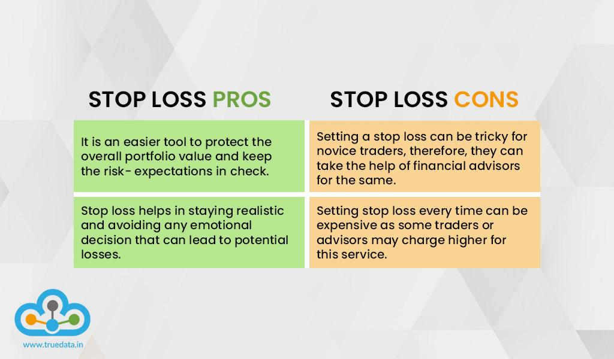

## Table of Contents

## What is a stop-loss order?

A stop-loss order is an instruction you give to your broker to sell a stock if its price falls to a certain level. This helps you limit your losses if the stock's price starts going down a lot. For example, if you bought a stock at $50 and you set a stop-loss order at $45, the stock will be sold automatically if its price drops to $45 or lower.

Using a stop-loss order can be a good way to protect your money when you are investing. It helps you manage risk by setting a limit on how much you are willing to lose on a particular investment. However, it's important to remember that stop-loss orders are not perfect. Sometimes, the price of a stock can drop suddenly and then quickly recover, which means you might sell your stock at a loss even though it could have gone back up in value.

## How does a stop-loss order work?

A stop-loss order is like a safety net for your investments. When you buy a stock, you can tell your broker to sell it if the price drops to a certain level. This level is called the stop price. For example, if you buy a stock for $100 and set a stop-loss order at $90, your broker will automatically sell the stock if its price falls to $90 or below. This helps you limit how much money you could lose if the stock's price goes down a lot.

However, stop-loss orders are not perfect. Sometimes, the stock price might drop suddenly but then quickly go back up. If this happens, your stock could be sold at a lower price even though it could have recovered. This is called getting "stopped out." So, while stop-loss orders can help protect your money, they can also mean you miss out on potential gains if the stock price rebounds after a quick drop.

## What are the main types of stop-loss orders?

There are two main types of stop-loss orders: the standard stop-loss order and the trailing stop-loss order. A standard stop-loss order is set at a specific price. For example, if you buy a stock at $50 and set a stop-loss order at $45, the stock will be sold if its price drops to $45 or lower. This type of order is simple and helps you limit your losses at a fixed point.

A trailing stop-loss order is a bit different. It moves with the stock price. If the stock price goes up, the stop price also goes up, but if the stock price goes down, the stop price stays the same. For example, if you set a trailing stop at 10% below the stock's highest price, and the stock goes from $50 to $60, the stop price will move from $45 to $54. This type of order can help you lock in profits while still protecting against big losses.

## What are the benefits of using a stop-loss order?

Using a stop-loss order can help you protect your money when you invest in stocks. It works by automatically selling your stock if its price drops to a certain level you choose. This way, you can limit how much money you lose if the stock's price goes down a lot. It's like having a safety net that stops you from losing too much.

Stop-loss orders also help you manage your investments without having to watch the stock market all the time. Once you set a stop-loss order, you can relax a bit because you know that your stock will be sold if it hits your stop price. This can save you time and reduce stress, especially if you have a busy life and can't always keep an eye on your investments.

## Can a stop-loss order guarantee a specific selling price?

A stop-loss order does not guarantee a specific selling price. When you set a stop-loss order, you tell your broker to sell your stock if it reaches a certain price. But the stock might keep falling fast, so you might end up selling it for less than your stop price. This can happen because there might not be enough buyers at your stop price, so the sale happens at the next available price, which could be lower.

For example, if you set a stop-loss order at $45 and the stock price suddenly drops to $40, your stock might be sold at $40 instead of $45. This is called "slippage." So, while a stop-loss order helps you limit your losses, it can't promise that you'll sell your stock at the exact price you set. It's a useful tool, but you need to understand that the final selling price might be different from your stop price.

## What are the potential drawbacks of using a stop-loss order?

Using a stop-loss order can have some downsides. One big problem is that the stock price might drop suddenly but then quickly go back up. If this happens, your stock could be sold at a lower price even though it could have recovered. This is called getting "stopped out." So, you might miss out on potential gains if the stock price rebounds after a quick drop.

Another issue is that a stop-loss order doesn't guarantee you'll sell your stock at the exact price you set. If the stock price falls fast, you might end up selling it for less than your stop price. This is called "slippage." So, while a stop-loss order can help limit your losses, it can't promise that you'll sell your stock at the price you want. It's a useful tool, but you need to understand that the final selling price might be different from your stop price.

## How do market gaps affect stop-loss orders?

Market gaps can really mess up stop-loss orders. A market gap happens when a stock's price jumps from one price to another without any trading in between. This can happen overnight or after big news comes out. If the stock price gaps below your stop-loss price, your stock might be sold at a much lower price than you planned. This is because there might not be any buyers at your stop price, so the sale happens at the next available price, which could be a lot lower.

For example, if you set a stop-loss order at $45 and the stock price gaps down to $40 overnight, your stock will be sold at $40 instead of $45. This means you lose more money than you expected. So, while stop-loss orders can help limit your losses, they can't protect you from big price gaps. It's important to know this when you're using stop-loss orders to manage your investments.

## What is the difference between a stop-loss order and a stop-limit order?

A stop-loss order and a stop-limit order are two tools you can use to manage your investments, but they work a bit differently. A stop-loss order tells your broker to sell your stock if its price falls to a certain level, called the stop price. For example, if you set a stop-loss order at $45, your stock will be sold if its price drops to $45 or lower. This helps you limit your losses if the stock's price goes down a lot.

A stop-limit order adds another step to the process. With a stop-limit order, you set both a stop price and a limit price. When the stock price hits the stop price, your order turns into a limit order, which means your stock will only be sold if it can be sold at your limit price or better. For example, if you set a stop price at $45 and a limit price at $44, your stock will only be sold if it can be sold for $44 or more once it hits $45. This gives you more control over the selling price, but it also means your stock might not be sold at all if the price keeps falling and never reaches your limit price.

## How should one determine the optimal placement of a stop-loss order?

Deciding where to set your stop-loss order is important for protecting your money when you invest in stocks. You want to find a balance between limiting your losses and giving your stock enough room to move up and down a bit without getting sold too soon. A good way to start is by looking at how much the stock's price usually changes. If the stock often goes up and down by a certain amount, you might want to set your stop-loss order a bit further away from the current price to avoid selling it too early.

Another thing to think about is how much risk you're okay with. If you don't want to lose too much money, you might set your stop-loss order closer to the price you bought the stock at. But if you're willing to take more risk for a chance at bigger gains, you might set it further away. It's also a good idea to think about any big news or events that could affect the stock's price. If there's something coming up that could make the stock's price jump around a lot, you might want to adjust your stop-loss order to account for that.

## What psychological factors should be considered when setting a stop-loss?

When you set a stop-loss order, your feelings can play a big role. It's easy to feel scared about losing money, so you might set your stop-loss too close to the price you bought the stock at. This can make you sell the stock too soon, even if it might go back up. On the other hand, if you're feeling too hopeful, you might set your stop-loss too far away, hoping the stock will go up even if it's going down. This can lead to bigger losses if the stock keeps falling.

It's important to think about your emotions and try to stay calm when you decide where to set your stop-loss order. You might want to use a clear plan or strategy to help you make a smart choice, instead of letting your feelings take over. Talking to a financial advisor or doing some research can also help you set a stop-loss order that makes sense for your goals and how much risk you're okay with.

## How do professional traders typically use stop-loss orders in their strategies?

Professional traders often use stop-loss orders as part of their trading strategies to manage risk and protect their investments. They carefully choose where to set their stop-loss orders based on technical analysis, like looking at charts and patterns, and their own experience with how the market moves. They might set their stop-loss orders at key levels, like support or resistance points, where the stock price is likely to change direction. This helps them limit their losses if the market goes against their trades.

Some professional traders also use stop-loss orders to lock in profits. They might set a trailing stop-loss order that moves up as the stock price goes up. This way, they can keep some of their gains if the stock starts to fall, but still give the stock room to grow. By using stop-loss orders in this way, professional traders can balance the risk of losing money with the chance to make more profits, helping them stay disciplined and stick to their trading plans.

## What advanced techniques can be used to manage stop-loss orders more effectively?

Professional traders often use a technique called scaling to manage their stop-loss orders better. This means they don't put all their money into one trade at once. Instead, they might buy a stock in smaller amounts over time. As the stock price goes up, they can move their stop-loss order up too. This way, they can lock in some profits while still giving the stock room to grow. It's like climbing a ladder, moving the safety net up with each step, so if they fall, they don't fall as far.

Another advanced technique is using multiple stop-loss orders for the same stock. Traders might set different stop-loss orders at different price levels. For example, they might set one stop-loss at a small loss to protect against sudden drops, and another at a bigger loss to give the stock more room to move. This way, they can manage their risk better and have a plan for different scenarios. It's like having several safety nets at different heights, so no matter how the stock falls, they have a way to limit their losses.

## References & Further Reading

[1]: Bergstra, J., Bardenet, R., Bengio, Y., & Kégl, B. (2011). ["Algorithms for Hyper-Parameter Optimization."](https://papers.nips.cc/paper/4443-algorithms-for-hyper-parameter-optimization) Advances in Neural Information Processing Systems 24.

[2]: ["Advances in Financial Machine Learning"](https://www.amazon.com/Advances-Financial-Machine-Learning-Marcos/dp/1119482089) by Marcos Lopez de Prado

[3]: ["Evidence-Based Technical Analysis: Applying the Scientific Method and Statistical Inference to Trading Signals"](https://www.amazon.com/Evidence-Based-Technical-Analysis-Scientific-Statistical/dp/0470008741) by David Aronson

[4]: ["Machine Learning for Algorithmic Trading"](https://github.com/stefan-jansen/machine-learning-for-trading) by Stefan Jansen

[5]: ["Quantitative Trading: How to Build Your Own Algorithmic Trading Business"](https://books.google.com/books/about/Quantitative_Trading.html?id=j70yEAAAQBAJ) by Ernest P. Chan