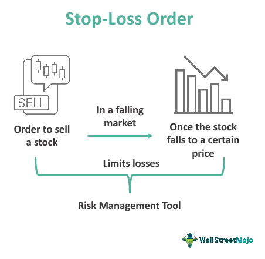

## Table of Contents

## What is a stop-loss order?

A stop-loss order is a tool that investors use to limit their losses when they are trading stocks, currencies, or other financial assets. It works by automatically selling an asset when its price falls to a certain level that the investor has set in advance. This helps protect the investor's money by preventing them from losing more than they are willing to risk.

For example, if you buy a stock at $50 and you set a stop-loss order at $45, the stock will be sold automatically if its price drops to $45. This means you will only lose $5 per share, instead of potentially losing more if the stock keeps falling. Stop-loss orders are popular because they help manage risk and give investors peace of mind, knowing they have a safety net in place.

## How does a stop-loss order work?

A stop-loss order is a way to tell your broker to sell a stock or other asset if its price goes down to a certain level. This level is called the stop price. You choose this stop price when you set up the order. If the price of the stock reaches or goes below the stop price, the stop-loss order turns into a market order. A market order means the stock will be sold right away at the best available price.

For example, imagine you bought a stock for $100 and you want to limit your loss to $10. You can set a stop-loss order at $90. If the stock price drops to $90 or lower, your stop-loss order will kick in and sell the stock. This way, you won't lose more than $10 per share. It's like having a safety net that automatically helps you manage your risk without needing to watch the market all the time.

## Why is a stop-loss important in trading?

A stop-loss is important in trading because it helps you protect your money. When you set a stop-loss, you decide ahead of time how much you're willing to lose on a trade. If the price of what you're trading goes down to that level, the stop-loss will automatically sell it for you. This means you won't lose more money than you planned, which can be really helpful, especially if the market moves quickly and you can't watch it all the time.

Using a stop-loss also helps you manage your emotions when trading. It's easy to get scared or hopeful and make bad decisions if you see prices going up and down. A stop-loss takes the emotion out of it by sticking to your plan. This way, you can trade more calmly and stick to your strategy, which can lead to better results over time.

## What are the different types of stop-loss orders?

There are a few different types of stop-loss orders that traders use. The first type is a standard stop-loss order, which turns into a market order when the price hits the stop price. This means the asset will be sold at the next available price, which can be helpful for getting out of a trade quickly. Another type is a stop-limit order. With this, when the price hits the stop price, it turns into a limit order instead of a market order. This means the asset will only be sold at a specific price or better, which can give you more control but might not guarantee a sale if the price moves too fast.

A third type is a trailing stop-loss order. This one is special because it moves with the price of the asset. You set it as a percentage or a dollar amount below the market price, and it follows the price up as it rises. If the price starts to fall, the trailing stop stays where it is until the price hits it, and then it sells the asset. This can be a good way to lock in profits while still protecting against big losses. Each type of stop-loss order has its own advantages and can be used depending on what you want to achieve in your trading strategy.

## How do you set a stop-loss order?

Setting a stop-loss order is easy and you can do it through your trading platform or with your broker. First, decide on the price at which you want to sell your asset if it goes down. This is called the stop price. Go to your trading account, find the stock or asset you want to set the stop-loss for, and look for an option that says something like "set stop-loss" or "place stop order." Enter the stop price you decided on and confirm the order. Now, if the price of your asset drops to or below that stop price, it will automatically sell.

There are a few things to keep in mind when setting a stop-loss order. Make sure you understand the different types of stop-loss orders, like standard, stop-limit, and trailing stop-loss, because each works a bit differently. Also, think about how much you are willing to lose on the trade and set your stop price accordingly. It's a good idea to set your stop-loss at a level that gives the asset some room to move but still protects you from big losses. Remember, once you set a stop-loss, you can always change it if your plan changes or if the market conditions shift.

## What are the common mistakes to avoid when using stop-loss orders?

One common mistake people make with stop-loss orders is setting them too close to the current price. If you do this, the price might hit your stop-loss just because of normal ups and downs in the market, and you could miss out on a good trade. It's better to give the price some room to move, so think about how much the price usually changes and set your stop-loss a bit further away from that.

Another mistake is forgetting to adjust your stop-loss as the price of the asset changes. If the price goes up, you might want to move your stop-loss up too, so you can lock in some of your profits. A trailing stop-loss can help with this, but you still need to check it and make sure it's set right. Also, don't set and forget your stop-loss. Keep an eye on the market and be ready to change your stop-loss if things change.

Lastly, some people set their stop-loss too far away from the current price because they don't want to sell. This can lead to big losses if the price drops a lot. It's important to find a good balance. Think about how much you're willing to lose and set your stop-loss at a level that makes sense for your trading plan. Remember, the goal of a stop-loss is to protect your money, so don't be afraid to use it wisely.

## How does a stop-loss affect trading psychology?

Using a stop-loss can really help with your feelings when you're trading. It's easy to get scared or excited when prices go up and down. But if you have a stop-loss set, you don't have to worry as much. You know that if the price goes down too far, your stop-loss will sell the asset for you. This can make you feel calmer and less stressed because you have a plan in place.

A stop-loss also helps you stick to your trading plan. Sometimes, people might want to hold onto a losing trade hoping it will turn around. But with a stop-loss, you've already decided how much you're willing to lose. This takes away the temptation to make emotional decisions. By using a stop-loss, you can trade more confidently and keep your emotions in check, which is really important for making good trading choices.

## What is the impact of volatility on stop-loss orders?

Volatility means how much the price of an asset goes up and down. When the market is very volatile, it can make stop-loss orders tricky to use. If you set your stop-loss too close to the current price, the asset might hit your stop-loss just because of normal ups and downs, even if the overall trend is still good. This can cause you to sell too early and miss out on a good trade. So, in a volatile market, you need to set your stop-loss further away from the current price to give the asset more room to move.

On the other hand, if you set your stop-loss too far away in a volatile market, you might end up losing more money than you planned. Big price swings can make the price drop a lot before it comes back up. If your stop-loss is too far away, it won't protect you from these big drops. So, you need to find a good balance. Think about how much the price usually changes and set your stop-loss at a level that makes sense for that asset's [volatility](/wiki/volatility-trading-strategies). This way, you can still protect your money without getting stopped out too early.

## How can stop-loss orders be optimized for different trading strategies?

Stop-loss orders can be optimized for different trading strategies by adjusting the stop price based on the specific goals and time frames of each strategy. For short-term traders, like day traders, setting a tighter stop-loss is often better. This means the stop-loss is closer to the entry price, which helps protect against quick market swings. These traders want to limit their losses quickly because they are in and out of trades fast. On the other hand, long-term investors might set wider stop-losses. They give their investments more room to move because they are holding onto them for a longer time and want to avoid being stopped out by normal market ups and downs.

Another way to optimize stop-loss orders is by using different types of stop-losses that match your strategy. For example, if you're using a trend-following strategy, a trailing stop-loss can be very helpful. It moves up as the price goes up, which helps lock in profits while still protecting against big drops. If you're more focused on specific price levels, a stop-limit order might work better. This type of order lets you set both a stop price and a limit price, so you have more control over the price at which your asset sells. By choosing the right type of stop-loss and setting it at the right level, you can make your trading strategy more effective and better protect your money.

## What are the tax implications of using stop-loss orders?

Using stop-loss orders can affect your taxes because it might change when you sell your stocks or other investments. When you sell something for a profit, you have to pay capital gains tax. If you use a stop-loss and it sells your investment at a profit, you'll owe taxes on that gain. The tax rate depends on how long you held the investment. If you held it for less than a year, it's a short-term capital gain and taxed at your regular income tax rate. If you held it for more than a year, it's a long-term capital gain and usually taxed at a lower rate.

If your stop-loss sells your investment at a loss, you can use that loss to reduce your taxes. This is called tax-loss harvesting. You can use the loss to offset any gains you made from other investments. If your losses are more than your gains, you can use up to $3,000 of the extra loss to reduce your regular income. Any loss you can't use this year can be carried over to future years. So, while stop-loss orders can help you manage your investments, they can also have important tax effects that you should think about.

## How do stop-loss orders interact with other risk management tools?

Stop-loss orders work together with other risk management tools to help keep your money safe when you're trading. One common tool is position sizing, where you decide how much money to put into a trade. By using stop-loss orders along with position sizing, you can set a limit on how much you're willing to lose. For example, if you decide you only want to risk 1% of your trading account on one trade, you can use a stop-loss to make sure you don't lose more than that amount.

Another tool that works well with stop-loss orders is diversification. This means spreading your money across different types of investments so that if one goes down, the others might still be okay. When you use stop-loss orders with a diversified portfolio, you can protect each investment without worrying about all your money being tied up in one place. This way, you can manage your risk better and feel more confident in your trading strategy.

## What advanced techniques can be used to enhance the effectiveness of stop-loss orders?

One advanced technique to enhance the effectiveness of stop-loss orders is using technical analysis to set more precise stop levels. By studying charts and looking at things like support and resistance levels, you can set your stop-loss at a price that makes sense based on past price movements. For example, if you see that a stock often bounces back when it hits a certain price, you can set your stop-loss just below that level. This way, you're less likely to get stopped out by normal ups and downs, but still protected if the price drops a lot.

Another technique is using multiple stop-loss orders for the same trade. This is called a tiered or layered approach. You can set different stop-losses at different price levels. For instance, you might set one stop-loss closer to your entry price to limit small losses, and another further away to protect against bigger drops. This can give you more control over your risk and let you adjust your strategy as the trade goes on. By combining these advanced techniques with your stop-loss orders, you can make your trading plan stronger and better manage your risk.

## How can you implement a stop-loss in your algo trading strategy?

Implementing stop-loss orders into [algorithmic trading](/wiki/algorithmic-trading) strategies involves thoughtful planning and a sound understanding of market dynamics. Here are several practical tips to ensure effective integration:

**Setting Stop-Loss Levels**

1. **Technical Analysis and Indicators**: Set stop-loss levels using technical analysis, which includes support and resistance levels, moving averages, and trend lines. For example, placing a stop-loss just below a support level can prevent excessive downside in a downward market shift.

2. **Market Trends**: Consider the prevailing market trends when setting stop-loss points. In a trending market, a trailing stop-loss order can be beneficial. Trailing stop-losses adjust as the asset price moves favorably, locking in profits while allowing for continued participation in strong trends.

3. **Risk Tolerance**: Customize stop-loss settings based on your individual risk tolerance. A general guideline is the 1% rule, where you don't risk more than 1% of your total capital on a single trade. This can be calculated with the formula:
$$
   \text{Stop-Loss Distance} = \frac{\text{Account Risk in \%} \times \text{Account Balance}}{\text{Position Size}}

$$

**Backtesting Strategies**

Backtesting is crucial to validate the effectiveness of your stop-loss settings. It involves running your trading algorithms on historical data to assess their performance. Key considerations include:

- **Historical Volatility**: Analyze periods of historical data with varying levels of volatility to see how your stop-loss orders perform. This ensures that the stop-loss strategy is robust across different market conditions.

- **Algorithm Adjustments**: Use the insights gained from backtesting to refine your stop-loss parameters. Adjust stop-loss levels dynamically based on market conditions that were previously unaccounted for.

- **Performance Metrics**: Track key performance metrics such as the average win/loss ratio and drawdown statistics. These metrics help in understanding the efficiency of your stop-loss settings in protecting capital and securing profits.

By implementing these strategies, traders can enhance their algo trading systems to be more robust and effective. Careful setting of stop-loss levels, backed by diligent [backtesting](/wiki/backtesting), will help implement a disciplined approach that adapts to market conditions while optimizing risk management.

## References & Further Reading

[1]: Bergstra, J., Bardenet, R., Bengio, Y., & Kégl, B. (2011). ["Algorithms for Hyper-Parameter Optimization."](https://proceedings.neurips.cc/paper/2011/file/86e8f7ab32cfd12577bc2619bc635690-Paper.pdf) Advances in Neural Information Processing Systems 24.

[2]: ["Advances in Financial Machine Learning"](https://www.amazon.com/Advances-Financial-Machine-Learning-Marcos/dp/1119482089) by Marcos Lopez de Prado

[3]: ["Evidence-Based Technical Analysis: Applying the Scientific Method and Statistical Inference to Trading Signals"](https://www.amazon.com/Evidence-Based-Technical-Analysis-Scientific-Statistical/dp/0470008741) by David Aronson

[4]: ["Machine Learning for Algorithmic Trading"](https://github.com/stefan-jansen/machine-learning-for-trading) by Stefan Jansen

[5]: ["Quantitative Trading: How to Build Your Own Algorithmic Trading Business"](https://books.google.com/books/about/Quantitative_Trading.html?id=j70yEAAAQBAJ) by Ernest P. Chan