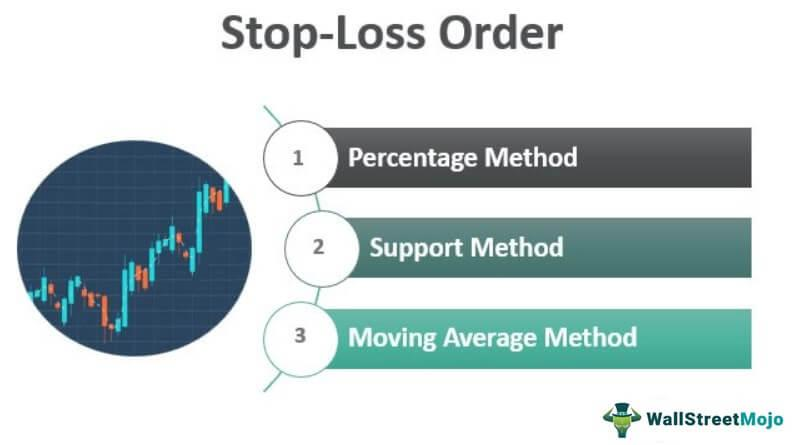

In today's fast-paced financial markets, effective risk management and enhanced trading strategies are paramount for traders who wish to maintain a competitive edge. Stop orders and algorithmic trading are essential tools that have been developed to meet these needs. Stop orders provide a mechanism for automatically executing trades when specified price levels are reached, allowing traders to manage financial risk without constant market monitoring. This ensures that traders can react swiftly to market movements, capitalizing on opportunities while mitigating potential losses.

Algorithmic trading, on the other hand, automates trade execution based on pre-defined rules, significantly increasing efficiency. This automated approach allows for trades to be carried out at speeds and volumes beyond human capabilities, thereby optimizing trade execution and minimizing the impact of market fluctuations. By integrating stop orders with algorithmic trading, traders can enhance their decision-making processes, utilizing sophisticated, data-driven strategies to improve performance outcomes.



This article will explore the concept of stop orders, detailing their functionalities in financial trading and examining how they can be employed strategically. Furthermore, it will discuss the role of algorithmic trading, highlighting its importance in executing trades effectively. The synergy between these components will be analyzed to demonstrate how they can work together to optimize trading performance, providing traders with a comprehensive toolkit for navigating the complexities of contemporary financial markets.

## Table of Contents

## Understanding Stop Orders

Stop orders are essential tools in financial trading, serving as automated triggers to execute buy or sell actions once a particular price threshold is reached. This functionality allows traders to manage their portfolios effectively without the need for continuous market surveillance. By setting predefined price levels, stop orders help traders mitigate risks and capitalize on market movements efficiently.

The primary types of stop orders include stop-loss orders and stop-entry orders. Stop-loss orders are designed to limit an investor's potential losses by triggering a sale when an asset's price drops to a certain level. For example, if a trader holds a stock currently valued at $100 and sets a stop-loss order at $90, the order will automatically sell the stock if its price falls to or below $90. This mechanism can protect investors from significant losses during unfavorable market conditions.

Stop-entry orders, on the other hand, allow traders to enter the market at a predetermined price, which can be advantageous for capturing potential market opportunities. When a market is moving in a favorable direction, a stop-entry order triggers a purchase once the asset reaches a specified price, potentially allowing the trader to gain from continued positive price movements.

Utilizing stop orders strategically can provide traders with significant benefits, including risk management and market entry or [exit](/wiki/exit-strategy) precision. These orders ensure that trades are executed according to the trader's strategy and not influenced by short-term emotions or market noise, which can lead to better decision-making and enhanced trading outcomes.

## Types and Applications of Stop Orders

Stop orders are critical instruments in financial trading, offering traders an automated means to execute trades at specific price levels. These orders are particularly vital in managing risk and maximizing potential opportunities in various market conditions. The primary stop orders, such as stop-loss orders, stop-entry orders, trailing stops, and guaranteed stops, each serve distinct purposes.

**Stop-Loss Orders:** Stop-loss orders are designed to cap potential losses by instructing the sale of an asset when its price falls to a specified level. This mechanism acts as a safeguard against significant losses that could occur in rapidly declining markets. For instance, if an investor holds a stock priced at $100 and sets a stop-loss order at $90, the stock will automatically be sold once its price reaches $90. This eliminates the need for constant portfolio monitoring and provides peace of mind, knowing that the maximum loss is pre-determined.

**Stop-Entry Orders:** Unlike stop-loss orders, stop-entry orders enable traders to enter the market at a predefined price level. These orders are beneficial for capturing market opportunities that might otherwise be missed if the trader is not actively monitoring the market. A stop-entry order for buying is typically placed above the current market price, while a stop-entry order for selling is placed below the current price. This approach is advantageous in scenarios where a trader anticipates a stock will begin to move significantly once a particular price threshold is reached.

**Trailing Stops and Guaranteed Stops:** Trailing stops and guaranteed stops offer additional layers of strategic control and protection, particularly useful in volatile markets. A trailing stop is a dynamic order that adjusts to favorable price changes while maintaining the stop level at a fixed distance. For instance, if a trader sets a trailing stop with a $5 distance on a stock initially priced at $100, the stop adjusts upwards with price increases but remains fixed if the price decreases, thus locking in potential profits while limiting downside risk. Python code for simulating a trailing stop might look as follows:

```python
def trailing_stop(current_price, initial_price, trailing_amount):
    if current_price > initial_price:
        stop_price = current_price - trailing_amount
    else:
        stop_price = initial_price - trailing_amount
    return stop_price
```

Guaranteed stops provide an insurance-type feature for stop orders, ensuring execution at the specified stop level regardless of market gaps or slippages, which are common in highly volatile conditions. This certainty comes, however, at a cost, as a premium is usually charged for employing guaranteed stops.

In conclusion, each type of stop order serves a specific function that can be customized to align with a trader's strategy and risk tolerance. Understanding and utilizing these stop orders effectively can significantly enhance a trader's ability to manage investments dynamically and advantageously within fluctuating markets.

## The Integration of Algo Trading

Algorithmic trading, often referred to as algo trading, automates the trading process by executing trades based on predefined criteria. This functionality provides immense efficiencies by managing trades at speeds and volumes unattainable by human traders. Central to this efficiency are algorithms—sets of instructions that allow computers to execute trades without human intervention. These algorithms can process data inputs, identify trading opportunities, execute orders, and manage risk.

The integration of [algorithmic trading](/wiki/algorithmic-trading) with stop orders yields significant advantages in executing trading strategies. Stop orders are crucial in managing financial risk and ensuring that trades are executed when specific price points are reached without the need for constant market observation. By automating this process through algorithms, traders can enhance decision-making capabilities, respond more rapidly to market changes, and maintain a disciplined approach to trading.

When integrating stop orders into algorithmic trading strategies, traders can employ sophisticated, data-driven approaches. For example, an algorithm can be programmed to place a stop-loss order automatically once a position is opened to manage risk proactively. Similarly, stop-entry orders can be programmed to trigger trades when a particular price condition is met, ensuring timely market entry based on real-time data analysis.

The capacity of algorithms to analyze and respond to a vast array of data inputs enables them to manage trades at a scale and speed that are otherwise impossible. This includes incorporating various technical indicators, market news, and even sentiment analysis to determine optimal trading conditions. The result is a more flexible and responsive trading strategy, capable of adapting to fluctuating market dynamics.

In conclusion, the automation of trading through algorithms, combined with the strategic implementation of stop orders, offers significant benefits for modern traders. This integration not only streamlines trading activities but also enhances the ability to manage risk effectively and optimize trading outcomes based on structured, rule-driven strategies. As technology continues to advance, the alignment between algo trading and stop orders is likely to become increasingly sophisticated, offering new avenues for traders to explore.

## Pros and Cons of Using Stop Orders in Algo Trading

Utilizing stop orders within algorithmic trading offers several benefits and drawbacks. One of the primary advantages is the automation of trading decisions, which removes emotional biases that often accompany manual trading. By following predefined criteria, algorithms execute trades at speed and scale beyond human capability, capturing market opportunities based on strategic pre-set rules. This automation helps ensure that trades are conducted at optimal terms, maximizing potential gains and minimizing losses.

For instance, an algorithm can continuously monitor market conditions and execute a stop-loss order when a position moves unfavorably, effectively capping potential losses without requiring the trader's constant attention. This can be seen as a proactive risk management strategy, crucial in volatile markets where rapid price changes can occur.

However, there are challenges associated with the implementation of stop orders in algorithmic trading. One significant concern is slippage, where high market [volatility](/wiki/volatility-trading-strategies) may cause the execution price to differ from the intended stop order price. This can result in trades executing at less favorable prices than anticipated. While stop orders are designed to curtail losses or secure profits, the inherent market dynamics can sometimes lead to premature execution of these orders, impacting profitability.

Moreover, the integration of stop orders with algorithmic strategies can offer more structured and disciplined trading approaches. By embedding stop order logic into an algorithm, traders can establish a rule-based framework that adapts to various market conditions, potentially reducing traditional risks associated with manual trading. This combination enhances the overall efficacy of trading systems by allowing for swift, data-driven decisions while maintaining a certain level of protection against market unpredictabilities.

For example, consider a trader implementing a moving average crossover strategy. They can integrate stop-loss and stop-entry orders into their algorithm to manage the strategy's exposure systematically. In Python, this might be represented as follows:

```python
def trade_algorithm(data):
    short_window = 50
    long_window = 200
    data['Short_MA'] = data['Price'].rolling(window=short_window).mean()
    data['Long_MA'] = data['Price'].rolling(window=long_window).mean()

    positions = []
    for i in range(len(data)):
        if data['Short_MA'][i] > data['Long_MA'][i]:  # Buy signal
            if not positions or positions[-1] != 'Buy':
                positions.append('Buy')
        elif data['Short_MA'][i] < data['Long_MA'][i]:  # Sell signal
            if not positions or positions[-1] != 'Sell':
                positions.append('Sell')

        # Implementing a stop-loss
        if positions and positions[-1] == 'Buy':
            if data['Price'][i] < stop_loss_price:
                positions.append('Sell')
        elif positions and positions[-1] == 'Sell':
            if data['Price'][i] > stop_loss_price:
                positions.append('Buy')

    return positions

# Example usage
import pandas as pd

# Sample market data
data = pd.DataFrame({'Price': [110, 112, 111, 113, 115, 114, 113, 116, 118, 117]})
stop_loss_price = 110

trade_algorithm(data)
```

In the above code, the algorithm checks moving averages to determine buy/sell actions and applies a simplistic stop-loss strategy to manage risk. While foundational, such systems illustrate the synergy between algorithmic processes and stop orders, emphasizing their utility and constraints in real-world trading.

## Real-World Applications and Examples

Stop orders and algorithmic trading have become crucial tools for managing portfolios and executing trades in today's dynamic financial markets. Let's explore specific instances where these strategies are applied effectively.

### Case Study: Managing Stock Portfolios with Stop Orders During Volatile Markets

Stop orders can be highly effective in protecting portfolios during periods of increased volatility. Consider a scenario where a large institutional investor holds a diversified portfolio of tech stocks. During a sudden market downturn prompted by negative economic news, the investor uses stop-loss orders to limit potential losses.

For example, if the investor holds shares in Company X at a purchase price of $150, they might set a stop-loss order at $130. If the stock's price drops to this level, the stop-loss order triggers an automatic sale, capping potential losses. This approach ensures that the investor does not need to monitor prices constantly, reducing emotional decision-making during volatile periods.

### Examples of Algorithmic Strategies Incorporating Stop Orders for Optimized Futures Trading

Algorithmic trading strategies often integrate stop orders to enhance decision-making in futures markets, where price movements can be rapid and substantial. A popular approach involves the use of trend-following algorithms, which identify and capitalize on market [momentum](/wiki/momentum).

Consider a futures trading system designed to buy when a security's price moves above a specified threshold and sell when it falls below another. This system might integrate stop-entry orders to trigger trades when price thresholds are breached, ensuring that trades align with the emerging trend. For example:

```python
def trend_following_algo(price, entry_point, stop_entry_order):
    if price > entry_point:
        # Execute buy order
        execute_trade('buy')
        # Set stop entry for continuation
        stop_entry_order = price * 1.01  # 1% move up
    elif price < stop_entry_order:
        # Execute sell order
        execute_trade('sell')

# Assume the price series is provided
price_series = [101, 102, 103, 100, 99]

for price in price_series:
    trend_following_algo(price, 100, 101.5)
```

In this example, the algorithm automates the entry and exit of positions while using stop orders to modify future entries and exits based on market conditions, thus optimizing the trading strategy. 

### Automating Responses to Market News and Events

Market events and news have a significant impact on asset prices. Algorithmic systems equipped with stop orders can automate responses to these events more efficiently than human traders. For example, an algorithm may be programmed to adjust stop orders based on specific keywords from a continuous news feed, allowing traders to dynamically hedge risks and capitalize on market opportunities.

When an unexpected event occurs, the system automatically reevaluates the positions and adjusts or sets new stop orders, enabling trades that align with the trader's risk management rules. The timely adjustment of these orders permits the trader to navigate sudden market impacts effectively without requiring direct intervention.

In conclusion, stop orders and algorithmic trading form a powerful combination to manage and optimize trading practices effectively, particularly under volatile market conditions or when responding to market news. This sophisticated blend of techniques allows for improved efficiency, reduced emotional bias, and strategic optimization in trade execution.

## Future Trends in Stop Order and Algo Trading

Emerging technologies such as [artificial intelligence](/wiki/ai-artificial-intelligence) (AI) and [machine learning](/wiki/machine-learning) are increasingly influencing the trajectory of algorithmic trading. These technologies offer sophisticated analytics and predictive capabilities, enabling traders to develop smarter algorithms that can adapt in real time to changing market conditions. AI-driven algorithms can analyze vast datasets, including historical market data, social media sentiment, and economic indicators, providing traders with deeper insights and more precise trading strategies.

Machine learning algorithms, in particular, are designed to improve over time as they process more data. They can identify complex patterns and predict price movements with a high degree of accuracy, thus aiding traders in setting optimal stop prices. By using regression models, clustering, and neural networks, machine learning can refine stop order strategies, reducing the likelihood of triggering stop orders during temporary market fluctuations.

Data analytics is another critical component in enhancing stop order precision. Advanced data analytics tools can process large volumes of data and extract actionable insights that are critical for defining precise stop prices. Traders can employ these tools to backtest their strategies against historical data, optimizing their stop orders for current market conditions. This approach allows for more informed decision-making, leading to better trade outcomes.

As algorithmic trading systems become more sophisticated, they also face increased scrutiny from regulatory bodies. The evolving regulatory landscape aims to ensure market integrity and protect investors from potential risks associated with automated trading. Regulations may focus on ensuring transparency, preventing market manipulation, and maintaining fair trading practices. Automated trading systems, including those employing stop orders, are subject to compliance with these regulations, which might include requirements for pre-trade risk assessments and post-trade reporting.

In summary, the integration of AI, machine learning, and advanced data analytics is pivotal in shaping the future of stop order and algorithmic trading. These technologies enhance the precision and adaptability of trading strategies. However, traders and firms must stay abreast of regulatory changes to effectively leverage these technologies while maintaining compliance.

## Conclusion

The synergy between stop orders and algorithmic trading offers a robust toolkit for modern traders, merging automated efficiency with strategic precision. Stop orders provide a systematic approach to managing risk and ensuring trades are executed under favorable conditions without requiring constant market supervision. Algorithmic trading complements this by processing and executing trades with speed and [volume](/wiki/volume-trading-strategy) that exceed human capabilities, adhering to predefined rules. This combination allows traders to capitalize on market opportunities while minimizing potential losses.

Both stop orders and algorithmic trading present inherent risks. Stop orders might expose traders to slippage, especially in volatile markets, where trades could be executed at prices significantly different from the intended level. Algorithmic trading can amplify this risk if not properly managed, as rapid market movements can lead to unexpected outcomes. Despite these risks, the combined use of these tools can significantly enhance trading efficiency and outcomes by offering a structured, rule-based approach that mitigates traditional trading pitfalls.

Staying informed about technological advances and market dynamics is crucial for effectively leveraging these tools. Emerging technologies, including artificial intelligence and machine learning, promise to refine algorithmic strategies further by offering more precise data analysis and prediction capabilities. Moreover, advancements in data analytics are poised to provide deeper insights into optimal stop prices, enhancing the precision of stop orders. Keeping abreast of these developments, alongside evolving regulatory frameworks, will ensure traders remain competitive and responsibly leverage stop orders and algorithmic trading to their full potential.

## References & Further Reading

[1]: Bergstra, J., Bardenet, R., Bengio, Y., & Kégl, B. (2011). ["Algorithms for Hyper-Parameter Optimization."](https://papers.nips.cc/paper/4443-algorithms-for-hyper-parameter-optimization) Advances in Neural Information Processing Systems 24.

[2]: ["Advances in Financial Machine Learning"](https://www.amazon.com/Advances-Financial-Machine-Learning-Marcos/dp/1119482089) by Marcos Lopez de Prado

[3]: ["Evidence-Based Technical Analysis: Applying the Scientific Method and Statistical Inference to Trading Signals"](https://www.amazon.com/Evidence-Based-Technical-Analysis-Scientific-Statistical/dp/0470008741) by David Aronson

[4]: ["Machine Learning for Algorithmic Trading"](https://github.com/PacktPublishing/Machine-Learning-for-Algorithmic-Trading-Second-Edition) by Stefan Jansen

[5]: ["Quantitative Trading: How to Build Your Own Algorithmic Trading Business"](https://books.google.com/books/about/Quantitative_Trading.html?id=j70yEAAAQBAJ) by Ernest P. Chan