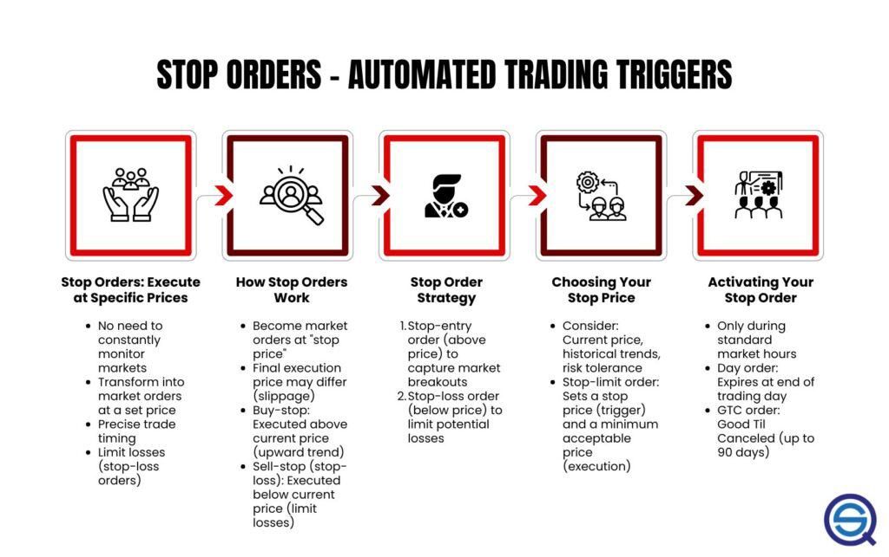

In the world of stock trading, developing a comprehensive strategy is crucial for maximizing profits while minimizing potential losses. Among the various tools at a trader's disposal, stop orders stand out as a critical element, offering automation for both buying and selling decisions. This functionality empowers traders to react swiftly to market conditions without constant monitoring, which is invaluable in the fast-paced environment of stock trading.

The implementation of stop orders within trading strategies serves multiple purposes. Primarily, they act as a risk management tool, providing a safety net against significant market movements that could result in substantial losses. By setting predefined conditions for trade execution, stop orders help in maintaining discipline within the trading process, ensuring that emotional biases are minimized.

This article examines the integration of stop orders into stock trading, focusing on their role within broader investment strategies, along with highlighting their increasing significance in algorithmic (algo) trading. The landscape of stock trading has evolved with technology, and algorithmic trading represents the interplay of automated systems and complex strategies. Stop orders are a foundational element in these systems, enabling precise risk and position management.

Moreover, we'll explore the different types of stop orders, including stop-loss, stop-entry, and trailing stop orders, and analyze their respective advantages and disadvantages. Each type offers unique benefits, suitable for varying market conditions and trader objectives. By understanding these nuances, traders can effectively tailor their strategies to fit both manual and automated trading contexts.

The goal is to equip traders with comprehensive insights into stop orders, enabling them to harness these tools for effective trading. This involves not only recognizing the mechanical aspects of stop orders but also appreciating their strategic value in crafting robust and resilient trading strategies. Whether operating through traditional methods or leveraging advanced algorithmic platforms, a thorough understanding of stop orders can significantly enhance a trader's ability to navigate the complexities of the stock market.

## Table of Contents

## Understanding Stop Orders

Stop orders are a critical tool in stock trading, designed to automatically execute buy or sell instructions once a specified price, known as the stop price, is reached. This mechanism acts as a safety net, protecting traders from significant losses by ensuring trades are executed according to predetermined criteria without the need for constant monitoring. 

There are three primary types of stop orders: stop-loss, stop-entry, and trailing stop orders, each serving distinct purposes and catering to various trading strategies and risk tolerances.

1. **Stop-Loss Orders**: These orders are designed to limit losses by triggering a sell order if the price of a security falls to a predetermined level. For instance, a trader holding shares might set a stop-loss order 10% below the purchase price. If the stock price falls to this level, the stop-loss order becomes a market order, and the shares are sold at the next available price. This helps protect against further decline in stock value.

2. **Stop-Entry Orders**: These orders facilitate entry into a position by triggering a buy or sell order when the security reaches a specified price. Stop-entry orders are often used in momentum trading strategies, allowing traders to enter positions in the direction of the market trend. For example, a trader anticipating upward momentum may place a stop-entry order to buy shares once the price rises above a resistance level.

3. **Trailing Stop Orders**: These orders allow for dynamic adjustment of the stop price as the market price moves favorably. Trailing stops are particularly useful for locking in profits while providing the opportunity for additional gains if the market continues to move in a trader's favor. The trailing stop distance can be set as a fixed amount or a percentage from the current market price. For example, if a stock currently valued at $100 has a trailing stop set at $10, the stop price would automatically rise to $105 if the stock price moves to $115, maintaining the $10 gap.

Understanding each type of stop order is crucial for traders aiming to incorporate them effectively into their trading strategies. These orders offer flexibility and risk management options essential for both novice and experienced traders. By utilizing stop orders strategically, traders can tailor their approach to the market—balancing risk and potential reward—in line with their specific investment objectives and risk appetite.

## Types of Stop Orders

Stop orders are versatile tools in stock trading that facilitate strategic order execution to manage risk and optimize trading outcomes. There are three primary types: stop-loss orders, stop-entry orders, and trailing stop orders, each serving distinct purposes in trading strategies.

Stop-loss orders are designed to limit potential losses by triggering a sell order when the price of a stock falls to a pre-determined level. For instance, if a trader owns a stock currently priced at $100 and sets a stop-loss order at $90, the order will automatically sell the stock if its price drops to $90. This mechanism helps protect traders from significant financial loss, especially in volatile market conditions.

Stop-entry orders, on the other hand, enable traders to enter a market position as the price moves in a desired direction, by setting a buy or sell action once a specific price level is reached. For example, a trader expecting a [breakout](/wiki/breakout-trading) might set a stop-entry buy order slightly above a resistance level. When the price reaches this level, the order activates, allowing the trader to capitalize on upward [momentum](/wiki/momentum).

Trailing stop orders adjust dynamically as market prices move favorably, allowing traders to lock in profits while providing room for potential additional gains. The trailing stop price changes with the market price, maintaining a set distance. For example, a trailing stop set at $5 below the market price would automatically adjust upward as the stock price rises, selling the stock if the price falls more than $5 from its peak.

Utilizing different types of stop orders in combination can effectively manage financial risk and enhance trading performance by accommodating various market conditions and trading goals. For instance, a trader might implement a trailing stop order in tandem with a stop-loss order to secure profit while limiting losses.

Ultimately, the selection of stop orders aligns with the trader’s individual strategies and prevailing market conditions. A cautious trader focused on risk mitigation might favor stop-loss orders, while an aggressive trader seeking to capitalize on market movements may prioritize trailing stops or stop-entry orders. Successful application of these orders requires understanding their unique attributes and strategic use for effective portfolio management.

## Advantages and Disadvantages of Stop Orders

Stop orders present a significant advantage for traders by providing execution guarantees, meaning trades can automatically execute without the trader actively monitoring the markets. This feature is particularly valuable in fast-moving or volatile markets where timely reactions to price changes are crucial. By automating trade entries and exits, stop orders enable traders to maintain more consistent control over their positions, potentially limiting losses and securing profits even when they cannot oversee every market movement.

However, stop orders are not without their downsides. A prominent drawback is their susceptibility to short-term price fluctuations, which can result in unintended executions. For example, a brief price dip might trigger a stop-loss order, selling a position only for the price to rebound shortly after, thereby crystallizing a loss unnecessarily. This situation illustrates the concept of "stop hunting," where price movements briefly hit levels where many stop orders are set, and then reverse. 

Additionally, slippage is a common issue associated with stop orders. Slippage occurs when a trade is executed at a price different from the predetermined stop price, often due to rapid market [volatility](/wiki/volatility-trading-strategies) or insufficient [liquidity](/wiki/liquidity-risk-premium). This discrepancy arises because, once triggered, stop orders become market orders, which are filled at the best available price rather than the stop price itself. While stop orders guarantee execution, the actual trade may occur at a less favorable price, potentially increasing losses or reducing gains.

To strategically incorporate stop orders, traders must weigh these benefits and drawbacks comprehensively. Understanding the market conditions, typical price volatility, and liquidity of the securities involved can help optimize the placement and type of stop orders used. In volatile markets, setting stop orders too close to the current price could increase the risk of slippage or premature execution. Conversely, setting them too far might not provide the needed protection against adverse price movements.

In conclusion, the evaluation of stop orders' pros and cons is essential for traders aiming to integrate these tools effectively within their trading strategies. Through careful analysis and strategic implementation, traders can leverage stop orders to enhance their trading performance while navigating the complexities of market dynamics.

## Stop Order vs. Limit Order

In trading, both stop orders and limit orders are essential tools used to automate transactions, but they have distinct operational characteristics and applications. A stop order is a conditional order that triggers the conversion to a market order once a predetermined stop price is reached. This means it executes at the best available market price after the stop price is met, providing certainty of execution but not of price. Consequently, stop orders are typically used to protect against losses or to enter a position as market prices continue to move in a favorable direction. For example, a stop-loss order would be placed below the current market price to limit potential losses.

On the other hand, a limit order is an order to buy or sell a security at a specific price or better. It is characterized by its ability to enforce price constraints, thus ensuring that transactions are executed only when the market reaches the desired price. While this provides control over the trade price, it does so at the cost of missing out on trades if the market never reaches the specified limit price. For instance, a buy limit order would be set below the current market price, aiming to capitalize on a potential price retracement.

Understanding these differences is crucial for traders to align their trade execution with strategic goals. Stop orders serve as tools for risk management and entry based on momentum, while limit orders cater to price optimization and capturing value at predetermined levels. Traders can exploit these characteristics by employing a combination of stop and limit orders to manage their portfolios more effectively. For example, a trader might use a stop order to initiate a trade once a breakout is confirmed and a limit order to secure profits at a projected resistance level.

By integrating both order types into their strategies, traders can achieve a more nuanced control over trade execution, balancing the need for execution certainty with price precision. This balanced approach allows traders to mitigate risks while optimizing returns in fluctuating market conditions.

## Algorithmic Trading and Stop Orders

Algorithmic trading, often referred to as algo trading, utilizes automated systems to execute trades according to pre-defined rules and criteria. A critical element of these systems is the use of stop orders, which enable automated risk and position management. Stop orders in [algorithmic trading](/wiki/algorithmic-trading) provide a mechanism to implement strategies that can respond dynamically to market conditions.

Stop orders are integral to managing risk in algo trading as they automate decision-making processes that determine when to enter or [exit](/wiki/exit-strategy) positions. By setting stop orders, traders can ensure that losses are minimized if the market moves unfavorably. Additionally, stop orders can apply to profit-taking strategies, ensuring that gains are captured when the asset reaches a favorable price.

Traders can implement complex strategies within algo trading systems by leveraging stop orders. These strategies include adjusting stop prices relative to market movements, thereby locking in profits while allowing flexibility for further gains. For example, a trailing stop order can move the stop price in tandem with an asset's price in a favorable direction, thus securing profits as the asset's value increases.

The integration of stop orders within algorithmic frameworks enhances trading efficiency by allowing precise trade execution. Algorithms can be programmed to monitor numerous variables and execute stop orders without human intervention, reducing the impact of emotions on trading decisions. This precision is particularly crucial in high-frequency trading environments where trades must occur at optimal times based on real-time data.

For those employing algorithmic trading systems, understanding how to effectively use stop orders is crucial for optimizing performance outcomes. A solid grasp of incorporating stop orders in these systems can lead to improved risk management and more consistent returns. As algorithmic trading technology advances, it is likely that the sophistication and utility of stop orders will expand, offering more robust tools to traders operating in diverse market conditions.

## Conclusion

Stop orders are integral to both traditional and algorithmic trading strategies, offering automated mechanisms to manage trades that help mitigate risks and protect investments from adverse market movements. Different types of stop orders, such as stop-loss, stop-entry, and trailing stop orders, provide various options for limiting potential losses and capturing gains, allowing traders to tailor strategies to their specific risk appetites and market conditions. An understanding of these order types and their implications is crucial for crafting effective trading strategies that align with individual goals and market dynamics.

As the financial markets continue to evolve with advancements in technology, integrating stop orders into algorithmic trading promises to expand the scope and sophistication of trading tools available to traders. Algorithmic systems benefit from the precision and efficiency that stop orders provide, enabling real-time adjustments to market conditions and enhancing overall trading performance. For traders leveraging either manual processes or automated systems, a comprehensive grasp of stop orders is vital for achieving consistent success in the ever-changing landscape of stock trading. This understanding equips traders to navigate market fluctuations with confidence while optimizing their strategies for maximum effectiveness.

## References & Further Reading

[1]: ["Advances in Financial Machine Learning"](https://www.amazon.com/Advances-Financial-Machine-Learning-Marcos/dp/1119482089) by Marcos Lopez de Prado

[2]: ["Evidence-Based Technical Analysis: Applying the Scientific Method and Statistical Inference to Trading Signals"](https://www.amazon.com/Evidence-Based-Technical-Analysis-Scientific-Statistical/dp/0470008741) by David Aronson

[3]: ["Machine Learning for Algorithmic Trading"](https://github.com/stefan-jansen/machine-learning-for-trading) by Stefan Jansen

[4]: ["Quantitative Trading: How to Build Your Own Algorithmic Trading Business"](https://www.amazon.com/Quantitative-Trading-Build-Algorithmic-Business/dp/1119800064) by Ernest P. Chan

[5]: Hasbrouck, J. (2003). ["Intraday Price Formation in U.S. Equity Index Markets"](https://onlinelibrary.wiley.com/doi/10.1046/j.1540-6261.2003.00609.x) The Review of Financial Studies, 16(4), 1021-1053.

[6]: Aldridge, I. (2010). ["High-Frequency Trading: A Practical Guide to Algorithmic Strategies and Trading Systems"](https://www.ahmetbeyefendi.com/wp-content/uploads/2020/07/High-Frequency-Trading-Irene-Aldridge.pdf) Wiley.