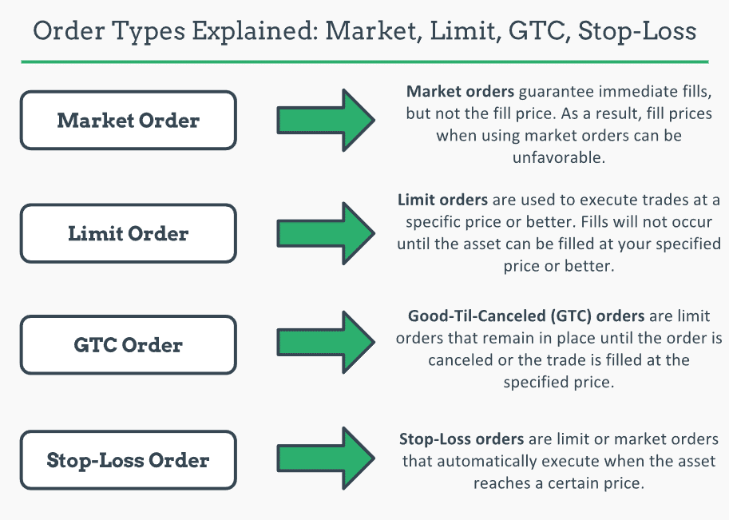

## Table of Contents

## What is a stop order?

A stop order is a type of order you can place with your broker to buy or sell a stock when it reaches a specific price, called the stop price. It helps you manage risk by automatically triggering a trade if the stock price moves in a way you didn't expect. For example, if you own a stock and want to limit your losses, you can set a stop order to sell the stock if its price drops to a certain level.

There are two main types of stop orders: a stop-loss order and a stop-limit order. A stop-loss order becomes a market order once the stop price is reached, meaning it will sell (or buy) the stock at the best available price. This can be useful but might result in a sale at a lower price than expected if the market is moving quickly. On the other hand, a stop-limit order turns into a limit order when the stop price is hit, meaning it will only execute at the limit price or better. This gives you more control over the price but carries the risk that the order might not be filled if the stock price moves away from your limit price.

## What is the difference between a stop order and a limit order?

A stop order and a limit order are two different types of orders you can use when trading stocks. A stop order is used to buy or sell a stock once it reaches a certain price, called the stop price. It's like setting a trigger. When the stock hits that price, the stop order turns into a market order, which means it will buy or sell the stock at the best available price at that moment. This is useful if you want to limit your losses or protect your gains without watching the market all the time.

A limit order, on the other hand, is an order to buy or sell a stock at a specific price or better. Unlike a stop order, a limit order doesn't turn into a market order. It will only be filled at the price you set or better. For example, if you want to buy a stock, you can set a limit order at a lower price than the current market price, and it will only buy the stock if it drops to that price or lower. This gives you more control over the price you pay or receive, but there's a risk that the order might not be filled if the stock never reaches your limit price.

In summary, a stop order is about triggering an action when a stock hits a certain price, while a limit order is about setting a specific price at which you're willing to buy or sell. Both are useful tools, but they serve different purposes depending on what you're trying to achieve in your trading strategy.

## How does a stop-loss order work?

A stop-loss order is a tool that helps you limit your losses when you're trading stocks. It works by setting a specific price, called the stop price, at which you want to sell your stock if it starts to drop. For example, if you bought a stock at $50 and you don't want to lose more than $5, you can set a stop-loss order at $45. If the stock price falls to $45, your stop-loss order will turn into a market order, which means it will sell your stock at the best available price at that moment.

The main benefit of a stop-loss order is that it helps you manage risk without having to watch the market all the time. It automatically triggers a sale if the stock price hits your stop price, which can help prevent bigger losses if the stock keeps falling. However, there's a downside to consider: if the market is moving quickly, your stock might be sold at a price lower than your stop price because a stop-loss order turns into a market order. This means you might end up selling at $44 or even lower if the market is very volatile when your stop price is hit.

## What is a stop-limit order and when should it be used?

A stop-limit order is a type of order that combines the features of a stop order and a limit order. It works by setting two prices: the stop price and the limit price. When the stock price reaches the stop price, the stop-limit order turns into a limit order. This means the stock will only be bought or sold at the limit price or better. For example, if you set a stop price at $45 and a limit price at $44, your stock will only be sold if the price drops to $45 and someone is willing to buy it at $44 or higher.

You should use a stop-limit order when you want more control over the price at which your stock is bought or sold. It's helpful if you're worried about the stock price moving too fast and you want to make sure you get a certain price. However, there's a risk that your order might not be filled if the stock price moves away from your limit price after hitting the stop price. So, it's a good choice when you're willing to take that risk for the sake of getting a better price.

## Can you explain the concept of a trailing stop order?

A trailing stop order is a type of order that helps you protect your profits as a stock's price goes up. It works by setting a stop price that moves along with the stock price. For example, if you set a trailing stop at 10% below the stock's highest price, the stop price will keep increasing as the stock price rises, but it won't go down if the stock price drops. This means if the stock price hits a new high, the stop price moves up to stay 10% below that new high.

This kind of order is useful if you want to lock in gains without having to watch the market all the time. If the stock price starts to fall, the trailing stop will trigger a sale when it reaches the stop price, helping you sell at a higher price than if you had set a fixed stop price. However, like other stop orders, a trailing stop turns into a market order when it's triggered, so there's a risk of selling at a lower price if the market is moving quickly.

## What are the key considerations when setting the stop price for a stop order?

When setting the stop price for a stop order, you need to think about how much risk you're willing to take. If you set the stop price too close to the current price, your stock might get sold even if it's just a small, normal dip in the market. This can happen if the stock price moves around a lot, and you might miss out on potential gains if the price goes back up. On the other hand, if you set the stop price too far away from the current price, you might lose more money than you want if the stock keeps falling.

You should also consider the stock's volatility, which means how much its price goes up and down. If a stock is very volatile, you might want to set a wider stop price to give it room to move without triggering a sale. Another thing to think about is the overall market conditions. If the market is going through a lot of ups and downs, you might need to adjust your stop price to account for that. Lastly, think about your investment goals and how long you plan to hold the stock. If you're in it for the long term, you might be okay with a wider stop price to ride out short-term fluctuations.

## How does the timing of a stop order affect its execution?

The timing of when you place a stop order can really affect when it gets filled. If you set your stop price too close to the current price, your order might get triggered by a small dip in the stock price, especially if the market is moving a lot. This means your stock could be sold even if the price goes back up right after. On the other hand, if you set the stop price far away from the current price, it might take longer for the order to be triggered, which could mean bigger losses if the stock keeps falling.

Also, the time of day you place your stop order can make a difference. The stock market is most active during regular trading hours, so if you place a stop order during this time, it's more likely to be filled quickly. But if you place it after hours or before the market opens, it might not get filled until the market is active again. This can be important if the stock price changes a lot overnight or over the weekend.

## What are the potential risks and benefits of using stop orders?

Using stop orders can help you manage your risk and protect your profits. When you set a stop order, you decide at what price you want to sell your stock if it starts to drop. This can stop you from losing too much money if the stock price falls a lot. It's like having a safety net. Also, stop orders can help you lock in your gains. If you set a trailing stop order, it will move up as the stock price goes up, so you can sell at a higher price if the stock starts to fall.

But there are some risks to think about too. One big risk is that the stock price might hit your stop price and then go back up right away. If this happens, you'll sell your stock and miss out on any gains it might have made later. Another risk is that if the market is moving very quickly, your stop order might turn into a market order and sell your stock at a lower price than you expected. This can happen if there's a lot of panic selling or if the stock price drops fast. So, while stop orders can be helpful, you need to be careful about where you set your stop price and understand that they don't always work out the way you plan.

## How do market conditions influence the effectiveness of stop orders?

Market conditions can really change how well stop orders work. If the market is calm and the stock prices are moving slowly, your stop order is more likely to work the way you want it to. When you set a stop price, it will trigger a sale at that price or close to it. But if the market is moving a lot, like during big news events or economic reports, your stop order might not work as well. The stock price could drop fast and go past your stop price before your order can be filled. This means you might end up selling your stock at a lower price than you planned.

Also, the time of day can affect how your stop order works. During regular trading hours, when lots of people are buying and selling, your stop order is more likely to be filled quickly. But if you set a stop order after the market closes or before it opens, it might not get filled until the market is active again. This can be a problem if the stock price changes a lot overnight or over the weekend. So, it's important to think about what's happening in the market and when you're setting your stop order to make sure it does what you want it to do.

## What advanced strategies involve the use of stop orders?

One advanced strategy that uses stop orders is called "bracket trading." In this strategy, you set up three orders at the same time: a buy order, a stop-loss order, and a take-profit order. When you buy a stock, you also set a stop-loss order to limit your losses if the stock price goes down, and a take-profit order to sell the stock if it goes up to a certain price. This way, you can manage your risk and lock in your gains without having to watch the market all the time. It's like setting up a safety net and a goal at the same time.

Another strategy is using "trailing stop orders" to ride a stock's upward trend. When you set a trailing stop order, the stop price moves up as the stock price goes up, but it doesn't move down if the stock price drops. This means you can keep your gains as the stock price rises, and if the stock starts to fall, the trailing stop will trigger a sale to protect your profits. It's a good way to let your winners run while still having a plan to sell if the stock turns around. This strategy works well in a strong bull market where stock prices are going up a lot.

## How can stop orders be used in algorithmic trading?

In algorithmic trading, stop orders can be used to make trading decisions automatically based on certain rules. Traders can set up their computer programs to place stop orders when a stock reaches a certain price. This helps them manage risk without having to watch the market all the time. For example, if a trader wants to limit losses on a stock, they can program their algorithm to place a stop-loss order at a specific price. When the stock hits that price, the stop order turns into a market order and sells the stock, helping to protect the trader's investment.

Another way stop orders are used in algorithmic trading is for taking profits. Traders can set up their algorithms to place a trailing stop order that moves up as the stock price goes up. This lets them keep their gains as the stock rises, but if the stock starts to fall, the trailing stop will trigger a sale to lock in those profits. This strategy can be especially useful in markets where stock prices are going up a lot, as it helps traders ride the upward trend while still having a plan to sell if the stock turns around.

## What are the best practices for managing stop orders in volatile markets?

In volatile markets, it's really important to set your stop orders carefully. If you set your stop price too close to the current price, your stock might get sold even if it's just a small dip. This can happen a lot when the market is moving up and down a lot. So, you might want to set a wider stop price to give your stock more room to move without selling it too soon. Also, think about how much risk you're okay with. If you're worried about big losses, you might want to set your stop price further away from the current price, but remember, this means you might lose more money if the stock keeps falling.

Another thing to keep in mind is the timing of your stop orders. In a volatile market, prices can change a lot during the day, so placing your stop order during regular trading hours might be better. This way, it's more likely to be filled quickly if the stock hits your stop price. If you place it after the market closes or before it opens, it might not get filled until the market is active again, which can be a problem if the stock price changes a lot overnight or over the weekend. So, think about when you're setting your stop orders and how the market is moving to make sure they work the way you want them to.

## References & Further Reading

[1]: ["Advances in Financial Machine Learning"](https://www.amazon.com/Advances-Financial-Machine-Learning-Marcos/dp/1119482089) by Marcos Lopez de Prado

[2]: ["Evidence-Based Technical Analysis: Applying the Scientific Method and Statistical Inference to Trading Signals"](https://www.amazon.com/Evidence-Based-Technical-Analysis-Scientific-Statistical/dp/0470008741) by David Aronson

[3]: ["Machine Learning for Algorithmic Trading"](https://github.com/stefan-jansen/machine-learning-for-trading) by Stefan Jansen

[4]: ["Quantitative Trading: How to Build Your Own Algorithmic Trading Business"](https://www.amazon.com/Quantitative-Trading-Build-Algorithmic-Business/dp/1119800064) by Ernest P. Chan

[5]: Hasbrouck, J. (2003). ["Intraday Price Formation in U.S. Equity Index Markets"](https://onlinelibrary.wiley.com/doi/10.1046/j.1540-6261.2003.00609.x) The Review of Financial Studies, 16(4), 1021-1053.

[6]: Aldridge, I. (2010). ["High-Frequency Trading: A Practical Guide to Algorithmic Strategies and Trading Systems"](https://www.ahmetbeyefendi.com/wp-content/uploads/2020/07/High-Frequency-Trading-Irene-Aldridge.pdf) Wiley.