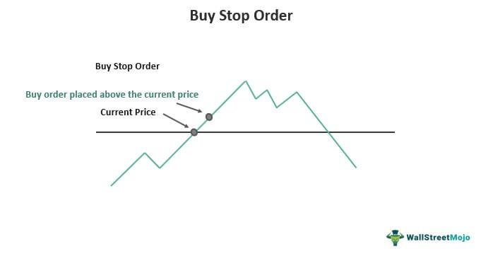

In today's rapidly evolving financial markets, mastering trading strategies is crucial for gaining a competitive edge. The use of stopped order trading, financial orders, and algorithmic trading has become fundamental to enhancing the effectiveness and efficiency of trading operations. Stopped orders, despite being discontinued, provide historical insights into how traders aimed to stabilize markets and manage price volatility. Financial orders serve as the foundation of trade execution, each type offering unique benefits and challenges in terms of risk management and execution precision. Meanwhile, algorithmic trading has transformed the landscape by automating trade execution based on complex algorithms, improving both speed and accuracy.

This article provides a comprehensive examination of these trading mechanisms, their roles, functionalities, and how they integrate within financial trading. We will explore stopped orders' historical significance, delve into the diverse types of financial orders such as market and limit orders, and discuss the pivotal role of algorithmic trading in enhancing strategies through automation and data analysis. By understanding these various elements, traders can gain insights into optimizing trading performance and managing risks effectively.



In today’s markets, the synergy between these trading components allows traders to navigate the increasing complexity and volatility. Stopped orders, despite their historical nature, still inform today's techniques. Financial orders enable precision in execution, while algorithmic trading aids in mitigating risks through predetermined strategies. By equipping themselves with knowledge of these concepts, traders can better navigate the complexities of today's financial landscape, thereby improving their trading outcomes.

## Table of Contents

## Understanding Stopped Orders

Stopped orders were a distinctive category of order condition formerly utilized within the New York Stock Exchange (NYSE) framework. Their primary function was to delay order execution until a more favorable price level was reached. This mechanism was particularly beneficial for forestalling abrupt market fluctuations that could be triggered by substantial orders, thus contributing to price stabilization and ensuring orders were executed at improved prices.

The strategy underpinning stopped orders was aligned with the traditional market environment, where human specialists played a pivotal role in order matching and execution. These orders were essentially a safeguard against the potential volatility-induced market disruptions, allowing traders to manage their positions with greater precision.

Despite their historical significance, stopped orders were officially discontinued in 2016 as the trading landscape evolved toward electronic trading systems. The transition emphasized a diminished necessity for manual intervention by specialists, reflecting the broader shift towards automation and electronic [order book](/wiki/order-book-trading-strategies) systems. This evolution in trading technology diminished the reliance on traditional methods like stopped orders, favoring more advanced and rapid trade execution strategies enabled by electronic platforms.

Analyzing the utilization and eventual obsolescence of stopped orders provides valuable insights into the market's adaptive processes. It highlights the continual evolution of trading techniques in response to technological advancements and changing market dynamics. Such adaptations are essential for maintaining market stability and efficiency, ensuring that trading practices evolve to meet the demands of increasingly complex financial systems. The cessation of stopped orders marks a critical point in the history of trading practices, illustrating the shift from human-centric to technology-driven trading environments.

## Types and Applications of Financial Orders

Financial orders are fundamental instruments in the trading environment, serving as both entry and [exit](/wiki/exit-strategy) points for trades. They are utilized to manage executions in alignment with strategic trading goals while considering risk management. The primary types of financial orders—market orders, limit orders, and stop orders—each possess distinct characteristics and applications, resulting in different impacts on trading outcomes.

**Market Orders**  
Market orders are designed to facilitate immediate execution of trades at the current market price. The primary advantage of market orders is their ability to ensure that trades are completed promptly, regardless of price fluctuations. This type of order is particularly beneficial in highly volatile markets where speed of execution is paramount. However, the prioritization of completion over price may lead to higher transaction costs if the market is moving rapidly, as the trader relinquishes control over the trade price.

**Limit Orders**  
Limit orders address the need for price control in trade executions by allowing traders to specify the maximum or minimum price at which they are willing to buy or sell. By setting a predefined price, traders can ensure that trades do not execute at unfavorable prices. Nonetheless, this comes with the risk of non-execution if the market conditions fail to meet the criteria outlined in the limit order. For instance, a trader might place a buy limit order at $100; if the stock never drops to $100, the trade will not execute. This characteristic of limit orders makes them suitable for traders who prioritize price certainty over execution speed.

**Stop Orders**  
Stop orders, on the other hand, act as a safety mechanism to limit losses or protect profits. A stop order becomes a market order once a predetermined price, known as the stop price, is reached. For example, a stop-loss order placed at 5% below a stock's purchase price will convert to a market order if the stock price falls by 5%, thereby minimizing potential losses. It is crucial to note that, since stop orders become market orders upon activation, there may be a difference between the stop price and the actual execution price, especially in fast-moving markets. 

Strategically applying these order types requires a thorough understanding of market dynamics and the trader's specific objectives, as well as the implications of each order type on risk management. By effectively employing these orders, traders can navigate varying market conditions, aiming to optimize their trading objectives while managing associated risks.

## Algorithmic Trading: Enhancing Efficiency and Precision

Algorithmic trading automates the execution of financial orders by using advanced algorithms that adhere to predefined criteria concerning various parameters such as timing, price, and [volume](/wiki/volume-trading-strategy). This marked departure from manual trading methods aims to increase efficiency, precision, and speed, as well as to substantially decrease the likelihood of human error. By implementing these sophisticated mathematical frameworks, traders can execute a greater volume of trades with more consistent results, factoring in current market conditions instantaneously.

One of the key advantages of [algorithmic trading](/wiki/algorithmic-trading) is its ability to deploy trades at speeds and frequencies that are impossible for human traders to match. This agility enables the system to take advantage of minute price disparities that exist briefly within the market, optimizing trade entry and exit points with remarkable accuracy. Moreover, algorithms rely heavily on data analysis, using historical and real-time data to predict favorable trading conditions, thus optimizing overall trading performance and minimizing the adverse impacts of sudden market fluctuations.

To further optimize trading operations, algorithmic trading frameworks can be integrated with stop orders, an essential risk management tool. Stop orders are particularly beneficial in ensuring that trading strategies remain aligned with predefined parameters, automatically executing trades when specific conditions are met. This integration serves to protect investors from significant losses by providing a safety net against volatile price movements, thereby ensuring that trading strategies can be executed without the need for constant manual oversight.

The transformative nature of algorithmic trading lies in its profound scalability, capable of handling a multitude of trading scenarios simultaneously. This scalability is a result of both the computational power of modern algorithms and their ability to continuously adapt to changing market dynamics without human intervention. Consequently, traders benefit from a trading approach that can rapidly adjust its strategies to maximize returns based on the latest available data, while maintaining the precision necessary to execute each trade to its greatest potential.

In essence, algorithmic trading has redefined the landscape of financial trading operations. The integration of data analysis, speed, and precision through advanced algorithms offers unparalleled advantages that extend beyond mere trade execution. As a result, traders are better equipped to not only navigate but effectively capitalize on the complexities and opportunities prevalent in today's dynamic financial markets.

## Pros and Cons of Using Stop Orders in Algo Trading

The use of stop orders in algorithmic trading presents several advantages and challenges that traders must consider for effective implementation. One of the primary benefits of stop orders is the automation of trade execution. By setting predefined price points, traders can reduce emotional decision-making and minimize the necessity of constant market monitoring. This automation allows traders to maintain a disciplined approach to their trading strategies, executing trades at specified levels without the need for manual intervention.

Stop orders play a significant role in risk mitigation, especially during periods of high market [volatility](/wiki/volatility-trading-strategies). They act as a safety net by triggering trades at predetermined price thresholds, helping to limit potential losses. This capability is particularly crucial in fast-moving markets where prices can fluctuate rapidly, often beyond the capability of human traders to react promptly. The assurance that trades will be executed automatically provides traders with a degree of control over risk exposure.

However, reliance on stop orders is not without its drawbacks. One significant challenge is the potential for slippage. Slippage occurs when market conditions change rapidly, causing the execution price of a stop order to differ from its specified trigger price. This situation can arise in highly volatile markets or when there is insufficient market [liquidity](/wiki/liquidity-risk-premium), leading to trades being executed at less favorable prices than anticipated. As a result, the effectiveness of stop orders in controlling risk can sometimes be compromised.

Integrating stop orders within an algorithmic trading strategy requires careful consideration of several factors. Balancing the speed of execution with precision is essential, as faster execution may increase the likelihood of slippage. Traders must develop strategies to adapt to varying market conditions, taking into account both market liquidity and volatility. This involves determining optimal trigger points for stop orders and continuously adjusting them based on evolving market data.

For example, traders might utilize [machine learning](/wiki/machine-learning) models to predict market movements and adjust stop levels accordingly. By analyzing historical data and real-time market information, algorithms can offer more accurate predictions, which can then be used to set more effective stop levels. Here is a basic example in Python, demonstrating a simplified predictive model using linear regression to adjust stop levels:

```python
import numpy as np
from sklearn.linear_model import LinearRegression

# Historical market data (e.g., price and volume)
data = np.array([[100, 2000], [101, 2200], [99, 2100], [102, 2300]])

# Target variable (e.g., future price movement)
target = np.array([1, -1, 1, -1])

# Train a linear regression model
model = LinearRegression()
model.fit(data, target)

# Predict future price movement to adjust stop level
new_data = np.array([[102, 2400]])  # New market data
predicted_movement = model.predict(new_data)

# Adjust stop level based on prediction
if predicted_movement > 0:
    stop_level = new_data[0][0] * 1.01
else:
    stop_level = new_data[0][0] * 0.99

print("Adjusted Stop Level:", stop_level)
```

This example illustrates a basic approach to using predictive insights to refine stop order strategies. Overall, while stop orders provide important benefits in algorithmic trading, their successful integration hinges on continual strategy adaptation and an understanding of market dynamics.

## Case Studies and Real-World Applications

Real-world applications of stopped orders and algorithmic trading highlight their adaptability and effectiveness under fluctuating market conditions. Notably, traders often employ these strategies to stabilize stock portfolios, especially during periods of heightened volatility. By utilizing stop orders, traders set predefined conditions to limit potential losses, ensuring that stocks are sold if prices fall below a certain threshold. This strategic approach minimizes the emotional decision-making that can occur during market turbulence, providing a layer of protection against severe downturns.

In the context of futures trading, algorithmic strategies integrate stop orders to fine-tune entry and exit points based on prevailing market conditions. Algorithmic trading systems execute orders when specific criteria, such as price or volume benchmarks, are met. This precision ensures that trades capitalize on optimal market conditions, achieving the best possible outcomes. For example, a trader might set an algorithm to sell a futures contract automatically if the market price reaches a certain level, safeguarding gains or curtailing losses.

Moreover, traders utilize algorithmic trading to automate responses to real-time market news and events. This capability ensures rapid adaptation to sudden market shifts, which is crucial in high-frequency trading environments. Algorithms assess live data feeds and execute trades without manual intervention, maintaining alignment with overall market trends and sentiment changes. Such systems safeguard against the immediate effects of unexpected events, allowing traders to effectively manage risks without constant monitoring.

These practical applications underscore the significant impact of stop orders and algorithmic trading on modern trading strategies. By enabling precise, timely trades and mitigating risks associated with volatile markets, these tools enhance decision-making and trading outcomes. The integration of these advanced techniques reflects the evolution of trading practices toward increased automation and strategic sophistication, facilitating improved performance and risk management in financial markets.

## Future Trends in Stopped Order and Algo Trading

As the landscape of financial trading continues to evolve, technological advancements are paving the way for more sophisticated strategies in stopped order and algorithmic trading. Among the most significant developments is the integration of [artificial intelligence](/wiki/ai-artificial-intelligence) (AI) and machine learning (ML) technologies. These tools are reshaping how traders approach the market by offering predictive insights and enabling real-time adjustments to trading parameters.

AI and ML algorithms are capable of processing vast amounts of data at unprecedented speeds, providing traders with deeper market insights. Through the use of pattern recognition and predictive analytics, these technologies can anticipate market movements, allowing traders to execute stop orders with greater precision. This capability not only enhances the efficiency of order execution but also minimizes potential risks associated with volatile market conditions.

Incorporation of AI-driven analytics facilitates more informed decision-making processes. Algorithms can analyze historical data, identify trends, and forecast future price movements, thereby optimizing the entry and exit points for trades. For instance, a machine learning model might be trained to recognize the conditions under which a stock is likely to experience price increases, thus informing the trader when to place a stop order that maximizes potential gains.

Python, as a preferred language for algorithmic trading, offers various libraries and frameworks that support AI and ML applications. Libraries such as TensorFlow and scikit-learn can be utilized to build and deploy predictive models tailored for financial markets. Below is a simple example of a Python code snippet using scikit-learn for predictive analytics:

```python
from sklearn.model_selection import train_test_split
from sklearn.ensemble import RandomForestRegressor
import pandas as pd

# Load market data
data = pd.read_csv('market_data.csv')

# Feature selection
X = data[['previous_close', 'volume', 'volatility']]
y = data['future_price']

# Train/test split
X_train, X_test, y_train, y_test = train_test_split(X, y, test_size=0.2, random_state=42)

# Model training
model = RandomForestRegressor(n_estimators=100, random_state=42)
model.fit(X_train, y_train)

# Predict price movements
predictions = model.predict(X_test)
```

As the capabilities of AI and ML progress, ensuring compliance and transparency in algorithmic trading becomes increasingly important. Regulatory frameworks are evolving to address concerns related to market integrity and ethical trading practices. Maintaining transparency in AI-driven trading operations will likely be a significant focus moving forward. Traders must not only adhere to existing regulations but also anticipate changes that could impact their strategies.

In conclusion, the future of stopped order and algorithmic trading lies in the effective integration of AI and ML, which promise to enhance decision-making and execution precision. As traders leverage these technologies, staying informed about regulatory developments will be vital in maximizing the benefits and ensuring sustainable trading practices.

## Conclusion

The integration of stopped orders with algorithmic trading strategies represents a comprehensive approach to modern trading. These methods collectively enhance trading efficiency by enabling faster and more precise execution of trades, reducing reliance on manual intervention. The automation afforded by algorithmic trading ensures precision in order execution, adhering to pre-established parameters, which is crucial in maintaining consistent trading performance.

Moreover, these combined strategies offer robust risk management tools. Stopped orders, traditionally used to mitigate potential losses by triggering a sale once a certain price level is reached, can be effectively integrated into algorithmic frameworks to manage exposure in volatile markets. This integration can help in systematically limiting risks and protecting against significant market swings that could adversely affect trading portfolios.

While these tools provide substantial benefits, traders must remain vigilant about potential risks such as slippage and market volatility, which can impact trade execution. Slippage occurs when there is a difference between the expected price of a trade and the actual price at which it is executed, often resulting from rapid market movements. Anticipating and mitigating these risks require continuous assessment and adaptation of trading algorithms.

Keeping abreast of technological advancements and regulatory changes is essential for optimizing the benefits of algorithmic and stopped order trading. As technology advances, incorporating elements such as machine learning and AI can enhance trading strategies, making them more predictive and adaptive. Concurrently, understanding evolving regulatory frameworks ensures compliance and maintains the integrity of trading operations.

In conclusion, the strategic use of these advanced trading techniques fosters improved decision-making and optimized trading performance. By harnessing technology and carefully managing risk, traders can navigate the complexities of modern financial markets more effectively. This comprehensive approach not only maximizes potential gains but also safeguards against unforeseen market challenges, establishing a robust foundation for successful trading endeavors.

## References & Further Reading

[1]: Bergstra, J., Bardenet, R., Bengio, Y., & Kégl, B. (2011). ["Algorithms for Hyper-Parameter Optimization."](https://proceedings.neurips.cc/paper/2011/file/86e8f7ab32cfd12577bc2619bc635690-Paper.pdf) Advances in Neural Information Processing Systems 24.

[2]: ["Advances in Financial Machine Learning"](https://www.amazon.com/Advances-Financial-Machine-Learning-Marcos/dp/1119482089) by Marcos Lopez de Prado

[3]: ["Evidence-Based Technical Analysis: Applying the Scientific Method and Statistical Inference to Trading Signals"](https://www.amazon.com/Evidence-Based-Technical-Analysis-Scientific-Statistical/dp/0470008741) by David Aronson

[4]: ["Machine Learning for Algorithmic Trading"](https://github.com/stefan-jansen/machine-learning-for-trading) by Stefan Jansen

[5]: ["Quantitative Trading: How to Build Your Own Algorithmic Trading Business"](https://www.amazon.com/Quantitative-Trading-Build-Algorithmic-Business/dp/1119800064) by Ernest P. Chan