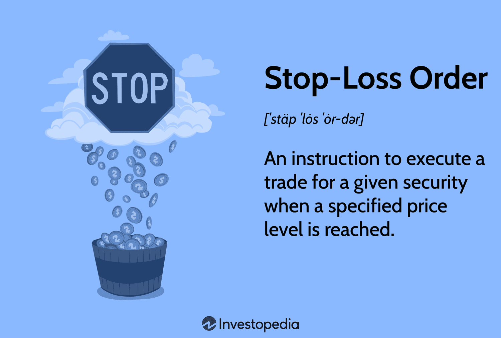

## Table of Contents

## What is a stopped order in finance?

A stopped order, also known as a stop order, is a type of order used in trading to buy or sell a security when it reaches a certain price. This price is called the stop price. When the security's price hits the stop price, the stop order turns into a market order, which means it will be executed at the next available price. This tool is commonly used by traders to limit losses or protect profits.

For example, if you own a stock currently priced at $50 and you want to limit your loss, you might set a stop order at $45. If the stock price drops to $45, your stop order would trigger and turn into a market order, selling your stock at the next available price, which could be slightly above or below $45. This helps prevent further loss if the stock price continues to fall. On the other hand, if you want to protect profits, you could set a stop order above the current price to sell if the stock rises to that level.

## How does a stopped order work?

A stopped order is a tool traders use to buy or sell a stock when it hits a certain price. This price is called the stop price. When the stock reaches the stop price, the stopped order turns into a market order. A market order means the stock will be bought or sold at the next available price. This can help traders limit their losses or protect their profits.

For example, imagine you own a stock that is currently worth $50. You are worried it might go down, so you set a stopped order at $45. If the stock price drops to $45, your stopped order will turn into a market order and sell your stock at the next available price. This could be a little above or below $45. This way, you stop the stock from losing more value if it keeps going down. If you want to protect your profits, you can set a stopped order above the current price to sell if the stock goes up to that level.

## What are the different types of stopped orders?

There are two main types of stopped orders: stop-loss orders and stop-limit orders. A stop-loss order is used to limit a loss or protect a profit on a stock that you own. When the stock reaches the stop price you set, the stop-loss order turns into a market order and sells the stock at the next available price. This can help you avoid losing more money if the stock price keeps dropping.

A stop-limit order is a bit different. It also turns into an order to sell when the stock reaches the stop price, but it becomes a limit order instead of a market order. A limit order means the stock will only be sold at the price you set or better. This gives you more control over the selling price, but there's a risk the stock might not be sold if the price drops too fast and goes below your limit price. Both types of stopped orders can help you manage your investments, but they work in slightly different ways.

## What are the benefits of using stopped orders?

Using stopped orders can help you manage your investments more easily. They let you set a specific price at which you want to buy or sell a stock. This means you don't have to watch the stock all the time. If the stock reaches the price you set, the stopped order will turn into a regular order and buy or sell the stock for you. This can save you a lot of time and stress.

Stopped orders also help you limit your losses or protect your profits. For example, if you own a stock and its price starts to fall, you can set a stopped order to sell it at a certain lower price. This way, you can stop the stock from losing more value. On the other hand, if the stock's price goes up, you can set a stopped order to sell it at a higher price and keep your profits safe. This makes managing your investments easier and can help you make smarter decisions.

## What are the risks associated with stopped orders?

Using stopped orders can be risky because there's no guarantee that your order will be filled at the exact price you set. For example, if you set a stop-loss order to sell a stock at $45 and the stock price suddenly drops to $40, your order might be filled at $40 instead of $45. This is called slippage, and it can lead to bigger losses than you planned for. Also, if the market is very volatile and prices are changing quickly, your stopped order might not be executed at all, leaving you stuck with a stock that's losing value.

Another risk with stopped orders is that they can be triggered by short-term price changes that don't reflect the overall trend of the stock. For instance, if a stock briefly dips to your stop price due to a temporary market fluctuation, your order might be triggered even though the stock's long-term value is still strong. This can cause you to sell the stock too early and miss out on potential gains. It's important to think carefully about where you set your stop price and to keep an eye on market conditions to avoid these kinds of mistakes.

## How do you set up a stopped order?

To set up a stopped order, you need to use a trading platform or an online brokerage account. First, find the stock you want to buy or sell. Then, look for an option to place an order. When you're setting up the order, choose the type of stopped order you want, like a stop-loss order or a stop-limit order. For a stop-loss order, you'll set the stop price, which is the price at which you want the order to turn into a market order. For a stop-limit order, you'll set both a stop price and a limit price, which is the lowest price you're willing to accept for the sale.

Once you've set the stop price and any other necessary details, like the number of shares you want to trade, you can submit the order. The trading platform will keep an eye on the stock price for you. If the stock reaches your stop price, the stopped order will turn into a market order or a limit order, depending on what you chose. This means the stock will be bought or sold at the next available price or at your limit price. Remember to check your order details carefully before submitting to make sure everything is set up the way you want.

## Can a stopped order be modified or canceled after it is placed?

Yes, you can usually modify or cancel a stopped order after you place it, as long as it hasn't been triggered yet. Most trading platforms let you go back into your account and change the stop price or the number of shares, or even cancel the order completely. You just need to find the order in your account, make the changes you want, and save them.

It's important to keep an eye on your stopped orders and make changes if needed. Market conditions can change quickly, and you might decide to adjust your stop price or cancel the order if the stock isn't behaving the way you expected. Just remember, once the stopped order is triggered and turns into a market or limit order, you can't change it anymore. It will go through and buy or sell the stock at the next available price or your limit price.

## What is the difference between a stop-loss order and a stop-limit order?

A stop-loss order is used to limit your losses or protect your profits on a stock. When you set a stop-loss order, you choose a stop price. If the stock reaches this stop price, the order turns into a market order and sells the stock at the next available price. This can help you avoid losing more money if the stock price keeps dropping. However, there's a risk that the stock might be sold at a lower price than you expected if the market is moving quickly.

A stop-limit order works a bit differently. Like a stop-loss order, you set a stop price. But when the stock hits this price, the order turns into a limit order instead of a market order. This means the stock will only be sold at the limit price you set or better. This gives you more control over the selling price, but there's also a risk that the stock might not be sold at all if the price drops too fast and goes below your limit price. Both types of orders can help you manage your investments, but they work in slightly different ways.

## How do market conditions affect the execution of stopped orders?

Market conditions can really change how stopped orders work. If the market is calm and prices are moving slowly, a stopped order might get filled at the exact price you set. But if the market is wild and prices are jumping all over the place, your stopped order might not be filled at the price you wanted. This is called slippage. For example, if you set a stop-loss order to sell at $45, but the stock suddenly drops to $40, your order might be filled at $40 instead. This can mean bigger losses than you planned for.

Also, if the market is very busy and lots of people are buying and selling, your stopped order might not be filled right away. This can be a problem if the stock price keeps moving away from your stop price. Sometimes, a stopped order might not be filled at all if the price moves too fast. It's important to think about how the market is doing when you set up a stopped order, so you can be ready for these kinds of changes.

## What are some common mistakes to avoid when using stopped orders?

One common mistake people make with stopped orders is setting the stop price too close to the current stock price. If the stock price moves around a lot, it might hit your stop price by accident and trigger your order too soon. This can make you miss out on potential gains if the stock price goes back up after a small dip. It's a good idea to give the stock some room to move before your stopped order kicks in.

Another mistake is not thinking about how the market is doing when you set up your stopped order. If the market is really busy and prices are changing fast, your stopped order might not be filled at the price you want. This can lead to bigger losses than you planned for. Always keep an eye on market conditions and be ready to change your stopped order if things get too wild.

## How do stopped orders fit into a broader trading strategy?

Stopped orders are a key part of a broader trading strategy because they help you manage risk and protect your investments. When you're trading, you want to make sure you don't lose too much money if the market goes against you. A stop-loss order can help you do this by automatically selling a stock if it drops to a certain price. This way, you can limit your losses without having to watch the market all the time. It's like having a safety net that catches you if you start to fall.

On the other hand, stopped orders can also help you lock in profits. If you own a stock that's going up, you can set a stop order above the current price to sell it if it reaches that level. This lets you keep the gains you've made without having to sell the stock right away. By using stopped orders as part of your trading strategy, you can be more confident in your investments and focus on making smart decisions, knowing that your risks are managed and your profits are protected.

## What advanced techniques can be used with stopped orders for expert traders?

Expert traders can use a technique called trailing stops with stopped orders. A trailing stop is a type of stop-loss order that moves with the stock price. If the stock price goes up, the stop price moves up too, but if the stock price goes down, the stop price stays where it is. This way, you can lock in profits as the stock price rises, but still protect yourself from big losses if the price suddenly drops. It's like having a safety net that follows the stock as it climbs higher.

Another advanced technique is using multiple stopped orders at different price levels. This can help you manage risk in a more detailed way. For example, you might set a stop-loss order at a lower price to limit your losses, and a stop-limit order at a higher price to lock in profits. By setting up several stopped orders, you can create a more flexible trading strategy that reacts to different market conditions. This can help you make the most of your investments while keeping your risks under control.

## References & Further Reading

[1]: Bergstra, J., Bardenet, R., Bengio, Y., & Kégl, B. (2011). ["Algorithms for Hyper-Parameter Optimization."](https://proceedings.neurips.cc/paper/2011/file/86e8f7ab32cfd12577bc2619bc635690-Paper.pdf) Advances in Neural Information Processing Systems 24.

[2]: ["Advances in Financial Machine Learning"](https://www.amazon.com/Advances-Financial-Machine-Learning-Marcos/dp/1119482089) by Marcos Lopez de Prado

[3]: ["Evidence-Based Technical Analysis: Applying the Scientific Method and Statistical Inference to Trading Signals"](https://www.amazon.com/Evidence-Based-Technical-Analysis-Scientific-Statistical/dp/0470008741) by David Aronson

[4]: ["Machine Learning for Algorithmic Trading"](https://github.com/stefan-jansen/machine-learning-for-trading) by Stefan Jansen

[5]: ["Quantitative Trading: How to Build Your Own Algorithmic Trading Business"](https://www.amazon.com/Quantitative-Trading-Build-Algorithmic-Business/dp/1119800064) by Ernest P. Chan