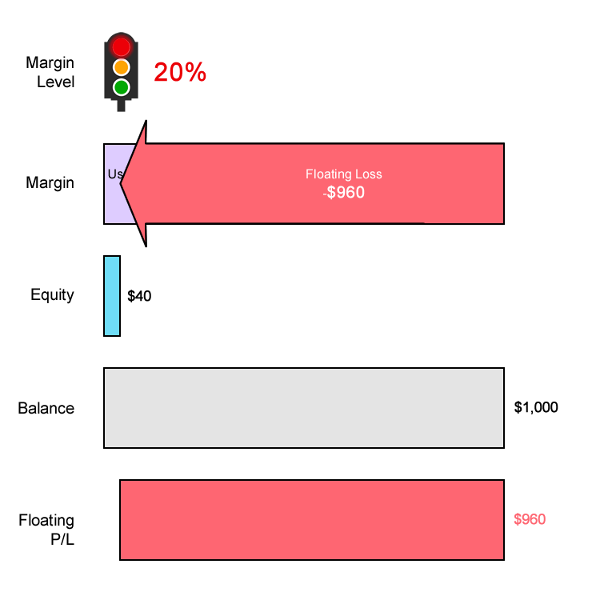

## Table of Contents

## What does it mean to be 'stopped out' in trading?

Being 'stopped out' in trading means that a trader's position is automatically closed by a stop-loss order when the price of the asset reaches a certain level. A stop-loss order is a tool that traders use to limit their losses. For example, if a trader buys a stock at $50 and sets a stop-loss order at $45, the position will be sold automatically if the stock price drops to $45, thus preventing further loss.

This can happen in both buying and selling positions. If a trader is selling a stock (short selling) and the price goes up instead of down, a stop-loss order can also close the position to limit the loss. Being stopped out is a common occurrence in trading and is part of risk management. It helps traders to stick to their trading plan and not let emotions drive their decisions.

## How does a stop-loss order work in trading?

A stop-loss order is like a safety net for traders. It's an order you set up with your broker to sell a stock or other asset if its price drops to a certain level. This level is called the stop price. For example, if you buy a stock at $100 and you're worried it might fall, you can set a stop-loss order at $90. If the stock price hits $90, your stop-loss order turns into a market order, and your stock gets sold at the best available price at that moment.

Stop-loss orders help traders manage risk by limiting how much money they can lose on a trade. It's a way to protect your investment without having to watch the market all the time. If the market moves against you, the stop-loss order kicks in and sells your position before the loss gets too big. However, there's a catch: if the price drops quickly, you might end up selling at a lower price than your stop price, which is known as slippage. Still, using a stop-loss order can help you stick to your trading plan and avoid emotional decisions.

## What are the common reasons traders get stopped out?

Traders often get stopped out because the market moves against their position. This can happen for many reasons, like unexpected news or events that make the price of a stock or other asset go up or down quickly. For example, if a company announces bad news, its stock price might drop fast, hitting the stop-loss level and stopping out traders who were betting on the price going up.

Another common reason is when the market is very volatile. This means the price can swing a lot in a short time. If the price moves a lot, it can easily hit the stop-loss level, even if it's just a temporary dip. Traders might set their stop-loss too close to the current price to try to limit their losses, but this can make it more likely they get stopped out, especially in a choppy market.

Sometimes, traders get stopped out because they set their stop-loss levels too tight. This means the stop price is too close to where they bought or sold the asset. If the market moves normally but with small ups and downs, a tight stop-loss can be triggered, even if the overall trend is still in the trader's favor. It's important for traders to find a balance between protecting their investment and giving the trade enough room to breathe.

## How can beginners avoid being stopped out too frequently?

Beginners can avoid being stopped out too often by setting their stop-loss orders wisely. Instead of placing the stop-loss too close to the entry price, they should give the trade some room to move. This means setting the stop-loss at a level where the price might dip a bit but still has a good chance of bouncing back. For example, if you buy a stock at $50, instead of setting a stop-loss at $49, you might set it at $48 or even $47, depending on how much risk you're willing to take. This gives the stock some space to fluctuate without triggering the stop-loss too soon.

Another way to avoid frequent stop-outs is to understand the market's [volatility](/wiki/volatility-trading-strategies). Some stocks or assets move up and down a lot more than others. If you're trading something that's very volatile, you need to set your stop-loss further away from your entry price. Also, beginners should learn about the asset they're trading. Knowing what news or events can affect the price can help you set a stop-loss that's less likely to be hit by normal market movements. By taking these steps, beginners can reduce the chances of being stopped out too often and give their trades a better chance to succeed.

## What is the difference between a hard stop and a mental stop?

A hard stop is when you set an actual order with your broker to sell your asset if it reaches a certain price. This means the computer will automatically sell your stock without you having to do anything. It's like a safety net that makes sure you don't lose too much money if the price goes down a lot. Once you set a hard stop, it's there until you change it or it gets triggered.

A mental stop is different because it's just a plan in your head. You decide at what price you'll sell, but you have to remember to do it yourself. There's no automatic order with your broker. This means you need to watch the market closely and be ready to sell if the price hits your mental stop level. The good thing about a mental stop is that you can change your mind quickly if the market changes, but it's riskier because you might forget or not be able to sell in time.

## How do market volatility and liquidity affect the likelihood of being stopped out?

Market volatility can make it more likely for traders to be stopped out. When the market is volatile, prices can swing up and down a lot in a short time. If a trader sets a stop-loss order, a big price swing might hit that stop-loss level, even if it's just for a moment. This can cause the trader to be stopped out, even if the price goes back up later. So, in a volatile market, traders need to be careful about where they set their stop-loss orders. They might need to set them further away from the current price to avoid being stopped out too often.

Liquidity also plays a big role in whether a trader gets stopped out. Liquidity means how easy it is to buy or sell an asset without affecting its price too much. In a market with low [liquidity](/wiki/liquidity-risk-premium), there might not be enough buyers or sellers when you want to trade. If a trader's stop-loss order gets triggered in a low liquidity market, it might be hard to sell the asset at the stop price. This can lead to slippage, where the trader ends up selling at a worse price than they planned. So, in markets with low liquidity, traders need to be extra careful with their stop-loss orders to avoid big losses from slippage.

## What strategies can intermediate traders use to manage stop-losses effectively?

Intermediate traders can manage stop-losses effectively by using a trailing stop. A trailing stop moves with the price of the asset as it goes up, but stays at the same level if the price goes down. This way, traders can lock in profits while still protecting against big losses. For example, if a trader buys a stock at $50 and sets a trailing stop of 10%, the stop-loss will move up as the stock price rises. If the stock goes to $60, the trailing stop moves to $54. This means the trader can keep some of the gains even if the price drops later.

Another strategy is to use technical analysis to set stop-loss levels. Intermediate traders can look at support and resistance levels on price charts to decide where to place their stop-loss orders. Support levels are where the price has bounced back up before, and resistance levels are where the price has fallen back down. By setting stop-losses just below support levels or above resistance levels, traders can avoid being stopped out by normal price movements and still protect against bigger drops. This method helps traders make more informed decisions about where to set their stop-losses based on the asset's past behavior.

## How can the placement of a stop-loss order impact trading performance?

The placement of a stop-loss order can really change how well a trader does. If a trader puts the stop-loss too close to the price they bought at, they might get stopped out a lot. This can happen even if the price just goes down a little bit and then goes back up. Getting stopped out often means the trader can miss out on profits if the price keeps going up after they've been stopped out. It can also mean they lose money on a lot of trades, which can hurt their overall performance.

On the other hand, if a trader sets the stop-loss too far away from the buying price, they might lose more money if the price goes down a lot. This can be risky because the trader might end up losing more than they planned. But, setting the stop-loss further away can also give the trade more room to move. This means the trader might stay in the trade longer and have a better chance of making money if the price eventually goes up. So, finding the right spot for a stop-loss is important for balancing risk and reward in trading.

## What psychological factors contribute to traders getting stopped out?

One big reason traders get stopped out is because of fear. When the price of what they bought starts to go down, traders can get scared that they'll lose a lot of money. This fear can make them set their stop-loss orders too close to the price they bought at. They want to make sure they don't lose too much, but this can mean they get stopped out even if the price just dips a little and then goes back up. Fear can make traders too careful and cause them to miss out on profits because they get out of the trade too early.

Another psychological [factor](/wiki/factor-investing) is overconfidence. Some traders might think they know exactly where the price is going to go, so they set their stop-loss orders too far away. They believe the price won't go down that much, so they want to give their trade more room to move. But if the price does go down a lot, they can end up losing more money than they planned. Overconfidence can make traders take too much risk and not protect themselves enough with their stop-loss orders. Balancing fear and overconfidence is important for setting stop-losses in a way that helps traders manage their trades well.

## How do professional traders adjust their stop-loss strategies in different market conditions?

Professional traders change their stop-loss strategies depending on how the market is acting. In a calm market where prices don't move much, they might set their stop-loss orders closer to the price they bought at. This helps them protect their money if the price goes down a little. But, if the market is very busy and prices are moving up and down a lot, they'll set their stop-loss orders further away. This gives their trades more room to move without getting stopped out too soon because of normal price swings. They also look at how easy it is to buy or sell the asset, called liquidity. In a market with low liquidity, they might set their stop-loss further away to avoid selling at a bad price if the market can't handle their order quickly.

In different market conditions, professional traders also use different tools to set their stop-losses. In a market that's going up, they might use a trailing stop. This type of stop-loss moves up with the price, so it can help them keep some of their profits if the price keeps going up. But if the market is going down, they might set a fixed stop-loss at a level where the price has bounced back up before, called a support level. This helps them get out of the trade before the price drops too much. By changing their stop-loss strategies, professional traders can better manage their trades and protect their money no matter what the market is doing.

## What advanced techniques can be used to minimize the risk of being stopped out?

One advanced technique to minimize the risk of being stopped out is using a volatility-based stop-loss. This means setting the stop-loss based on how much the price of the asset usually moves up and down. Traders can use something called the Average True Range (ATR) to figure this out. The ATR shows how much the price has been moving lately. By setting the stop-loss a certain number of ATRs away from the price they bought at, traders can give their trade enough room to move without getting stopped out by normal price swings. This way, they can stay in the trade longer and have a better chance of making money if the price goes up later.

Another technique is using multiple time frames for setting stop-losses. Traders can look at different time frames, like daily, hourly, or even minute-by-minute charts, to see where the price might go. By setting the stop-loss at a level that makes sense on all these time frames, traders can avoid being stopped out by short-term price movements that don't change the bigger trend. This method helps traders make more informed decisions about where to set their stop-losses and can reduce the chances of getting stopped out too often.

## How can traders use technical analysis to set more effective stop-loss levels?

Traders can use technical analysis to set more effective stop-loss levels by looking at support and resistance levels on price charts. Support levels are where the price has bounced back up before, and resistance levels are where the price has fallen back down. By setting the stop-loss just below a support level or just above a resistance level, traders can avoid being stopped out by normal price movements. This way, they can stay in the trade longer and have a better chance of making money if the price goes in their favor. For example, if a trader buys a stock at $50 and sees that the price has bounced back up from $48 before, they might set the stop-loss at $47.50 to give the trade some room to move.

Another way to use technical analysis is by looking at moving averages. Moving averages smooth out price data to show the trend over time. Traders can set their stop-loss just below a key moving average, like the 50-day or 200-day moving average, to protect their trade while still giving it room to move. If the price stays above the moving average, it's a good sign that the trend is still going in the trader's favor. But if the price drops below the moving average, it might be time to get out of the trade. By using these technical indicators, traders can set stop-loss levels that are more likely to keep them in the trade during normal price movements and get them out if the trend changes.

## References & Further Reading

[1]: Bergstra, J., Bardenet, R., Bengio, Y., & Kégl, B. (2011). ["Algorithms for Hyper-Parameter Optimization."](https://dl.acm.org/doi/10.5555/2986459.2986743) Advances in Neural Information Processing Systems 24.

[2]: ["Advances in Financial Machine Learning"](https://www.amazon.com/Advances-Financial-Machine-Learning-Marcos/dp/1119482089) by Marcos Lopez de Prado

[3]: ["Evidence-Based Technical Analysis: Applying the Scientific Method and Statistical Inference to Trading Signals"](https://www.amazon.com/Evidence-Based-Technical-Analysis-Scientific-Statistical/dp/0470008741) by David Aronson

[4]: ["Machine Learning for Algorithmic Trading"](https://github.com/stefan-jansen/machine-learning-for-trading) by Stefan Jansen

[5]: ["Quantitative Trading: How to Build Your Own Algorithmic Trading Business"](https://www.amazon.com/Quantitative-Trading-Build-Algorithmic-Business/dp/1119800064) by Ernest P. Chan