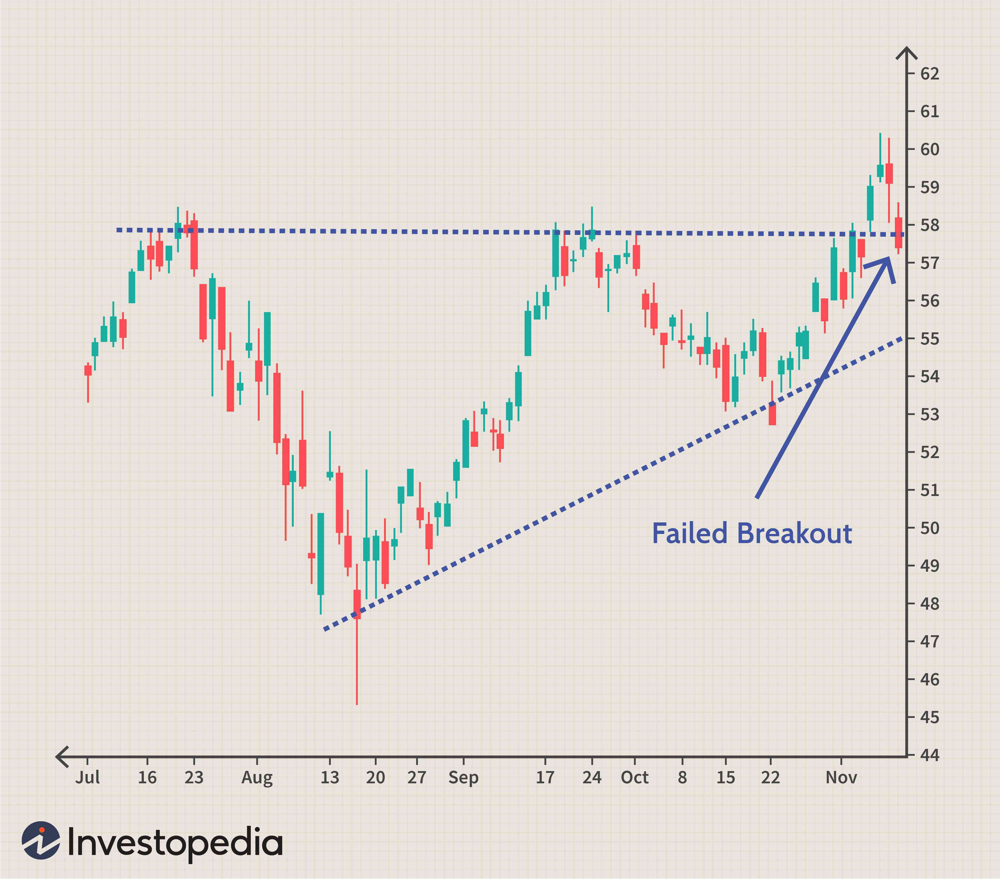

Investment trading strategies are essential tools for both novice and experienced traders aiming to optimize their financial gains while minimizing associated risks. These strategies provide a structured approach to investing, enabling traders to make informed decisions based on a combination of data analysis, market trends, and risk management techniques. 

A pivotal development in the trading world has been the rise of algorithmic trading, commonly referred to as 'algo trading'. This technique utilizes computer algorithms to execute trades automatically, based on predetermined criteria such as timing, price, and volume. Algo trading has dramatically altered the landscape of financial markets by enabling trades to be executed with greater speed and precision than ever before. 



One frequent challenge traders encounter is the phenomenon of being 'stopped out'. This occurs when a trader's position is automatically closed out due to reaching a pre-set stop-loss level, which is designed to limit potential losses. While this mechanism is an effective risk management tool, it can sometimes activate unexpectedly, particularly during periods of high market volatility, potentially leading to missed opportunities and unintentional outcomes.

This article aims to explain investment trading strategies, the concept of getting stopped out, and evaluate how algorithmic trading can both mitigate and exacerbate these situations. Understanding these elements is crucial for traders seeking to refine their strategies and enhance their market performance.

## Table of Contents

## Understanding Trading Strategies

Investment trading strategies involve employing systematic methods to trade financial securities with the primary objective of earning profits. These strategies are designed to capitalize on market inefficiencies and trends and can vary greatly depending on the duration, complexity, and analytical techniques used by traders.

**Variety of Trading Strategies**

1. **Day Trading**: This strategy involves buying and selling securities within the same trading day. Day traders capitalize on small price movements and require a good understanding of market internals and news that can affect prices in short periods. Because holdings are not kept overnight, this approach minimizes the risk associated with overnight market movements.

2. **Swing Trading**: Unlike day trading, swing traders hold positions for several days or even weeks. This method seeks to capture larger price shifts or 'swings' within the market. Swing trading balances the need for active monitoring with less frequent decision-making than day trading.

3. **Long-term Investing**: This strategy entails holding a diverse portfolio of assets over an extended period, often based on thorough research and selection of undervalued stocks. Long-term investors focus on the overall health and potential growth of a portfolio rather than short-term market volatility.

**Analytical Methods**

Two main analytical methods are used to design these strategies: technical analysis and [fundamental analysis](/wiki/fundamental-analysis).

- **Technical Analysis**: This method involves evaluating securities by analyzing statistics generated by market activity, such as past prices and volume. Technical analysts use charts and other tools to identify patterns that suggest future market behavior. Techniques like moving averages, relative strength index (RSI), and chart patterns play a crucial role in this approach.

- **Fundamental Analysis**: This involves assessing a security's intrinsic value by examining related economic, financial, and qualitative and quantitative factors. Fundamental analysts study earnings, economic indicators, company financials, and industry conditions to determine whether a security is undervalued or overvalued. Common metrics used include price-to-earnings ratios, revenue growth rates, and dividend yields.

Each of these strategies and techniques requires a different level of involvement, risk tolerance, and market understanding. They can be utilized independently or in combination, depending on the trader's objectives and market conditions. Understanding these strategies provides a foundation for further exploring how they can be effectively implemented and adjusted to mitigate risks such as being stopped out prematurely.

## What Does 'Stopped Out' Mean?

Being stopped out occurs when a stop-loss order is executed, resulting in the closure of a trading position at a predetermined price point. A stop-loss order is an essential risk management tool designed to limit potential losses for traders. It allows them to set a price level at which their position will be automatically closed if the market moves unfavorably.

This mechanism is particularly important in volatile markets where prices can fluctuate widely within short periods. The objective of a stop-loss is to cap losses by exiting a position before it further deteriorates. For instance, if a trader purchases a stock at $100 and sets a stop-loss order at $95, the position will be automatically sold if the stock price falls to $95, limiting the loss to $5 per share.

However, while the intention of a stop-loss is to prevent large losses, it can sometimes trigger unexpectedly due to temporary price movements or 'noise' in the market. Such premature executions are often referred to as being "whipsawed," where the price hits the stop-loss point briefly and then reverses direction, potentially leading to missed opportunities for gains.

Both manual and [algorithmic trading](/wiki/algorithmic-trading) strategies are susceptible to being stopped out. Manual traders set their stop-loss levels based on their analysis and market expectations, while algorithmic trading systems can automatically calculate and adjust these levels. Nevertheless, algorithmic strategies might experience frequent stop-outs if they are not designed to accommodate sudden market swings or if they lack adaptive measures for different market conditions.

Overall, stop-loss orders are a double-edged sword: they are crucial for managing excessive risk but require careful setting and monitoring to avoid unnecessary exits during transient price shifts.

## Role of Algo Trading in Investment Strategies

Algorithmic trading, commonly abbreviated as algo trading, employs complex computer algorithms to execute trades systematically based on predetermined strategies. One of the primary benefits of utilizing algo trading in investment strategies is the enhancement of trading efficiency and efficacy. This is particularly advantageous under volatile market conditions where rapid decision-making and execution can significantly influence profitability.

Algo trading enables the execution of trades at speeds and frequencies that are impossible for humans to achieve. This high-speed execution facilitates the exploitation of minute market inefficiencies for potential profit. Furthermore, algo trading removes the emotional biases that often plague manual trading, ensuring that trades are executed based on objective criteria defined in the trading algorithms.

Despite these advantages, the design and implementation of an algorithm are crucial. Poorly designed algorithms have the potential to trigger frequent 'stopped out' events, where trades are exited prematurely due to pre-set stop-loss levels being hit. Market [volatility](/wiki/volatility-trading-strategies) can exacerbate this issue, especially if the algorithm does not account for rapid price movements or lacks adaptive mechanisms to adjust stop-loss thresholds dynamically. This can result in diminished potential profits, as trades are closed before realizing their full profit potential.

To illustrate, consider a basic moving average crossover strategy implemented in Python:

```python
import pandas as pd

def moving_average_crossover(prices, short_window=40, long_window=100):
    signals = pd.DataFrame(index=prices.index)
    signals['price'] = prices
    signals['short_mavg'] = prices.rolling(window=short_window, min_periods=1, center=False).mean()
    signals['long_mavg'] = prices.rolling(window=long_window, min_periods=1, center=False).mean()

    signals['signal'] = 0.0
    signals['signal'][short_window:] = np.where(signals['short_mavg'][short_window:] > signals['long_mavg'][short_window:], 1.0, 0.0)   
    signals['positions'] = signals['signal'].diff()
    return signals

# Example of use
prices = pd.Series([1, 2, 3, 4, 5, 6, 7, 8, 9, 10, 11, 12])
signals = moving_average_crossover(prices)
print(signals)
```

In this example, a simple moving average crossover strategy is employed where a buy signal is triggered when a short-term moving average crosses above a long-term moving average. However, if stop-loss levels are not properly calibrated or adaptive, market noise could lead to premature trade exits.

Therefore, the robustness of an algo trading system lies not only in its speed and efficiency but also in the adaptability and accuracy of its algorithms. Developers must rigorously backtest and simulate their strategies against historical data to fine-tune stop-loss settings and ensure that the systems are resilient to varying market conditions. Balancing this precision with risk management principles is essential to maximize the benefits of algo trading in investment strategies.

## Common Issues in Algo Trading

Algorithmic trading, while offering numerous benefits in efficiency and speed, is not without its pitfalls. One significant issue is curve fitting, where the trading algorithm is excessively optimized to reflect historical market data, potentially compromising its ability to perform under new market conditions. This form of over-optimization can lead to misleadingly successful backtests that may not hold in real-world trading scenarios. The primary risk here is that the algorithm might rely too heavily on patterns that were present in the past, failing to accommodate unforeseen variables or changes in market behavior. 

High-frequency trading ([HFT](/wiki/high-frequency-trading-strategies)), a subset of algorithmic trading, represents another challenge. These strategies execute a large number of orders within fractions of a second, exploiting minor price discrepancies for profit. However, the sensitivity to minuscule price changes means such strategies can often trigger stop-loss orders, known as being "stopped out". This frequent stoppage occurs due to what might be considered noise in price movements, rather than any significant market trend or shift. The rapid execution speed, while an advantage, can thus also be a liability, as it multiplies the chances of premature exits from trades, sometimes diminishing potential gains. 

System reliability is another critical issue in algorithmic trading. This encompasses both hardware and software components that must operate seamlessly to execute trades effectively. System failures—whether from hardware malfunctions, power disruptions, or software bugs—can lead to missed opportunities or substantial financial losses. Furthermore, incomplete or inaccurate data feeds can cause trading algorithms to make incorrect decisions. Algorithms depend heavily on the real-time data they are fed; any error in this data can result in unintended trade executions. Incomplete data can skew analytical models, leading to incorrect predictions about market behavior.

To illustrate, consider a simple Python example of an algorithmic trading strategy using historical price data. An over-fitted model might look something like this:

```python
import numpy as np
from sklearn.linear_model import LinearRegression

# Historical stock prices
prices = np.array([100, 102, 101, 105, 107, 108, 110])
# Predictive feature set
days = np.arange(len(prices)).reshape(-1, 1)

# Overfitting Model
model = LinearRegression()
model.fit(days, prices)

# Predict future price
future_day = np.array([[7]])
predicted_price = model.predict(future_day)
```

In this example, the model overfits the linear trend of the given historical prices, making it less robust to predict future market prices which may not follow the same linear pattern. An algorithm that is highly tailored to recognize patterns in such historical data may falter when those patterns do not emerge in future market data, thus exemplifying the risks of curve fitting.

These challenges underscore the necessity of designing robust and adaptable algorithms within algorithmic trading. Traders must ensure their algorithms incorporate mechanisms to adjust and minimize these potential pitfalls, aiming for a balance between optimization for past data and flexibility for future market scenarios.

## Strategies to Avoid Getting Stopped Out Unnecessarily

Avoiding unnecessary stop-outs is a critical aspect of maintaining robust and profitable trading strategies. Traders can employ various techniques to protect their positions and enhance their trading performance. Here are some effective strategies:

### Mental Stops and Hedging with Options

Implementing mental stops involves setting a psychological trigger to [exit](/wiki/exit-strategy) a trade rather than using a hard stop-loss order. This requires discipline and monitoring but helps avoid premature exits due to market noise or temporary volatility spikes. Traders should be cautious, as this may lead to emotional decision-making if not managed properly.

Hedging with options is another effective strategy. By purchasing put options as insurance on long positions or call options for short positions, traders can mitigate potential losses without immediately closing trades. Options provide flexibility and can protect against significant adverse price movements, allowing traders to remain in positions with less risk.

### Diversification

Diversifying trading portfolios by spreading investments across different strategies and markets reduces the impact of isolated failures. Diversification means not only holding a mix of asset classes but also employing a variety of trading strategies like trend-following, mean-reversion, or [arbitrage](/wiki/arbitrage) across different market sectors. This minimizes the risk associated with any single asset or strategy underperforming due to specific market conditions.

### Backtesting and Continuous Monitoring

Proper [backtesting](/wiki/backtesting) involves simulating a trading strategy using historical data to verify its effectiveness and robustness. Key metrics to consider during backtesting include the strategy's Sharpe ratio, drawdown, and win/loss ratio. These metrics help identify whether a strategy can sustain profitability and withstand market volatility.

Continuous monitoring is essential for adapting strategies to changing market conditions. This includes real-time data analysis to detect shifts in market patterns or the emergence of new risks. Implementing systems that automatically alert traders to significant deviations from expected performance enables timely adjustments to the trading strategy.

Traders may use Python libraries such as `pandas`, `numpy`, and `[backtrader](/wiki/backtrader)` for backtesting and developing their algorithmic strategies. Below is a simple example of backtesting a moving average crossover strategy using Python:

```python
import backtrader as bt

class SMACross(bt.Strategy):
    def __init__(self):
        self.sma1 = bt.indicators.SMA(self.data.close, period=10)
        self.sma2 = bt.indicators.SMA(self.data.close, period=50)

    def next(self):
        if self.sma1 > self.sma2:
            self.buy(size=100)  # Buy signal
        elif self.sma1 < self.sma2:
            self.sell(size=100)  # Sell signal

cerebro = bt.Cerebro()
data = bt.feeds.YahooFinanceData(dataname='SPY', fromdate=datetime(2020, 1, 1), todate=datetime(2022, 1, 1))
cerebro.adddata(data)
cerebro.addstrategy(SMACross)
cerebro.run()
cerebro.plot()
```

This code sets up a crossover strategy where a shorter moving average crosses above or below a longer one, signaling buy or sell actions. Such backtesting aids in refining strategies and preparing for actual trading environments.

Overall, these strategies underscore the necessity of disciplined risk management to navigate the complexities of financial markets, ensuring that traders are not unnecessarily stopped out from potentially successful trades.

## Conclusion

Algorithmic trading, often referred to as algo trading, has significantly transformed investment strategies by leveraging computational power to execute trades efficiently and quickly. However, traders must develop a nuanced understanding of stop-loss mechanisms to protect their investments effectively. These mechanisms are particularly crucial in mitigating potential losses and navigating market volatility, where abrupt price moves can lead to substantial financial setbacks.

Balancing risk management with strategy efficacy is essential for successful investment trading. This balance is not merely about configuring an algorithm to react to market changes but ensuring the algorithm's logic aligns with a comprehensive risk management framework. Effective risk management techniques include using stop-loss orders judiciously and understanding their implications on the trading strategy. Implementing quantitative methods to assess and adjust these risk parameters can significantly influence trading outcomes.

Traders and developers must focus on designing robust systems capable of accommodating changing market conditions while reducing unnecessary stop-outs. This involves rigorous backtesting and ongoing evaluation of trading models to ensure their adaptability. Robust systems are typically equipped with mechanisms to fine-tune stop-loss settings dynamically based on market indicators, such as volatility or [liquidity](/wiki/liquidity-risk-premium) levels. For instance, employing [machine learning](/wiki/machine-learning) techniques can provide insights into optimal stop-loss levels under varying conditions, enhancing the algorithm's decision-making process.

Moreover, employing diversification strategies by spreading investments across different asset classes and market conditions can mitigate the adverse effects of strategy-specific failures. Diversification works as a safeguard against isolated market events that might trigger stop-out scenarios, thus preserving the overall portfolio's integrity.

In conclusion, while algo trading presents opportunities for increased efficiency and potentially higher returns, mastery over stop-loss mechanisms is indispensable for minimizing risks. By integrating robust risk management techniques within algorithmic trading frameworks and remaining adaptable to market changes, traders can enhance the resilience and profitability of their investment strategies.

## FAQs

### How do trading strategies work in the stock market?

Trading strategies in the stock market are systematic plans designed to achieve specific investment objectives, primarily gaining profits while managing risk. These strategies can be based on various forms of analysis:

1. **Technical Analysis**: This involves examining past market data, primarily price and volume, to forecast future price movements. Traders use charts and indicators like moving averages or the Relative Strength Index (RSI) to identify patterns and signals for entering or exiting trades.

2. **Fundamental Analysis**: This approach focuses on evaluating a company's intrinsic value by examining financial statements, management, industry conditions, and economic factors. Traders invest based on whether they believe the stock is undervalued or overvalued compared to the market.

3. **Quantitative Analysis**: This utilizes mathematical and statistical models to identify trading opportunities. Algorithms play a significant role in quantitative trading, often executing high-frequency trades across multiple markets.

4. **Seasonality and Event-driven Strategies**: These involve trading based on seasonal trends or specific events that can impact stock prices, such as earnings reports or geopolitical developments.

### How can traders determine if a strategy has stopped working?

Traders can assess the viability of their strategies through various methods:

1. **Consistent Losses**: A clear sign is if the strategy starts yielding consistent losses over a significant period, especially if market conditions remain unchanged.

2. **Decreasing Win Rate**: Monitoring the ratio of wins to losses can indicate if a strategy's edge is diminishing. A significant and sustained drop in this ratio may suggest issues with the strategy.

3. **Performance Metrics**: Metrics such as the Sharpe ratio can measure the risk-adjusted return of a strategy. A declining Sharpe ratio indicates that a strategy might not be adequately compensating for the risks being taken.

4. **Backtesting Results**: Routinely comparing backtested results with real-time performance can indicate discrepancies. If the live performance deviates significantly from backtested outcomes, it might suggest changes in market dynamics or flaws in the model.

### How can traders protect themselves from strategies that stop working?

To safeguard against strategies potentially failing, traders can adopt several precautionary measures:

1. **Regular Monitoring and Adjustment**: Continuously monitor performance and adapt strategies as necessary. Utilizing software for real-time analytics can offer insights into when adjustments may be needed.

2. **Diversification**: Spreading investments across various strategies, asset classes, and markets reduces the impact of any single strategy failing.

3. **Risk Management**: Implementing rigorous risk management techniques, such as setting stop-loss orders at appropriate levels or using options for hedging, can limit potential losses.

4. **Robust Backtesting and Forward Testing**: Before deploying strategies, thorough backtesting using historical data and forward testing in a simulated environment can help validate a strategy's effectiveness.

5. **Machine Learning and AI**: Incorporating machine learning models can allow strategies to adapt dynamically to changing market conditions, potentially identifying new patterns and opportunities that traditional strategies might overlook. 

In Python, a simple framework to backtest a strategy could look like this:

```python
import pandas as pd
from backtesting import Backtest, Strategy
from backtesting.lib import crossover

class SimpleStrategy(Strategy):
    def init(self):
        self.sma_short = self.I(pd.Series.rolling, self.data.Close, 10).mean
        self.sma_long = self.I(pd.Series.rolling, self.data.Close, 30).mean

    def next(self):
        if crossover(self.sma_short, self.sma_long):
            self.buy()
        elif crossover(self.sma_long, self.sma_short):
            self.sell()

# Example usage:
data = pd.read_csv('historical_data.csv', parse_dates=True, index_col='Date')
bt = Backtest(data, SimpleStrategy, cash=10000, commission=.002)
output = bt.run()
print(output)
```
This demonstrates how to apply a simple moving average crossover strategy using historical stock data. Regular evaluation and adaptation of these strategies are crucial in today's dynamic market conditions.

## References & Further Reading

[1]: Bergstra, J., Bardenet, R., Bengio, Y., & Kégl, B. (2011). ["Algorithms for Hyper-Parameter Optimization."](https://dl.acm.org/doi/10.5555/2986459.2986743) Advances in Neural Information Processing Systems 24.

[2]: ["Advances in Financial Machine Learning"](https://www.amazon.com/Advances-Financial-Machine-Learning-Marcos/dp/1119482089) by Marcos Lopez de Prado

[3]: ["Evidence-Based Technical Analysis: Applying the Scientific Method and Statistical Inference to Trading Signals"](https://www.amazon.com/Evidence-Based-Technical-Analysis-Scientific-Statistical/dp/0470008741) by David Aronson

[4]: ["Machine Learning for Algorithmic Trading"](https://github.com/stefan-jansen/machine-learning-for-trading) by Stefan Jansen

[5]: ["Quantitative Trading: How to Build Your Own Algorithmic Trading Business"](https://www.amazon.com/Quantitative-Trading-Build-Algorithmic-Business/dp/1119800064) by Ernest P. Chan