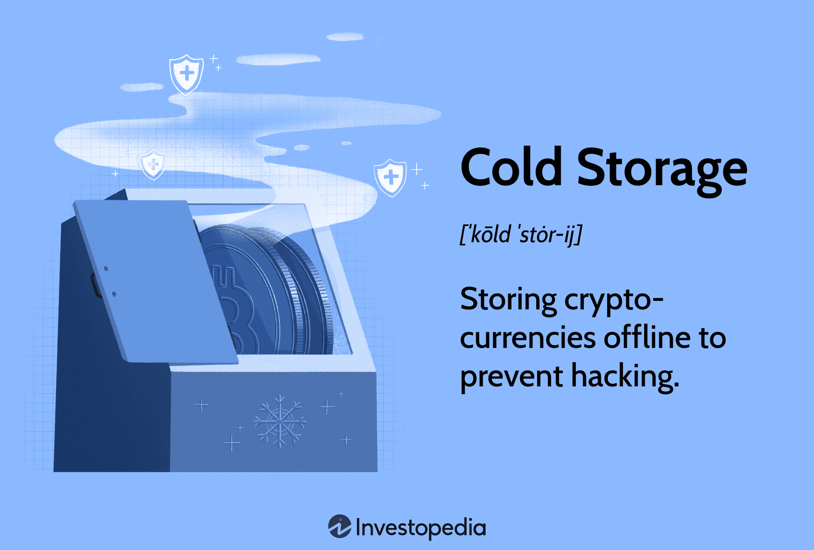

The emergence of Non-Fungible Tokens (NFTs) has significantly altered our perception of digital assets, offering new dimensions and opportunities for investment portfolios globally. Characterized by their unique and indivisible properties, NFTs differ fundamentally from traditional cryptocurrencies like Bitcoin and Ethereum, which are fungible and interchangeable. This distinctiveness has sparked a global interest, resulting in an unprecedented surge in the popularity and value of NFT-based assets across various sectors, including digital art, music, and virtual real estate.

As NFTs evolve from niche interests to mainstream assets, the responsibility of safeguarding them becomes critically important. Unlike physical assets, NFTs exist exclusively in digital form and are recorded on blockchain technology. This immutability and uniqueness make secure storage of NFTs a priority, as any loss or unauthorized access can lead to unrecoverable financial setbacks. Consequently, understanding how to securely manage these digital assets is essential for collectors, traders, and investors seeking to preserve and possibly increase their investments.



This article aims to provide a comprehensive guide on NFT storage, focusing on the types of wallets available, effective security practices, and their potential integration with algorithmic trading. By exploring these aspects, readers can gain a better understanding of how to protect their NFT collections and leverage advanced trading mechanisms. Given the dynamic nature of technology and trading systems, staying informed and implementing robust security measures will help maximize the potential of NFT investments.

## Table of Contents

## What Are NFTs?

Non-fungible tokens (NFTs) are distinctive digital assets embedded within blockchain technology that underscore their singularity and immutability. Unlike cryptocurrencies such as Bitcoin or Ethereum, which are fungible and can be exchanged on a one-to-one basis, NFTs represent unique items with distinct properties that differentiate them from each other. This uniqueness is a key characteristic, making NFTs suitable for various applications that require individuality and provenance.

NFTs encompass a broad spectrum of digital and tangible assets. These include digital art, where creators can tokenize their work, ensuring originality and a demonstrable ownership record. Music, another significant area, sees artists releasing NFTs of their creations, providing fans with exclusive ownership rights. Digital collectibles, virtual real estate, and even metadata related to physical items can also be tokenized as NFTs. Each NFT contains distinct information or properties, such as historical ownership data or bespoke attributes related to the asset it represents. 

The blockchain technology underpinning NFTs assures their uniqueness by keeping a secure, immutable record of each token's metadata and transaction history. This feature is crucial for asserting authenticity and ownership, preventing duplications, and ensuring scarcity, which are vital aspects of their value proposition. Consequently, the manner in which NFTs are stored becomes a vital consideration to prevent unauthorized access or loss, reinforcing their role as valuable digital assets.

## Types of NFT Wallets

NFT wallets are specialized digital storage solutions designed to hold non-fungible tokens, which are unique digital assets recorded on a blockchain. There are primarily two types of wallets for storing NFTs: hot wallets and cold wallets. Both serve the fundamental purpose of managing NFT ownership keys, but they differ significantly in terms of connectivity, security, and accessibility.

### Hot Wallets
Hot wallets are digital wallets connected to the internet, offering the advantage of easy and quick access to NFTs. Since they are online, users can rapidly engage in buying, selling, or trading NFTs without significant setup time. Hot wallets are preferred for their user-friendly interfaces and compatibility with numerous NFT marketplaces and platforms. However, the convenience of hot wallets comes at the cost of increased susceptibility to cyber threats. Being online leaves them vulnerable to hacking attempts, phishing schemes, and malware attacks, necessitating diligent security practices such as enabling Two-Factor Authentication (2FA) and regularly updating wallet applications.

### Cold Wallets
Cold wallets, on the other hand, are offline devices used to store NFT keys, providing enhanced security by keeping them away from potential online threats. They are typically hardware devices that resemble USB drives or similar gadgets, operating independently of internet connectivity. This isolation makes cold wallets a highly secure option for storing valuable NFT collections, as they are immune to online hacking attempts. The trade-off, however, is that accessing NFTs stored in cold wallets involves additional steps, such as connecting the device to a computer and using specialized software. Due to the offline nature, cold wallets are more suitable for long-term storage rather than frequent trading.

By understanding the distinct characteristics and use cases of hot and cold wallets, users can make informed decisions about which type of NFT wallet aligns with their security needs and transaction habits.

## Setting Up an NFT Wallet

Setting up an NFT wallet is akin to configuring a [cryptocurrency](/wiki/cryptocurrency) wallet, with options available in both digital applications and physical hardware formats. This process is instrumental in ensuring the security and accessibility of NFTs. A crucial step in setting up an NFT wallet is verifying its compatibility with the specific blockchain that hosts the NFT, such as Ethereum or Solana. Each blockchain has its unique protocols and standards, requiring a wallet that can effectively interact with them.

The setup process typically begins with selecting a wallet service that meets your needs. For digital app-based wallets, downloading the application from a trusted provider is the first step. Upon installation, users are usually prompted to create a new wallet, which involves generating a secure passphrase. This passphrase acts as a master key, essential for the recovery of the wallet if access is lost. It is critical to store this passphrase securely, as losing it could result in irretrievable financial losses.

Creating a wallet address follows the secure passphrase generation. This address acts as a public endpoint where digital assets can be sent and received. Most wallets automate the address creation process, ensuring that the generated address is compatible with the corresponding blockchain. Users should verify this compatibility, especially when transacting on multiple blockchains, to avoid failed transactions and potential asset loss.

Physical hardware wallets, known as cold wallets, offer an alternative setup process. These wallets provide enhanced security by storing the user's private keys offline. Setting up a hardware wallet involves connecting the device to a computer or mobile device, installing the requisite software, and following prompts to create a wallet and passphrase. While the initial setup might seem cumbersome, the security benefits often outweigh the effort for those holding significant NFT investments.

In summary, the setup of an NFT wallet, whether digital or hardware, requires careful attention to compatibility and security protocols. By meticulously following the setup steps and securing access credentials, users can safeguard their NFTs effectively.

## How to Store NFTs Safely

Ensuring the safe storage of Non-Fungible Tokens (NFTs) is essential to protect them from unauthorized access and loss. One of the foundational steps in safeguarding NFTs is to always back up your seed phrase. The seed phrase is an essential recovery key that allows you to restore access to your digital wallet and consequently, your NFTs, in the unfortunate event of device loss or malfunction. This backup should be stored in a secure, offline location, such as a safe or a secure digital vault, to prevent it from being compromised.

To enhance the security of NFT storage, it's advisable to select wallets that offer advanced security features like Two-Factor Authentication (2FA). 2FA adds an additional layer of security by requiring not only a password but also a second form of authentication, such as a one-time code from an authentication app or a hardware token. By implementing 2FA, you significantly reduce the risk of unauthorized access to your NFT wallet, even if your primary credentials are compromised.

For individuals possessing valuable NFT collections, utilizing a cold wallet may be the optimal choice. Cold wallets, unlike hot wallets, are not connected to the internet. This offline status provides a substantial security advantage by reducing the exposure to potential cyber threats such as hacking or phishing. Cold wallets are typically hardware devices that securely store NFT keys in an encrypted format, ensuring that they remain inaccessible to malicious online actors. This type of storage is particularly recommended for NFTs with significant value or for users who prioritize long-term security over the convenience of real-time access.

## Cost Considerations for NFT Wallets

When considering the storage of Non-Fungible Tokens (NFTs), understanding the cost implications of different wallet types is essential. NFT wallets generally come in two forms: hot wallets and cold wallets, each with distinct cost structures and benefits.

Hot wallets are digital wallets connected to the internet. They are commonly offered as browser extensions or mobile applications and are generally free to download and use. The primary cost associated with hot wallets arises from transaction fees, which can vary based on the blockchain network's demand (e.g., "gas fees" on the Ethereum network). These fees are incurred during the transfer of NFTs or other transactions conducted within the wallet. Users should be aware that, while hot wallets provide convenience and instant access, they often do not require an upfront monetary investment but represent an ongoing cost through transaction fees.

Conversely, cold wallets are hardware devices that store NFT keys offline, enhancing security by minimizing exposure to online threats. The cost of cold wallets, which ranges significantly, is determined by features and brand reputation. Basic models start around $77, but more advanced versions with additional security features or storage capacity can reach up to $400. Brands like Ledger and Trezor offer popular cold wallet options, each with varying price points reflective of their feature sets.

When selecting between these storage solutions, it's crucial to consider the value of your NFT investments and your trading frequency. A straightforward assessment can guide the decision:

1. **Investment Value**: If you have high-value NFT collections, investing in a secure cold wallet may be worthwhile to provide enhanced protection against potential hacking attempts.

2. **Trading Frequency**: For users engaging in frequent NFT trading or transactions, the convenience and lower upfront costs of a hot wallet might be preferable, despite the transaction fees incurred.

Balancing these factors can help you select a storage solution that aligns with your security needs and financial priorities, ensuring the protection and management of your digital assets efficiently and economically.

## Integrating NFTs with Algo Trading

Algorithmic trading, often referred to as algo trading, involves using computer algorithms to execute trades in financial markets automatically. In the context of NFTs, algo trading leverages pre-defined criteria to optimize the buying and selling process of these unique digital assets, enhancing the efficiency and potential profitability of trading strategies.

To successfully integrate NFTs with algo trading, it is essential to understand both blockchain technology and automated trading logic. Blockchains ensure that the provenance and ownership of NFTs are securely tracked and immutable. As NFTs are tokenized on distinct blockchains like Ethereum or Solana, this knowledge becomes foundational for any algo trading initiative.

### API-Driven Integration
Advanced NFT wallets provide capabilities for integration with API-driven trading platforms. These platforms enable real-time transactions by interfacing directly with different NFT marketplaces. An API, or Application Programming Interface, allows software applications to communicate with each other. In the context of NFTs, APIs can fetch real-time data, execute trades, and track ownership changes across marketplaces.

For example, using Python, one might interact with an NFT marketplace API as follows:

```python
import requests

def get_nft_price(marketplace_api_url, nft_id):
    response = requests.get(f"{marketplace_api_url}/nft/{nft_id}/price")
    if response.status_code == 200:
        return response.json()['price']
    return None

# Assume these details are provided
marketplace_api_url = 'https://api.nftmarketplace.com'
nft_id = '123456'
current_price = get_nft_price(marketplace_api_url, nft_id)
print(f"The current price of NFT {nft_id} is {current_price}")
```

This Python code snippet illustrates a simple way to retrieve the price of an NFT from a marketplace API, a foundational step in creating an automated trading strategy.

### Understanding Trading Logic
Successful algo trading with NFTs requires a sophisticated understanding of automated trading logic. It involves defining trading strategies based on certain conditions, such as price thresholds, market trends, or even social sentiment analysis. These conditions must be encoded as algorithmic rules that the trading system can follow without human intervention.

Consider a basic algorithm that decides whether to buy an NFT based on price fluctuations:

1. Monitor the average market price of an NFT.
2. Determine a buy threshold when the price drops below a certain percentage of the average market price.
3. Execute the purchase through the NFT marketplace API.

Pseudocode for this strategy might look like:

```
average_price = calculate_average_price(nft)
buy_threshold = average_price * 0.95  # 5% below average price

if current_price < buy_threshold:
    execute_trade(nft_id, buy)
```

### Emphasizing Real-Time Execution
Integrating real-time execution capabilities is crucial for algo trading success. As NFT markets can be volatile, the ability to execute trades promptly based on algorithmic decisions can capitalize on transient price discrepancies.

In conclusion, merging NFTs with algo trading involves a synergy between blockchain technology and automated systems. Competencies in coding, understanding APIs, and developing robust trading algorithms are imperative for leveraging NFT trading opportunities effectively.

## Advanced Storage Solutions

Multi-signature wallets significantly enhance the security framework of NFT storage by mandating multiple private keys for transaction authorization. This mechanism requires the consent of several authorized individuals before executing a transaction, thus reducing the risk of unauthorized access. Multi-signature functionality often involves setting a consensus structure, where, for instance, two out of three keyholders must approve a transaction. This ensures a collective safeguard against threats such as key theft or loss.

InterPlanetary File System (IPFS) provides a decentralized approach to storing NFT metadata, contributing to greater data persistence and accessibility. Unlike traditional centralized storage solutions, IPFS fragments data across a distributed network, ensuring that files remain retrievable even if a node goes offline. This enhances resilience to data loss due to server failures or cyber-attacks. Using the IPFS allows NFT creators and owners to maintain the integrity and availability of important asset details, such as provenance and ownership history.

Adopting a hybrid storage strategy that combines the advantages of both hot and cold wallets further refines NFT security protocols. Such a strategy involves using hot wallets for frequent transactions due to their convenience and accessibility, while cold wallets securely store NFTs of higher value or those meant for long-term holding. This dual approach optimizes both security and usability, giving NFT owners the flexibility to manage their assets without compromising on safety. 

In the context of implementing hybrid strategies, it's crucial to evaluate the balance between security needs and transaction frequency, ensuring that the NFT storage aligns with the owner's risk tolerance and investment objectives. As blockchain technology evolves, incorporating these advanced storage solutions will be crucial to safeguard NFTs from emerging threats while leveraging the benefits of decentralized systems.

## Conclusion

Securing NFTs involves understanding the nuances of digital asset storage and employing best practices. As NFTs continue to gain popularity, it becomes imperative to comprehend the significance of safeguarding these digital assets. The unique attributes of NFTs, such as their singularity and association with blockchain technology, make secure storage fundamental. With technologies constantly evolving, including algo trading and other blockchain innovations, it is vital for investors and collectors to remain informed and adaptable.

Implementing robust security practices is essential to mitigating risks associated with NFT storage. Whether using hot wallets for frequent transactions or cold wallets for higher security, protecting these assets requires vigilance and strategic planning. For example, using a combination of advanced security features like Two-Factor Authentication (2FA) and backing up seed phrases can protect against potential threats.

Integrating secure storage solutions with technological advancements such as algo trading can further enhance the potential of NFT investments. Algo trading platforms offer automated and optimized strategies for buying and selling NFTs, providing efficiency in managing digital assets. By employing API-driven integrations between advanced NFT wallets and trading systems, users can facilitate real-time transactions while ensuring security. Understanding the mechanics of blockchain transactions and algorithmic logic can aid in maximizing the benefits of combining these technologies.

In conclusion, the dynamic landscape of NFTs necessitates a proactive approach to storage and security. By embracing best practices and technological advancements, NFT owners can protect and potentially amplify the value of their investments. Staying informed and utilizing sophisticated storage solutions will be crucial as NFT ecosystems continue to evolve.

## References & Further Reading

[1]: Antonopoulos, A. M., & Wood, G. (2018). ["Mastering Ethereum: Building Smart Contracts and DApps"](https://www.amazon.com/Mastering-Ethereum-Building-Smart-Contracts/dp/1491971940). O'Reilly Media.

[2]: Haber, S., & Stornetta, W. S. (1991). ["How to Time-Stamp a Digital Document"](https://link.springer.com/article/10.1007/BF00196791). Journal of Cryptology.

[3]: Mougayar, W. (2016). ["The Business Blockchain: Promise, Practice, and Application of the Next Internet Technology"](https://books.google.com/books/about/The_Business_Blockchain.html?id=CEsPDAAAQBAJ). Wiley.

[4]: Narayanan, A., Bonneau, J., Felten, E., Miller, A., & Goldfeder, S. (2016). ["Bitcoin and Cryptocurrency Technologies: A Comprehensive Introduction"](https://press.princeton.edu/books/hardcover/9780691171692/bitcoin-and-cryptocurrency-technologies). Princeton University Press.

[5]: Tapscott, D., & Tapscott, A. (2016). ["Blockchain Revolution: How the Technology Behind Bitcoin and Other Cryptocurrencies is Changing the World"](https://archive.org/details/blockchainrevolu0000taps). Portfolio.