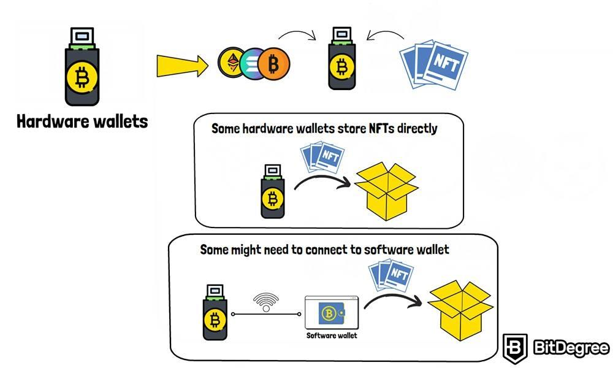

## Table of Contents

## What are NFTs and why is storage important for them?

NFTs, or Non-Fungible Tokens, are unique digital items that you can own and trade on the internet. They are like special digital certificates that prove you own something, like a piece of art, a video, or even a tweet. Each NFT is one-of-a-kind and cannot be swapped for another NFT because they are not the same, just like how a painting by a famous artist is different from another painting.

Storage is really important for NFTs because they need a safe place to live on the internet. When you buy an NFT, it's not just the token you're getting; you're also getting the digital file that goes with it, like an image or a video. This file needs to be stored somewhere that won't go away or get lost. If the storage isn't good, the file could disappear, and then your NFT wouldn't be worth much because the thing it represents would be gone. So, having reliable storage makes sure your NFT stays valuable and safe.

## What are the basic storage options available for NFTs?

There are a few main ways to store NFTs. The first way is to use centralized storage, which means your NFT's digital file is kept on servers owned by a company. This is like storing your stuff in a friend's house. It can be easy and cheap, but if the company has problems or goes away, your NFT's file could be in trouble. Some popular centralized storage options are services like Google Drive or Amazon Web Services.

Another option is decentralized storage, which is like storing your stuff in a community safe that lots of people look after. This uses blockchain technology, where the file is broken into pieces and spread out across many computers around the world. This way, it's harder for the file to be lost or taken away, but it can be more complicated to set up and might cost more. A well-known decentralized storage option is the InterPlanetary File System (IPFS).

Lastly, you can also store NFTs on your own computer or an external hard drive. This is like keeping your stuff at home. It gives you full control over your NFT's file, but if your computer breaks or gets lost, your NFT could be at risk. It's important to back up your files if you choose this method.

## How does storing NFTs on a blockchain work?

When you store NFTs on a blockchain, you're using a special kind of computer network that's spread out all over the world. Instead of keeping the whole NFT file in one place, the blockchain breaks it into tiny pieces and scatters them across many different computers. This makes it really hard for anyone to mess with your NFT or make it disappear. Each piece of your NFT is recorded on the blockchain, kind of like writing it down in a big, shared notebook that everyone can see but no one can change without everyone agreeing.

To make sure your NFT stays safe and can be found, the blockchain uses something called a hash. A hash is like a special code that points to where all the pieces of your NFT are stored. This code is written on the blockchain, and anyone who wants to see your NFT can use the hash to put all the pieces back together. This way, even if one computer goes offline, your NFT won't be lost because the other computers still have the pieces and the hash helps everyone find them.

## What are the differences between centralized and decentralized storage for NFTs?

Centralized storage for NFTs means keeping the digital file on servers that are owned and managed by a single company, like Google or Amazon. It's like putting your stuff in a friend's house. This can be easy and often cheaper because the company takes care of everything. But there's a risk: if the company has problems, goes out of business, or decides to stop storing your file, your NFT could be in trouble. You don't have full control over your NFT's file because it's in someone else's hands.

Decentralized storage for NFTs, on the other hand, uses a network of many computers around the world, like a community safe where everyone helps look after your stuff. It uses blockchain technology to break your NFT's file into small pieces and spread them out across this network. This makes it really hard for anyone to mess with or lose your NFT because it's not all in one place. It might be more complicated to set up and could cost more, but you have more control and security because the file is shared and protected by many people.

## How can you ensure the security of your NFTs in storage?

To keep your NFTs safe in storage, it's important to choose the right kind of storage. If you use centralized storage, pick a reliable company that has a good track record of keeping data safe. Make sure they have strong security measures in place, like encryption and regular backups. Also, keep an eye on the company to make sure it's still doing well and won't suddenly go out of business.

If you go with decentralized storage, make sure the blockchain network you choose is secure and trusted. Look for networks that have been around for a while and are used by lots of people. It's also a good idea to keep your own backups of your NFT files, just in case something goes wrong with the network. By spreading your files across different places, you add an extra layer of safety.

No matter which storage you choose, always use strong passwords and enable two-[factor](/wiki/factor-investing) authentication if it's available. Be careful about who you share information with, and keep your private keys safe. By being careful and choosing the right storage, you can help make sure your NFTs stay secure.

## What are the costs associated with different NFT storage methods?

Centralized storage for NFTs can be pretty cheap. Companies like Google or Amazon offer storage services that you pay for based on how much space you use. It's like renting a small locker at a big store. The cost can be as low as a few dollars a month for a small amount of space. But if you want more space or need special features like extra security, the price can go up. Also, remember that if the company decides to change their prices or goes out of business, you might have to pay more or find a new place to store your NFTs.

Decentralized storage, like using the blockchain, can be a bit more expensive. This is because the files are spread out across many computers, and you have to pay each computer owner a little bit for storing your NFT. The cost depends on how big your file is and how long you want it to be stored. It can range from a few cents to a few dollars per month for each file. But the good thing is that once you pay, the file is usually safe and secure, and you don't have to worry about a company going out of business.

Storing NFTs on your own computer or an external hard drive can be the cheapest option if you already have the equipment. You just need to buy the storage once, and it's yours. But if your computer or hard drive breaks, you'll have to pay to fix or replace it. It's a good idea to have backups, which might mean buying extra hard drives or using cloud storage, which adds to the cost. So, while it can start out cheap, you need to be ready for possible extra costs to keep your NFTs safe.

## How do you choose the right storage solution for your NFTs?

Choosing the right storage solution for your NFTs depends on what you need and how much you want to spend. If you want something easy and cheap, centralized storage might be the way to go. Companies like Google or Amazon have services that are simple to use and don't cost much. But remember, if the company has problems or goes away, your NFTs could be at risk. So, you need to pick a company that you trust and that has a good history of keeping data safe.

If you want more control and security, decentralized storage could be better. This uses blockchain technology to spread your NFT's file across many computers around the world, making it harder for anyone to mess with it. It might cost a bit more and be trickier to set up, but it gives you peace of mind because your NFT is safer. Just make sure to choose a trusted blockchain network that lots of people use.

Storing NFTs on your own computer or an external hard drive can be the cheapest option if you already have the equipment. It gives you full control over your files, but you need to be careful. If your computer breaks or gets lost, your NFTs could be in trouble. It's a good idea to have backups, which might mean buying extra hard drives or using cloud storage, adding to the cost. So, think about how much you're willing to spend and how much risk you're okay with when choosing where to store your NFTs.

## What are the best practices for managing and organizing NFT storage?

To manage and organize your NFT storage well, start by choosing a storage method that fits your needs. If you go with centralized storage, pick a reliable company that has a good history of keeping data safe. Make sure to use strong passwords and enable two-factor authentication if it's available. Keep track of where your NFTs are stored and make sure you have backups in case something goes wrong. If you choose decentralized storage, make sure the blockchain network you use is trusted and has been around for a while. Keep your private keys safe and don't share them with anyone.

Organizing your NFTs is also important. Create folders or labels to keep your NFTs sorted by type, like art, music, or collectibles. This makes it easier to find what you're looking for. If you're using your own computer or hard drive, make sure to name your files clearly and keep them in a safe place. Regularly check your storage to make sure everything is still there and working properly. By being organized and careful, you can make sure your NFTs stay safe and easy to manage.

## How does the choice of storage affect the accessibility and transferability of NFTs?

The choice of storage for your NFTs can change how easy it is to get to them and move them around. If you use centralized storage, like from a big company, it's usually pretty easy to get to your NFTs because the company takes care of everything. You can log in and see your NFTs whenever you want. But if you want to move your NFTs to someone else, you might need to follow the company's rules, which can be a bit tricky. Also, if the company has problems or goes away, it might be hard to get to your NFTs.

On the other hand, if you use decentralized storage, like a blockchain, it can be a bit harder to get to your NFTs because you need to know how to use the blockchain. But once you figure it out, you have more control over your NFTs. Moving them to someone else is easier because you don't have to follow a company's rules. You just need to share the right information, like the hash, and the other person can get your NFT. This makes decentralized storage good for keeping your NFTs safe and easy to move around.

## What are the emerging technologies in NFT storage and their potential impacts?

New technologies are coming up that could change how we store NFTs. One of these is called "sharding," which is a way to break up big files into smaller pieces and spread them out even more across different computers. This could make storing NFTs cheaper and faster because it uses the power of many computers at once. Another new technology is "zero-knowledge proofs," which help keep your NFTs private and secure. With zero-knowledge proofs, you can prove you own an NFT without showing the whole file to everyone, making it safer to move your NFTs around.

These new technologies could make a big difference in how we use and store NFTs. Sharding could help more people store their NFTs without spending too much money, making it easier for everyone to join in. Zero-knowledge proofs could make people feel safer about buying and selling NFTs because their private information stays private. Together, these technologies could make NFTs more popular and easier to use, helping more people enjoy and trade digital art and other unique items.

## How can you backup and recover NFTs from different storage solutions?

To backup your NFTs from centralized storage, like Google Drive or Amazon, you can download the files to your own computer or an external hard drive. This way, you have a copy of your NFTs that you can keep safe. If something goes wrong with the company's servers, you can still get to your NFTs from your backup. To recover them, just upload the files back to the centralized storage or use them directly from your backup. It's a good idea to do this regularly to make sure your NFTs are always safe.

For decentralized storage, like using a blockchain, backing up your NFTs is a bit different. You need to keep your private keys safe because they are what let you get to your NFTs. You can write down your private keys or store them in a secure place, like a hardware wallet. If you need to recover your NFTs, you use your private keys to access them on the blockchain. It's important to keep your private keys very safe because if you lose them, you might not be able to get your NFTs back.

## What are the legal and regulatory considerations for storing NFTs?

When you store NFTs, you need to think about the rules and laws that might affect them. Different countries have different rules about digital items like NFTs. Some places might have special laws about how you can store and move NFTs, especially if they are worth a lot of money. It's important to know these rules so you don't get into trouble. For example, some countries might have rules about how you need to report your NFTs for taxes, or they might have rules about how you can prove you own an NFT.

Another thing to think about is how safe your NFTs are in storage. Some places might have rules about how companies that offer storage services need to keep your NFTs safe. If you're using a company to store your NFTs, you should check if they follow these rules. Also, if you're storing NFTs on a blockchain, you need to make sure you're following any rules about using that blockchain. Keeping up with these rules can help make sure your NFTs stay safe and legal.

## References & Further Reading

[1]: Antonopoulos, A. M., & Wood, G. (2018). ["Mastering Ethereum: Building Smart Contracts and DApps"](https://www.amazon.com/Mastering-Ethereum-Building-Smart-Contracts/dp/1491971940). O'Reilly Media.

[2]: Haber, S., & Stornetta, W. S. (1991). ["How to Time-Stamp a Digital Document"](https://link.springer.com/article/10.1007/BF00196791). Journal of Cryptology.

[3]: Mougayar, W. (2016). ["The Business Blockchain: Promise, Practice, and Application of the Next Internet Technology"](https://books.google.com/books/about/The_Business_Blockchain.html?id=CEsPDAAAQBAJ). Wiley.

[4]: Narayanan, A., Bonneau, J., Felten, E., Miller, A., & Goldfeder, S. (2016). ["Bitcoin and Cryptocurrency Technologies: A Comprehensive Introduction"](https://press.princeton.edu/books/hardcover/9780691171692/bitcoin-and-cryptocurrency-technologies). Princeton University Press.

[5]: Tapscott, D., & Tapscott, A. (2016). ["Blockchain Revolution: How the Technology Behind Bitcoin and Other Cryptocurrencies is Changing the World"](https://archive.org/details/blockchainrevolu0000taps). Portfolio.