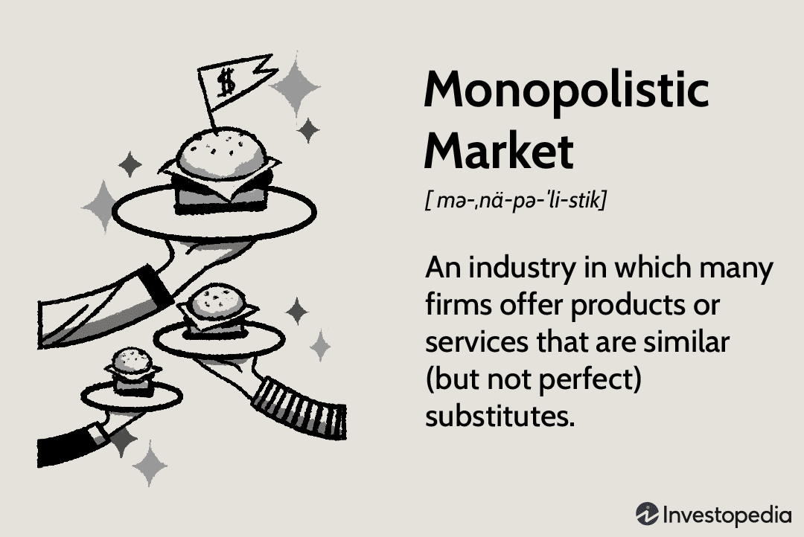

In the evolving world of finance, understanding the multifaceted nature of financial assets is crucial for both individual investors and institutions. Financial assets serve as instruments for wealth creation and preservation, and their complexity demands a comprehensive approach to managing them effectively. This article discusses the concepts of store of value financial assets, asset management, and algorithmic trading, providing a framework for enhancing investment strategies and optimizing returns.

Store of value financial assets, such as precious metals, real estate, and cryptocurrencies, play a pivotal role in preserving wealth over time. These assets ensure that value can be saved, retrieved, and exchanged in the future. The dynamics of these traditional and modern stores of value are essential for maintaining financial stability, especially in volatile economic climates.



Asset management is another critical element of financial success. It involves the strategic deployment of capital to achieve defined investment goals, requiring a deep understanding of both tangible and intangible business assets. Effective asset management considers a broad range of financial aspects, including risk management, diversification, and market trends, thereby contributing to long-term financial stability.

Algorithmic trading, the use of sophisticated algorithms to automate trading processes, is reshaping asset management practices. By mitigating human bias and executing complex strategies, algorithmic trading enhances the efficiency and speed of transactions while reducing costs. This technology-driven approach is transforming the financial landscape, opening up new possibilities for optimizing trade execution based on real-time data analysis.

Ultimately, the article aims to highlight the intersections of these elements and the opportunities they present for investors and asset managers. By understanding the comprehensive nature of financial assets and embracing technological advancements, market participants can optimize their investment strategies to achieve superior outcomes. Recognizing both the potential and limitations of these tools is essential for navigating the rapidly changing financial markets of the future.

## Table of Contents

## Understanding Financial Assets as a Store of Value

A store of value is an asset that can be preserved, retrieved, and exchanged in the future without significant loss in value. It is a fundamental concept in finance, aiding individuals and institutions in the preservation of wealth over time. Traditionally, assets such as precious metals, real estate, and currencies have been regarded as reliable stores of value. These assets have intrinsic characteristics that ensure their stability and durability, making them dependable for future transactions.

Precious metals, particularly gold, have long been recognized as a universal store of value. Gold's scarcity and resistance to corrosion contribute to its enduring worth. Historically, gold has served as a hedge against inflation and currency devaluation, providing financial security. Similarly, real estate is considered a traditional store of value due to its physical substance and utility in generating income through rentals. Over time, property values typically appreciate, offering a safeguard against inflation.

In recent years, the advent of cryptocurrencies, notably Bitcoin, has redefined the notion of a store of value. Cryptocurrencies offer decentralized digital alternatives to traditional financial assets, with Bitcoin often likened to digital gold. Its limited supply and the security offered by blockchain technology underpin its potential as a store of value. However, the [volatility](/wiki/volatility-trading-strategies) associated with cryptocurrencies remains a point of concern for investors, impacting their role as stable preserves of wealth.

The significance of traditional and modern stores of value lies in their application in today's economic landscape. Traditional assets are often perceived as safer due to their historical performance and lower volatility. Conversely, modern stores of value like cryptocurrencies present higher potential returns but come with increased risk. Balancing these assets within an investment portfolio can enhance financial resilience, especially amid economic fluctuations.

Investors must evaluate the characteristics of different financial assets to align with their risk tolerance and long-term financial objectives. While traditional stores of value offer proven stability, modern options offer innovation and high growth potential, reflecting the complex nature of today's economic framework.

## The Role of Asset Management

Effective asset management plays a pivotal role in optimizing the performance of financial assets, ensuring that capital is strategically deployed to meet specific investment objectives. The process involves a comprehensive understanding of both tangible assets, such as physical property and equipment, and intangible assets, such as intellectual property and brand value. This dual focus is essential for accurately assessing a company's financial health and implementing strategies that enhance long-term financial stability.

The strategic deployment of capital refers to the allocation of resources in a manner that aligns with an investor’s goals. This may involve diversifying investments across different asset classes or sectors to mitigate risks and maximize returns. Portfolio diversification is a fundamental concept in asset management, as it helps to spread risk across various investments, reducing the impact of any single asset's adverse performance. For example, an asset manager might recommend a mix of stocks, bonds, real estate, and commodities to achieve a balanced risk-return profile.

Understanding tangible and intangible assets is crucial, as they both contribute to a company's overall value. Tangible assets include items that have a physical presence and can be easily quantified. These might encompass machinery, buildings, and inventory, all of which are integral to a company's operational capabilities. On the other hand, intangible assets, such as patents, trademarks, and goodwill, often represent a significant portion of a company’s market value. Recognizing the impact of these assets is vital for evaluating a firm's financial strength and potential for future growth.

Asset managers employ various strategies to manage business assets effectively. One such strategy is active management, where managers make specific investment decisions to outperform market indices. This approach requires constant analysis and adjustment of portfolios based on market trends and economic indicators. Conversely, passive management involves tracking a specific index or benchmark, minimizing transaction costs, and maintaining a set investment mix without frequent changes.

Enhancing long-term financial stability involves adopting practices that ensure sustainable growth and mitigate potential risks. Asset managers might focus on acquiring assets that appreciate over time or generate steady income streams. For instance, investing in dividend-paying stocks or rental properties can provide regular cash flows and contribute to wealth accumulation. Additionally, leveraging technology and advanced analytics can aid in making informed decisions and predicting market movements, thereby refining investment strategies.

In summary, effective asset management necessitates the strategic deployment of capital, a thorough comprehension of tangible and intangible assets, and the implementation of strategic management practices. These components collectively enhance the performance of financial assets and support long-term financial stability.

## Intersection of Financial and Business Assets in Trading

The synergy between financial and business assets plays a vital role in formulating effective trading strategies within financial markets. Financial assets, such as stocks, bonds, and commodities, derive their value largely from the performance and potential of underlying business assets. In trading, understanding the intrinsic value and potential returns of these financial instruments is crucial for making informed investment decisions.

Investors often rely on the financial assets of a company, including equity and debt instruments, to evaluate its performance and forecast future growth prospects. For instance, the price of a company's stock reflects the market's perception of the company's value, which is fundamentally linked to its business assets. These assets—ranging from property and equipment to intellectual property—determine the company's ability to generate revenue and profit over time.

Diversification is a key strategy employed by investors to integrate financial and business assets effectively. By spreading investments across various asset classes, sectors, or geographical regions, investors can mitigate the risks associated with market volatility and economic downturns. For example, a diversified portfolio containing a mix of equities, bonds, and commodities can provide a buffer against losses in any single asset class. This approach ensures a balance between risk and return, enhancing the overall stability of the investment portfolio.

Risk management is another critical component of integrating financial and business assets in trading. Effective risk management involves identifying potential risks associated with financial instruments and implementing strategies to minimize their impact. This might include using derivatives such as options and futures contracts to hedge against potential losses or employing stop-loss orders to limit downside risk.

Valuation is an essential technique that ties together financial and business assets. Investors assess a company’s value by examining its business assets and translating their worth into financial terms. Common valuation methods include discounted cash flow (DCF) analysis, which estimates the present value of expected future cash flows, and comparable company analysis, which benchmarks a company against its peers. Accurate valuation allows investors to determine whether a financial asset is undervalued or overvalued, guiding their investment decisions.

Ultimately, integrating financial and business assets in trading necessitates an understanding of the dynamics between a company's operational capabilities and market performance. By leveraging these interconnections, investors can construct robust trading strategies that capitalize on the inherent value of business assets, optimize returns, and manage risks effectively.

## The Rise of Algorithmic Trading

Algorithmic trading represents a significant technological advancement in the financial markets, utilizing sophisticated algorithms to automate and improve trade execution. This approach enhances both efficiency and speed by reducing human intervention, thus minimizing potential biases and errors associated with manual trading processes.

By employing programming languages such as Python, these algorithms can execute complex trading strategies that surpass human capabilities, handling vast amounts of data and analyzing market conditions in real-time. For instance, [trend following](/wiki/trend-following) algorithms, which are designed to capture gains by analyzing asset price patterns, facilitate decisions based on historical price movement to predict future trends, allowing traders to capitalize on market [momentum](/wiki/momentum).

Statistical [arbitrage](/wiki/arbitrage), another popular [algorithmic trading](/wiki/algorithmic-trading) strategy, involves exploiting price inefficiencies between related financial instruments. It uses quantitative models to identify and profit from short-term mispricings. Mathematical techniques like mean reversion, where assets are expected to return to a historical average, play a crucial role in this strategy.

High-frequency trading ([HFT](/wiki/high-frequency-trading-strategies)) represents the pinnacle of algorithmic trading, deploying algorithms for the rapid execution of large volumes of trades in fractions of a second. By leveraging speed, HFT gains a competitive edge, making profits from minute price discrepancies that occur across different markets or assets over short periods.

The impact of algorithmic trading on market [liquidity](/wiki/liquidity-risk-premium) and efficiency has been profound. These systems can improve liquidity by increasing the [volume](/wiki/volume-trading-strategy) of trades and tightening bid-ask spreads, which can lower transaction costs for all market participants. However, they can also exacerbate market volatility and contribute to phenomena like flash crashes due to their rapid execution speeds and complex interactions.

While algorithmic trading offers numerous advantages, understanding its nuances and potential market impacts is crucial for investors seeking to effectively incorporate these strategies into their trading activities. The progressive evolution of these technologies continues to reshape the financial landscape, offering both opportunities and challenges.

## Leveraging Algorithmic Trading in Asset Management

Algorithmic trading plays a pivotal role in asset management by enhancing the precision and efficiency of trade execution through real-time data analysis. This technological advancement allows asset managers to make decisions grounded in empirical data, thereby optimizing investment strategies and maximizing returns. An essential component of algorithmic trading is [backtesting](/wiki/backtesting), which involves evaluating trading strategies on historical data to estimate their potential performance. By simulating various market scenarios, backtesting facilitates strategy refinement, enabling asset managers to make more informed decisions and minimize risks associated with market volatility.

Dynamic adjustment of asset portfolios is another significant advantage provided by algorithmic systems. These systems can process vast amounts of market data at high speeds, allowing for real-time adjustments to portfolios based on pre-set criteria or evolving market conditions. This capability ensures that asset portfolios remain aligned with investment goals and risk tolerance levels, even in highly volatile markets. For example, a portfolio manager might implement a momentum-based algorithm that continuously reallocates assets toward securities exhibiting upward price trends, thus capitalizing on market momentum to enhance returns.

The integration of algorithmic trading into asset management represents a substantial shift in financial strategies. Traditional asset management relied heavily on human judgment and slower, manual processes, which often limited responsiveness to market changes. In contrast, algorithmic systems offer a level of speed and precision unattainable by manual methods, allowing for sophisticated strategies such as [statistical arbitrage](/wiki/statistical-arbitrage) and high-frequency trading. Moreover, these systems are capable of processing complex mathematical models that facilitate risk management and asset allocation in a highly efficient manner.

To illustrate the potential of algorithmic trading in asset management, consider a simple moving average crossover strategy. This strategy might employ a short-term moving average (SMA_short) and a long-term moving average (SMA_long) to guide trading decisions:

```python
def moving_average_crossover(prices, short_window, long_window):
    SMA_short = prices.rolling(window=short_window, min_periods=1).mean()
    SMA_long = prices.rolling(window=long_window, min_periods=1).mean()

    buy_signals = (SMA_short > SMA_long) & (SMA_short.shift(1) <= SMA_long.shift(1))
    sell_signals = (SMA_short < SMA_long) & (SMA_short.shift(1) >= SMA_long.shift(1))

    return buy_signals, sell_signals
```

This Python function calculates short and long moving averages and generates buy/sell signals whenever these averages cross. Such strategies are dynamically implemented in algorithmic trading systems, allowing traders to execute transactions based on objective criteria rather than subjective decision-making.

In conclusion, the integration of algorithmic trading significantly elevates the practice of asset management. By harnessing real-time data analysis and automated decision-making, financial strategies are more precise and adaptable to market fluctuations. As the financial landscape continues to evolve, this merging of technology with traditional asset management practices is poised to redefine how investment goals are achieved.

## Challenges and Considerations in Algorithmic Trading

Algorithmic trading, while offering significant advantages in trading efficiency and speed, comes with inherent challenges and considerations. One of the primary challenges is overfitting, where models become too tailored to historical data, capturing noise rather than underlying patterns. This can lead to poor performance in real-world trading scenarios. To mitigate overfitting, traders can employ techniques such as cross-validation and keeping models as simple as possible, while also setting aside a portion of data for testing purposes.

Data dependency is another issue. Algorithmic models rely heavily on historical and real-time data to make predictions and execute trades. However, the quality and integrity of this data can vary, leading to potential errors in trade execution. Ensuring data accuracy and implementing robust data cleaning processes are essential steps to maintain model reliability.

Market impact risks also pose significant challenges. Large algorithmic trades have the potential to influence market prices, adversely affecting trade outcomes. To address this, traders can use algorithms designed to minimize market impact, such as slicing large orders into smaller ones and executing them over a longer period.

Navigating regulatory environments is crucial in algorithmic trading. Different jurisdictions have varying regulations regarding trading practices, and compliance is vital to avoid legal repercussions. Traders must stay informed about relevant regulations and, when necessary, adjust their strategies to remain compliant. This includes implementing transparent trading algorithms and maintaining detailed records of trade executions.

Balancing automation with human oversight is essential for optimizing algorithm performance. While algorithms can efficiently process vast amounts of data and execute trades quickly, human insight is invaluable for addressing unforeseen market conditions and making strategic decisions. A balanced approach can be achieved by integrating human monitoring systems that oversee the performance of trading algorithms and intervene when anomalies occur.

Finally, several best practices can enhance algorithmic trading strategies. These include regularly backtesting strategies against historical data, continuously monitoring algorithm performance, and updating algorithms to adapt to changing market conditions. By implementing comprehensive risk management frameworks that address the unique challenges of algorithmic trading, traders can optimize their strategies and improve their performance in financial markets.

## Conclusion

The convergence of financial assets, asset management, and algorithmic trading has redefined investment strategies, presenting unprecedented opportunities for optimizing returns. By comprehending the symbiotic relationships among these elements, investors can preserve and grow their wealth more efficiently. Financial assets, traditionally revered for their value preservation capabilities, gain additional strategic utility when paired with sophisticated asset management techniques. Asset management provides the framework for aligning investment actions with specific financial goals, capitalizing on the underlying potential of these assets.

Algorithmic trading introduces a technological dimension that enhances the efficacy of asset management practices. By leveraging algorithms for the automation of trade executions, investors achieve greater efficiency and precision in handling financial transactions. This system not only mitigates human biases but also facilitates the execution of complex trading strategies that would be impractical to perform manually.

Despite the advances brought by technology, it is crucial to acknowledge its constraints and associated risks. Algorithmic trading, while powerful, may face challenges such as data dependency and potential regulatory compliance issues. Therefore, maintaining a balance between automation and human oversight is key to maximizing the benefits while minimizing potential drawbacks.

In an ever-evolving financial landscape, future success will hinge upon the ability to remain informed and agile, adapting to technological advancements and market dynamics. As market participants, staying proactive and responsive to changes will be essential in harnessing these innovations to create robust and resilient investment strategies.

## References & Further Reading

[1]: Rochlani, H., Rathore, D., & Arya, R. S. (2020). ["Algorithmic trading: A review."](https://www.researchgate.net/publication/262239006_Algorithmic_Trading_Review) Journal of King Saud University-Computer and Information Sciences, 32(7), 781-790.

[2]: Baur, D. G., & Lucey, B. M. (2010). ["Is gold a hedge or a safe haven? An analysis of stocks, bonds and gold."](https://onlinelibrary.wiley.com/doi/10.1111/j.1540-6288.2010.00244.x) Financial Review, 45(2), 217-229.

[3]: Nakamoto, S. (2008). ["Bitcoin: A peer-to-peer electronic cash system."](https://nakamotoinstitute.org/library/bitcoin/) Available at: bitcoin.org

[4]: Markowitz, H. (1952). ["Portfolio selection."](https://onlinelibrary.wiley.com/doi/abs/10.1111/j.1540-6261.1952.tb01525.x) The Journal of Finance, 7(1), 77-91.

[5]: Looney, J. W. (2006). ["Real Estate as a Hedge Against Inflation."](https://www.emerald.com/insight/content/doi/10.1108/14635789410063913/full/html) Journal of Real Estate Portfolio Management, 12(3), 337-345.