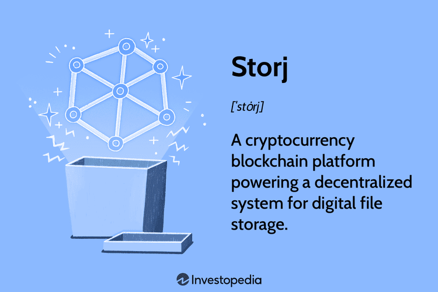

Storj is a cryptocurrency platform that integrates blockchain technology to deliver decentralized data storage solutions. Unlike traditional cloud services, which rely on centralized data centers managed by companies like Amazon, Google, or Microsoft, Storj leverages a global network of nodes. This network operates similarly to a peer-to-peer system, where users can rent out unused hard drive space to store encrypted file fragments. This decentralized structure offers improved security and privacy since no single entity controls the entire network. 

Storj utilizes the Ethereum blockchain to manage its decentralized storage network. This blockchain records transactions and facilitates the management of transactions using its native currency, STORJ tokens. These tokens are essential within the network, serving as payment for storage space and bandwidth, and as an incentive for node operators to maintain the network's integrity and performance. Node operators are rewarded with STORJ tokens for contributing their storage resources and bandwidth to the network, creating a system that encourages participation and robust functionality.



Storj's decentralized approach provides multiple advantages over traditional cloud storage services. Primarily, it enhances security by encrypting each file, breaking it into smaller pieces, and distributing these encrypted fragments across its network of nodes. This method ensures that no single node has access to the entire file, preventing data breaches commonly associated with centralized storage providers.

The integration of blockchain technology into Storj's platform introduces unique opportunities within the cryptocurrency markets, notably in algorithmic trading. Algorithmic trading involves using automated and complex trading algorithms to manage buying and selling decisions in financial markets, including cryptocurrencies such as STORJ. This form of trading can process vast amounts of data in real-time and execute trades far quicker than human traders, optimizing investment strategies and enhancing liquidity in the market. It poses potential risks, such as over-reliance on technology and market volatility, which require careful management. Nevertheless, algorithmic trading presents significant advantages by allowing traders to capitalize on market inefficiencies, particularly in volatile markets like cryptocurrency. 

As both a decentralized storage system and a tradable cryptocurrency asset, Storj represents a compelling intersection of technology and finance. It offers an innovative alternative to conventional cloud storage and presents new opportunities for traders and investors in the evolving landscape of digital assets.

## Table of Contents

## What is Storj?

Storj is a pioneering cryptocurrency platform that leverages blockchain technology to facilitate decentralized data storage solutions. Unlike traditional centralized cloud storage systems, which rely on a single provider's data centers, Storj employs a distributed network of nodes located globally. This decentralized approach enhances the security, privacy, and resilience of data storage.

The Storj network is structured around a large number of independent nodes, each of which contributes resources such as bandwidth and disk space to the network. These nodes are operated by individuals and organizations from diverse geographic locations, ensuring the system's redundancy and fault tolerance. Data uploaded to the Storj network is encrypted and fragmented into smaller pieces or 'shards,' which are then distributed across multiple nodes. This technique of fragmentation and distribution ensures that no single node possesses a complete copy of the data, enhancing its security and preventing data breaches.

Central to the Storj platform is the STORJ token, a specialized [cryptocurrency](/wiki/cryptocurrency) that facilitates transactions within the network. STORJ tokens are used as a medium of exchange to compensate node operators for the storage space and bandwidth they contribute. When users store data on the network, they pay in STORJ tokens, aligning economic incentives across the ecosystem. Additionally, node operators can convert their earned STORJ tokens into other cryptocurrencies or fiat money through exchanges, making it a versatile asset.

The utility of the STORJ token extends beyond compensation; it also plays a vital role in ensuring the system's economic stability and motivating participants to maintain the quality and integrity of their storage services. This innovative usage of blockchain technology and cryptocurrency not only revolutionizes traditional data storage paradigms but also introduces new possibilities for secure and decentralized internet infrastructure.

## Understanding Storj's Blockchain Storage

Storj utilizes a decentralized infrastructure powered by blockchain technology to secure and store data efficiently and reliably. Unlike traditional centralized cloud storage services, where data is stored on servers managed by a single entity, Storj spreads data across numerous nodes globally. This decentralized approach enhances security by eliminating single points of failure and reducing the risk of data breaches. Data is encrypted end-to-end before it leaves a client device, ensuring that only the data owner has access to the encryption keys, thus enhancing privacy and security measures.

Traditional cloud storage follows a centralized model, typically storing data in massive data centers managed by few large corporations. While these services offer convenience and scalability, they often come with inherent security risks. Centralized data storage means that a breach or malfunction at the data center could jeopardize the data of thousands or millions of users. Additionally, the dependency on a centralized authority raises privacy concerns about unauthorized access and data misuse.

Storj's decentralized model mitigates these concerns by fragmenting files into smaller pieces that are distributed and stored over a robust network of nodes, making unauthorized access significantly more challenging. This sharding technique, coupled with redundancy schemes, ensures high availability and reliability of data. Data retrieval involves reconstructing the file from its various parts using the encryption keys provided to the data owner, adding an extra layer of security. 

The applications of Storj's decentralized storage are vast. One significant use case is video streaming, where the demand for highly available, secure, and distributed storage solutions is critical. Storj enables a streamlined experience by reducing latency issues commonly associated with centralized networks and providing resilience against data center outages.

Software distribution is another domain where Storj’s architecture shines. Developers can leverage Storj for distributing software updates efficiently without relying on traditional centralized servers, reducing costs and distribution times while increasing download speeds through parallelism across multiple nodes.

Furthermore, Storj is an advantageous option for cloud-native applications that require scalable storage solutions without the expense and vulnerabilities of traditional services. By minimizing environmental footprints and costs associated with operating large data centers, Storj supports sustainable and economically feasible storage alternatives.

In summary, Storj's unique decentralized storage approach, underpinned by encryption and sharding technology, offers a formidable enhancement in security and efficiency, distinguishing it significantly from its centralized cloud storage counterparts.

## Differences Between Storj and Filecoin

Storj and Filecoin are two prominent decentralized storage solutions that leverage blockchain technology to offer secure and distributed data storage. While both aim to disrupt traditional centralized storage models, they differ in several aspects, including their operational blockchain technology and reward systems.

### Blockchain Technology

**Storj** utilizes a distributed hash table (DHT) and operates on top of the Ethereum blockchain. The Storj network enforces data integrity and redundancy through erasure coding, which breaks data into pieces and spreads it across multiple nodes. Its decentralized approach involves a network of independent nodes contributing unused storage space, with blockchain technology ensuring secure transactions and data retrieval.

**Filecoin**, on the other hand, is built on a purpose-developed blockchain utilizing a unique proof-of-replication (PoRep) and proof-of-spacetime (PoSt) consensus mechanism. PoRep ensures that storage providers have genuinely stored the data they claim to store, while PoSt periodically verifies the ongoing availability of data over time. Filecoin’s blockchain is integral to its storage operations, linking space offered by storage providers with those seeking to store data.

### Reward Systems

In Storj, rewards are primarily distributed in the form of STORJ tokens to node operators who provide storage and bandwidth. These rewards are contingent upon storage availability, uptime, and bandwidth sharing in the network. Storj incentivizes node operators to maintain high availability and performance, rewarding them based on data retrievals and uploads.

Filecoin's reward system involves its native FIL tokens, rewarding storage miners for providing storage and retrieving data. The Filecoin economy distinguishes itself through its auction-based market, where storage prices are determined by supply and demand between clients and storage miners. The PoRep and PoSt mechanisms play a critical role in determining reward distribution, as only verified storage miners receive compensation for their contributions.

### Conclusion

Despite their shared goal of decentralizing data storage, Storj and Filecoin exhibit distinct operational and economic models. Storj relies on Ethereum blockchain and a network of globally distributed nodes, whereas Filecoin employs its bespoke blockchain and advanced proof mechanisms to ensure data integrity and miner reward verification. Understanding these differences can guide users and investors in choosing the appropriate platform based on their specific needs and expectations.

## The Role of Algorithmic Trading in Cryptocurrency

Algorithmic trading refers to the use of computer programs and systems to execute trading strategies automatically and at high speed. This method leverages mathematical models and statistical analysis to determine optimal trading opportunities, replacing or augmenting traditional manual trading. Its application in cryptocurrency markets has become increasingly significant due to the volatile and fast-paced nature of digital assets. 

The primary advantage of [algorithmic trading](/wiki/algorithmic-trading) in cryptocurrency is its ability to process massive amounts of market data and execute trades within fractions of a second. This speed allows for more precise entry and [exit](/wiki/exit-strategy) points, which can be crucial in the dynamic cryptocurrency markets where prices can change rapidly. Additionally, algorithmic trading can operate 24/7 across multiple exchanges, ensuring opportunities are not missed due to the round-the-clock trading typical of cryptocurrency markets.

In the context of Storj and similar cryptocurrency assets, algorithmic trading can optimize investments by implementing strategies based on real-time data analysis. For instance, algorithms can be programmed to monitor the Storj market for specific indicators, such as price patterns or trading volumes, to make informed trading decisions without human intervention. Such strategies can include [market making](/wiki/market-making), [arbitrage](/wiki/arbitrage), and [trend following](/wiki/trend-following).

For example, a simple moving average (SMA) strategy might be employed to trade Storj. The algorithm could be coded in Python to calculate short-term and long-term SMAs of Storj's price and execute a buy order when the short-term SMA crosses above the long-term SMA (indicating a bullish trend) and a sell order when the opposite occurs:

```python
import pandas as pd

# Fetching Storj historical price data
storj_data = pd.read_csv('storj_price_data.csv')
storj_data['SMA_short'] = storj_data['Close'].rolling(window=20).mean()
storj_data['SMA_long'] = storj_data['Close'].rolling(window=50).mean()

def trading_strategy(data):
    buy_signals = []
    sell_signals = []
    for i in range(len(data)):
        if data['SMA_short'][i] > data['SMA_long'][i]:
            buy_signals.append(data['Close'][i])
            sell_signals.append(None)
        elif data['SMA_short'][i] < data['SMA_long'][i]:
            buy_signals.append(None)
            sell_signals.append(data['Close'][i])
        else:
            buy_signals.append(None)
            sell_signals.append(None)
    return buy_signals, sell_signals

storj_data['Buy_Signal'], storj_data['Sell_Signal'] = trading_strategy(storj_data)
```

While the above highlights the potential of algorithmic trading, it is important to recognize the associated risks. Market conditions can change unexpectedly, and algorithms can sometimes misinterpret data or react inappropriately to unforeseen events, leading to significant financial losses. Additionally, the complexity of creating and maintaining algorithms requires a high level of technical expertise and constant monitoring to ensure performance aligns with market conditions.

Benefits of automated trading systems include the elimination of human error, emotional bias, and the ability to backtest strategies on historical data, optimizing their effectiveness before live deployment. However, the risks, such as system failures, incorrect assumptions in algorithms, and security vulnerabilities, necessitate a careful approach to leveraging these systems in cryptocurrency trading. 

In conclusion, while algorithmic trading presents an advanced toolset to potentially enhance investment returns in Storj and other cryptocurrencies, it requires an informed and strategic implementation to mitigate risks and capitalize on the benefits.

## How to Participate in the Storj Network

To participate in the Storj network as a node operator, individuals need to understand the technical and financial requirements involved. Node operators play a crucial role by providing decentralized storage space through their computers, which are connected to the Storj network. This process is designed to offer enhanced security and cost-efficiency compared to traditional storage systems.

### Becoming a Storj Node Operator

**System Requirements:**

To operate a Storj node, certain hardware and software prerequisites must be met:

- **Hardware Specifications:** Minimum requirements typically include a reliable internet connection, a dual-core processor, at least 4 GB of RAM, and sufficient storage capacity on a hard drive (preferably 1 TB or more) to host data. Additionally, the system should ideally remain operational 24/7 to ensure consistent availability of storage.

- **Software Environment:** The node operator must have a compatible operating system—Linux, Windows, or macOS—along with Docker, which is used to deploy containerized applications. The Storj software is installed within a Docker container.

**Setting Up the Node:**

Once the necessary hardware and software are in place, the node operator needs to set up the node by:

1. **Installing Docker:** Docker installation can vary based on the operating system, following the official Docker installation guide is recommended.

2. **Configuring and Running the Node:** After Docker is installed, the node operator can configure and run the Storj node using command-line instructions provided by Storj Labs. This typically involves pulling the Storj container image from Docker Hub and setting up node identity and configuration files.

**Payouts and Rewards:**

Storj network compensates node operators through a dual reward system:

- **STORJ Tokens:** Operators earn STORJ tokens, the native cryptocurrency, proportionate to the storage provided and bandwidth used for data transfers. Payment is made based on successful data storage and retrieval actions completed in the network.

- **Uptime and Reputation:** The reliability and performance of a node are critical. Storj implements a reputation mechanism that influences payouts, rewarding nodes with high uptime and low data loss.

### Potential Profitability and Challenges

**Profitability Considerations:**

The viability of running a Storj node from a financial perspective largely depends on factors such as electricity costs, internet expenses, and initial hardware investments. Given the competitive nature of decentralized storage, maximizing profitability requires optimal node performance and low operational costs.

**Challenges:**

Node operators may face challenges, including maintaining consistent uptime, handling network outages, and ensuring the security of their system from unauthorized access or attacks. The decentralized structure necessitates robust security practices to safeguard against potential vulnerabilities.

### Using Storj Tokens

**Storage Payments:**

Storj tokens are used within the network to facilitate transactions for storage services. Users pay for data storage and retrieval, and node operators receive compensation in STORJ, thus creating an internal economy.

**Trading on Exchanges:**

STORJ tokens can also be traded on various cryptocurrency exchanges. This aspect of the token provides [liquidity](/wiki/liquidity-risk-premium) to node operators and users, allowing them to convert tokens to other cryptocurrencies or fiat money as needed, enhancing financial accessibility and flexibility in the network.

Overall, participating in the Storj network as a node operator requires an understanding of both technical requirements and economic incentives, presenting both opportunities and challenges within the decentralized storage marketplace.

## Investment Perspective on Storj Cryptocurrency

Storj presents a unique investment opportunity within the volatile cryptocurrency market, driven by its robust business model focused on decentralized data storage. As a utility token underpinning the Storj network, STORJ facilitates transactions for storage services, thereby exhibiting inherent value and use-case-driven demand. 

Storj's potential for long-term success is linked to the increasing demand for decentralized storage solutions, a sector expected to grow as industries emphasize data security and privacy. The protocol's innovative use of blockchain for decentralized data handling positions Storj favorably in the business-oriented cryptocurrency landscape. Its model contrasts with speculative cryptocurrencies, as Storj’s value proposition is directly tied to its utility in the network, appealing to both enterprises and individual users seeking non-traditional cloud storage solutions.

From an investment perspective, Storj should be viewed as a component of a diversified portfolio. The cryptocurrency market is characterized by high [volatility](/wiki/volatility-trading-strategies), and Storj is no exception. Therefore, a balanced approach, emphasizing risk assessment, is crucial when considering investments in Storj. Strategies could include spreading investments across different asset classes or including multiple cryptocurrencies with similar business functionalities but different market behaviors to offset potential losses.

Investors should assess the risks associated with Storj, which include market volatility, regulatory changes, and technological risks inherent in blockchain technology. The ability to analyze and manage these risks—alongside understanding Storj’s market trends and technological developments—is essential for maximizing investment potential. This involves keeping abreast of blockchain advancements, monitoring the Storj network's performance, and understanding the competitive landscape with other decentralized storage providers.

In summary, Storj represents a promising yet volatile investment in the cryptocurrency market. Its focus on practical utility and decentralized storage infrastructure suggests potential for growth, particularly as demand for secure data storage solutions continues to rise. However, success depends on informed risk management and strategic diversification, positioning Storj as a high-risk, high-reward investment avenue.

## The Future of Storj and Decentralized Storage

Storj, as a pioneering force in decentralized storage, aims to revolutionize the internet landscape by promoting a more distributed and secure way of handling data. Its long-term vision involves creating a truly decentralized internet, often referred to as Web 3.0, where control over data is decentralized, enhancing privacy, security, and integrity.

One of the primary goals is to offer scalable and efficient storage solutions that can compete with, if not surpass, traditional centralized systems. By leveraging worldwide nodes for storage, Storj minimizes data vulnerability to single points of failure. The network relies on advanced encryption techniques to ensure data privacy, which is crucial for widespread adoption of decentralized storage.

Recent updates in the Storj network have included improvements in scalability and performance, aimed at accommodating a growing user base. Enhancements in the platform's user interface and the network's ability to handle diverse data forms are notable developments. These enhancements align with Storj's commitment to improving the user experience and expanding its use cases, from video streaming to cloud-native application storage.

Looking ahead, blockchain-based storage solutions like Storj are poised to benefit significantly from advancements in both blockchain technology and decentralized applications (dApps). Future trends might involve integrating [artificial intelligence](/wiki/ai-artificial-intelligence) to optimize data storage and retrieval processes, thereby improving the overall efficiency of the decentralized storage network. Additionally, as regulations around data privacy and security become more stringent, decentralized solutions like Storj could become preferable due to their inherent privacy-preserving features.

Storj's continued growth also depends on its ability to adapt to other technological advancements, such as quantum computing, which has implications for data encryption standards. Preparing for such shifts will be instrumental in safeguarding the network's security and functionality in the long term.

The future of Storj and decentralized storage lies in the ability to harness collective computational and storage resources while ensuring security and privacy, thus contributing to a more open and equitable internet. As the ecosystem evolves, innovations such as smart contracts and improvements in blockchain consensus mechanisms will likely play significant roles in enhancing the capabilities and adoption of decentralized storage networks like Storj.

## Conclusion

Storj represents a significant innovation within the blockchain and cryptocurrency landscape, offering a compelling alternative to traditional cloud storage solutions. By decentralizing data storage, Storj provides enhanced security and privacy, addressing the growing concerns over data breaches and unauthorized access that plague centralized systems. This decentralization reduces the reliance on a single point of failure, thus fostering a more resilient and trustworthy storage infrastructure.

The strategic importance of decentralized storage solutions like Storj is multifaceted. Firstly, they democratize the storage economy by enabling individuals worldwide to participate as storage providers, thus fostering an inclusive and distributed network. Secondly, decentralized storage mitigates the risk of censorship or data loss due to infrastructure collapse, enhancing data sovereignty for users. This characteristic is particularly crucial in regions where data accessibility is compromised by political or infrastructural constraints.

From an investment perspective, Storj offers a unique opportunity for those looking to capitalize on the growth of blockchain technology. As more businesses and individuals recognize the value of decentralized storage, the demand for platforms like Storj is poised to increase. Investors may find Storj attractive due to its solid technological foundation and its utility in powering real-world applications. Moreover, the function of STORJ tokens within the network underlines their potential value appreciation as adoption grows.

In conclusion, Storj not only influences the blockchain and cryptocurrency landscape with its decentralized storage model but also sets the stage for future innovations in data management. Its advantages extend beyond technology, offering strategic imperatives for privacy, security, and investment. Exploring Storj presents an opportunity to engage with a transformative technology that aligns with the evolving demands of our digital era.

## References & Further Reading

[1]: Heimbach, I., Kaur, J., & Jegen, D. (2017). ["Cloud computing for algorithmic trading: where are we headed?"](https://www.researchgate.net/publication/378548435_Algorithmic_Trading_and_AI_A_Review_of_Strategies_and_Market_Impact) Proceedings of the ACM 2017 International Conference on Management of Data.

[2]: Schatsky, D., Muraskin, C., & Gurumurthy, R. (2015). ["Blockchain and the five vectors of progress."](https://www2.deloitte.com/content/dam/Deloitte/uk/Documents/Innovation/deloitte-uk-path-to-cognitive-enterprise.pdf) Deloitte Review, Issue 17.

[3]: "[The Storj Whitepaper](https://static.storj.io/storjv3.pdf)," Storj Labs Inc.

[4]: Benet, J. (2014). ["Filecoin: A Decentralized Storage Network."](https://filecoin.io/filecoin.pdf) Protocol Labs.

[5]: Antonopoulos, A. M., & Wood, G. (2018). ["Mastering Ethereum: Building Smart Contracts and DApps"](https://www.amazon.com/Mastering-Ethereum-Building-Smart-Contracts/dp/1491971940) O'Reilly Media.

[6]: Lopez de Prado, M. (2018). ["Advances in Financial Machine Learning"](https://www.amazon.com/Advances-Financial-Machine-Learning-Marcos/dp/1119482089) Wiley.

[7]: Aronson, D. (2011). ["Evidence-Based Technical Analysis: Applying the Scientific Method and Statistical Inference to Trading Signals"](https://www.amazon.com/Evidence-Based-Technical-Analysis-Scientific-Statistical/dp/0470008741) Wiley.

[8]: Jansen, S. (2020). ["Machine Learning for Algorithmic Trading: Predictive models to extract signals from market and alternative data for systematic trading strategies with Python"](https://www.amazon.com/Machine-Learning-Algorithmic-Trading-alternative/dp/1839217715) Packt Publishing.