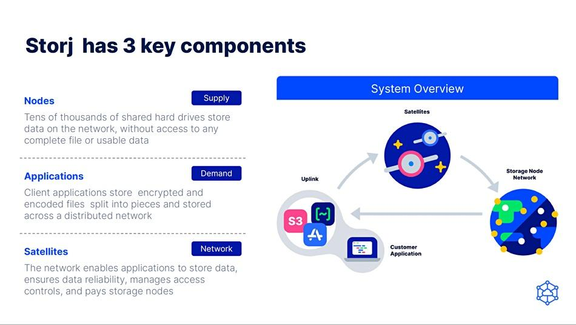

## Table of Contents

## What is Storj?

Storj is a decentralized cloud storage platform. It lets people store their files on many computers around the world instead of keeping everything in one place. This makes the storage safer and cheaper. People who have extra space on their computers can share it with others and earn money for doing so.

Using Storj is easy. You can upload your files through their website or use their special software. Once your files are uploaded, they are broken into small pieces and spread across different computers. This way, even if one computer goes down, your files are still safe. Storj uses strong encryption to keep your files private and secure.

## How does Storj work?

Storj works by letting people store their files on many different computers around the world. When you upload a file to Storj, it gets split into small pieces. These pieces are then spread out across different computers. This means your file is not stored in just one place, which makes it safer. If one computer stops working, your file is still safe because the other pieces are on different computers.

To use Storj, you can go to their website or use their special software. Once you upload your files, Storj takes care of breaking them into pieces and spreading them out. Storj also uses strong encryption to keep your files private. This means that only you can see your files, and no one else can. People who have extra space on their computers can join Storj and let others use their space. In return, they get paid for sharing their space.

## What are the key features of Storj?

Storj is a special kind of cloud storage that spreads your files across many computers around the world. When you upload a file, it gets broken into small pieces. These pieces are then stored on different computers. This way, if one computer stops working, your file is still safe because the other pieces are on different computers. This makes Storj very reliable and safe for storing your files.

Storj also uses strong encryption to keep your files private. This means that only you can see your files, and no one else can. You can upload your files easily through their website or by using their special software. Another cool thing about Storj is that people who have extra space on their computers can share it with others and earn money. This makes Storj not only safe and reliable but also affordable for everyone.

## How does Storj ensure data security?

Storj keeps your data safe by using strong encryption. When you upload a file, it gets broken into small pieces and each piece is encrypted. This means that even if someone gets a piece of your file, they can't understand it without the special key that only you have. This encryption makes sure that your files stay private and secure, no matter where they are stored.

Another way Storj ensures data security is by spreading your file pieces across many different computers around the world. If one computer goes down or is hacked, your file is still safe because the other pieces are on different computers. This makes it very hard for anyone to get all the pieces of your file together to see what it is. By spreading out the pieces and encrypting them, Storj makes sure your data is both safe and private.

## What are the benefits of using Storj for data storage?

Storj is a great choice for storing your files because it's safe and reliable. When you upload a file, it gets broken into small pieces and spread across many computers around the world. This means that if one computer stops working, your file is still safe because the other pieces are on different computers. Storj also uses strong encryption to keep your files private. This means that only you can see your files, and no one else can. This makes Storj very secure for storing important data.

Another big benefit of using Storj is that it's affordable. People who have extra space on their computers can share it with others and earn money. This makes the cost of storage lower for everyone who uses Storj. You can easily upload your files through their website or by using their special software. This makes it simple and convenient to use Storj for all your storage needs.

## How does Storj compare to traditional cloud storage services?

Storj is different from traditional cloud storage services like Google Drive or Dropbox because it spreads your files across many computers around the world. Traditional cloud storage keeps all your files in one place, usually in big data centers. With Storj, if one computer goes down, your files are still safe because they are on different computers. This makes Storj more reliable and less likely to lose your data. Storj also uses strong encryption to keep your files private, so only you can see them.

Another big difference is that Storj can be cheaper than traditional cloud storage. With Storj, people who have extra space on their computers can share it with others and earn money. This makes the cost of storage lower for everyone who uses Storj. Traditional cloud storage services, on the other hand, often have fixed prices and might cost more. Using Storj is also easy; you can upload your files through their website or by using their special software, just like with traditional services.

## What are the different use cases for Storj?

Storj is great for people who want to store their files safely and cheaply. If you have important documents, photos, or videos, you can use Storj to keep them safe. Because Storj spreads your files across many computers around the world, your data is very secure. Even if one computer stops working, your files are still safe. This makes Storj a good choice for anyone who needs reliable storage for their important data.

Another use case for Storj is for businesses that need to store a lot of data. Companies can use Storj to keep their files safe and private. Storj's strong encryption means that only the company can see their files, and no one else can. Plus, because Storj can be cheaper than traditional cloud storage, it's a good option for businesses looking to save money on storage costs. Whether it's for personal use or for a business, Storj offers a secure and affordable way to store your data.

## How can businesses leverage Storj for their data storage needs?

Businesses can use Storj to store their important data safely and affordably. Storj spreads files across many computers around the world, so if one computer stops working, the data is still safe. This makes it a reliable choice for businesses that need to keep their data secure. Storj also uses strong encryption, which means only the business can see their files, and no one else can. This is important for keeping sensitive business information private.

Another way businesses can benefit from Storj is by saving money on storage costs. Traditional cloud storage can be expensive, but with Storj, people who have extra space on their computers can share it and earn money. This makes the cost of storage lower for everyone, including businesses. By using Storj, companies can store large amounts of data without spending a lot of money. This makes Storj a smart choice for businesses looking to manage their data storage needs efficiently and economically.

## What is the process of integrating Storj into existing systems?

Integrating Storj into existing systems is pretty straightforward. You can start by signing up for a Storj account on their website. Once you have an account, you'll need to install the Storj software, called the Storj DCS (Decentralized Cloud Storage). This software helps you connect to the Storj network and manage your files. If your business already uses other cloud storage services, you might need to set up a way to move your files from those services to Storj. This can be done by using Storj's tools or writing some simple scripts to automate the process.

After you've set up the Storj software, you can start uploading your files. The software will break your files into small pieces and spread them across different computers around the world. This keeps your data safe and private. You can also set up your existing systems to automatically save new files to Storj. This might involve changing some settings in your software or adding a new feature to your applications. By doing this, you can make sure all your important business data is stored safely on Storj without much extra work.

## What are the potential challenges and limitations of using Storj?

Using Storj can have some challenges. One challenge is that it might take longer to upload or download files compared to traditional cloud storage. This is because your files are spread across many different computers around the world, and it takes time for all those pieces to come together. Another challenge is that if too many people are using the Storj network at the same time, it might slow down. This can be frustrating if you need to access your files quickly.

There are also some limitations to using Storj. For example, Storj might not be the best choice for storing very small files because the process of breaking them into pieces and spreading them out can be more work than it's worth. Also, since Storj relies on people sharing their computer space, the amount of storage available can change over time. This means you might not always have the same amount of space to use. Despite these challenges and limitations, Storj can still be a great choice for safe and affordable storage if you understand how it works.

## How does Storj's decentralized model impact its scalability and performance?

Storj's decentralized model can affect its scalability and performance in some ways. Because Storj uses many different computers around the world to store files, it can grow big very easily. If more people want to use Storj, they can join and share their computer space. This means Storj can handle a lot of data without needing big data centers. But, adding more computers also means that it might take longer to upload or download files. This is because the files are broken into pieces and spread out, so it takes time for all the pieces to come together.

The performance of Storj can also change based on how many people are using it at the same time. If a lot of people are uploading or downloading files, the network might get busy and slow down. This can make it harder to get your files quickly when you need them. But, because Storj is decentralized, it can still keep working even if some computers go down. This makes it very reliable, but you might need to be patient sometimes when using it.

## What future developments are expected for Storj and its ecosystem?

Storj is always working on new things to make it better. One big thing they're looking at is making it faster to upload and download files. Right now, it can take a bit longer because files are spread out across many computers. But they're trying to find ways to speed this up so you don't have to wait so long. They're also thinking about adding new features that can help businesses use Storj more easily, like special tools for managing lots of data.

Another thing Storj is working on is making the network even safer and more private. They want to keep using strong encryption to protect your files, but they're also looking at new ways to make sure no one can see your data except you. They're also thinking about how to make it easier for more people to join the Storj network and share their computer space. This could help make Storj even cheaper and more reliable in the future.

## References & Further Reading

[1]: Heimbach, I., Kaur, J., & Jegen, D. (2017). ["Cloud computing for algorithmic trading: where are we headed?"](https://www.researchgate.net/publication/378548435_Algorithmic_Trading_and_AI_A_Review_of_Strategies_and_Market_Impact) Proceedings of the ACM 2017 International Conference on Management of Data.

[2]: Schatsky, D., Muraskin, C., & Gurumurthy, R. (2015). ["Blockchain and the five vectors of progress."](https://www2.deloitte.com/content/dam/Deloitte/uk/Documents/Innovation/deloitte-uk-path-to-cognitive-enterprise.pdf) Deloitte Review, Issue 17.

[3]: "[The Storj Whitepaper](https://static.storj.io/storjv3.pdf)," Storj Labs Inc.

[4]: Benet, J. (2014). ["Filecoin: A Decentralized Storage Network."](https://filecoin.io/filecoin.pdf) Protocol Labs.

[5]: Antonopoulos, A. M., & Wood, G. (2018). ["Mastering Ethereum: Building Smart Contracts and DApps"](https://www.amazon.com/Mastering-Ethereum-Building-Smart-Contracts/dp/1491971940) O'Reilly Media.

[6]: Lopez de Prado, M. (2018). ["Advances in Financial Machine Learning"](https://www.amazon.com/Advances-Financial-Machine-Learning-Marcos/dp/1119482089) Wiley.

[7]: Aronson, D. (2011). ["Evidence-Based Technical Analysis: Applying the Scientific Method and Statistical Inference to Trading Signals"](https://www.amazon.com/Evidence-Based-Technical-Analysis-Scientific-Statistical/dp/0470008741) Wiley.

[8]: Jansen, S. (2020). ["Machine Learning for Algorithmic Trading: Predictive models to extract signals from market and alternative data for systematic trading strategies with Python"](https://www.amazon.com/Machine-Learning-Algorithmic-Trading-alternative/dp/1839217715) Packt Publishing.