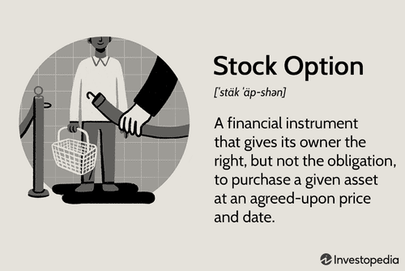

The stock market is an ever-evolving landscape that requires savvy investment strategies to navigate successfully. In recent years, a notable shift has occurred with the emergence of 'story stocks' and the increasing prevalence of algorithmic trading, both of which have significantly impacted investor decisions. Story stocks, characterized by their narrative-driven valuations rather than traditional financial metrics, are gaining prominence in sectors that promise innovation and future growth, such as technology and biotechnology. Investors are drawn to these stocks as they often present opportunities for substantial returns based on projected potential rather than current earnings.

Concurrently, algorithmic trading has gained traction due to its capacity for executing trades at high speeds and with precision, effectively removing human emotion from trading decisions. Utilizing computer programs that follow specific instructions, algorithmic trading capitalizes on market inefficiencies and patterns that may be difficult for human traders to discern. As these approaches intertwine, understanding their dynamics and potential risks becomes crucial for investors seeking to enhance their stock market endeavors. 



This article will explore the intersection of story stocks and algorithmic trading, highlighting how modern technologies and market narratives are shaping today's investment strategies. By examining the essentials of both strategies and their combined potential, investors can better position themselves to capitalize on the unique opportunities presented by this evolving financial landscape.

## Table of Contents

## Understanding Story Stocks

Story stocks are a unique category of equities primarily propelled by compelling narratives and investor expectations rather than fundamental financial attributes like earnings, assets, or cash flow. While traditional stock valuation focuses on tangible metrics, story stocks draw their value from potential growth narratives, market sentiment, or anticipated technological breakthroughs.

These stocks often see valuations that far exceed their intrinsic value, driven by optimistic investor sentiment. This phenomenon is especially evident in high-growth sectors such as technology and biotechnology, where innovation is rapid, and the promise of potential breakthroughs spurs investor interest. For example, companies involved in advancing renewable energy technologies or pioneering medical treatments can become story stocks if the market perceives their efforts as paving the way for significant future advancements.

However, the allure of story stocks comes with substantial risk. Some stocks manage to live up to their narratives, achieving soaring success and validating investor confidence. Yet, many others fail to meet such high expectations, resulting in disappointing financial performance and a stark decline in value. This disparity underscores the importance of cautious optimism; investors should judiciously assess the sustainability of a company's narrative against its actual performance and market conditions.

To comprehend the factors that render story stocks attractive, investors must conduct thorough research into the underlying business models, competitive landscape, and potential catalysts that could turn narratives into reality. They should also remain vigilant to market signals and sentiment shifts, as these can significantly impact a story stock's value, both positively and negatively. A comprehensive understanding of these dynamics allows investors to navigate the inherent uncertainties and capitalize on the lucrative potential that story stocks may offer.

## The Role of Algorithmic Trading

Algorithmic trading, often abbreviated as algo-trading, involves the use of computer algorithms to automate trading decisions and transactions. These algorithms are designed to follow a set of parameters specified by the trader, which can include timing, price, quantity, and other variables. By executing trades automatically, [algorithmic trading](/wiki/algorithmic-trading) offers several advantages over manual trading.

One of the primary benefits of algorithmic trading is its ability to execute trades at high speeds and with precision. The rapid execution of trades is crucial in markets where prices can change within milliseconds. This high-frequency trading environment is beyond the capability of human traders, making algorithmic systems essential for capturing market opportunities that arise for brief moments.

Furthermore, algo-trading effectively removes emotional biases from trading decisions. Human traders often succumb to emotions like fear and greed, which can lead to irrational decision-making. In contrast, algorithmic systems operate based purely on predefined logic, ensuring consistent execution of trades without being swayed by the psychological pitfalls that often beset human counterparts.

Several popular strategies are employed in algorithmic trading, including trend-following, [arbitrage](/wiki/arbitrage), and [volume](/wiki/volume-trading-strategy)-weighted average price (VWAP) trades. Trend-following strategies capitalize on sustained market movements, buying securities in rising markets and selling them in falling ones. Arbitrage opportunities arise when price discrepancies occur between different markets or platforms, allowing the algorithm to buy low in one context and sell high in another simultaneously. VWAP strategies, meanwhile, focus on executing trades in larger volumes over a set timeframe, ensuring that the prices paid or received are close to the average price.

Nevertheless, algorithmic trading is not without its risks and challenges. System failures or technical glitches can result in significant financial losses. For instance, if an algorithm mistakenly identifies a market trend, it might execute large volumes of trades based on faulty assumptions, exacerbating market [volatility](/wiki/volatility-trading-strategies). Moreover, the dependency on technology means that unforeseen technical issues, such as server outages or connectivity problems, can severely disrupt trading activities.

Given the complexities and potential pitfalls of algorithmic trading, a comprehensive understanding of its mechanisms and strategies is vital for modern investors. Integrating these technologies with existing investment strategies can lead to more informed decision-making and potentially more successful investments. As the landscape of trading continues to evolve, keeping pace with technological advancements in algorithmic systems will be crucial for investors seeking to maintain a competitive edge in the stock market.

## Investment Strategies Combining Story Stocks and Algo Trading

Combining the speculative nature of story stocks with the precise execution provided by algorithmic trading presents a compelling investment opportunity. This strategy involves leveraging the volatility and [momentum](/wiki/momentum) often associated with story stocks through the automation and speed offered by algorithmic trading systems.

Investors employ algorithmic trading to take advantage of rapid price movements, frequently observed in story stocks due to market narratives and investor sentiment. By programming algorithms to swiftly react to significant news events or sudden changes in stock prices, investors can effectively time their market entry and [exit](/wiki/exit-strategy) points. This precision allows for the exploitation of short-lived trading opportunities that might otherwise be missed by human traders.

For instance, when a narrative concerning a breakthrough in technology or a new product launch fuels investor enthusiasm, an algorithm can be programmed to initiate trades when the stock price crosses specific thresholds. Python, with its rich ecosystem of financial libraries such as `pandas`, `NumPy`, and `TA-Lib`, can be an excellent tool for developing these trading algorithms. A basic example of a momentum-based trading algorithm in Python might look like this:

```python
import pandas as pd
import numpy as np
from ta.momentum import RSIIndicator

def trading_strategy(data):
    data['rsi'] = RSIIndicator(data['close'], window=14).rsi()
    data['signal'] = np.where(data['rsi'] > 70, 'sell', np.where(data['rsi'] < 30, 'buy', 'hold'))
    return data

# Example usage with historical stock data in a DataFrame 'df'
# Assume 'close' is a column in 'df' representing the closing prices
strategy_result = trading_strategy(df)
```

Such algorithms must be meticulously backtested and fine-tuned to ensure they respond appropriately to the often volatile nature of story stocks. This requires a deep understanding of market narratives and the ability to integrate these insights into algorithmic models.

Implementing a successful strategy that combines story stocks with algorithmic trading also involves balancing [fundamental analysis](/wiki/fundamental-analysis) with algorithmic methods. While algorithmic efficiency can optimize trade execution, the underlying economic realities and fundamentals of the stocks must not be overlooked. By merging traditional evaluation metrics with advanced technology, investors can create a comprehensive approach that maximizes their market participation's potential.

This balanced strategy can effectively harness the market's unpredictability while mitigating risks associated with speculative investments. By aligning algorithmic precision with story-driven stock opportunities, investors unlock the potential for enhanced portfolio performance in the evolving landscape of stock market investing.

## Risks and Challenges

Story stocks and algorithmic trading are integral components of modern investment strategies, yet they present a series of risks that investors need to manage carefully. Market volatility is a critical concern, particularly when relying on algorithms that execute trades based on specific assumptions. If these assumptions are incorrect or become outdated, the algorithms might trigger trades at unfavorable times, magnifying losses. This situation can be exacerbated in volatile markets where price fluctuations occur rapidly and unpredictably. The pivotal challenge is to ensure that algorithms are continuously updated to reflect the latest market conditions and sentiment analyses.

Another significant risk involves dependency on technology. Automated trading systems, despite their precision and speed, are not immune to failures. System outages, software bugs, or hardware malfunctions can lead to missed trading opportunities or unintended trades, which can, in turn, have financial repercussions. To mitigate these risks, investors must maintain robust technological infrastructure and have contingency plans in place to manage potential system failures. Regular testing and updates can help in identifying vulnerabilities before they manifest as significant issues during live trading.

Regulatory compliance is a growing challenge, particularly as algorithmic trading becomes more widespread. Regulatory bodies are increasingly scrutinizing trading practices to ensure market fairness and transparency. Algorithms must comply with legal standards, which can vary significantly across different jurisdictions. Compliance requires a thorough understanding of relevant regulations and the capability to adapt trading systems to meet these requirements. Investors and trading firms need to stay informed about regulatory changes and emerging compliance standards to avoid legal challenges and potential penalties.

Successful navigation of these risks requires a multi-faceted approach. Investors need to undertake due diligence to understand the specific risks associated with both story stocks and algorithmic trading thoroughly. This involves constant monitoring of both market trends and technological advancements to anticipate potential challenges and adjust strategies accordingly. Additionally, maintaining open communication with regulatory bodies and industry experts can provide insights that may not be immediately apparent from market data alone. By adopting a proactive stance and remaining adaptable to change, investors can better mitigate the inherent risks of these contemporary trading methodologies and improve the likelihood of achieving long-term success.

## Future Trends in Stock Market Investing

As technology and market narratives evolve, so too will the strategies for investing in stock markets. An area of significant transformation is algorithmic trading, where [artificial intelligence](/wiki/ai-artificial-intelligence) (AI) and [machine learning](/wiki/machine-learning) (ML) are poised to further revolutionize its operations, enhancing efficiency and accuracy. AI and ML can process vast datasets far beyond human capability, identifying complex patterns and trends to inform trading decisions. The integration of AI with algorithmic trading could lead to more sophisticated algorithms capable of learning from past trades and continuously adapting to ever-changing market conditions. This adaptability can give traders an edge, enabling them to respond swiftly to emerging market opportunities or challenges.

In parallel, the growing interest in sustainable and socially responsible investing (SRI) is expected to impact story stock narratives. Investors are increasingly considering environmental, social, and governance ([ESG](/wiki/esg-investing)) factors in their decision-making processes. This shift could transform how story stocks are perceived, with heightened value placed on businesses that demonstrate commitment to sustainable practices. Companies that align with these values might experience positive investor sentiment, potentially driving their stock valuations alongside traditional financial metrics.

Remaining competitive in this evolving landscape requires continuous education and adaptation to new tools and market dynamics. Learning to leverage advanced technologies, such as AI and ML, in conjunction with understanding ESG criteria, is becoming critical for investors. As the market progresses, those who embrace these changes and commit to ongoing learning can position themselves advantageously. Engagement with new educational resources, attending relevant workshops, and staying updated with the latest research and market analyses are essential steps for investors aiming to stay ahead of the curve in stock market investing.

## Conclusion

Investors who engage with both story stocks and algorithmic trading have the potential to unlock distinct opportunities in the stock market. Story stocks, driven by market narratives and investor sentiment rather than fundamentals, present a high-risk, high-reward scenario. Algorithmic trading, on the other hand, offers precision and speed, harnessing technology to execute trades in fractions of a second based on predefined criteria. By understanding the intricacies and potential pitfalls of combining these approaches, investors can effectively leverage their unique advantages.

One of the key considerations for success is balancing new-age strategies with traditional financial principles. Fundamental analysis remains crucial; investors should evaluate the intrinsic value of stocks to identify overvaluations that might be the result of speculative hype. Simultaneously, algorithmic strategies should be tailored to accommodate market anomalies and volatility, ensuring robustness and adaptability to sudden changes.

The landscape of stock market investing is set to evolve continuously as technological progress and market narratives converge. Advanced technologies like artificial intelligence stand to further enhance the capabilities of algorithmic trading, enabling more sophisticated, adaptive, and self-learning algorithms. Meanwhile, shifts in societal values might shape the types of narratives that drive story stocks, such as the increasing emphasis on environmental, social, and governance (ESG) criteria.

To remain competitive, investors must commit to ongoing education and adaptation. Engaging with new market tools and dynamics, understanding emerging trends, and staying informed about regulatory developments are vital components of a resilient investment strategy. In this ever-evolving market environment, the key to maintaining an edge lies in the ability to continually learn and adapt, thereby optimizing portfolio performance and mitigating associated risks.

## References & Further Reading

[1]: Lo, A. W. (2004). ["The Adaptive Markets Hypothesis: Market Efficiency from an Evolutionary Perspective."](https://papers.ssrn.com/sol3/papers.cfm?abstract_id=602222) Journal of Portfolio Management, 30(5), 15-29.

[2]: Lepone, A., & Sacco, B. (2013). ["High-Frequency Trading and its Impact on Market Quality."](https://www.semanticscholar.org/paper/The-impact-of-high-frequency-trading-on-market-%3A-An-Frino-Lepone/46440e5fc9339f52c5f1f857b1ffd7e8073e2bf8) Journal of Trading, 8(3).

[3]: Bodek, H. (2013). ["The Problem of HFT - Collected Writings on High Frequency Trading & Stock Market Structure Reform."](https://www.amazon.com/Problem-HFT-Collected-Frequency-Structure/dp/1481978357)

[4]: Thaler, R. H. (1993). ["Advances in Behavioral Finance."](https://psycnet.apa.org/record/1993-98595-000) Russell Sage Foundation.

[5]: Shiller, R. J. (2000). ["Irrational Exuberance."](https://press.princeton.edu/books/paperback/9780691173122/irrational-exuberance) Princeton University Press.