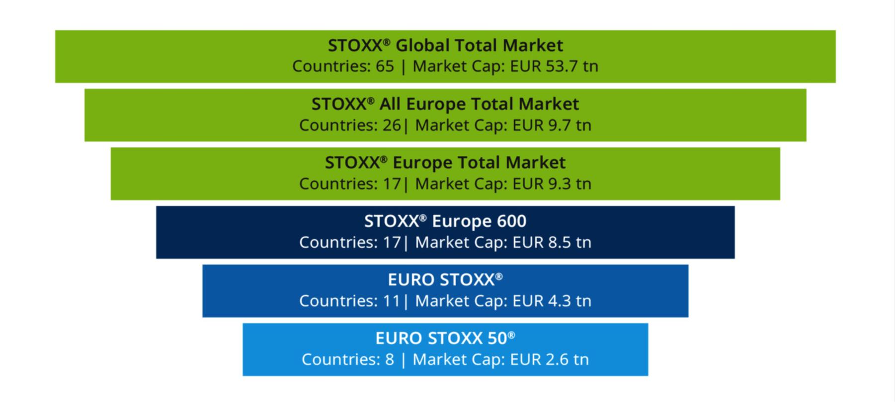

## Table of Contents

## What is the STOXX European Index?

The STOXX European Index is a stock market index that tracks the performance of major companies in Europe. It is created by STOXX Ltd., a company that specializes in creating and managing indices. The index includes a wide range of companies from different countries in Europe, like Germany, France, and Italy. This helps investors get a good picture of how the European stock market is doing overall.

The most well-known version of the STOXX European Index is the EURO STOXX 50, which follows the performance of the 50 biggest and most important companies in the Eurozone. These companies come from industries like banking, technology, and consumer goods. Investors use this index to see how these big European companies are doing and to make decisions about where to put their money. The index is updated regularly to make sure it always shows the current state of the market.

## How is the STOXX European Index calculated?

The STOXX European Index is calculated using a method called market capitalization weighting. This means that the value of the index depends on the total value of the companies included in it. Bigger companies have a bigger impact on the index's value. To find the total value of a company, you multiply the number of its shares by the price of each share. Then, you add up the values of all the companies in the index and divide by a special number called the divisor. This divisor helps keep the index stable even when companies are added or removed.

The calculation happens every day when the stock markets are open. The prices of the shares change all the time, so the index's value changes too. STOXX Ltd. makes sure the index is always up to date by using the latest share prices. They also review the companies in the index regularly to make sure it still represents the European market well. If a company gets too big or too small, or if a new company becomes important, STOXX might change the list of companies in the index.

## What are the main components of the STOXX European Index?

The STOXX European Index includes many big companies from Europe. Some of the main companies in the index are from industries like banking, technology, and consumer goods. For example, you might find companies like Total (a French energy company), Siemens (a German technology company), and L'Oréal (a French cosmetics company) in the index. These companies are chosen because they are big and important in their industries, and they help show how the European economy is doing.

The index is made up of different versions, with the EURO STOXX 50 being one of the most famous. This version includes the 50 biggest and most important companies in the Eurozone. These companies come from countries like Germany, France, and Spain. By looking at the EURO STOXX 50, people can get a good idea of how the biggest companies in Europe are doing. This helps investors decide where to put their money.

## How does the STOXX European Index differ from other European indices?

The STOXX European Index is different from other European indices because it covers a wide range of companies from many European countries. For example, the EURO STOXX 50 focuses on the 50 biggest companies in the Eurozone, while other indices like the FTSE 100 only include companies from the UK. The STOXX European Index gives a broader view of the European market by including companies from different countries and industries, which makes it useful for investors who want to understand the overall performance of Europe's economy.

Another way the STOXX European Index differs is in how it is calculated. It uses a market capitalization weighting method, which means bigger companies have a bigger impact on the index's value. This is similar to other indices like the S&P 500, but the STOXX European Index is unique because it is regularly updated to reflect changes in the market. This makes sure the index always shows a current picture of the European market, which can be different from other indices that might not update as often or use different methods to calculate their values.

## What is the historical performance of the STOXX European Index?

The STOXX European Index has had ups and downs over the years, just like any other stock market index. It has gone through periods of growth and times of decline, influenced by events like the global financial crisis in 2008 and the European debt crisis that followed. For example, during the financial crisis, the index dropped a lot because many big companies lost value. But after that, it slowly started to recover as the European economy got better. Overall, the index has shown that it can bounce back from tough times, which is important for investors to know.

Looking at more recent years, the STOXX European Index has been affected by events like Brexit and the COVID-19 pandemic. When the UK voted to leave the European Union in 2016, the index went down because of the uncertainty this caused. Then, when the pandemic hit in 2020, the index dropped a lot as businesses closed and people stayed home. But as vaccines were developed and economies reopened, the index started to go up again. These ups and downs show how the index can be a good way to see what's happening in Europe's economy and how it's doing over time.

## How can investors use the STOXX European Index to guide their investment decisions?

Investors can use the STOXX European Index to understand how the European market is doing overall. By looking at the index, they can see if the market is going up or down. This helps them decide if it's a good time to invest in European companies. For example, if the index is going up, it might mean that the economy is doing well, and it could be a good time to buy stocks. But if the index is going down, it might be a sign that the economy is struggling, and investors might want to wait or sell their stocks.

The index can also help investors pick specific companies to invest in. Since the STOXX European Index includes big companies from different industries, investors can look at which companies are doing well or poorly within the index. For instance, if a company like Siemens is doing better than others in the index, an investor might decide to buy shares in Siemens. This way, the index acts as a guide to finding strong companies in Europe. By regularly checking the index, investors can make smarter choices about where to put their money.

## What are the sector allocations within the STOXX European Index?

The STOXX European Index includes companies from many different sectors, like banking, technology, and consumer goods. This mix helps show how different parts of the European economy are doing. For example, if the banking sector is doing well, it might make up a bigger part of the index. This can happen because the value of banking companies goes up, making them a larger part of the total value of the index. On the other hand, if technology companies are doing poorly, their share in the index might go down.

The exact sector allocations can change over time because the index is updated regularly. This means the percentage of the index that comes from each sector can go up or down based on how well those sectors are doing. For instance, if energy companies are doing really well, they might make up a bigger part of the index. By looking at these sector allocations, investors can get a good idea of which parts of the European economy are strong or weak at any given time.

## How frequently is the STOXX European Index rebalanced and reconstituted?

The STOXX European Index is rebalanced and reconstituted regularly to make sure it stays up to date with changes in the market. Rebalancing happens every quarter, which means it is done four times a year. During rebalancing, the weights of the companies in the index are adjusted to reflect their current market values. This helps keep the index accurate and fair, showing how the market is doing at that time.

Reconstitution, on the other hand, happens once a year. This is when the list of companies in the index is reviewed and possibly changed. Companies might be added or removed based on their size and importance in the market. This yearly check makes sure the index still represents the European market well. By doing these updates, the STOXX European Index gives investors a current and reliable view of the European economy.

## What are the eligibility criteria for companies to be included in the STOXX European Index?

To be included in the STOXX European Index, companies need to meet certain rules. They must be based in Europe and have their stocks traded on a European stock exchange. The company should also be big enough, which is measured by how much it is worth in the market. This is called market capitalization. The company needs to have a certain amount of shares available for people to buy and sell, which is called free float. This makes sure the company is important enough to be part of the index.

The index also looks at how much the company is traded. It needs to have enough trading activity, so people can easily buy and sell its stocks. This is called [liquidity](/wiki/liquidity-risk-premium). The company should also follow the rules set by the stock exchange where it is listed. These rules help make sure the company is doing things the right way. By meeting all these criteria, a company can be part of the STOXX European Index and help show how the European market is doing.

## How does the STOXX European Index handle corporate actions like mergers and acquisitions?

The STOXX European Index takes care of corporate actions like mergers and acquisitions by making changes to the index. When two companies merge or one company buys another, the value of the companies can change. The index needs to update to show these changes. If a company in the index gets bigger because of a merger or acquisition, its weight in the index might go up. If a company gets smaller or is taken over completely, it might be removed from the index.

These changes are made during the regular updates of the index. The index is rebalanced every three months, which means the weights of the companies are adjusted. If a merger or acquisition happens between these times, the index might make a special update to keep things accurate. This way, the STOXX European Index always shows a true picture of the European market, even when big changes happen to the companies in it.

## What are the different versions of the STOXX European Index available for investors?

The STOXX European Index comes in different versions to help investors in different ways. The most famous one is the EURO STOXX 50, which follows the 50 biggest and most important companies in the Eurozone. This version is good for investors who want to see how the biggest companies in Europe are doing. Another version is the STOXX Europe 600, which includes 600 companies from 17 European countries. This one gives a broader view of the European market because it includes more companies from different places.

There are also other versions like the STOXX Europe 50, which is similar to the EURO STOXX 50 but includes companies from all of Europe, not just the Eurozone. The STOXX Europe Total Market Index is another option, which includes almost all companies in Europe that meet the index's rules. This version is good for investors who want to see the whole European market. Each version of the index helps investors understand different parts of the European economy and make better choices about where to put their money.

## How does the STOXX European Index incorporate ESG (Environmental, Social, and Governance) factors?

The STOXX European Index includes [ESG](/wiki/esg-investing) factors by creating special versions of the index that focus on these areas. These versions, like the STOXX Europe 600 ESG-X Index, look at how well companies are doing in terms of the environment, social issues, and how they are run. Companies that do not meet certain ESG standards might be left out of these special indexes. This helps investors who care about these issues to put their money into companies that are doing good things for the world.

The way ESG factors are included in the index is by using data from companies about their ESG performance. This data is checked and scored by experts. The scores help decide which companies should be in the ESG-focused indexes. By doing this, the STOXX European Index gives investors a way to see how European companies are doing in terms of ESG, and it helps them make choices that match their values.

## References & Further Reading

[1]: [STOXX Ltd.](https://www.stoxx.com/en_US/web/stoxxcom/home) - Official website providing detailed information on the different indices offered by STOXX, including Euro STOXX 50 and STOXX Europe 600.

[2]: [Qontigo.](https://www.stoxx.com/web/dax-indices/about-us) - Parent company of STOXX with insights on their index products and methodologies.

[3]: Lopez de Prado, M. (2018). ["Advances in Financial Machine Learning."](https://www.amazon.com/Advances-Financial-Machine-Learning-Marcos/dp/1119482089) Wiley. - A book offering insights on the intersection of machine learning and finance, relevant to algorithmic trading.

[4]: Harris, L. (2003). ["Trading and Exchanges: Market Microstructure for Practitioners."](https://www.amazon.com/Trading-Exchanges-Market-Microstructure-Practitioners/dp/0195144708) Oxford University Press. - Provides a comprehensive overview of how trading works at the technical level, including algorithmic trading.

[5]: Chan, E. P. (2008). ["Quantitative Trading: How to Build Your Own Algorithmic Trading Business."](https://github.com/ftvision/quant_trading_echan_book) Wiley. - A practical guide to setting up algorithmic trading strategies, useful for understanding how STOXX indices can be used in these systems.