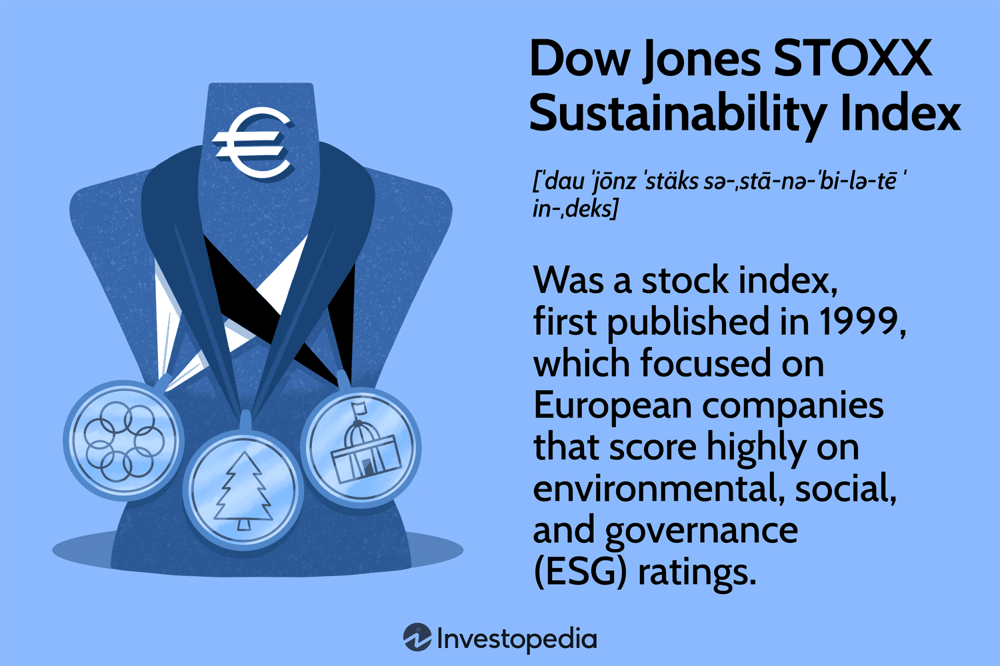

The STOXX Index family is a crucial component of the European financial markets, serving as a benchmark for gauging the performance of leading markets across Europe. These indices, managed by Qontigo, a subsidiary of Deutsche Börse, offer a comprehensive suite of indices covering various sectors and regions, with a significant focus on European economies. The most significant among them, the Euro STOXX 50, is widely recognized as the European counterpart to the Dow Jones Industrial Average, reflecting the performance of the top 50 blue-chip companies in the Eurozone.

European indexing, through mechanisms such as the STOXX indices, plays a pivotal role in the broader financial markets by offering transparency, consistency, and a reliable gauge for evaluating market trends and performance. It caters to investors seeking to track specific sectors or the broader economic landscape of the Eurozone, providing insights that are crucial for both institutional and individual investors.



Algorithmic trading has revolutionized the investment landscape, introducing new dynamics in terms of speed, precision, and efficiency. Algorithms facilitate trading decisions and executions based on pre-defined criteria and can operate at a pace impossible for human traders. This has significantly enhanced the liquidity of markets like those represented by the STOXX indices, increasing the volume of trades and improving market efficiency. High-frequency trading, a subset of algorithmic trading, dominates significant portions of trading activity on European exchanges, and indices such as the STOXX provide the necessary benchmarks against which these trades are executed and measured.

The STOXX indices are instrumental in representing the financial health and economic performance of key European markets. They serve as benchmarks for a wide array of financial products, including exchange-traded funds (ETFs), mutual funds, and derivatives, and are an essential tool for anyone involved in the European or global financial sectors. Through their reflection of the market movements and economic conditions, these indices help investors make informed investment decisions and enable the development of trading strategies that can align with or hedge against market fluctuations.

## Table of Contents

## Understanding STOXX Indices

STOXX Ltd., a subsidiary of Qontigo, is recognized as a leading provider of innovative and globally acknowledged indices. These financial tools are pivotal for the assessment and benchmarking of market performance, especially across Europe. Among its offerings, STOXX specializes in the creation and maintenance of a broad range of indices covering various markets, sectors, and investment strategies.

The underpinning of STOXX's prominence in the financial markets is its development of robust indices that accurately measure the performance of European markets, such as the Euro STOXX 50 and STOXX Europe 600. The Euro STOXX 50 Index is the preeminent index of leading European blue-chip companies, encompassing large, liquid stocks from within the Eurozone. It serves as a vital benchmark for investors and is widely used for derivative products, such as futures and options, providing effective insights into market trends and opportunities for portfolio diversification.

In parallel, the STOXX Europe 600 Index offers a more comprehensive snapshot of European financial health by encompassing 600 companies from 17 European countries, thus stretching beyond the confines of the Eurozone. This index is often utilized to gauge the broader market sentiment and trend across Europe, serving as a reference point for fund managers and institutional investors aiming to achieve diversified European equity exposure.

The comprehensive market coverage provided by STOXX indices is instrumental for both passive and active investment strategies. By tracking these indices, investors can gain a clear understanding of market dynamics and deploy strategies that optimize returns while mitigating risk. The creation of indices that balance [liquidity](/wiki/liquidity-risk-premium), representation, and sector diversification underscores STOXX's essential role in the financial ecosystem, offering indispensable benchmarking tools that accommodate varied investment objectives and risk profiles.

## Euro STOXX 50 Index

The Euro STOXX 50 Index is a key European blue-chip stock market index, representing the performance of 50 of the largest and most liquid stocks within the Eurozone. Established in 1998 by STOXX Ltd., the index serves as a vital indicator of the economic health and market dynamics within Europe, reflecting a significant portion of the market capitalization in the region.

The composition of the Euro STOXX 50 is determined based on a rigorous selection process, focusing on the market capitalization, liquidity, and sector representation of companies. The index components are selected from 11 countries that are part of the Eurozone, ensuring a diverse geographic and sectoral representation. The primary selection criterion is free-float market capitalization, which emphasizes the shares available for public trading, rather than the total market capitalization. The index constituents are reviewed annually in September, with quarterly reviews to ensure continued compliance with selection criteria. This process ensures the index remains representative of the leading blue-chip stocks within the Eurozone.

The Euro STOXX 50 acts as a benchmark for European stock market performance, providing a transparent and reliable measure of the largest companies in the Eurozone. It is used by a wide range of market participants, including asset managers, institutional investors, and individual investors, as a guide to market trends and investment decisions. Its status as a benchmark is reinforced by its widespread use in derivatives markets, where futures and options based on the Euro STOXX 50 are extensively traded, offering investors tools for hedging and speculative purposes.

The index's significance is further highlighted by its adoption in multiple financial products such as exchange-traded funds (ETFs), which enable investors to gain exposure to the index's performance efficiently. The Euro STOXX 50, thus, not only mirrors the economic landscape within the Eurozone but also facilitates investment strategies across global financial markets, acting as a cornerstone for both traditional and [algorithmic trading](/wiki/algorithmic-trading) strategies.

## Investing in STOXX Indices

Investors seeking exposure to European markets often turn to STOXX indices through a variety of investment vehicles. Exchange-traded funds (ETFs) and mutual funds are the primary options. Both allow investors to gain broad market exposure with relative ease, but they have distinct characteristics.

### ETFs vs. Direct Stock Purchases

ETFs offer a diversified approach by pooling together various holdings that track an index, such as the Euro STOXX 50. This diversity reduces individual stock risk. ETFs like the iShares Euro STOXX 50 UCITS [ETF](/wiki/etf-trading-strategies) and the SPDR Euro STOXX 50 ETF are popular choices, offering investors a straightforward, cost-effective way to invest in a basket of European stocks.

In contrast, direct stock purchases involve buying individual company shares. This strategy can offer higher returns if an investor correctly identifies outperforming stocks. However, it also involves higher risk due to lack of diversification. Furthermore, managing a portfolio of individual stocks is typically more time-consuming and may involve higher transaction costs.

### Major ETFs Tracking the Euro STOXX 50

Several major ETFs track the Euro STOXX 50 Index, providing investors with a range of options that differ in terms of management style, cost, and additional features:

- **iShares Euro STOXX 50 UCITS ETF**: This ETF is among the largest and most liquid options available, allowing for efficient entry and exit at minimal cost. It is traded on multiple European exchanges and provides exposure to 50 large blue-chip companies from the Eurozone.

- **SPDR Euro STOXX 50 ETF**: Known for its competitive fees, this ETF offers similar exposure and liquidity to the iShares offering. It is a favored choice for cost-conscious investors looking to replicate the performance of the Euro STOXX 50.

- **Xtrackers Euro STOXX 50 UCITS ETF**: Managed by DWS, the asset management arm of Deutsche Bank, this ETF provides another alternative with low tracking error. It appeals to those seeking precision in tracking index performance.

These ETFs are designed to provide investors with a comprehensive exposure to the Eurozone's leading companies. They are also known for their transparency, tax efficiency, and ease of trading, making them attractive to both institutional and retail investors.

In conclusion, investing in STOXX indices via ETFs offers a convenient, diversified, and liquid means to participate in the European market. By understanding the differences between ETFs and direct stock investing, and the various ETF options available, investors can make informed decisions aligned with their financial goals and risk tolerance.

## Algorithmic Trading with STOXX Indices

Algorithmic trading, which involves using computer algorithms to automate trading decisions and execute transactions, has become increasingly prominent in the financial markets. The STOXX indices, which include prominent indices such as the Euro STOXX 50 and STOXX Europe 600, are crucial benchmarks frequently leveraged by algorithmic trading strategies.

**Utilization of STOXX Indices in Algorithmic Trading Strategies**

Algorithmic trading strategies often utilize the STOXX indices as reference points for executing trades. Traders exploit the liquidity and price stability offered by these indices to implement strategies such as [arbitrage](/wiki/arbitrage), [trend following](/wiki/trend-following), and mean reversion. These strategies are designed to take advantage of price discrepancies, detect trends or patterns, and forecast future movements based on historical data.

For example, arbitrage strategies may focus on price differences between the STOXX indices and related derivative products, capturing profits within milliseconds. Similarly, trend-following algorithms might analyze historical trends of the Euro STOXX 50 Index to predict future price movements, executing buy or sell orders accordingly.

**Impact on Liquidity and Market Efficiency**

The rapid adoption of algorithmic trading has significantly impacted market liquidity and efficiency. High-frequency trading ([HFT](/wiki/high-frequency-trading-strategies)), a form of algorithmic trading that executes a large number of orders at extremely fast speeds, often uses STOXX indices as a basis for trade decisions due to their stability and liquidity. This constant trading activity increases market liquidity by narrowing bid-ask spreads, allowing for more efficient price discovery.

However, these algorithms can also contribute to market [volatility](/wiki/volatility-trading-strategies) during times of stress, as algorithmic strategies might amplify trends or trigger cascades of trades that affect market stability. Despite these challenges, the overall impact of algorithmic trading on market efficiency is considered positive, as it enhances the speed and precision of trades.

**Examples of Popular Algorithmic Trading Strategies**

Several algorithmic trading strategies are prevalent among traders utilizing the STOXX indices:

1. **Statistical Arbitrage**: This strategy uses mathematical models to find pricing inefficiencies between securities. Traders might identify correlations between the Euro STOXX 50 components and use statistical methods to trade pairs of stocks, aiming to profit from any temporary divergence in prices.

   ```python
   import numpy as np
   import statsmodels.api as sm

   # Example of a simple mean reversion strategy
   def mean_reversion_strategy(prices, lookback=10):
       moving_average = prices.rolling(window=lookback).mean()
       std_dev = prices.rolling(window=lookback).std()
       z_score = (prices - moving_average) / std_dev
       return z_score
   ```

2. **Mean Reversion**: Some algorithms operate on the principle that stock prices will revert to their historical mean. Implementing this strategy involves statistical analysis of past prices of stocks in indices like the STOXX Europe 600, identifying deviations that present potential trading opportunities.

3. **Machine Learning Implementations**: Advanced trading firms utilize machine learning algorithms to predict market movements. These algorithms are trained on historical data from STOXX indices to identify patterns and improve decision-making in real-time trading environments.

The interplay between algorithmic trading and STOXX indices underscores the importance of these indices in modern trading practices, offering various opportunities for innovation and advancements in market strategies.

## Sustainability and ESG in STOXX Indices

The Euro STOXX 50 [ESG](/wiki/esg-investing) Index is a significant benchmark focusing on sustainability and environmental, social, and governance (ESG) criteria within the European market. This index includes companies that are part of the Euro STOXX 50 Index but have also demonstrated strong ESG performance. As investors increasingly prioritize sustainable investing, the Euro STOXX 50 ESG Index serves as an essential tool for aligning financial goals with ethical considerations.

**Criteria for Inclusion in the ESG Index**

To be included in the Euro STOXX 50 ESG Index, companies must undergo a rigorous evaluation process. This process assesses a firm's ESG performance using specific criteria, such as environmental policies, carbon footprint, labor practices, and corporate governance structures. The index excludes companies involved in controversial activities, such as weapons manufacturing, tobacco production, or significant environmental damage. Additionally, the ESG assessment is performed by specialized agencies that use both quantitative and qualitative metrics to determine a company's eligibility and ESG score.

**Benefits for Socially Responsible Investors**

Investors seeking to integrate ethics into their portfolios find ESG indices beneficial due to their comprehensive evaluation of a company's impact on society and the environment. These indices provide a streamlined way to invest in companies that are leaders in sustainable practices, reducing the time and effort investors need to conduct individual company assessments. Furthermore, investing in ESG indices can potentially yield long-term financial returns, as companies with strong ESG performance are often more resilient to regulatory changes and can enjoy better brand reputation and customer loyalty.

**The Role of ESG Indices in Promoting Ethical Investing**

ESG indices like the Euro STOXX 50 ESG Index play a crucial role in promoting ethical investing by offering transparent benchmarks that prioritize sustainability. They encourage companies to improve their ESG performance by incentivizing good practices through their inclusion criteria. As a result, these indices contribute to a broader shift towards responsible investment practices, promoting corporate accountability and sustainability. By choosing ESG indices, investors can influence companies to adopt better practices, leading to a positive impact on both the financial markets and society at large.

## Conclusion

The STOXX indices continue to play a vital role in the global financial markets, maintaining their relevance through ongoing adaptability and innovation. These indices offer a comprehensive reflection of European market performance while also extending to global indices, thereby enabling investors worldwide to benchmark and gauge market health effectively. As the financial landscape becomes increasingly complex, STOXX indices provide consistency and clarity, acting as indispensable tools for financial analysis and decision-making.

Indexing, investment, and algorithmic trading have cultivated a synergistic relationship that fundamentally alters market dynamics. Index-based investing provides a streamlined approach for investors to engage with diversified markets efficiently, reducing risks associated with individual securities. Algorithmic trading, leveraging these indices, further enhances this process through optimized trading executions, increased liquidity, and improved market efficiency. Algorithms, utilizing sophisticated models and real-time data, such as those based on STOXX indices, drive the modern investment ecosystem by not only minimizing transaction costs but also by capitalizing on fleeting market opportunities.

As sustainable investing gains prominence, it is important for investors to integrate both traditional and ESG-focused indices into their investment strategies. By doing so, they align financial goals with responsible investment practices. The Euro STOXX 50 ESG Index, for example, provides a pathway for socially responsible investing by measuring companies against environmental, social, and governance criteria. This allows investors to partake in ethical investing while still achieving competitive returns. The merging of traditional financial performance with sustainability considerations reflects an evolving investment mindset that values long-term societal impact alongside economic gains.

Ultimately, STOXX indices encapsulate the twin objectives of achieving robust financial performance and fostering sustainable economic models. Investors are encouraged to explore the full spectrum of indexing opportunities, balancing between traditional indices and those prioritizing ESG benchmarks, to construct resilient and forward-looking portfolios.

## References & Further Reading

[1]: [STOXX Ltd.](https://www.stoxx.com/en_US/web/stoxxcom/home) - Official website providing detailed information on the different indices offered by STOXX, including Euro STOXX 50 and STOXX Europe 600.

[2]: [Qontigo.](https://www.stoxx.com/web/dax-indices/about-us) - Parent company of STOXX with insights on their index products and methodologies.

[3]: Lopez de Prado, M. (2018). ["Advances in Financial Machine Learning."](https://www.amazon.com/Advances-Financial-Machine-Learning-Marcos/dp/1119482089) Wiley. - A book offering insights on the intersection of machine learning and finance, relevant to algorithmic trading.

[4]: Harris, L. (2003). ["Trading and Exchanges: Market Microstructure for Practitioners."](https://www.amazon.com/Trading-Exchanges-Market-Microstructure-Practitioners/dp/0195144708) Oxford University Press. - Provides a comprehensive overview of how trading works at the technical level, including algorithmic trading.

[5]: Chan, E. P. (2008). ["Quantitative Trading: How to Build Your Own Algorithmic Trading Business."](https://github.com/ftvision/quant_trading_echan_book) Wiley. - A practical guide to setting up algorithmic trading strategies, useful for understanding how STOXX indices can be used in these systems.