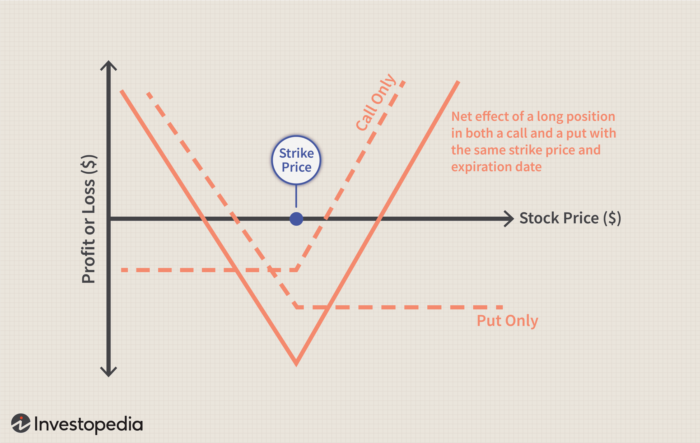

Options trading is a pivotal component of modern financial markets, offering numerous strategies to maximize returns and manage risks. Among these strategies, straddle options have gained attention for their unique ability to exploit price movements without requiring traders to predict the market's directional shifts. Straddle strategies involve the simultaneous purchase of a call option and a put option with the same strike price and expiration date, providing a robust framework for capturing profits amidst market volatility.

The appeal of straddle strategies lies in their versatility. They are particularly attractive to traders who expect significant price fluctuations but lack a clear view of whether the market will rise or fall. This dynamic positions straddles as an essential tool for navigating uncertain market conditions, whether in response to corporate earnings announcements, economic data releases, or geopolitical developments.



This article aims to dissect straddle strategies comprehensively, examining their mechanics and how traders can implement them effectively. Furthermore, it will discuss the impact of technological advancements, particularly algorithmic trading, in enhancing the precision and efficiency of executing straddle strategies. With algorithms, traders can optimize entries and exits, manage risks, and capitalize on opportunities with speed and accuracy that manual methods struggle to match.

In summary, straddle strategies present a compelling opportunity for options traders to capitalize on volatility. By understanding the intricacies and utilizing advanced techniques, traders can leverage straddles to introduce flexibility into their trading portfolios and potentially uncover significant financial gains.

## Table of Contents

## Understanding Straddle Options Trading

A straddle is an options trading strategy that involves purchasing both a call and a put option with the same strike price and expiration date. This dual-purchase structure is designed to capitalize on the underlying asset's price movements, whether up or down, or potentially benefit from market stagnation. 

The primary types of straddle strategies are the long straddle and the short straddle. A long straddle is utilized when traders anticipate significant market volatility. This strategy profits if there is considerable movement in the asset's price in either direction. For instance, if a stock is priced at $100, buying a call and a put option, both with a $100 strike price, sets up a long straddle. If the stock price rises to $120, the call option can be sold at a profit, while the loss on the put option is limited to its purchase price. Conversely, if the price falls to $80, the put option becomes profitable, counterbalancing the call option's loss.

Conversely, a short straddle is employed when traders expect the market to remain stable. This strategy involves selling both a call and a put with the same strike price and expiration date. It works best when the asset price remains closer to the strike price, allowing the trader to retain the premiums collected from writing the options. The risk in a short straddle is significant since large price movements can lead to substantial losses, making it a suitable strategy for calm markets.

Traders engaging in straddle trading benefit from correct predictions regarding price [volatility](/wiki/volatility-trading-strategies). A long straddle can provide unlimited profit potential if the asset moves significantly in either direction, though losses are limited to the premium paid for the options. A short straddle benefits from low volatility, but it carries the risk of potentially unlimited losses and limited profit to the premiums received.

Understanding the dynamics of straddle options trading is crucial for effectively leveraging their potential, especially considering the costs and risks involved. This knowledge is essential in developing sophisticated trading strategies that align with the expected market conditions.

## Types of Straddle Strategies

A straddle strategy in options trading consists of two fundamental approaches: the long straddle and the short straddle. Each approach caters to different market expectations and risk profiles, providing versatility to traders seeking to capitalize on volatility. The long straddle and short straddle are differentiated by their response to market movements and can be employed in various scenarios based on specific market conditions.

### Long Straddle

A long straddle strategy is typically used when a trader anticipates substantial market movements but is uncertain about the direction of these movements. This strategy involves buying a call option and a put option with the same underlying asset, strike price, and expiration date. The key idea is that significant price shifts, whether upward or downward, will generate profits.

In a long straddle, the maximum potential loss is limited to the total premium paid for both options. However, the potential gain is theoretically unlimited, given that significant price movements can result in either option moving substantially in-the-money. This strategy is most effective in volatile market conditions where large price swings are anticipated due to events like earnings announcements, monetary policy changes, or geopolitical developments.

Mathematically, the payoff for a long straddle can be expressed as:

$$
\text{Payoff} = \max(S_T - K, 0) + \max(K - S_T, 0) - C - P
$$

where $S_T$ is the stock price at expiration, $K$ is the strike price, and $C$ and $P$ are the premiums for the call and put options, respectively.

### Short Straddle

Conversely, a short straddle is predicated on the expectation that the market will exhibit low volatility and remain within a narrow price range. This strategy involves selling both a call and a put option with identical strike prices and expiration dates. The aim is to profit from the premiums received from selling the options, which can be maximized if the underlying asset's price remains stable.

In a short straddle, the trader earns the total premium as profit if the price of the underlying asset stays at the strike price at expiration. However, the risk is considerably high if the market moves significantly in either direction since losses can be substantial.

The payoff for a short straddle can be described by:

$$
\text{Payoff} = C + P - \max(S_T - K, 0) - \max(K - S_T, 0)
$$

### Comparative Analysis

Choosing between a long or short straddle depends on the trader's outlook on market volatility. Long straddles are suitable for environments with expected high volatility and potential for significant price changes. These scenarios usually arise around major market events or during periods of economic uncertainty.

Short straddles are more apt when markets are predicted to be stable or exhibit minimal fluctuations. This might occur during periods of political stability, absence of major economic reports, or predictable business cycles.

However, traders must remain cautious with both strategies, as long straddles entail high initial costs due to option premiums, while short straddles expose the trader to potentially unlimited losses if the market deviates significantly from the strike price. Understanding the market conditions and having clear predictions about volatility are essential for selecting the appropriate straddle strategy.

## Implementing a Straddle Strategy

Implementing a straddle strategy in options trading necessitates a detailed understanding of several critical factors, including the selection of the underlying asset, market [liquidity](/wiki/liquidity-risk-premium), strike prices, expiration dates, and effective risk management. This approach ensures that the strategy aligns with the trader's expectations of market volatility without being dependent on the direction of price movements.

### Choosing the Underlying Asset and Ensuring Market Liquidity

The choice of the underlying asset is paramount in a straddle strategy, as the asset must be volatile enough to provide profitable price swings in either direction. Stocks or indices that are expected to experience significant movements due to earnings reports, geopolitical events, or new product launches are typically prime candidates for straddles. 

Liquidity is equally vital; it ensures that the options can be purchased and sold with minimal slippage and at desired prices. High liquidity markets also feature tighter bid-ask spreads, which contribute to lower trading costs and facilitate easier entry and [exit](/wiki/exit-strategy) from the positions.

### Selecting Appropriate Strike Prices and Expiration Dates

In a straddle strategy, both a call and a put option with the same strike price and expiration date are purchased. The selection of the strike price is crucial; typically, it is chosen to be at-the-money (ATM) at the time of purchase, because ATM options have the highest gamma and thus the greatest potential for profit from significant price movements.

The expiration date should align with the expected time frame of the anticipated volatility. Short-term traders may opt for near-term expirations to capitalize on immediate price swings, while those expecting extended volatility might select longer-dated options. The choice depends on the trader's specific outlook and risk tolerance.

### Calculating Potential Profits and Risks, and Managing Positions Effectively

The potential profit from a long straddle is theoretically unlimited, as gains are realized if the underlying asset moves significantly in either direction. The break-even points for a straddle can be calculated using the formulas:

$$

\text{Break-even Price (upside)} = \text{Strike Price} + (\text{Premium Paid for Call} + \text{Premium Paid for Put})
$$

$$

\text{Break-even Price (downside)} = \text{Strike Price} - (\text{Premium Paid for Call} + \text{Premium Paid for Put})
$$

Risk management is essential, given that the total premiums paid for the options represent the maximum potential loss if the market remains stagnant and neither break-even point is reached. To manage these risks, traders may employ stop-loss orders or hedging techniques to limit potential losses. Furthermore, monitoring market conditions and volatility indices can provide important signals for adjusting the strategy as needed.

Careful position sizing is also critical to avoid excessive exposure and ensure that the straddle strategy does not exceed the trader’s risk capacity. By following these guidelines, traders can effectively implement a straddle strategy that aligns with their market expectations and risk preferences.

## Algorithmic Trading and Straddle Strategies

Algorithmic trading plays a pivotal role in enhancing the execution of straddle strategies by leveraging computational power to automate and optimize trades. This approach is particularly useful given the complex and often rapid movements in financial markets, where precision and speed are essential. By using [algorithmic trading](/wiki/algorithmic-trading), traders can formulate strategies that respond to market changes in real-time, ensuring that straddle positions are entered and exited at the most opportune times.

Automated systems utilize predefined algorithms to execute trades, significantly reducing the time it takes to respond to market conditions compared to manual trading. Such systems can be programmed to monitor market indicators, execute trades when specific conditions are met, and automatically adjust positions to manage risk and capitalize on volatility. Precision is achieved by automating the entire process—from market analysis to execution—leading to a reduction in human error and emotional biases.

A common algorithmic approach in straddle strategies is the use of straddle bots. These bots analyze market volatility in real-time and automatically place both call and put options when high volatility is detected. The strategy relies on advanced algorithms that evaluate market trends and price discrepancies, triggering trades when profitable opportunities arise. This level of automation is crucial in volatile markets where price movements are swift and often unpredictable.

One algorithmic strategy involves implementing a delta-neutral approach to maintain a balanced position between call and put options. By continuously adjusting the ratio of options, the strategy ensures that the portfolio remains hedged against market movements, allowing traders to benefit from substantial shifts in either direction without exposure to directional risk. This involves complex calculations and rapid adjustments that are best managed by automated systems.

Algorithmic trading systems also employ risk management algorithms that strategically set stop-loss and take-profit levels, ensuring that traders are protected from excessive losses while securing profits when market conditions are favorable. By doing so, these systems enhance the overall performance and profitability of straddle trades.

For example, a Python-based algorithmic trading script could be designed to scan for implied volatility spikes, executing a straddle trade when a certain volatility threshold is exceeded. Below is a simplified representation of such a script:

```python
import numpy as np
from trading_api import OptionsAPI  # Hypothetical API for trading

def main():
    api = OptionsAPI()
    asset = "AAPL"
    strike_price = 150
    expiration_date = "2023-12-20"

    while True:
        implied_volatility = api.get_implied_volatility(asset)

        if implied_volatility > threshold:
            # Execute long straddle
            api.buy_call(asset, strike_price, expiration_date)
            api.buy_put(asset, strike_price, expiration_date)
            print("Straddle executed at high volatility")

        # Regular risk management check
        if api.check_market_conditions() == "exit":
            api.close_positions(asset)
            print("Positions closed based on market conditions")

        # Sleep for a set interval before next check (e.g., 5 mins)
        time.sleep(300)

if __name__ == "__main__":
    main()
```

In practice, these strategies demand continuous market monitoring and [backtesting](/wiki/backtesting) to refine algorithms, confirming their effectiveness across various market conditions. Algorithmic trading's contribution to straddle strategies is immeasurable in terms of improving execution accuracy, managing risks, and adapting to market dynamics—ultimately maximizing the potential returns for traders.

## Real-Life Examples

In practical options trading, straddle strategies offer valuable insights into market dynamics, especially during periods of uncertainty. This section provides real-life examples of long and short straddle trades, illustrating their adaptability and profitability under varying market conditions.

### Long Straddle Trade Example

Consider a scenario where a trader anticipates significant price volatility in a tech stock due to an upcoming earnings report but is uncertain about whether the news will be received positively or negatively. The trader decides to use a long straddle strategy by purchasing both a call option and a put option of XYZ Corp, each with a strike price of $100 and an expiration date set to coincide with the earnings announcement.

#### Trade Setup:

- **Call Option Premium:** $5
- **Put Option Premium:** $5
- **Total Cost of Straddle:** $10 per share

In this setup, the total cost for implementing the straddle strategy is $10 per share, representing the combined premiums of the call and put options. The breakeven points for this trade occur at strike price plus and minus the total premium cost, i.e., $110 and $90, respectively.

#### Outcome:

1. **Stock Rises to $120:**
   - **Call Option:**
     - Profit: $20 (Stock price - Strike price - Call premium = $120 - $100 - $5)
   - **Put Option:**
     - Loss: $5 (Premium paid)
   - **Net Profit:** $20 - $5 = $15

2. **Stock Falls to $80:**
   - **Put Option:**
     - Profit: $15 (Strike price - Stock price - Put premium = $100 - $80 - $5)
   - **Call Option:**
     - Loss: $5 (Premium paid)
   - **Net Profit:** $15 - $5 = $10

In both cases, the long straddle adapts to the market's bidirectional movements, illustrating the strategy's effectiveness in volatility.

### Short Straddle Trade Example

A short straddle, on the other hand, can be profitable in a comparatively stable market. Consider a trader expecting little movement in the price of DEF Corp, currently trading at $50, due to anticipated regulatory announcements affecting the entire sector, ensuring stability.

#### Trade Setup:

- **Call Option Premium:** $3
- **Put Option Premium:** $3
- **Total Received Premium:** $6 per share

By selling both call and put options, the trader collects $6 in premium income. The breakeven points occur at $56 and $44.

#### Conditions for Profitability:

1. **Stock remains at $50 at expiration:**
   - The call and put options expire worthless.
   - **Net Profit:** $6 (Total premium received)

2. **Stock moves slightly to $53 or $47:**
   - Both options still expire out-of-the-money.
   - **Net Profit:** $6 (Total premium received)

The short straddle requires the stock to remain relatively stable, allowing the trader to profit primarily from the premiums collected.

### Lessons Learned

The real-life examples of long and short straddle trades highlight the necessity of understanding market conditions and volatility forecasts. Long straddles capitalize on significant volatility, offering profit opportunities in both bullish and bearish scenarios. Short straddles, conversely, benefit from market stability but involve higher risk due to unlimited potential losses if the market moves beyond the breakeven points.

Risk management and precise market analysis are crucial in executing these strategies effectively. Traders must also consider the impact of transaction fees and employ strategies like diversifying holdings or setting stop-loss orders to mitigate risks. These examples emphasize the adaptability of straddle strategies in different trading environments and their potential profitability when executed with caution and market awareness.

## Advantages and Disadvantages

Straddle strategies, like any financial strategy, come with a set of advantages and disadvantages that traders must weigh carefully. 

One of the primary advantages of straddle strategies is their potential for high gains and inherent flexibility. By purchasing both call and put options with the same strike price and expiration date, traders position themselves to benefit from significant price movements in either direction. This bilateral flexibility is particularly valuable in volatile markets where price forecasts are uncertain. For example, a long straddle might yield substantial profits if the underlying asset experiences rapid and significant shifts, allowing the trader to capitalize on large swings without needing to predict the direction of the movement.

However, straddle strategies are not without their costs and risks. One significant disadvantage is their high cost. The simultaneous acquisition of both call and put options often requires a hefty premium payout. This financial burden increases the break-even point, necessitating notable price movements just to cover the initial investments. Furthermore, if the expected volatility does not materialize and the asset price remains relatively stable, traders exposed to a long straddle may incur significant losses due to time decay, as the value of options erodes as they near expiration without lucrative price alterations.

To maximize rewards while minimizing risks, traders must meticulously evaluate market conditions. Analyzing historical volatility, upcoming economic events, and general market sentiment can provide insights into likely price movements. Additionally, employing tools such as algorithmic models can optimize entry and exit points, potentially enhancing returns and reducing exposure to adverse conditions. Understanding key metrics like the Greeks, which consider an option's price sensitivity to underlying variables, helps in refining strategies to align with individual risk tolerance and market outlooks.

In summary, the successful application of straddle strategies hinges on a detailed understanding of volatility and market dynamics. While these strategies can offer lucrative opportunities, traders must remain vigilant about the costs involved and assess conditions accurately to safeguard their investments.

## Conclusion

The exploration of straddle strategies within options trading has highlighted their capacity to generate profit through the anticipation of volatility, irrespective of market direction. Straddle strategies, particularly in their long and short forms, offer traders tools to navigate uncertain markets by betting on significant price fluctuations or stability, respectively. The core advantage of the straddle is its inherent flexibility, providing potential high gains from large movements in either direction. However, this comes with notable costs and risks, primarily related to the premiums paid for options, which can be substantial.

Understanding volatility and market conditions is paramount when employing straddle strategies. Volatility, a measure of price fluctuations, directly influences the potential profitability of a straddle. For a long straddle, higher volatility is beneficial, while short straddle strategies thrive in low-volatility environments. Accurately assessing these conditions allows traders to select the most suitable strategy, aligning their positions with market behavior. 

The integration of algorithmic trading is increasingly vital. Algorithms enhance straddle strategies by executing trades with precision and speed, managing risks through systematic approaches, and optimizing each aspect from strike price selection to moment of execution. These tools allow for real-time adjustments, critical in the dynamic world of trading.

In conclusion, traders should continuously analyze and refine their strategies to align with evolving market conditions and technological advancements. An astute understanding of volatility, coupled with adept use of algorithmic tools, serves as a foundation for maximizing the potential of straddle strategies. Through ongoing adaptation and learning, traders can better navigate complexities and improve their trading outcomes over time.

## References & Further Reading

[1]: Hull, John C. (2018). ["Options, Futures, and Other Derivatives"](https://www.amazon.com/Options-Futures-Other-Derivatives-10th/dp/013447208X). Pearson.

[2]: Natenberg, Sheldon (1994). ["Option Volatility and Pricing: Advanced Trading Strategies and Techniques"](https://www.amazon.com/Option-Volatility-Pricing-Strategies-Techniques/dp/0071818774). McGraw-Hill Education.

[3]: McMillan, Lawrence G. (2012). ["Options as a Strategic Investment"](https://www.optionstrategist.com/products/options-strategic-investment-5th-edition). Prentice Hall Press.

[4]: Taleb, Nassim Nicholas (1997). ["Dynamic Hedging: Managing Vanilla and Exotic Options"](https://archive.org/details/dynamichedgingma0000tale). Wiley.

[5]: Jamshidian, Farshid (2015). ["Quantitative Analysis, Derivatives Modeling, and Trading Strategies"](https://archive.org/details/quantitativeanal0000tang). Springer.