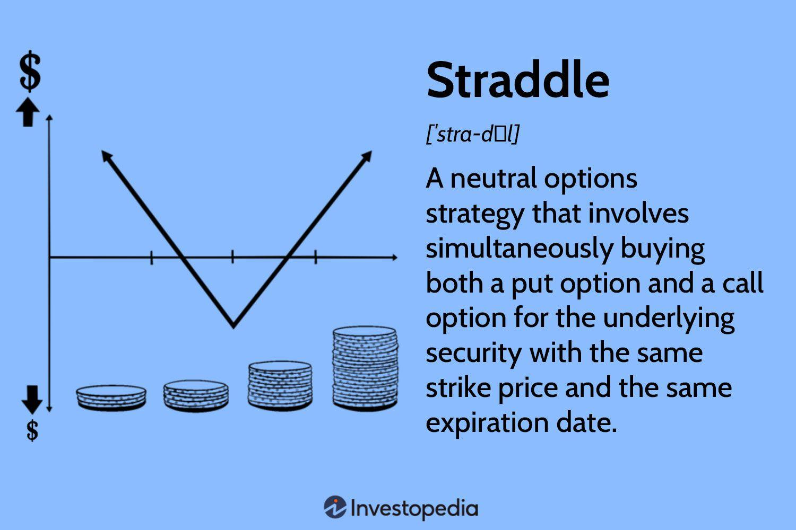

## Table of Contents

## What is a straddle strategy in finance?

A straddle strategy in finance is a way to bet on the movement of a stock's price without guessing if it will go up or down. You do this by buying both a call option and a put option at the same time, with the same price and expiration date. A call option lets you buy the stock at a set price, and a put option lets you sell it at that price. This strategy works best when you think the stock's price will move a lot, but you're not sure which way.

The main goal of a straddle is to make money from big price swings. If the stock price moves a lot in either direction, one of your options will become valuable. For example, if the price goes up a lot, the call option will be worth more. If it goes down a lot, the put option will be worth more. But, if the stock price doesn't move much, you might lose money because both options could expire without being worth much. So, a straddle is a good choice when you expect big changes but are unsure of the direction.

## How does a straddle strategy work?

A straddle strategy is a way to make money from a big move in a stock's price, without having to guess if it will go up or down. You do this by buying two options at the same time: a call option and a put option. Both options should have the same price (called the strike price) and the same expiration date. A call option gives you the right to buy the stock at the strike price, while a put option gives you the right to sell it at that price. By buying both, you're betting that the stock will move a lot in either direction.

If the stock price goes up a lot, the call option becomes more valuable because you can buy the stock at a lower price than it's worth on the market. If the stock price goes down a lot, the put option becomes more valuable because you can sell the stock at a higher price than it's worth on the market. Either way, you can make money if the stock moves enough. But, if the stock price doesn't move much and stays close to the strike price, both options might expire worthless, and you could lose the money you spent on them. So, a straddle works best when you expect a big change but aren't sure which way it will go.

## What are the key components of a straddle strategy?

A straddle strategy involves buying two options on the same stock: a call option and a put option. Both options should have the same strike price, which is the price at which you can buy or sell the stock, and the same expiration date, which is when the options will expire. The call option gives you the right to buy the stock at the strike price, while the put option gives you the right to sell the stock at that price. By buying both options, you're betting that the stock will make a big move in price, but you don't have to guess if it will go up or down.

The key to making money with a straddle is a big move in the stock's price. If the stock price goes up a lot, the call option becomes more valuable because you can buy the stock cheaper than its market price. If the stock price goes down a lot, the put option becomes more valuable because you can sell the stock at a higher price than its market value. However, if the stock price doesn't move much and stays near the strike price, both options might expire worthless, and you could lose the money you paid for them. So, a straddle is best used when you expect a big price change but aren't sure which direction it will go.

## When should an investor consider using a straddle strategy?

An investor should consider using a straddle strategy when they think a stock's price will move a lot, but they are not sure if it will go up or down. This can happen when there's big news coming up, like an earnings report or a major product launch. The straddle lets the investor make money from a big price swing in either direction without having to guess the right way.

However, a straddle is not a good choice if the stock's price is expected to stay the same or only move a little. If the price doesn't change much, both the call and put options might expire worthless, and the investor could lose the money they spent on them. So, a straddle works best when there's a good chance of a big price change, but the direction of that change is uncertain.

## What are the potential benefits of using a straddle strategy?

Using a straddle strategy can help you make money when a stock's price moves a lot, even if you're not sure which way it will go. If the stock price goes up a lot, the call option you bought becomes more valuable because you can buy the stock at a lower price than it's worth on the market. If the stock price goes down a lot, the put option you bought becomes more valuable because you can sell the stock at a higher price than it's worth. This means you can make money no matter which way the stock price moves, as long as it moves a lot.

However, there's a risk if the stock price doesn't change much. If it stays close to the price you set for your options, both the call and put options might expire without being worth much. This could mean you lose the money you spent on the options. So, a straddle strategy is best when you think a big change is coming, like before a big news event, but you're not sure if the stock will go up or down.

## What are the risks associated with a straddle strategy?

The main risk with a straddle strategy is that it might not work out if the stock's price doesn't move much. If the price stays close to where you set your options, both the call and put options could expire without being worth anything. This means you could lose all the money you spent on buying those options. So, if you use a straddle when you think the stock will stay the same or only change a little, you might end up losing money.

Another risk is that options can be expensive. You have to pay for both the call and put options, and that cost can add up. If the stock's price doesn't move enough to make one of the options valuable, you might not make enough money to cover what you spent. Also, time works against you with options. The closer you get to the expiration date without a big move in the stock's price, the less time you have for the price to change enough to make your options worth something. So, it's important to think about these costs and time factors when deciding if a straddle is right for you.

## How do market conditions affect the success of a straddle strategy?

Market conditions play a big role in how well a straddle strategy works. If the market is calm and the stock's price doesn't move much, a straddle might not be a good choice. This is because both the call and put options you bought could expire without being worth anything, and you could lose the money you spent on them. So, if you think the market will stay the same or only change a little, a straddle might not be the best strategy.

On the other hand, if the market is expected to be very active with big price swings, a straddle can be a good way to make money. This is because a big move in the stock's price, whether up or down, can make one of your options valuable. For example, if there's a big news event coming up, like an earnings report, and you think it will cause a lot of movement in the stock's price, a straddle can help you profit from that movement without having to guess which way the price will go. So, the key to a successful straddle is expecting a big change in the market.

## Can you explain the difference between a long straddle and a short straddle?

A long straddle and a short straddle are two different ways to use options to bet on how a stock's price will move. With a long straddle, you buy both a call option and a put option at the same time, with the same strike price and expiration date. This means you're betting that the stock's price will move a lot, but you don't care if it goes up or down. If the stock's price changes a lot in either direction, one of your options will become valuable, and you can make money. But, if the stock's price doesn't move much, you might lose the money you spent on the options.

A short straddle is the opposite. Instead of buying options, you sell both a call option and a put option at the same time, with the same strike price and expiration date. This means you're betting that the stock's price will stay the same or only move a little. If the stock's price doesn't change much, both options will expire without being worth much, and you get to keep the money people paid you for the options. But, if the stock's price moves a lot in either direction, you could lose money because you'll have to pay out on one of the options you sold. So, a short straddle is riskier because your potential losses can be bigger than your potential gains.

## What are the mathematical calculations involved in setting up a straddle?

When setting up a straddle, you need to know the cost of buying both a call option and a put option. The cost of each option is called the premium, and it depends on things like how much time is left before the options expire, how much the stock's price is expected to move, and how far the stock's current price is from the strike price you choose. You add up the premiums of the call and put options to find out the total cost of your straddle. For example, if the call option costs $5 and the put option costs $4, your total cost for the straddle would be $9.

To figure out if your straddle will make money, you need to think about how much the stock's price needs to move for one of your options to become valuable enough to cover the cost of both options. This is called the break-even point. You have two break-even points with a straddle: one if the stock's price goes up, and one if it goes down. The upper break-even point is the strike price plus the total cost of the straddle. The lower break-even point is the strike price minus the total cost of the straddle. Using the example above, if your strike price is $100, your upper break-even point would be $109 ($100 + $9), and your lower break-even point would be $91 ($100 - $9). If the stock's price moves outside of these points, you could make money, but if it stays between them, you might lose the money you spent on the options.

## How do implied volatility and historical volatility impact a straddle strategy?

Implied volatility and historical volatility are important for a straddle strategy because they help you guess how much a stock's price might move. Implied volatility is what people think the stock's price will do in the future, and it's part of the price you pay for options. If implied volatility is high, the options will cost more because people think the stock's price will move a lot. This can be good for a straddle because you want the stock's price to move a lot, but it also means you have to spend more money upfront. On the other hand, if implied volatility is low, options will be cheaper, but you might not make as much money if the stock's price doesn't move enough.

Historical volatility looks at how much the stock's price has moved in the past. It can give you an idea of what might happen in the future, but it's not a perfect guess. If a stock has had big price swings before, it might do it again, which could be good for a straddle. But, if the stock's price has been steady, a straddle might not work out because you need a big move to make money. So, looking at both implied and historical volatility can help you decide if a straddle is a good choice for a certain stock.

## What are some real-world examples of successful straddle strategies?

One real-world example of a successful straddle strategy happened around the time when Apple was about to release its quarterly earnings. An investor thought that Apple's stock price would move a lot after the earnings report, but they weren't sure if it would go up or down. So, they bought both a call option and a put option with the same strike price and expiration date. When Apple's earnings came out and were much better than expected, the stock price jumped up a lot. The call option became very valuable, and the investor made a good profit because the price move was big enough to cover the cost of both options.

Another example was when a biotech company was waiting for FDA approval on a new drug. The investor believed that the stock price would have a big reaction to the FDA's decision, but they didn't know if the news would be good or bad. They set up a straddle by buying both a call and a put option. When the FDA approved the drug, the stock price soared, making the call option very valuable. The investor profited because the stock's price moved enough to make the straddle worthwhile, even though they had to pay for both options upfront.

## How can advanced traders optimize a straddle strategy using delta-neutral adjustments?

Advanced traders can optimize a straddle strategy by making delta-neutral adjustments. Delta is a measure of how much an option's price will change when the stock's price changes. A straddle starts off with a delta that's close to zero because the call and put options balance each other out. But as the stock's price moves, the delta of the straddle changes. To keep the straddle delta-neutral, traders can buy or sell shares of the stock to offset the change in the straddle's delta. This means if the stock's price goes up and the straddle's delta becomes positive, the trader might sell some stock to bring the delta back to zero. If the stock's price goes down and the straddle's delta becomes negative, the trader might buy some stock to balance it out.

By keeping the straddle delta-neutral, traders can focus on making money from the stock's price moving a lot, rather than worrying about small price changes. This can help them manage risk better and potentially make more money. For example, if a trader expects a big news event to cause a large move in the stock's price, they can set up a delta-neutral straddle and then adjust it as needed. This way, they can take advantage of big price swings without being affected by smaller, less predictable movements in the stock's price.

## What is the Straddle Strategy and how does it work?

The straddle strategy in options trading revolves around the simultaneous purchase or sale of both a call and a put option with identical strike prices and expiration dates. This strategy serves to capitalize on significant price movements of the underlying asset, regardless of direction. By holding both a call and a put, the trader positions themselves to benefit from volatility, as profits can be realized if the asset's price moves significantly away from the strike price, either upwards or downwards.

The straddle strategy can be categorized into two types: the long straddle and the short straddle. The long straddle involves purchasing both a call and a put option. Traders employ this approach when they anticipate substantial volatility and are unsure of the direction the price will move. The payoff for a long straddle is theoretically unlimited potential profit if the price moves significantly, minus the premiums paid for the options. The formula for calculating the payoff of a long straddle at expiration is:

$$
\text{Payoff} = 
\begin{cases} 
(S - K - C - P), & \text{if } S > K \\
(K - S - C - P), & \text{if } S < K 
\end{cases}
$$

where $S$ is the spot price of the underlying asset, $K$ is the strike price, $C$ is the premium of the call option, and $P$ is the premium of the put option.

On the other hand, the short straddle involves selling both a call and a put option, which is typically adopted by those who expect little to no movement in the price of the underlying asset. This strategy aims to profit from the premiums received, with the risk being the potential for large losses if the asset price moves significantly beyond the strike price in either direction. The payoff for a short straddle is:

$$
\text{Payoff} = 
\begin{cases} 
(C + P) - (S - K), & \text{if } S > K \\
(C + P) - (K - S), & \text{if } S < K 
\end{cases}
$$

Successful implementation of either straddle strategy requires a thorough understanding of market conditions and a prediction of upcoming [volatility](/wiki/volatility-trading-strategies), which play pivotal roles in determining the profitability of the strategy.

## What are the types of straddle strategies?

The straddle strategy in options trading is bifurcated into two primary types: the long straddle and the short straddle. Each of these strategies is designed to exploit specific market conditions and necessitates a keen understanding of market dynamics.

### Long Straddle

The long straddle strategy is predicated upon the expectation of large price movements in either direction. It involves simultaneously purchasing both a call option and a put option on the same underlying asset, with identical strike prices and expiration dates. This approach allows traders to profit from volatility, regardless of whether the price of the underlying asset ascends or descends significantly. 

The profitability of this strategy hinges on the magnitude of the price change exceeding the total premium paid for both options. Mathematically, the payoff for a long straddle can be calculated as:

$$
P = \max(S - K, 0) + \max(K - S, 0) - (C + P)
$$

where $P$ is the net profit, $S$ is the spot price of the underlying asset at expiration, $K$ is the strike price, $C$ is the cost of the call option, and $P$ is the cost of the put option. 

This strategy is suitable when traders anticipate significant events, such as earnings reports or economic announcements, which may lead to substantial volatility.

### Short Straddle

Conversely, the short straddle strategy is designed to capitalize on instances where the trader predicts minimal price movement. This strategy involves selling both a call and a put option with the same strike price and expiration date. The goal here is to profit from the premiums collected on the options when the price of the underlying remains relatively stable.

The risk for a short straddle is theoretically unlimited, as significant price movements in either direction can lead to substantial losses. This is reflected in the payoff equation:

$$
P = (C + P) - \max(S - K, 0) - \max(K - S, 0)
$$

where the potential loss could exceed the premium received if the market moves sharply.

### Considerations for Both Strategies

The execution of each straddle strategy requires a thorough analysis of predicted volatility and current market conditions. Traders must evaluate the potential catalysts for price movements, such as market news, geopolitical events, or financial earnings. Selecting the appropriate strategy hinges on this analysis, coupled with the [liquidity](/wiki/liquidity-risk-premium) of the options market and the specific characteristics of the underlying asset. Effective risk management is also crucial, as both strategies entail substantial financial commitments and diverging risk profiles.

## How can one implement the Straddle Strategy?

Implementing the straddle strategy involves key decisions that can influence the success or failure of trades. Central to this strategy is the selection of the underlying asset, which should exhibit pronounced volatility. Stocks of companies about to release earnings reports or markets reacting to geopolitical events often display the levels of volatility conducive to a successful straddle strategy. 

A crucial aspect of implementation is selecting the appropriate strike price and expiration date. The strike price must be carefully chosen to align with anticipated movements in the underlying asset's price. Generally, an at-the-money strike price, where the option's strike price is equal to the current price of the underlying asset, is favored for straddles, as it maximizes the potential for profiting from significant moves in either direction.

The expiration date is another pivotal [factor](/wiki/factor-investing). A longer expiration date allows more time for the expected price movement to occur, but this also increases the cost of the options, as premiums grow with time. Conversely, choosing an expiration date that is too short might not give the market enough time to react to anticipated events. Traders must therefore strike a delicate balance between time and cost to optimize their straddle strategy outcomes.

Managing the position requires a clear understanding of the potential profits and losses involved. The payoff from a long straddle at expiration can be expressed as:

$$
\text{Max}(S - K, 0) + \text{Max}(K - S, 0) - C - P
$$

where $S$ is the underlying asset’s price at expiration, $K$ is the strike price, $C$ is the premium paid for the call, and $P$ is the premium paid for the put. The break-even points occur at $S = K \pm (C + P)$, where the cost of both premiums is covered by the asset price movements.

Traders must also consider potential losses due to the premium costs. If the underlying asset’s price remains relatively stable, the straddle may incur a loss equal to the total premium of the call and put options. Implementing stop-loss orders or monitoring market conditions closely can help mitigate these risks. Additionally, some traders might look to adjust their positions as expiry approaches by rolling options forward or closing positions to lock in profits or reduce losses.

## What are the benefits and risks of the Straddle Strategy?

The straddle strategy in options trading provides unique advantages and carries inherent risks due to its structure, which involves holding both a call and a put option on the same underlying asset with identical strike prices and expiration dates. One of the primary benefits of employing a straddle strategy is its capacity to profit from significant market volatility without requiring the trader to predict the actual direction of the price movement. This characteristic is particularly advantageous in scenarios where substantial fluctuations are anticipated, such as before major economic data releases or corporate announcements. In these situations, regardless of whether the market trends upward or downward, the potential to capitalize on large price swings is present, as long as the movement surpasses the total premium paid for both options.

However, this strategy is not without its risks. A notable downside lies in the cost associated with purchasing the options—the premiums. If the market remains relatively stable and does not experience the predicted significant movements, the options may not move enough in the money to offset the initial premium costs, leading to a loss. Mathematically, the net payoff of a long straddle strategy can be expressed as:

$$
\text{Net Payoff} = \max(S_T - K, 0) + \max(K - S_T, 0) - (C + P)
$$

where $S_T$ is the stock price at expiration, $K$ is the strike price, $C$ is the call premium, and $P$ is the put premium. 

Effective risk management is imperative to mitigate potential losses inherent in a straddle strategy. Traders must set clear [exit](/wiki/exit-strategy) strategies and regularly monitor market conditions to adjust their positions accordingly. Additionally, implementing stop-loss orders and closely observing the Greeks (Delta, Gamma, Theta, and Vega) can help in managing the options' sensitivity to various risk factors, such as time decay and changes in volatility. By understanding and navigating these variables, traders can improve their capacity to manage risks and optimize the potential returns of their straddle strategy.

## References & Further Reading

[1]: ["Options, Futures, and Other Derivatives"](https://www.pearson.com/en-us/subject-catalog/p/options-futures-and-other-derivatives/P200000005938/9780136939917) by John C. Hull

[2]: Natenberg, S. (1994). ["Option Volatility and Pricing: Advanced Trading Strategies and Techniques."](https://www.amazon.com/Option-Volatility-Pricing-Strategies-Techniques/dp/0071818774) McGraw-Hill.

[3]: Lhabitant, F.-S. & Gregoriou, G. N. (2008). ["Handbook of Hedge Funds."](https://books.google.com/books/about/Hedge_Funds.html?id=-iI1o2dLyzMC) Wiley.

[4]: Tharp, V. (2008). ["Trade Your Way to Financial Freedom."](https://www.amazon.com/Trade-Your-Way-Financial-Freedom/dp/007147871X) McGraw-Hill.

[5]: Narang, R. K. (2009). ["Inside the Black Box: The Simple Truth About Quantitative Trading."](https://www.amazon.com/Inside-Black-Box-Quantitative-Trading/dp/0470432063) Wiley.