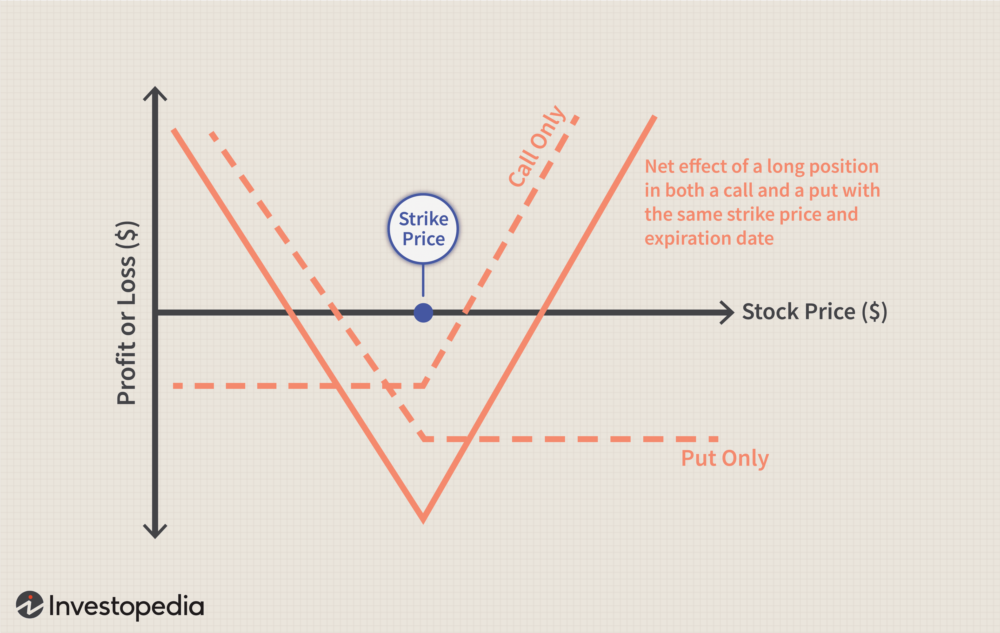

Options trading is a dynamic and complex field that offers traders the opportunity to capitalize on market movements through various strategic approaches. By using financial derivatives known as options, traders can create positions that allow them to potentially benefit from upward, downward, or even sideways price movements in the underlying asset. A fundamental appeal of options trading is its flexibility, as it permits traders to craft strategies tailored to specific market conditions and risk tolerances.

Among the numerous strategies available, the straddle strategy stands out for situations where traders anticipate significant volatility but are uncertain about the direction of the price movement. This strategy involves the simultaneous use of a call option, which gives the right to buy an asset, and a put option, which grants the right to sell it, both at the same strike price and expiration date. The core advantage of a straddle lies in its non-directional nature, which allows traders to potentially profit regardless of whether the asset's price moves up or down, as long as the movement is substantial enough to cover the cost of both options.



This article explores the intricacies of the straddle strategy in options trading. It aims to provide a comprehensive understanding by breaking down its components, the specific types of straddles, and its application in the context of algorithmic trading. Algorithmic trading, which employs computer algorithms to execute trades based on predefined criteria, can further enhance the effectiveness of straddle strategies by automating and optimizing the decision-making process in volatile markets.

## Table of Contents

## Understanding the Straddle Strategy

The straddle strategy in options trading revolves around the simultaneous purchase or sale of both a call and a put option with identical strike prices and expiration dates. This strategy serves to capitalize on significant price movements of the underlying asset, regardless of direction. By holding both a call and a put, the trader positions themselves to benefit from volatility, as profits can be realized if the asset's price moves significantly away from the strike price, either upwards or downwards.

The straddle strategy can be categorized into two types: the long straddle and the short straddle. The long straddle involves purchasing both a call and a put option. Traders employ this approach when they anticipate substantial volatility and are unsure of the direction the price will move. The payoff for a long straddle is theoretically unlimited potential profit if the price moves significantly, minus the premiums paid for the options. The formula for calculating the payoff of a long straddle at expiration is:

$$
\text{Payoff} = 
\begin{cases} 
(S - K - C - P), & \text{if } S > K \\
(K - S - C - P), & \text{if } S < K 
\end{cases}
$$

where $S$ is the spot price of the underlying asset, $K$ is the strike price, $C$ is the premium of the call option, and $P$ is the premium of the put option.

On the other hand, the short straddle involves selling both a call and a put option, which is typically adopted by those who expect little to no movement in the price of the underlying asset. This strategy aims to profit from the premiums received, with the risk being the potential for large losses if the asset price moves significantly beyond the strike price in either direction. The payoff for a short straddle is:

$$
\text{Payoff} = 
\begin{cases} 
(C + P) - (S - K), & \text{if } S > K \\
(C + P) - (K - S), & \text{if } S < K 
\end{cases}
$$

Successful implementation of either straddle strategy requires a thorough understanding of market conditions and a prediction of upcoming [volatility](/wiki/volatility-trading-strategies), which play pivotal roles in determining the profitability of the strategy.

## Components of a Straddle

A straddle strategy in options trading is centered on two fundamental components: call and put options. Each of these options plays a distinct role in the strategy.

A call option grants the trader the right, but not the obligation, to purchase the underlying asset at a predetermined price, known as the strike price, within a specific time frame. This right to buy becomes potentially profitable when the market price of the underlying asset exceeds the strike price before the option expires.

Conversely, a put option provides the trader with the right, but again not the obligation, to sell the underlying asset at the strike price within the option's lifespan. This right to sell can be advantageous if the asset's market price falls below the strike price before expiration.

The strike price is a critical element of both call and put options within a straddle strategy. It signifies the price at which the asset can be bought or sold, establishing a benchmark for potential profitability. In a straddle, both options must share the same strike price and expiration date, aligning the strategy to respond to market volatility without the need to anticipate price direction.

Overall, the interaction of call and put options with the strike price is what allows the straddle strategy to harness price volatility, providing opportunities to benefit from significant market movements in either direction.

## Types of Straddle Strategies

The straddle strategy in options trading is bifurcated into two primary types: the long straddle and the short straddle. Each of these strategies is designed to exploit specific market conditions and necessitates a keen understanding of market dynamics.

### Long Straddle

The long straddle strategy is predicated upon the expectation of large price movements in either direction. It involves simultaneously purchasing both a call option and a put option on the same underlying asset, with identical strike prices and expiration dates. This approach allows traders to profit from volatility, regardless of whether the price of the underlying asset ascends or descends significantly. 

The profitability of this strategy hinges on the magnitude of the price change exceeding the total premium paid for both options. Mathematically, the payoff for a long straddle can be calculated as:

$$
P = \max(S - K, 0) + \max(K - S, 0) - (C + P)
$$

where $P$ is the net profit, $S$ is the spot price of the underlying asset at expiration, $K$ is the strike price, $C$ is the cost of the call option, and $P$ is the cost of the put option. 

This strategy is suitable when traders anticipate significant events, such as earnings reports or economic announcements, which may lead to substantial volatility.

### Short Straddle

Conversely, the short straddle strategy is designed to capitalize on instances where the trader predicts minimal price movement. This strategy involves selling both a call and a put option with the same strike price and expiration date. The goal here is to profit from the premiums collected on the options when the price of the underlying remains relatively stable.

The risk for a short straddle is theoretically unlimited, as significant price movements in either direction can lead to substantial losses. This is reflected in the payoff equation:

$$
P = (C + P) - \max(S - K, 0) - \max(K - S, 0)
$$

where the potential loss could exceed the premium received if the market moves sharply.

### Considerations for Both Strategies

The execution of each straddle strategy requires a thorough analysis of predicted volatility and current market conditions. Traders must evaluate the potential catalysts for price movements, such as market news, geopolitical events, or financial earnings. Selecting the appropriate strategy hinges on this analysis, coupled with the [liquidity](/wiki/liquidity-risk-premium) of the options market and the specific characteristics of the underlying asset. Effective risk management is also crucial, as both strategies entail substantial financial commitments and diverging risk profiles.

## Implementing the Straddle Strategy

Implementing the straddle strategy involves key decisions that can influence the success or failure of trades. Central to this strategy is the selection of the underlying asset, which should exhibit pronounced volatility. Stocks of companies about to release earnings reports or markets reacting to geopolitical events often display the levels of volatility conducive to a successful straddle strategy. 

A crucial aspect of implementation is selecting the appropriate strike price and expiration date. The strike price must be carefully chosen to align with anticipated movements in the underlying asset's price. Generally, an at-the-money strike price, where the option's strike price is equal to the current price of the underlying asset, is favored for straddles, as it maximizes the potential for profiting from significant moves in either direction.

The expiration date is another pivotal [factor](/wiki/factor-investing). A longer expiration date allows more time for the expected price movement to occur, but this also increases the cost of the options, as premiums grow with time. Conversely, choosing an expiration date that is too short might not give the market enough time to react to anticipated events. Traders must therefore strike a delicate balance between time and cost to optimize their straddle strategy outcomes.

Managing the position requires a clear understanding of the potential profits and losses involved. The payoff from a long straddle at expiration can be expressed as:

$$
\text{Max}(S - K, 0) + \text{Max}(K - S, 0) - C - P
$$

where $S$ is the underlying asset’s price at expiration, $K$ is the strike price, $C$ is the premium paid for the call, and $P$ is the premium paid for the put. The break-even points occur at $S = K \pm (C + P)$, where the cost of both premiums is covered by the asset price movements.

Traders must also consider potential losses due to the premium costs. If the underlying asset’s price remains relatively stable, the straddle may incur a loss equal to the total premium of the call and put options. Implementing stop-loss orders or monitoring market conditions closely can help mitigate these risks. Additionally, some traders might look to adjust their positions as expiry approaches by rolling options forward or closing positions to lock in profits or reduce losses.

## Algo Trading and the Straddle Strategy

Algorithmic trading allows for the automation of the straddle strategy, facilitating prompt execution of trades according to predefined parameters. This automation is particularly advantageous in options trading, where timing and precision are crucial. Algorithms, or algos, enhance trading efficiency by managing multiple trades concurrently. This capability not only increases the speed of execution but also minimizes human error and emotional biases that can adversely affect decision-making.

Incorporating historical data analysis and predictive modeling, traders can construct algorithms to identify potential opportunities for implementing the straddle strategy. For instance, using historical price volatility and options pricing data, traders can develop models to forecast significant market movements, triggering the execution of a straddle trade. The use of [machine learning](/wiki/machine-learning) algorithms can further refine these models, improving the predictive accuracy and thus the profitability of the strategy.

The use of [algorithmic trading](/wiki/algorithmic-trading) also allows for the [backtesting](/wiki/backtesting) of the straddle strategy. This involves simulating the strategy using historical data to evaluate its potential profitability and risk. The process enables traders to tweak their models and algorithms, potentially increasing their effectiveness when deployed in live markets. For example, a Python-based backtesting framework might utilize libraries such as `Pandas` for data manipulation and `NumPy` for numerical computations, while `Matplotlib` can be used for visualizing the performance results.

Here is a basic Python example for backtesting a simple straddle strategy:

```python
import pandas as pd
import numpy as np
import matplotlib.pyplot as plt

# Load historical price data
data = pd.read_csv('historical_data.csv')  # This should contain date and price columns

# Define parameters
strike_price = 100  # Example strike price
premium = 10  # Total premium paid for the straddle

# Calculate profits/loss
data['profit'] = data['price'].apply(lambda x: max(x - strike_price, 0) + max(strike_price - x, 0) - premium)

# Plot the results
plt.figure(figsize=(10, 5))
plt.plot(data['date'], data['profit'], label='Straddle Profit')
plt.axhline(0, color='r', linestyle='--', label='Break-even')
plt.xlabel('Date')
plt.ylabel('Profit / Loss')
plt.title('Straddle Strategy Backtest Results')
plt.legend()
plt.show()
```

In summary, algorithmic trading enhances the execution and management of the straddle strategy by facilitating quick trade execution, mitigating human-emotional biases, and leveraging historical data for informed decision-making. As technology advances, it provides traders with powerful tools to gain competitive advantages in the volatile market environments where straddle strategies thrive.

## Benefits and Risks of the Straddle Strategy

The straddle strategy in options trading provides unique advantages and carries inherent risks due to its structure, which involves holding both a call and a put option on the same underlying asset with identical strike prices and expiration dates. One of the primary benefits of employing a straddle strategy is its capacity to profit from significant market volatility without requiring the trader to predict the actual direction of the price movement. This characteristic is particularly advantageous in scenarios where substantial fluctuations are anticipated, such as before major economic data releases or corporate announcements. In these situations, regardless of whether the market trends upward or downward, the potential to capitalize on large price swings is present, as long as the movement surpasses the total premium paid for both options.

However, this strategy is not without its risks. A notable downside lies in the cost associated with purchasing the options—the premiums. If the market remains relatively stable and does not experience the predicted significant movements, the options may not move enough in the money to offset the initial premium costs, leading to a loss. Mathematically, the net payoff of a long straddle strategy can be expressed as:

$$
\text{Net Payoff} = \max(S_T - K, 0) + \max(K - S_T, 0) - (C + P)
$$

where $S_T$ is the stock price at expiration, $K$ is the strike price, $C$ is the call premium, and $P$ is the put premium. 

Effective risk management is imperative to mitigate potential losses inherent in a straddle strategy. Traders must set clear [exit](/wiki/exit-strategy) strategies and regularly monitor market conditions to adjust their positions accordingly. Additionally, implementing stop-loss orders and closely observing the Greeks (Delta, Gamma, Theta, and Vega) can help in managing the options' sensitivity to various risk factors, such as time decay and changes in volatility. By understanding and navigating these variables, traders can improve their capacity to manage risks and optimize the potential returns of their straddle strategy.

## Real-world Examples and Case Studies

Examining real-world scenarios where the straddle strategy has been employed offers valuable insights into its practical applications. One such scenario involves major corporate announcements, which often lead to significant stock price movements. For instance, earnings reports, mergers, or acquisitions can create volatility, making a straddle strategy potentially profitable. If a trader anticipates that an upcoming quarterly earnings report will cause substantial price fluctuation but is unsure of the direction, purchasing both a call and a put option at the same strike price can prove beneficial. This approach ensures that if the stock price moves significantly in either direction, one of the options will likely end in-the-money, potentially leading to a profitable trade.

Another scenario for implementing the straddle strategy is during economic data releases, such as employment reports or central bank [interest rate](/wiki/interest-rate-trading-strategies) announcements. These events often lead to increased market volatility as traders react to new information that impacts economic outlooks and monetary policy. For example, when the Federal Reserve releases its interest rate decision, financial markets frequently experience sharp movements, which can be effectively captured using a straddle strategy.

A historical analysis of past straddle trades provides further illustrative examples. For instance, during the 2008 financial crisis, the U.S. stock market experienced extreme volatility. Traders who implemented straddle strategies around key news releases, like bank bailouts or government interventions, could benefit from the significant price swings. The straddle's ability to generate profits without predicting market direction is particularly advantageous in such turbulent environments.

These examples underscore the importance of timing and selecting suitable underlying assets in straddle strategies. Traders need to closely monitor upcoming events and assess the likelihood of substantial price movements. Additionally, historical data analysis can enhance the understanding of a straddle strategy's performance under diverse market conditions, facilitating better decision-making and risk assessment for future trades.

## Conclusion

The straddle strategy is widely regarded as a versatile approach for traders aiming to capitalize on market volatility. By purchasing both a call and a put option at the same strike price and expiration, traders position themselves to benefit from significant price fluctuations in any direction. The effectiveness of this strategy, however, heavily relies on the trader's aptitude in selecting optimal market conditions and effectively managing associated risks.

Traders must adeptly analyze market conditions, focusing particularly on periods where significant volatility is anticipated, such as major economic announcements or corporate earnings releases. Additionally, successful implementation of the straddle strategy requires meticulous risk management to handle the potential implications of the options' premiums and market stability.

In recent years, the integration of algorithmic trading has offered traders novel ways to execute the straddle strategy. By employing algorithms to automate and manage trades, traders can execute strategies with speed and precision, minimizing human error and emotional decision-making. Algorithms can be programmed to assess historical data and generate predictive models, offering competitive advantages in navigating volatile markets. This synergy between algorithmic trading and the straddle strategy not only enhances operational efficiency but also broadens the scope of opportunities for traders, making it an invaluable asset in the dynamic landscape of options trading.

## References & Further Reading

[1]: ["Options, Futures, and Other Derivatives"](https://www.pearson.com/en-us/subject-catalog/p/options-futures-and-other-derivatives/P200000005938/9780136939917) by John C. Hull

[2]: Natenberg, S. (1994). ["Option Volatility and Pricing: Advanced Trading Strategies and Techniques."](https://www.amazon.com/Option-Volatility-Pricing-Strategies-Techniques/dp/0071818774) McGraw-Hill.

[3]: Lhabitant, F.-S. & Gregoriou, G. N. (2008). ["Handbook of Hedge Funds."](https://books.google.com/books/about/Hedge_Funds.html?id=-iI1o2dLyzMC) Wiley.

[4]: Tharp, V. (2008). ["Trade Your Way to Financial Freedom."](https://www.amazon.com/Trade-Your-Way-Financial-Freedom/dp/007147871X) McGraw-Hill.

[5]: Narang, R. K. (2009). ["Inside the Black Box: The Simple Truth About Quantitative Trading."](https://www.amazon.com/Inside-Black-Box-Quantitative-Trading/dp/0470432063) Wiley.