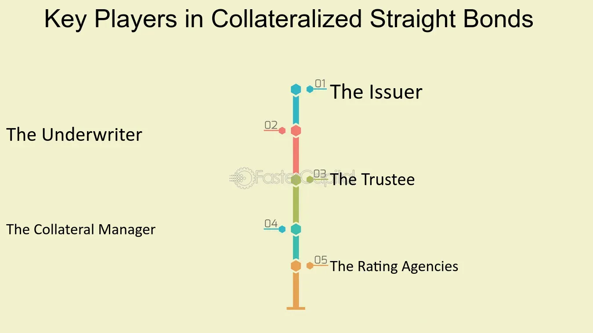

## Table of Contents

## What is a straight bond?

A straight bond is a type of bond that pays a fixed interest rate to the bondholder at regular intervals until the bond matures. It is also known as a plain vanilla bond because it is the simplest form of bond without any special features. When you buy a straight bond, you lend money to the issuer, which could be a government or a company, and in return, they promise to pay you back the amount you lent, called the principal, plus interest over a set period of time.

The interest payments on a straight bond are usually made semi-annually or annually. These payments are calculated based on the bond's coupon rate, which is set when the bond is issued. For example, if you own a bond with a face value of $1,000 and a coupon rate of 5%, you will receive $50 every year until the bond matures. At the end of the bond's term, the issuer will repay you the $1,000 principal. Straight bonds are popular among investors who want a steady and predictable income stream.

## How does a straight bond differ from other types of bonds?

A straight bond is the simplest type of bond. It pays a fixed interest rate to the bondholder at regular times until it matures. The bondholder gets their money back at the end. Other bonds can be more complex. For example, a zero-coupon bond doesn't pay interest during its term. Instead, it's sold at a discount and pays the full face value at maturity. A floating-rate bond has an interest rate that changes with market rates, so the payments can go up or down.

Another type of bond is a convertible bond. This bond can be turned into a set number of the issuer's stock shares. This gives the bondholder a chance to benefit from the company's growth. Callable bonds let the issuer buy back the bond before it matures, which can be good for the issuer if interest rates drop. Puttable bonds let the bondholder sell the bond back to the issuer before it matures, which can be good for the bondholder if interest rates rise. So, while a straight bond is simple and predictable, other bonds offer different features that can be more beneficial depending on the investor's goals and market conditions.

## What are the key features of a straight bond?

A straight bond is a simple type of bond that pays a fixed [interest rate](/wiki/interest-rate-trading-strategies) to the person who owns it. This interest is paid at regular times, like every six months or every year, until the bond reaches its end date. The interest rate is set when the bond is first sold and stays the same. The owner of the bond also gets their money back at the end, which is called the principal. For example, if you buy a bond for $1,000 with a 5% interest rate, you will get $50 every year until the bond matures, and then you get your $1,000 back.

Straight bonds are different from other bonds because they don't have any special features. Other bonds might change their interest rates, let you turn the bond into company stock, or let the issuer or the owner end the bond early. But a straight bond is simple and predictable. This makes it a good choice for people who want a steady income without surprises. They know exactly how much money they will get and when they will get it.

## Who typically issues straight bonds?

Straight bonds are usually issued by governments and big companies. Governments, like the U.S. government, issue bonds to borrow money to pay for things like roads, schools, and other public projects. These bonds are often seen as very safe because the government can usually pay back what it borrows. Companies also issue straight bonds to get money to grow their business, buy new equipment, or pay off other debts. These bonds might be a bit riskier than government bonds, but they often pay a higher interest rate to make up for that risk.

Investors who buy straight bonds are looking for a steady income. They might be people saving for retirement or big organizations like pension funds that need to make sure they have money coming in regularly. Because straight bonds pay the same amount of interest at the same times, they are a good choice for these investors. They know exactly how much money they will get and when they will get it, which helps them plan their finances.

## What are the benefits of investing in straight bonds?

Investing in straight bonds can give you a steady income. They pay the same amount of interest at the same times, like every six months or every year. This makes it easy to plan your money because you know exactly how much you will get and when. This is good for people who are retired or saving for something important. They can count on this money to help them pay their bills or reach their goals.

Straight bonds are also seen as safe investments, especially if they are issued by the government. Governments can usually pay back what they borrow, so their bonds are less risky. Even if a company issues the bond, it might be safer than other investments like stocks, which can go up and down a lot. So, if you want to keep your money safe while still [earning](/wiki/earning-announcement) some interest, straight bonds can be a good choice.

## What are the risks associated with straight bonds?

Straight bonds can be a safe way to invest, but they still have some risks. One big risk is interest rate risk. If interest rates go up after you buy a bond, the value of your bond might go down. This is because new bonds will be issued with higher interest rates, making your bond less attractive to other investors. If you need to sell your bond before it matures, you might get less money than you paid for it.

Another risk is credit risk. This means the chance that the issuer of the bond, like a company or government, might not be able to pay back the money they borrowed. If the issuer goes bankrupt, you might not get all your money back. This risk is usually lower with government bonds, but it can be higher with bonds from companies, especially if the company is not doing well financially.

Inflation risk is also something to think about. If inflation goes up, the money you get from the bond might not be worth as much as when you first invested. This can happen if the interest rate on the bond is lower than the rate of inflation. So, even though straight bonds can give you a steady income, these risks mean you need to be careful and think about how they might affect your investment.

## How is the interest rate determined for a straight bond?

The interest rate for a straight bond is set when the bond is first sold. This rate, called the coupon rate, is based on several things like how much risk there is, what interest rates are like in the market, and how long the bond will last. If the bond is from a government, it might have a lower interest rate because it's seen as safer. But if it's from a company, especially one that might have trouble paying back the money, the interest rate could be higher to make up for that risk.

Once the coupon rate is set, it stays the same for the whole time the bond is active. This means the bondholder gets the same amount of interest at regular times, like every six months or every year, until the bond matures. The interest payments are calculated by multiplying the bond's face value by the coupon rate. For example, if you have a $1,000 bond with a 5% coupon rate, you will get $50 every year. This fixed interest rate makes straight bonds a good choice for people who want a steady and predictable income.

## What is the process of issuing a straight bond?

When a government or a company wants to issue a straight bond, they start by deciding how much money they need to borrow and for how long. They work with banks or other financial experts to set the terms of the bond, like the interest rate, which is called the coupon rate, and how often the interest will be paid. They also decide on the bond's face value, which is the amount they will pay back when the bond matures. Once these details are set, the issuer prepares a document called a prospectus. This document tells investors everything they need to know about the bond, including the risks involved.

After the prospectus is ready, the issuer sells the bonds to investors. This can be done through a public offering, where the bonds are sold to anyone who wants to buy them, or through a private placement, where the bonds are sold to a select group of investors. The bonds are usually sold at their face value, but sometimes they might be sold at a discount or a premium, depending on market conditions. Once the bonds are sold, the issuer uses the money for the planned projects or expenses. Over time, the issuer pays the interest to the bondholders at the set intervals, and when the bond matures, they pay back the face value to the bondholders.

## How do straight bonds affect a company's financial statements?

When a company issues straight bonds, it gets money from investors. This money shows up on the company's balance sheet as a liability called "bonds payable." This means the company owes this money to the bondholders and has to pay it back when the bonds mature. The money the company gets from selling the bonds can be used to buy new equipment, pay off other debts, or grow the business. So, the company's assets go up by the amount of money it got from the bonds.

The interest the company has to pay on the bonds affects its income statement. Every time the company pays interest to the bondholders, it records this as an expense called "interest expense." This expense reduces the company's profit for that period. The interest payments are usually made every six months or every year, so the company has to keep track of these payments and make sure it has enough money to cover them. When the bonds mature, the company pays back the money it borrowed, which reduces the "bonds payable" on the balance sheet.

## What are the tax implications of investing in straight bonds?

When you invest in straight bonds, you have to think about taxes. The interest you get from the bonds is usually counted as regular income. This means you have to pay taxes on it every year, just like you do with money you earn from a job. The tax rate you pay depends on how much money you make in total. If the bonds are from the government, like U.S. Treasury bonds, the interest is taxed at the federal level but might not be taxed by your state or local government.

Some bonds, like municipal bonds, can be different. The interest from these bonds might not be taxed at all, depending on where you live. This can make them a good choice if you want to keep more of your money. But if you sell a bond before it matures and make a profit, you might have to pay capital gains tax on that profit. The tax rules can be complicated, so it's a good idea to talk to a tax expert to understand how investing in straight bonds will affect your taxes.

## How do market conditions influence the pricing of straight bonds?

Market conditions play a big role in how much straight bonds cost. When interest rates in the market go up, the price of existing bonds usually goes down. This happens because new bonds that are issued will have higher interest rates, making the old bonds with lower rates less attractive to investors. So, if someone wants to sell their old bond, they might have to sell it for less than they paid for it. On the other hand, if interest rates in the market go down, the price of existing bonds can go up. This is because the old bonds with higher interest rates become more valuable compared to the new bonds with lower rates.

The overall health of the economy also affects bond prices. If people think the economy is doing well and will keep growing, they might want to invest in riskier things like stocks instead of bonds. This can make bond prices drop because fewer people want to buy them. But if the economy seems shaky and people are worried about losing money, they might look for safe investments like bonds. This can push bond prices up because more people want to buy them. So, understanding market conditions can help you know if it's a good time to buy or sell straight bonds.

## What advanced strategies can be used when trading straight bonds?

One advanced strategy when trading straight bonds is called bond laddering. This means buying bonds that mature at different times. For example, you might buy bonds that mature in one year, three years, and five years. This way, you get your money back at different times, which can help you manage your cash flow better. It also lets you take advantage of changes in interest rates. If rates go up, you can use the money from the bonds that mature to buy new bonds with higher rates. If rates go down, you still have bonds that pay the higher old rates.

Another strategy is called duration matching. This is when you match the length of time your bonds last with when you need the money. For example, if you know you will need money in five years, you would buy bonds that mature in five years. This can help you avoid having to sell your bonds early if interest rates change, which could mean you lose money. By matching the duration, you can make sure you have the money you need when you need it, without worrying too much about what's happening in the market.

A third strategy is active trading, where you buy and sell bonds based on what's happening in the market. This can be riskier, but it can also make you more money if you do it right. For example, if you think interest rates are going to go down, you might buy bonds now because their prices will go up when rates fall. Or if you think rates will go up, you might sell your bonds before their prices drop. This strategy takes a lot of watching the market and understanding what might happen next, so it's not for everyone.

## What is a financial example of a straight bond?

To illustrate, consider a corporate bond with a face value of $1,000, a coupon rate of 5%, and a maturity period of 10 years. Such a bond promises an annual coupon payment of $50, calculated by multiplying the face value by the coupon rate $(1000 \times 0.05)$. 

Assuming the bond is acquired at a discount price of $950, the initial cash outflow for the investor is $950. During the investment period, the investor receives $50 annually for ten years, totaling $500 in coupon payments. At maturity, the issuer repays the face value of $1,000. Thus, the total inflow at the end of the maturity period is $1,500 $(500 \, \text{in coupons} + 1000 \, \text{face value})$.

To evaluate the bond's profitability, investors often calculate the current yield and yield to maturity (YTM). The current yield is determined by dividing the annual coupon payment by the bond's purchase price:

$$
\text{Current Yield} = \frac{\text{Annual Coupon Payment}}{\text{Purchase Price}} = \frac{50}{950} \approx 5.26\%
$$

Yield to maturity (YTM) offers a more comprehensive measure of return, as it considers all cash flows until maturity (coupon payments and face value) and incorporates the bond's time-value of money. While the formula for YTM involves solving the present value equation, it can be approximated or calculated using financial calculators or programming languages like Python.

Here's a simple Python code snippet to estimate the YTM using the `numpy` library:

```python
import numpy as np

face_value = 1000  
annual_coupon = 50  
current_price = 950  
years = 10

def bond_ytm(price, coupon, face_value, years):
    ytm = (coupon + (face_value - price) / years) / ((face_value + price) / 2)
    return ytm

ytm = bond_ytm(current_price, annual_coupon, face_value, years)
print(f"Estimated YTM: {ytm:.2%}")
```

This example accentuates the appeal of straight bonds, offering foreseeable income while allowing investors to assess profitability through straightforward calculations. The combination of income predictability and the potential for capital gain if acquired at a discount enhances their attractiveness, particularly for investors seeking stability.

## References & Further Reading

[1]: ["The Handbook of Fixed Income Securities"](https://www.amazon.com/Handbook-Fixed-Income-Securities-Ninth/dp/1260473899) by Frank J. Fabozzi

[2]: ["Advances in Financial Machine Learning"](https://www.amazon.com/Advances-Financial-Machine-Learning-Marcos/dp/1119482089) by Marcos Lopez de Prado

[3]: ["Algorithmic Trading: Winning Strategies and Their Rationale"](https://books.google.com/books/about/Algorithmic_Trading.html?id=WAlFDwAAQBAJ) by Ernie Chan

[4]: ["Bond Markets, Analysis, and Strategies"](https://www.amazon.com/Bond-Markets-Analysis-Strategies-tenth/dp/026204627X) by Frank J. Fabozzi

[5]: ["Machine Learning for Asset Managers"](https://www.amazon.com/Machine-Learning-Managers-Elements-Quantitative/dp/1108792898) by Marcos Lopez de Prado