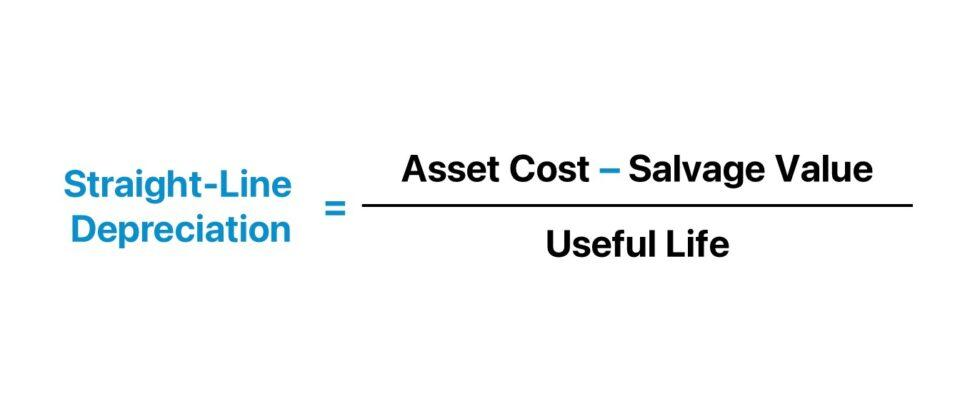

Algorithmic trading, commonly known as algo trading, leverages advanced statistical models and predefined strategies to accurately determine the timing and scale of trading transactions. These models are essential for making swift and informed decisions that maximize returns and minimize risks. A crucial element within these strategies is the consideration of asset depreciation and amortization, which can significantly impact the financial outcomes of trading activities. A popular method for calculating this depreciation is the straight-line basis, valued for its straightforwardness.

This article aims to elucidate the application of the straight-line basis in algo trading. By exploring its role, we gain insights into how simplicity and predictability can be beneficial when integrating asset depreciation into trading models. The process involves evenly spreading the cost of an asset over its useful life, providing a consistent reduction in book value each year. This consistency is particularly advantageous in the high-paced environment of algorithmic trading, where precise financial management is imperative.



Moreover, to effectively manage asset depreciation, traders can utilize example calculations to integrate the straight-line method into their strategies. By doing so, they ensure that asset values are accurately reflected, maintaining the robustness of their trading models amid potential fluctuations. Understanding this method equips traders with the ability to maintain an efficient strategy, offering a balance between simplicity and accuracy.

This examination will investigate the mechanics of the straight-line method and demonstrate its utility in improving the efficiency and reliability of algorithmic trading. Through careful integration, traders can enhance their decision-making processes, optimize resource allocation, and ultimately, achieve better control over their financial strategies.

## Table of Contents

## What is Straight-Line Basis?

The straight-line basis is a fundamental method for calculating the depreciation and amortization of assets. This approach provides a straightforward way to assess how much value an asset loses over a given period, maintaining a constant rate of depreciation. The calculation process is simple: it involves subtracting the asset's salvage value from its initial purchase price and then dividing the result by the asset's estimated useful life in years. This can be mathematically expressed as:

$$
\text{Depreciation Expense} = \frac{\text{Purchase Price} - \text{Salvage Value}}{\text{Useful Life}}
$$

In financial graphs, this method produces a straight line, indicating a steady decline in the asset's value over time. The straight-line basis is favored for its simplicity and easy application in both accounting and trading. Its predictability ensures a consistent depreciation expense, beneficial for strategic planning and financial reporting. 

Moreover, the uniform nature of this method makes it widely applicable across various sectors, where an unvarying depreciation rate is suitable for the asset's operational environment. This makes it particularly useful in cases where the asset's utility and wear remain relatively constant throughout its lifecycle.

## Formula and Calculation

The straight-line basis method is a fundamental approach used to calculate depreciation, allowing for a predictable and consistent reduction in asset value over time. The formula applied to compute depreciation using this method is:

$$
\text{Depreciation Expense} = \frac{\text{Purchase Price of Asset} - \text{Salvage Value}}{\text{Estimated Useful Life of Asset}}
$$

To illustrate, consider an asset, such as a piece of equipment, purchased for $10,500. The asset is expected to have a useful life of 10 years, with a salvage value at the end of its life estimated at $500. Applying the straight-line basis formula, the annual depreciation expense is calculated as follows:

$$
\text{Depreciation Expense} = \frac{10,500 - 500}{10} = \frac{10,000}{10} = 1,000
$$

This calculation indicates that the equipment depreciates by $1,000 each year. By the end of the 10-year period, the asset's book value will have decreased to its salvage value of $500. This method's simplicity allows it to be easily incorporated into accounting and trading strategies, ensuring an annual depreciation cost that remains consistent and predictable.

## Advantages and Disadvantages

The straight-line basis method of depreciation offers several advantages that make it desirable for both accounting and trading strategies. One of the primary benefits is its simplicity, making it easy to understand and apply. This simplicity translates to a reduction in the likelihood of calculation errors, as the formula for straight-line depreciation is straightforward: $(\text{Purchase Price of Asset} - \text{Salvage Value}) / \text{Estimated Useful Life of Asset}$. By providing consistent depreciation expenses across accounting periods, the straight-line basis aids in maintaining a predictable expense schedule. This predictability is particularly advantageous for financial reporting and strategic planning, as it allows firms to anticipate and manage cash flows with greater accuracy.

Despite these benefits, there are notable disadvantages to consider. The method's simplicity can also be a limitation. It assumes a constant rate of depreciation, which may not accurately reflect the true wear and tear or obsolescence of an asset. For example, many assets tend to depreciate more rapidly in their early years and less so later, a trend not captured by the straight-line method. This can result in the underestimation or overestimation of asset value over time. Additionally, the straight-line basis does not account for potential increases in maintenance costs as an asset ages, an oversight that can lead to unexpected financial burdens.

The method also relies heavily on estimation. The initial estimates for an asset's useful life and salvage value can be uncertain and are often based on historical data or industry standards, which may not be accurate. This uncertainty can lead to discrepancies between estimated and actual asset values, especially in industries subject to rapid technological advancement. As technologies evolve, asset lifespan and residual values may change, requiring more flexible depreciation methods.

In summary, while the straight-line basis provides a clear and consistent approach to depreciation, it is essential to consider its limitations and potential inaccuracies, particularly in dynamic or fast-evolving sectors.

## Example Calculation in Algo Trading

Consider a trading strategy where equipment or software necessary for trading undergoes depreciation according to the straight-line basis method. This method provides a structured way to account for asset depreciation, which is crucial for maintaining financial accuracy in [algorithmic trading](/wiki/algorithmic-trading) systems.

Incorporating the previously discussed example, let's assume your algorithm integrates an annual depreciation cost of $1,000. This amount represents the yearly decline in value of a particular trading tool or piece of software, calculated using the formula:

$$
\text{Annual Depreciation} = \frac{\text{Purchase Price} - \text{Salvage Value}}{\text{Estimated Useful Life}}
$$

Here's how such a calculation can be integrated into an algorithmic trading strategy:

1. **Risk Management and Profitability Computation**: The annual depreciation cost of $1,000 is incorporated into the algorithm's core calculations for risk management and profitability. By accounting for this fixed expense, the trading strategy can be adjusted to ensure that profits are substantial enough to cover depreciation costs. This leads to more precise financial forecasting and risk assessment.

2. **Real-Time Financial Data Maintenance**: By including depreciation in real-time computations, traders can maintain an accurate depiction of financial health. This is especially important in high-frequency trading, where decisions are made in milliseconds. The predefined depreciation helps in evaluating whether additional trading activities might lead to a net gain or loss.

3. **Algorithmic Implementation Example**: Below is a simple Python code snippet illustrating how annual depreciation might be set up as a constant parameter in an algorithm.

   ```python
   class TradingAlgorithm:
       def __init__(self, initial_balance, annual_depreciation):
           self.balance = initial_balance
           self.annual_depreciation = annual_depreciation

       def apply_depreciation(self):
           self.balance -= self.annual_depreciation
           print(f"Updated balance after depreciation: ${self.balance}")

   # Example usage:
   trading_algo = TradingAlgorithm(initial_balance=10000, annual_depreciation=1000)
   trading_algo.apply_depreciation()
   ```

   In this example, the `TradingAlgorithm` class initializes with an `initial_balance` and a fixed `annual_depreciation`. By calling `apply_depreciation`, the algorithm updates the balance by factoring in the depreciation, ensuring the strategy continually adapts to asset value changes.

Integrating a straightforward depreciation model like the straight-line basis helps maintain consistency in accounting practices, aligning the technical execution of the algorithm with sound financial management principles.

## Integrating Straight-Line Basis into Trading Strategies

Integrating the straight-line basis into algorithmic trading strategies involves planning and optimizing the utilization of assets to ensure financial strategies are robust against the impacts of depreciation costs. This method can offer regularity in accounting for asset value loss, thus contributing to the precision of financial planning and risk management within a trading algorithm.

When executing algorithmic trading, it is essential for traders to simulate various asset life and value scenarios. Such simulations facilitate the assessment of how different depreciation costs affect overall trading performance and financial goals. By accurately predicting the impact of consistent depreciation, like the straight-line basis, traders can adjust their strategies to maintain operational efficiency and profitability.

The straight-line basis is especially beneficial in environments where asset deterioration occurs predictably. Traders can integrate this into their algorithms by calculating a fixed annual depreciation cost, which can be factored into profit and loss projections, thereby ensuring the strategies account for these reduced asset values over time. This is critical for maintaining accurate financial data, especially in high-frequency trading where the precision of input data can significantly influence trading outcomes.

However, for assets exposed to variable wear and tear, alternative depreciation methods may be more suitable. These alternatives can better capture the non-linear depreciation patterns that such assets might experience. While the simplicity of the straight-line method makes it a convenient choice for stable assets, its application must be carefully considered based on the specific characteristics and depreciation patterns of the assets involved.

By employing the straight-line basis within a trading strategy, traders can ensure predictable expense scheduling, minimizing unexpected financial impacts caused by asset depreciation. This integration supports the maintenance of a consistent and reliable algorithmic trading strategy.

## Conclusion

The straight-line basis is a valuable technique for algorithmic traders, providing a reliable method to manage asset depreciation effectively over time. Its straightforward calculation, defined by the formula:

$$
\text{Depreciation Expense} = \frac{\text{Purchase Price of Asset} - \text{Salvage Value}}{\text{Estimated Useful Life of Asset}}
$$

enables easy integration into automated trading strategies, thereby ensuring precision in financial management. This simplicity offers the advantage of minimizing errors and facilitating a stable expense schedule, essential for developing and maintaining robust trading strategies.

However, the simplicity that makes the straight-line basis appealing may also be a limitation. Since it assumes a constant rate of depreciation, it may not fully capture the complexities of asset value changes, such as accelerated depreciation or increased maintenance costs over time. Traders may consider complementing the straight-line basis with other methods, like double declining balance or sum-of-the-years-digits, to accommodate assets that experience more variable rates of depreciation.

By understanding and applying the straight-line basis alongside other valuation methods, traders can optimize asset management, allowing for more adaptive and efficient trading strategies. This balanced approach can enhance a trader's ability to maintain accurate financial data and adjust strategies as necessary, ultimately improving decision-making in algorithmic trading environments.

## References & Further Reading

[1]: ["Advances in Financial Machine Learning"](https://www.amazon.com/Advances-Financial-Machine-Learning-Marcos/dp/1119482089) by Marcos Lopez de Prado

[2]: ["Evidence-Based Technical Analysis: Applying the Scientific Method and Statistical Inference to Trading Signals"](https://www.wiley.com/en-us/Evidence+Based+Technical+Analysis%3A+Applying+the+Scientific+Method+and+Statistical+Inference+to+Trading+Signals-p-9780470008744) by David Aronson

[3]: ["Machine Learning for Algorithmic Trading"](https://github.com/stefan-jansen/machine-learning-for-trading) by Stefan Jansen

[4]: ["Quantitative Trading: How to Build Your Own Algorithmic Trading Business"](https://www.amazon.com/Quantitative-Trading-Build-Algorithmic-Business/dp/1119800064) by Ernest P. Chan