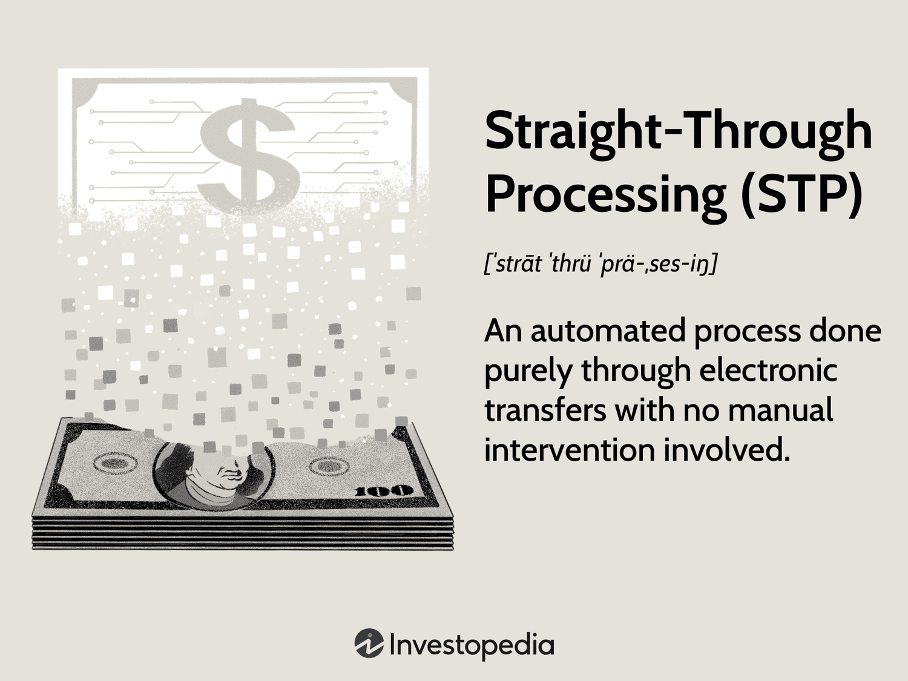

Straight-Through Processing (STP) represents a transformative approach in the financial industry, facilitating automated transactions that occur without the need for manual intervention. This methodology significantly advances the way financial operations are conducted, particularly in the realms of payments, securities trading, and algorithmic trading. STP plays a pivotal role in modern financial ecosystems, significantly enhancing the efficiency with which transactions are processed.

One of the primary advantages of STP is its ability to expedite transaction processes. By automating the entire transaction lifecycle, STP minimizes delays, resulting in seamless and rapid execution of financial activities. This is particularly crucial in fast-paced environments such as algorithmic trading, where the timing of transactions can have a profound impact on trade outcomes. Moreover, STP's capability to reduce errors, which commonly arise from manual handling, ensures a higher degree of accuracy and reliability in financial operations.

The implementation of STP also provides competitive advantages for financial institutions and traders. By streamlining processes and improving data accuracy, entities leveraging STP can achieve greater efficiency, allowing them to better capitalize on market opportunities. This efficiency not only reduces operational costs but also enhances strategic decision-making capabilities by providing real-time, accurate data analysis.

As technology continues to advance, the importance of STP is becoming increasingly pronounced. STP's integration with emerging technologies such as artificial intelligence and blockchain is anticipated to further refine automated transaction processes. In algorithmic trading, for instance, the synergy between STP and advanced algorithms provides traders with the tools to develop more complex and effective trading strategies. Ultimately, STP is a critical component in the automation of financial practices, continuously evolving to meet the demands of the ever-changing digital economy.

## Table of Contents

## What is Straight-Through Processing (STP)?

Straight-Through Processing (STP) is a sophisticated automated method that significantly enhances the efficiency of financial transactions by eliminating manual intervention. Its primary objective is to streamline processes within financial systems, ensuring transactions are processed rapidly and with minimal human error. The concept of STP first emerged in payment processing, where it was used to expedite payments and reduce transaction costs. Over time, its application has extended into securities trading and other financial areas, offering broader benefits across the financial industry.

At the core of STP are essential technologies such as electronic exchanges, powerful computing systems, and the internet. These technologies collectively provide the infrastructure needed to automate transactions fully. Electronic exchanges facilitate real-time communication between trading parties, enabling instantaneous trade executions. Computers and advanced software manage and process large volumes of data efficiently, while the internet allows global connectivity, further accelerating the pace of transactions.

STP's principal advantage lies in its ability to conduct operations with minimal need for human input, thus reducing potential errors inherent to manual processes. With human intervention significantly decreased, the likelihood of mistakes is diminished, and transaction accuracy is improved. The speed of processing is another substantial benefit; transactions that previously took hours or even days can be completed in seconds with STP.

For companies to leverage STP effectively, robust systems and networks are critical. These include reliable hardware capable of handling high transaction volumes and sophisticated software that ensures data accuracy and security. Additionally, stable and high-speed internet connections are vital for maintaining seamless communication between various financial entities.

In summary, Straight-Through Processing is a transformative approach in the financial sector, providing significant enhancements in processing speed, accuracy, and efficiency by utilizing cutting-edge technology and minimizing manual tasks.

## The Benefits of STP in Automated Transactions

Straight-Through Processing (STP) significantly enhances the speed of transactions by processing them in near real-time. This rapid processing capability is crucial for financial operations where timing is critical, such as stock exchanges and payment systems. Automation plays a key role in minimizing human involvement in transaction processes, thereby reducing the risk of human errors. This ensures that transactions are accurate and reliable, which is particularly important in financial markets where precision is paramount.

Cost efficiency is another notable advantage of STP. By automating transaction processes, businesses can substantially decrease labor costs associated with manual processing. This shift not only leads to financial savings but also improves overall process efficiency. The reduction in manual interventions also means there is less room for errors that could potentially lead to additional expenses and resource allocation for error correction.

Additionally, STP enhances transparency within transactions. It provides clear audit trails, which are invaluable for compliance purposes. These trails allow companies to easily track and verify each transaction step, simplifying regulatory compliance and auditing. The ability to maintain detailed records automatically translates into a more straightforward and less resource-intensive compliance process.

Scalability is yet another critical benefit of STP, allowing businesses to manage increasing volumes of transactions without a corresponding increase in costs. This capability is essential for financial institutions and companies anticipating growth in transaction [volume](/wiki/volume-trading-strategy). The adaptability of STP systems to handle higher loads without significant infrastructure changes or cost escalations demonstrates its robustness and strategic advantage. 

Implementing STP ensures that financial institutions are well-equipped to handle future challenges and expansions efficiently. These benefits collectively make STP an indispensable part of modern financial operations, facilitating smoother, faster, and more reliable automated transactions.

## STP in Algorithmic Trading

Straight-Through Processing (STP) plays an essential role in [algorithmic trading](/wiki/algorithmic-trading) by enabling the rapid and accurate execution of trades. This automation is critical for achieving the speed and precision required in modern trading environments where large volumes of transactions are processed virtually instantaneously. By eliminating manual interventions, STP reduces execution latency, thereby ensuring that trades are completed swiftly to capitalize on fleeting market opportunities.

The high reliability of STP systems is fundamental to the smooth operation of trading algorithms. By providing consistent and error-free transaction processing, STP minimizes the probability of execution mistakes that can arise from manual entry or systemic inefficiencies. This reliability is vital in high-frequency trading ([HFT](/wiki/high-frequency-trading-strategies)), where even the slightest delay or error can lead to significant financial losses.

STP's scalability and efficiency further support its application in high-frequency trading, where large volumes of trades must be processed in fractions of a second. The automation inherent in STP allows trading systems to handle this volume without a proportional increase in operational costs, ensuring that trading activities remain profitable even as transaction volumes grow.

Moreover, by automating transaction processes, STP frees algorithmic traders to focus on developing and optimizing trading strategies rather than expending resources on the logistics of trade execution. This shift allows for the application of more sophisticated algorithms, potentially leading to improved market strategies and outcomes.

In summary, the integration of STP with algorithmic trading not only enhances the speed and reliability of trade executions but also provides significant strategic advantages by enabling traders to devote more effort towards innovative strategy development. This synergy underscores the transformative impact of STP in the domain of automated trading.

## Case Studies: Success Stories of STP Implementation

Amazon.com is a prime example of leveraging Straight-Through Processing (STP) to enhance its e-commerce operations. By integrating STP systems, Amazon has streamlined its payment processes, reducing the time and potential errors associated with manual transaction handling. This automation not only enhances the speed of order processing but also ensures higher accuracy in financial transactions, leading to increased customer satisfaction and operational efficiency.

Financial institutions, particularly banks, have also significantly benefitted from the implementation of STP systems. By automating transaction processes, these institutions have drastically reduced error rates and operational costs. The reduced need for manual processing has led to improved accuracy in financial data handling and faster transaction settlements. For example, the adoption of STP solutions has enabled banks to handle increasing volumes of transactions without the need for proportional increases in staff or resources, thus enhancing profitability.

In securities trading, STP has revolutionized stock exchanges and trading platforms by facilitating real-time trade settlements. This advancement is particularly significant, as real-time processing is crucial in fast-paced financial markets where time is of the essence. The ability to settle trades instantaneously reduces the risk of market exposure and enhances the [liquidity](/wiki/liquidity-risk-premium) of financial markets. This transformation not only boosts the efficiency of trading platforms but also increases investor confidence by providing more reliable and transparent trading processes.

These examples underscore the cost savings, error reduction, and increased efficiency achieved through STP. The transformative power of STP is evident in its ability to optimize various operations across different sectors. By minimizing manual intervention, companies and financial institutions can allocate resources more effectively, focus on strategic priorities, and provide better services to their customers. Consequently, the implementation of STP continues to be a pivotal [factor](/wiki/factor-investing) in the modern financial landscape, driving both innovation and competitiveness.

## Future Trends and Innovations in STP

Experts predict that the integration of [artificial intelligence](/wiki/ai-artificial-intelligence) (AI) and [machine learning](/wiki/machine-learning) (ML) in Straight-Through Processing (STP) will significantly enhance the automation of financial processes. AI and ML can analyze large datasets to predict transaction outcomes, optimize routing, and reduce processing times. For instance, machine learning algorithms can be employed to detect patterns and anomalies in trading data, enabling more efficient management of back-office functions. This integration is expected to lead to smarter decision-making, higher accuracy, and an overall increase in operational efficiency.

Blockchain technology presents another promising advancement for STP, particularly in enhancing security and transparency. Blockchain's decentralized nature and immutable ledger can significantly bolster the integrity of STP systems by securely recording all transaction activities. This feature is particularly appealing in sectors where trust and accountability are paramount. The incorporation of blockchain into STP systems could also facilitate peer-to-peer transactions and further streamline trade settlements, reducing reliance on intermediaries.

The evolution of cloud computing is poised to offer greater flexibility and scalability for STP solutions. Cloud-based STP systems can be rapidly deployed and scaled to accommodate varying transaction volumes with minimal infrastructure investment. This flexibility can lead to cost savings and improves the ability to adapt to market demands. Additionally, cloud environments provide enhanced data storage solutions and computational power, which are critical for supporting complex STP operations and ensuring real-time data access and processing.

Future developments in STP aim to make the process more adaptable and efficient across various financial services. Innovations in API technology and open banking frameworks are anticipated to drive these improvements, allowing for seamless integration between different financial platforms and services. This adaptability will enable financial institutions to offer more customized products and services, enhancing the customer experience and engagement.

Continuous innovation in STP is likely to lead to applications beyond traditional finance. Emerging fields such as supply chain finance, insurance, and cross-border e-commerce could benefit from STP's efficiencies in transaction automation and error reduction. As industries increasingly adopt digital solutions, STP's proven capabilities could be leveraged to streamline operations and enhance service delivery across diverse sectors.

These developments point to a future where STP systems are more intelligent, secure, and ubiquitous, underlining their crucial role in automating and optimizing financial transactions in a digital economy.

## Conclusion

Straight-Through Processing (STP) has solidified its position as a crucial component in the landscape of automated financial transactions. The capability of STP to process transactions with remarkable speed and precision presents immense advantages in contemporary trading environments. By significantly reducing the latency between transaction initiation and completion, STP enhances the operational tempo of financial markets, thereby allowing for rapid exploitation of trading opportunities.

Furthermore, the integration of STP in algorithmic trading exemplifies its profound impact on market operations. Algorithmic trading, characterized by the execution of large volumes of orders at high speed and with limited human intervention, relies heavily on the efficiency provided by STP. By minimizing potential human errors and ensuring a seamless flow of information between trading systems, STP serves as a foundation upon which algorithmic strategies can be optimally executed.

Looking to the future, the ongoing evolution of STP is set to deliver further enhancements in financial processes. Advancements in artificial intelligence (AI) and machine learning are likely to be integrated with STP systems, augmenting their ability to handle complex transactions with greater accuracy and adaptability. Moreover, the advent of blockchain technology promises to bolster the security and transparency of STP operations, potentially revolutionizing verification and settlement procedures.

As technology continues to advance, the importance and utility of STP in a digital economy will undoubtedly expand. Its role in fostering cost-efficient, accurate, and swift financial transactions makes it an indispensable tool for modern finance. STP's future trajectory will not only reshape existing financial processes but also open up new possibilities across a broader range of industries, reinforcing its status as a pivotal element in the ongoing digital transformation.

## References & Further Reading

[1]: Swift, J. (2020). ["Straight-Through Processing for Financial Services"](https://www.researchgate.net/publication/282715709_Straight_Through_Processing_for_Financial_Services). SWIFT.

[2]: Chishti, S., & Barberis, J. (Eds.). (2016). ["The FINTECH Book: The Financial Technology Handbook for Investors, Entrepreneurs and Visionaries."](https://www.researchgate.net/publication/318790084_THE_FINTECH_BOOK_THE_FINANCIAL_TECHNOLOGY_HANDBOOK_FOR_INVESTORS_ENTREPRENEURS_AND_VISIONARIES) Wiley.

[3]: Bergstra, J., Bardenet, R., Bengio, Y., & Kégl, B. (2011). ["Algorithms for Hyper-Parameter Optimization."](https://dl.acm.org/doi/10.5555/2986459.2986743) Advances in Neural Information Processing Systems 24.

[4]: Cumming, D. J., Johan, S., & Zhang, M. (2018). ["Public and Private Market Financing of Young Innovative Companies."](https://papers.ssrn.com/sol3/papers.cfm?abstract_id=2882026) Palgrave Macmillan.

[5]: Markose, S. M. (2014). ["Systemic Risk from Global Financial Derivatives: A Network Analysis of Contagion and Its Mitigation with Super-Spreader Tax."](https://www.imf.org/external/pubs/ft/wp/2012/wp12282.pdf) Springer.