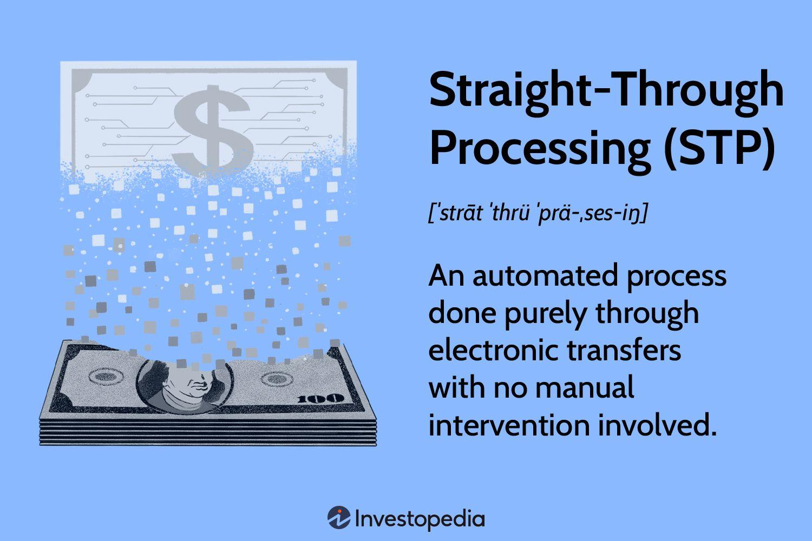

## Table of Contents

## What is Straight-Through Processing (STP)?

Straight-Through Processing (STP) is a method used in finance and banking to make transactions happen automatically, without people needing to do things by hand. It means that when you do something like buy a stock or move money, the computer system does everything from start to finish without stopping. This makes things faster and helps avoid mistakes that people might make.

Using STP can save a lot of time and money for banks and other financial companies. It's like having a super-fast, error-free worker that never gets tired. But, setting up STP can be hard and expensive because you need really good computer systems and everyone involved in the transaction needs to use the same kind of technology.

## How does Straight-Through Processing work?

Straight-Through Processing works by using computers to handle all parts of a financial transaction from start to finish without any human help. When you want to do something like buy a stock, you enter your order into a computer system. This system then checks if you have enough money, finds someone who wants to sell the stock at the price you're willing to pay, and makes the trade happen. All of this happens very quickly and automatically, without anyone needing to do anything by hand.

To make STP work well, everyone involved in the transaction needs to use the same kind of technology. This means that the bank, the stock exchange, and any other companies involved all need to have systems that can talk to each other easily. If everything is set up right, STP can make transactions happen much faster and with fewer mistakes than if people were doing the work. But setting up these systems can be tricky and costly, because it requires a lot of planning and technology.

## What are the basic components of an STP system?

The basic components of an STP system include a front-end interface, a processing engine, and a back-end system. The front-end interface is what you see and use to enter your transaction details, like buying a stock. It's like the screen where you type in what you want to do. The processing engine is the part that does all the work behind the scenes. It checks if you have enough money, finds someone to trade with, and makes sure everything is correct. The back-end system is where all the records are kept. It's like a big filing cabinet that stores all the details of your transactions.

To make sure an STP system works well, it also needs good communication between different parts of the financial world. This means that banks, stock exchanges, and other companies need to use the same kind of technology so they can talk to each other easily. If one part of the system doesn't work right, it can slow everything down or cause mistakes. So, keeping everything connected and working smoothly is really important for STP to be fast and accurate.

## What industries benefit most from Straight-Through Processing?

The finance and banking industries benefit the most from Straight-Through Processing. These industries deal with a lot of transactions every day, like buying and selling stocks, moving money between accounts, and processing payments. STP helps them do all these things quickly and without mistakes. This saves time and money, and makes customers happy because their transactions happen fast.

Another industry that benefits from STP is insurance. Insurance companies handle a lot of paperwork and need to process claims and payments. STP helps them do this work faster and with fewer errors. This means they can pay out claims quicker and keep their customers happy. Just like in banking, using STP in insurance can save a lot of time and money.

Overall, any industry that deals with a lot of transactions and needs to process them quickly and accurately can benefit from STP. It's like having a super-fast, error-free worker that never gets tired, which is very helpful in busy industries like finance, banking, and insurance.

## What are the primary benefits of implementing STP?

The main benefit of using Straight-Through Processing is that it makes transactions happen much faster. When you want to buy a stock or move money, the computer system does everything automatically without any people needing to help. This means your transaction can be done in seconds instead of waiting for someone to do it by hand. This speed is really helpful for banks and other companies that need to handle a lot of transactions every day.

Another big benefit is that STP helps avoid mistakes. When people do things by hand, they can make errors, like typing in the wrong numbers or missing a step. But with STP, the computer follows the same steps every time, so it's less likely to make mistakes. This makes everything more accurate and reliable, which is important for keeping customers happy and making sure everything is done right.

## How does STP improve operational efficiency?

Straight-Through Processing improves operational efficiency by making transactions happen faster. When you use STP, the computer system does all the work without any people needing to help. This means that things like buying a stock or moving money can be done in seconds instead of waiting for someone to do it by hand. For banks and other companies that handle a lot of transactions every day, this speed is a big help. It lets them do more work in less time, which saves them money and makes their customers happy because their transactions happen quickly.

STP also helps avoid mistakes, which is another way it improves operational efficiency. When people do things by hand, they can make errors, like typing in the wrong numbers or missing a step. But with STP, the computer follows the same steps every time, so it's less likely to make mistakes. This means everything is more accurate and reliable. When companies can trust that their transactions are done right the first time, they don't have to spend time and money fixing errors. This makes their operations run smoother and more efficiently.

## What are the challenges in implementing Straight-Through Processing?

One big challenge in using Straight-Through Processing is that it can be hard and expensive to set up. You need really good computer systems that can talk to each other easily. This means that everyone involved, like banks and stock exchanges, has to use the same kind of technology. If one part of the system doesn't work right, it can slow everything down or cause mistakes. So, making sure all the technology works together smoothly takes a lot of planning and money.

Another challenge is that STP needs everyone to follow the same rules and steps. If different companies have different ways of doing things, it can be hard to make everything work together. This means that sometimes, people have to change how they do their work to fit with the STP system. It can be tough to get everyone to agree on the same way of doing things, especially if they are used to doing it differently. This can slow down the process of setting up STP and make it more complicated.

## How can STP reduce operational costs?

Straight-Through Processing can help lower the costs of running a business by making transactions happen faster and without mistakes. When you use STP, the computer does all the work automatically, so you don't need as many people to do things by hand. This means you can save money on salaries and other costs that come with having a lot of workers. Also, because STP is so fast, you can do more work in less time, which helps you save money on things like office space and utilities.

Another way STP can cut costs is by reducing the number of errors in transactions. When people do things by hand, they can make mistakes that cost money to fix. But with STP, the computer follows the same steps every time, so it's less likely to make mistakes. This means you don't have to spend time and money fixing errors, which can add up to big savings over time. By making everything more accurate and reliable, STP helps businesses save money and run more smoothly.

## What role does technology play in enhancing STP?

Technology is really important for making Straight-Through Processing work well. It helps by making sure that all the different parts of the financial world, like banks and stock exchanges, can talk to each other easily. This means they need to use the same kind of computer systems so that when you want to buy a stock or move money, everything can happen quickly and without any mistakes. Good technology also makes sure that the computer can do all the work automatically, from checking if you have enough money to making the trade happen, without anyone needing to help.

Another way technology helps with STP is by making it easier to keep everything safe and secure. When you're moving money or buying stocks, you want to make sure no one can steal your information or mess with your transactions. Technology like encryption and secure networks helps keep everything safe. This is important because if people don't trust that their transactions are secure, they might not want to use STP. So, good technology not only makes STP faster and more accurate, but also helps build trust with customers.

## How does STP impact compliance and risk management?

Straight-Through Processing helps with following rules and managing risks by making everything more clear and easy to check. When you use STP, all the steps of a transaction are done by a computer, so there's a record of everything that happens. This makes it easier for companies to see if they are following the rules, like making sure they have the right information for each transaction. If there's a problem, it's easier to find out what went wrong because everything is recorded.

STP also helps lower the risk of mistakes and fraud. Because the computer does everything automatically, there's less chance for people to make errors or try to cheat. This means companies can feel more sure that their transactions are safe and correct. But, to make sure STP works well for compliance and risk management, the technology needs to be really good and everyone involved needs to use the same kind of systems. If the technology isn't set up right, it can still cause problems.

## What are the best practices for successful STP implementation?

The first step for a good STP setup is to make sure everyone uses the same technology. This means banks, stock exchanges, and other companies need to have systems that can talk to each other easily. If one part of the system doesn't work right, it can slow everything down or cause mistakes. So, it's important to plan carefully and spend money on good technology that works well together. Also, everyone needs to follow the same rules and steps. If different companies do things differently, it can be hard to make everything work together. Getting everyone to agree on the same way of doing things can take time, but it's worth it for STP to work well.

Another important thing is to keep everything safe and secure. When you're moving money or buying stocks, you want to make sure no one can steal your information or mess with your transactions. Using good technology like encryption and secure networks helps keep everything safe. This builds trust with customers because they know their transactions are secure. Also, it's a good idea to test the STP system a lot before using it for real. This helps find any problems and fix them before they cause trouble. By following these steps, companies can make sure their STP system works well and helps them do more work faster and with fewer mistakes.

## How can organizations measure the success of their STP initiatives?

Organizations can measure the success of their STP initiatives by looking at how fast their transactions are happening. When STP is working well, transactions like buying stocks or moving money should be done in seconds instead of waiting for someone to do it by hand. This speed can be measured by comparing the time it takes to complete transactions before and after using STP. If transactions are happening much faster, it's a good sign that the STP system is working well.

Another way to measure success is by checking how many mistakes are happening. STP should help avoid errors because the computer does everything automatically. Companies can look at the number of errors before and after using STP to see if there are fewer mistakes. If the number of errors goes down, it means the STP system is helping to make transactions more accurate and reliable. By looking at these two things—speed and accuracy—organizations can tell if their STP initiatives are successful.

## References & Further Reading

[1]: Swift, J. (2020). ["Straight-Through Processing for Financial Services"](https://www.researchgate.net/publication/282715709_Straight_Through_Processing_for_Financial_Services). SWIFT.

[2]: Chishti, S., & Barberis, J. (Eds.). (2016). ["The FINTECH Book: The Financial Technology Handbook for Investors, Entrepreneurs and Visionaries."](https://www.researchgate.net/publication/318790084_THE_FINTECH_BOOK_THE_FINANCIAL_TECHNOLOGY_HANDBOOK_FOR_INVESTORS_ENTREPRENEURS_AND_VISIONARIES) Wiley.

[3]: Bergstra, J., Bardenet, R., Bengio, Y., & Kégl, B. (2011). ["Algorithms for Hyper-Parameter Optimization."](https://dl.acm.org/doi/10.5555/2986459.2986743) Advances in Neural Information Processing Systems 24.

[4]: Cumming, D. J., Johan, S., & Zhang, M. (2018). ["Public and Private Market Financing of Young Innovative Companies."](https://papers.ssrn.com/sol3/papers.cfm?abstract_id=2882026) Palgrave Macmillan.

[5]: Markose, S. M. (2014). ["Systemic Risk from Global Financial Derivatives: A Network Analysis of Contagion and Its Mitigation with Super-Spreader Tax."](https://www.imf.org/external/pubs/ft/wp/2012/wp12282.pdf) Springer.